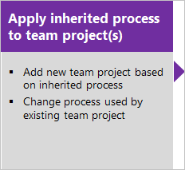
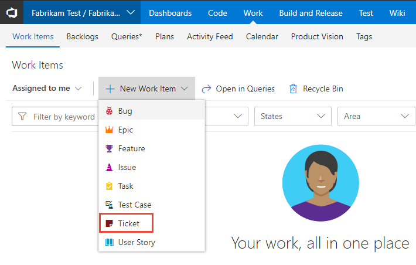

# Customize a project using an inheritance process

[!INCLUDE [temp](../../_shared/codex-agile.md)]

Your process provides the building blocks for tracking work. You primarily customize a process by adding or modifying a work item type (WIT) defined for that process.  

You can only customize inherited processes.  Any changes you make to the inherited process will automatically appear in the Codex projects that use that process. 

For example, the following image shows the work item form layout for the Bug WIT. From this page, you can add fields, groups, pages, and custom controls. To modify the workflow, you click **States**.

 

The general sequence for customizing a project is to customize an inheritance process, verify your customizations, and then change the process of the project(s) to use that process. 

  

In this topic you'll learn:  

> [!div class="checklist"] 
> * How to start customizing from the work item form
> * How to open the **Settings>Process** hub
> * Create an inheritance process to customize   
> * Add or modify a field 
> * Add or modify a rule for a work item type 
> * Add or modify work item types 
> * Modify the workflow of a work item type 
> * Add or modify a custom control   
> * Add an extension to a work item type
> * Verify the customization you made  
> * Change the process used by a team project 
 

[!INCLUDE [temp](../_shared/process-prerequisites.md)] 

## Start customizing  
The easiest way to start customizing a process is to start from the work item of the type you want to customize. 

0. From the web portal, open the WIT you want to customize, open the context menu, and choose the Customize. 

	  

	- If the project already uses an inherited process, then the **Layout** page for the corresponding WIT will open. 

		For example, the MyAgile process, User Story WIT, Layout page appears.   

		  

		> [!NOTE]    
		>The **Add custom control** option only appears when [qualifying extensions have been added from the Marketplace](custom-controls-process.md). 

	- If the project uses a system process, but a valid inherited process has been defined, then you have the option to select which inherited process you want the project to use. 

	 	 

		Upon choosing, the Layout page for the corresponding process and WIT opens.

	- If the project uses a system process, and no valid inherited process have been defined, then the system will automatically create an inherited process, labeling it *AccountName_ParentProcessName*&mdash;for example, *fabrikam Agile*&mdash;and automatically update the project to use the process. You can later [rename the process](manage-process.md#process-naming).  

		After which, the Layout page for the corresponding process and WIT opens.
  
0. From the Layout page, you can customize the WIT. Review the next section for a summary of all the customizations you can make. 
1. 

## Open Settings>Process hub

[!INCLUDE [temp](../_shared/open-process-admin-context-ts.md)]

 
[!INCLUDE [temp](../_shared/create-inherited-process.md)] 

## Add or modify a field 

Choose your inherited process, the work item type and then add and edit fields from the **Layout** page. You can make a few customizations to inherited fields. 
 Customizations are subject to the guidelines and limitations outlined under [What is a field?](inheritance-process-model.md#field-reference).

> [!div class="mx-tdBreakAll"]  
> | Inherited fields |Custom fields |&nbsp;&nbsp;&nbsp;| 
> |-------------|----------|---------| 
> |- [Change the field label](customize-process-field.md#rename-field) - [Show/Hide field on form](customize-process-field.md#show-hide-field) |- [Add a custom field](customize-process-field.md#add-field) - [Add pick list (drop-down menu)](customize-process-field.md#pick-list) - [Add person-name/Identity](customize-process-field.md#identity) - [Add a rich-text (HTML) field](customize-process-field.md#html)  - [Add a checkbox (Boolean) field](customize-process-field.md#boolean-field) - [Add a custom control](custom-controls-process.md) |- [Add custom rules to a field](custom-rules.md) - [Change the field label](customize-process-field.md#rename-field) - [Set Required/Default options](customize-process-field.md#options) - [Move the field within the layout](customize-process-form.md#move-field) - [Remove field from form](customize-process-field.md#remove-field) - [Delete field](customize-process-field.md#delete-field) | 

## Add or modify a rule for a work item type 
Choose your inherited process, the work item type, and then choose **Rules**.

## Add or modify work item types

Choose your inherited process, and then add or edit a work item type from the **Work item types** page.

> [!div class="mx-tdBreakAll"]  
> | Inherited WITs | Custom WITs |&nbsp;&nbsp;&nbsp;| 
> |-------------|----------|---------| 
> |- [Add/remove custom fields](customize-process-field.md) - [Add/remove custom groups](customize-process-form.md#groups) - [Add/delete custom pages](customize-process-form.md#pages) - [Add/remove a custom control](custom-controls-process.md)  - [Enable/disable](customize-process-wit.md#enable-disable) |- [Add custom WIT](customize-process-wit.md#add-wit) - [Change color or description](customize-process-wit.md#overview) - [Add/remove custom fields](customize-process-field.md) - [Add/remove custom groups](customize-process-form.md#groups) - [Add/delete custom pages](customize-process-form.md#pages) - [Add/remove a custom control](custom-controls-process.md) |- [Add, edit, or remove a workflow state](customize-process-workflow.md#states) - [Enable/disable](customize-process-wit.md#enable-disable) - [Delete](customize-process-wit.md#destroy) |  

### Modify the web form layout  

Choose your inherited process and the work item type, and then modify the form from the **Layout** page.

> [!div class="mx-tdBreakAll"]  
> | Inherited groups |Custom groups |&nbsp;&nbsp;&nbsp;| 
> |-------------|----------|---------| 
> |- [Relabel](customize-process-form.md#groups) - [Add/remove custom fields](customize-process-field.md) - [Show/hide fields](customize-process-field.md#remove-field)  **Inherited pages** - [Relabel](customize-process-form.md#pages) - [Add/remove custom fields](customize-process-field.md) - [Add/remove a custom group](customize-process-form.md#groups) |- [Add, modify, re-sequence, delete](customize-process-form.md#groups) - [Add/remove custom fields](customize-process-field.md) - [Add/Hide a group extension](custom-controls-process.md) **Custom pages**  - [Add, modify, re-sequence, delete](customize-process-form.md#pages) - [Add/delete custom fields](customize-process-field.md) - [Add/Hide a page extension](custom-controls-process.md) |    
> 
>  
## Modify the workflow of a work item type 

Choose your inherited process, the work item type, and then modify the workflow from the **States** page.  

> [!div class="mx-tdBreakAll"]  
> | Inherited states |Custom states |
> |-------------|----------|
> |- [View workflow states](customize-process-workflow.md#hide-state) - [Hide a state](customize-process-workflow.md#hide-state) |- [Add a state](customize-process-workflow.md#add-states) - [Edit a state (change color or category)](customize-process-workflow.md#edit-state) - [Remove a state](customize-process-workflow.md#remove-state) |   
 
## Add or modify a custom control    

Choose your inherited process, the work item type, and then choose **Add custom control**.

> [!div class="mx-imgBorder"]  
>  
 

Custom controls provide additional functionality to a work item form. A custom control comes in four flavors, or contribution types. The first three in the following list appear on the web form layout for all inherited and customizable work item types (WITs):    
- Field-level contribution 
- Group-level contribution 
- Page-level contribution
- Action-level contribution (appears in the context menu of the web form) 

To learn more, see [Add a custom control to a work item type](custom-controls-process.md).

 
## Add an extension to a work item type

An extension is an installable unit that contributes new capabilities to your Codex project.
  
> [!NOTE]   
> Group and Page extensions are automatically added to all WITs for all processes, both system and inheritance. You can choose to hide an extension for selected WITs within an inheritance process. 

0. To add an extension to a work item type, choose your inherited process, the WIT, and then choose **Get extensions**.
 
	> [!div class="mx-imgBorder"]  
	>  

0. Select the extension you want to add. Here we choose the Work item checklist.

0. Select the organization/account you want to add it to and choose **Install**.  

	> [!div class="mx-imgBorder"]  
	>  

	Extensions are available to add to all team projects and processes. 

0. Return to the process and WIT and verify the location of the extension is where you want it. Look for it at the bottom of the middle column and drag it to where you want it on the form. 

	> [!div class="mx-imgBorder"]  
	>  

## Modify the backlog and boards 

You can add additional WITs to a backlog level or add another portfolio backlog. As shown below, we've added a third level portfolio backlog labeled *Initiatives* which tracks the custom *Initiative* WIT, and we've renamed the product backlog to *Stories and Tickets* to indicate that we not only track *User Stories*, but also *Customer Tickets* on the product backlog. 
 
> [!div class="mx-imgBorder"]  
> ![Changes made to the backlog levels]_img/process/process-backlog-boards-intro.png) 

Choose your inherited process, and then modify the backlogs configuration from the **Backlog levels** page. Inherited backlogs aren't locked. 

> [!div class="mx-tdBreakAll"]  
> | Inherited backlogs |Custom backlogs |
> |-------------|----------|
> |- [Add a custom WIT](customize-process-backlogs-boards.md) - [Change the default WIT](customize-process-backlogs-boards.md) - [Rename the requirement backlog](customize-process-backlogs-boards.md#edit-product-backlog) - [Rename a portfolio backlog](customize-process-backlogs-boards.md#edit-portfolio-backlog) |- [Add a portfolio backlog which displays custom WITs](customize-process-backlogs-boards.md#portfolio-backlogs) - [Edit or rename a portfolio backlog](customize-process-backlogs-boards.md#edit-portfolio-backlog) - [Delete the top-level custom portfolio backlog](customize-process-backlogs-boards.md#edit-portfolio-backlog) |

## Verify the customization you made 

We recommend that you create a test project and apply your customized inheritance process to it to verify the changes you've made. 

0. Open the &hellip; context menu for the process you want to use and choose **New team project**.  

	> [!div class="mx-imgBorder"]  
	>  

0. The Create new project page opens. Fill out the form. 

	> [!div class="mx-imgBorder"]  
	>  

0. Open the **Work>Work Items** page (user context) and choose **New Work Item** and select the WIT you customized. Here we choose **Ticket**. 

	> [!div class="mx-imgBorder"]  
	>  

	If you don't see the custom WIT, refresh your browser to make sure it registers all the custom changes you've made. 

0.  Verify that the field you added appears on the form. Note that the  (exclamation mark) icon indicates the field is required.  

		

[!INCLUDE [temp](../_shared/change-project-to-inherited-process.md)] 

## Programmatically work with processes 

You can get, create, update, and delete processes defined for an account using the [REST API, Processes](https://docs.microsoft.com/en-us/rest/api/vsts/processes/processes).

## Related articles

Keep in mind that all projects that reference the inherited process that you're customizing will automatically update to contain the modifications you make. 

To customize a single project, always start by [creating an inherited process and changing the project to use that process](manage-process.md). Then, all the customizations that you make to the inherited process automatically appear for the project you migrated.  

See also: 
- [Work tracking object limits](object-limits.md)
- [What is an inherited process?](inheritance-process-model.md) 

