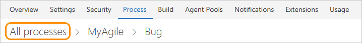

# About process customization and  inherited processes  

[!INCLUDE [temp](../../_shared/codex-agile.md)]

 

The Inheritance process model provides support for customizing work tracking objects and Agile tools for a team project through the user interface. Team projects inherit the customizations made to a process.

You can perform the following tasks with the Inheritance process model. 

> [!div class="mx-tdCol2BreakAll"]  
> |Fields  |Pick lists   |   Work item types |
> |-------------|----------|---------|
> |- [Add a custom field](customize-process-field.md) - [Add a person-name or Identity field](customize-process-field.md#identity) - [Add a rich-text field](customize-process-field.md#html) - [Add a checkbox (Boolean) field](customize-process-field.md#boolean-field) - [Add rules to a field](custom-rules.md) - [Change a field label](customize-process-field.md) - [Remove a field from a form](customize-process-field.md) - [Add a custom control field](custom-controls-process.md) - [Delete a field](customize-process-field.md#delete-field) - [Review fields](customize-process-field.md#review-fields)|- [Area paths](../set-area-paths.md) - [iteration paths](../set-iteration-paths-sprints.md) - [Person-name field (add team members)](../../accounts/add-team-members-vs.md) - [State or Reason fields](customize-process-workflow.md) - [Add a custom pick list](customize-process-form.md)|- [Add a custom field](customize-process-field.md) - [Add a custom WIT](customize-process-wit.md) - [Specify the WIT color](customize-process-wit.md) - [Customize the workflow (States)](customize-process-workflow.md) - [Customize the WIT form](customize-process-form.md) - [Add a custom control](custom-controls-process.md)| 

> [!div class="mx-tdCol2BreakAll"]  
> | Backlogs | Process |  
> |----------|---------|   
> |- [Add custom backlog levels](../../work/customize/add-portfolio-backlogs.md) - [Add a custom WIT to a backlog](customize-process-backlogs-boards.md) - [Show bugs on backlogs/boards](../../work/customize/show-bugs-on-backlog.md)|- [Create & manage an inherited process](manage-process.md) - [Customize a process](customize-process.md) |

 
> [!NOTE]    
> With the Inheritance process model, you can't modify the pick-lists of pre-defined fields&mdash;such as [Activity](../../work/track/query-numeric.md), [Automation Status](../../work/track/build-test-integration.md), [Discipline](../../work/track/query-numeric.md), [Priority](../../work/track/planning-ranking-priorities.md), plus others.  

> [!div class="mx-tdBreakAll"]  
> | Inherited fields |Custom fields |&nbsp;&nbsp;&nbsp;| 
> |-------------|----------|---------| 
> |- [Change the field label](customize-process-field.md#rename-field) - [Show/Hide field on form](customize-process-field.md#show-hide-field) |- [Add a custom field](customize-process-field.md#add-field) - [Add pick list (drop-down menu)](customize-process-field.md#pick-list) - [Add person-name/Identity](customize-process-field.md#identity) - [Add a rich-text (HTML) field](customize-process-field.md#html)  - [Add a checkbox (Boolean) field](customize-process-field.md#boolean-field) - [Add a custom control](custom-controls-process.md) |- [Add custom rules to a field](custom-rules.md) - [Change the field label](customize-process-field.md#rename-field) - [Set Required/Default options](customize-process-field.md#options) - [Move the field within the layout](customize-process-form.md#move-field) - [Remove field from form](customize-process-field.md#remove-field) - [Delete field](customize-process-field.md#delete-field) | 

## What you can customize

You can customize the elements listed below. Some options of inherited elements are locked and can't be customized. To perform any of these actions, you must be a member of the Project Collection Administrators group or be [granted explicit permissions to edit a specific process](../../security/set-permissions-access-work-tracking.md#process-permissions).  

> [!NOTE]    
>For a list of limits placed on the number of fields, work item types, backlog levels, and other objects you can customize, see [Work tracking object limits](object-limits.md). 

### Fields

Choose your inherited process, the work item type and then add and edit fields from the **Layout** page. Customizations are subject to the guidelines and limitations outlined under [What is a field?](customize-process-field.md#field-reference).

> [!div class="mx-tdBreakAll"]  
> | Inherited fields |Custom fields |&nbsp;&nbsp;&nbsp;| 
> |-------------|----------|---------| 
> |- [Change the field label](customize-process-field.md#rename-field) - [Show/Hide field on form](customize-process-field.md#show-hide-field) |- [Add a custom field](customize-process-field.md#add-field) - [Add pick list (drop-down menu)](customize-process-field.md#pick-list) - [Add person-name/Identity](customize-process-field.md#identity) - [Add a rich-text (HTML) field](customize-process-field.md#html)  - [Add a checkbox (Boolean) field](customize-process-field.md#boolean-field) - [Add a custom control](custom-controls-process.md) |- [Add custom rules to a field](custom-rules.md) - [Change the field label](customize-process-field.md#rename-field) - [Set Required/Default options](customize-process-field.md#options) - [Move the field within the layout](customize-process-form.md#move-field) - [Remove field from form](customize-process-field.md#remove-field) - [Delete field](customize-process-field.md#delete-field) | 

> [!NOTE]  
> When you change a project to use an inherited process, you may find one or more Agile tools or work items appear in an invalid state. For example: 
> 
> - If you make a field required, work items with that field undefined will show an error message. You'll need to resolve the errors to make additional changes and save the work item. 
> - If you add or remove/hide workflow states of a WIT that appears on the Kanban board, you'll need to update the Kanban board column configurations for all teams defined in the team project. 

### Work item types

Choose your inherited process, and then add or edit a work item type from the **Work item types** page.

> [!div class="mx-tdBreakAll"]  
> | Inherited WITs | Custom WITs |&nbsp;&nbsp;&nbsp;| 
> |-------------|----------|---------| 
> |- [Add/remove custom fields](customize-process-field.md) - [Add/remove custom groups](customize-process-form.md#groups) - [Add/delete custom pages](customize-process-form.md#pages) - [Add/remove a custom control](custom-controls-process.md)  - [Enable/disable](customize-process-wit.md#enable-disable) |- [Add custom WIT](customize-process-wit.md#add-wit) - [Change color or description](customize-process-wit.md#overview) - [Add/remove custom fields](customize-process-field.md) - [Add/remove custom groups](customize-process-form.md#groups) - [Add/delete custom pages](customize-process-form.md#pages) - [Add/remove a custom control](custom-controls-process.md) |- [Add, edit, or remove a workflow state](customize-process-workflow.md#states) - [Enable/disable](customize-process-wit.md#enable-disable) - [Delete](customize-process-wit.md#destroy) |  

### Web form layout  

Choose your inherited process and the work item type, and then modify the form from the **Layout** page.

> [!div class="mx-tdBreakAll"]  
> | Inherited groups |Custom groups |&nbsp;&nbsp;&nbsp;| 
> |-------------|----------|---------| 
> |- [Relabel](customize-process-form.md#groups) - [Add/remove custom fields](customize-process-field.md) - [Show/hide fields](customize-process-field.md#remove-field)  **Inherited pages** - [Relabel](customize-process-form.md#pages) - [Add/remove custom fields](customize-process-field.md) - [Add/remove a custom group](customize-process-form.md#groups) |- [Add, modify, re-sequence, delete](customize-process-form.md#groups) - [Add/remove custom fields](customize-process-field.md) - [Add/Hide a group extension](custom-controls-process.md) **Custom pages**  - [Add, modify, re-sequence, delete](customize-process-form.md#pages) - [Add/delete custom fields](customize-process-field.md) - [Add/Hide a page extension](custom-controls-process.md) |    

### Workflow states

Choose your inherited process, the work item type, and then modify the workflow from the **States** page.  

> [!div class="mx-tdBreakAll"]  
> | Inherited states |Custom states |
> |-------------|----------|
> |- [View workflow states](customize-process-workflow.md#hide-state) - [Hide a state](customize-process-workflow.md#hide-state) |- [Add a state](customize-process-workflow.md#add-states) - [Edit a state (change color or category)](customize-process-workflow.md#edit-state) - [Remove a state](customize-process-workflow.md#remove-state) |   

### Backlogs 
Choose your inherited process, and then modify the backlogs configuration from the **Backlog levels** page. Inherited backlogs aren't locked. 

> [!div class="mx-tdBreakAll"]  
> | Inherited backlogs |Custom backlogs |
> |-------------|----------|
> |- [Add a custom WIT](customize-process-backlogs-boards.md) - [Change the default WIT](customize-process-backlogs-boards.md) - [Rename the requirement backlog](customize-process-backlogs-boards.md#edit-product-backlog) - [Rename a portfolio backlog](customize-process-backlogs-boards.md#edit-portfolio-backlog) |- [Add a portfolio backlog which displays custom WITs](customize-process-backlogs-boards.md#portfolio-backlogs) - [Edit or rename a portfolio backlog](customize-process-backlogs-boards.md#edit-portfolio-backlog) - [Delete the top-level custom portfolio backlog](customize-process-backlogs-boards.md#edit-portfolio-backlog) |

## Web versus Visual Studio form layouts 

The customizations you make only impact the work item forms displayed in a web browser. The work item forms displayed in Visual Studio or other [supported clients](../../user-guide/tools.md) won't reflect any process customizations you make.    

## Return to the process list  
To return to the Process page, simply click the Process hub or the **All processes** breadcrumb link.   

  

To return to a specific process and choose another WIT to customize, click the process name from the breadcrumb link.  

[!INCLUDE [temp](../../work/_shared/field-reference.md)] 
