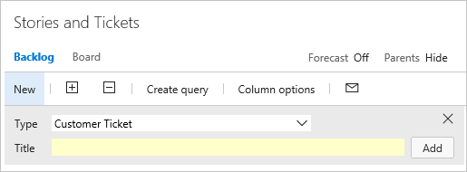

# About process customization and inherited processes  

[!INCLUDE [temp](../../_shared/codex-agile.md)]

 

To customize the work tracking system for a Codex project, you *customize* an inherited process. All Codex projects that use the inherited process, inherit the customizations made to that process. On the other hand, you *configure* your [Agile tools&mdash;Scrum and Kanban&mdash;through the web UI](../about-teams-and-settings.md).

There are a number of customizations you can make. The primary ones are adding custom fields, adding custom work item types (WITs) or modifying an existing WIT. 

Below you'll find an index to those tasks you can perform to customize an inherited process.  Some options of inherited elements are locked and can't be customized.  

## System versus inherited processes 

You'll see two types of processes:

-  System processes &mdash;[Scrum, Agile, and CMMI](../../work/work-items/guidance/choose-process.md)&mdash;which are locked from being changed.   
-  Inherited processes, which you can customize, are so named as they inherit from the system process from which they were created. Any updates the cloud service makes to the parent system process will automatically update your custom inherited process.  

In addition, all processes are shared. That is, one or more projects can use a single process. Instead of customizing a single project, you customize a process. Changes made to the process automatically update all projects that use that process. 

Once you've created an inherited process, you can customize it, create projects based on it, make a copy of it, and change existing projects to use it. 

For example, as shown in the picture below, you see a list of  projects defined for the *fabrikam* account. The second column shows the process used by each project. To update the *Fabrikam Fiber* project, you need to update the *MyAgile* process (which inherits from the Agile system process). Any changes you make to the *MyAgile* process will also update the *Test Agile* project. You can't customize the *Scrum project*, on the other hand, until you change it to a Scrum inherited process.

 

## Inherited versus custom objects 

Each process you create inherits the WITs provided with the parent system process&mdash;Agile, Scrum, or CMMI. For example, the Agile process provides bug, task, user story, feature, epic, issue and test-related WITs. 

You can add fields and modify the workflow and form for all inherited WITs that display on the **Work Item Types** page. If you don't want users to use a WIT, you can disable it. In addition, you can add custom WITs. 

## Field customizations 

Locked and inherited fields correspond to fields inherited from a system process. You can't customize locked fields. You can customize some options for inherited fields. 

> [!div class="mx-tdBreakAll"]  
> | Inherited fields |Custom fields |&nbsp;&nbsp;&nbsp;| 
> |-------------|----------|---------| 
> |- [Change the field label](customize-process-field.md#rename-field) - [Show/Hide field on form](customize-process-field.md#show-hide-field) |- [Add a custom field](customize-process-field.md#add-field) - [Add pick list (drop-down menu)](customize-process-field.md#pick-list) - [Add person-name/Identity](customize-process-field.md#identity) - [Add a rich-text (HTML) field](customize-process-field.md#html)  - [Add a checkbox (Boolean) field](customize-process-field.md#boolean-field) - [Add a custom control](custom-controls-process.md) | - [Add custom rules to a field](custom-rules.md) - [Change the field label](customize-process-field.md#rename-field) - [Set Required/Default options](customize-process-field.md#options) - [Move the field within the layout](customize-process-form.md#move-field) - [Remove field from form](customize-process-field.md#remove-field) - [Delete field](customize-process-field.md#delete-field) | 

When adding custom fields, note the following limits:  
*   A maximum of 64 fields can be defined for each WIT  
*   A maximum of 512 fields can be defined per process   

In addition, you can [add an existing inherited or custom field](customize-process-field.md#add-existing-field) to another WIT within the process. For example, you can add Due Date to the user story or bug WITs.    

### What you can't customize 
- You can't change the field name or data type once you've defined it  
- With regards to pick lists, you currently can't perform these operations:
	- Change the pick list of an inherited field, such as the Activity or Discipline field  
	- Change the pick list order, pick lists display in alphabetic order
- Import or define a global list  

> [!NOTE]    
> With the Inheritance process model, you can't modify the pick-lists of pre-defined fields&mdash;such as [Activity](../../work/track/query-numeric.md), [Automation Status](../../work/track/build-test-integration.md), [Discipline](../../work/track/query-numeric.md), [Priority](../../work/track/planning-ranking-priorities.md), plus others.  

### Configurable pick lists 

The following pick lists are configured through the user interface and not customizable through an inherited process.   
- [Area paths](../set-area-paths.md)  
- [Iteration paths](../set-iteration-paths-sprints.md)

Pick lists associated with person-name fields are managed based on the users you add to a [team project or team](../../accounts/add-team-members-vs.md).   

### Can a field be renamed or its field type changed?   
Renaming a field or changing the field type aren't supported actions.  

However, you can change the label that appears for a field on the work item form from the Layout tab. When selecting the field in a query you need to select the field name and not the field label. 

[!INCLUDE [temp](../_shared/field-reference.md)] 

[!INCLUDE [temp](../_shared/fields-become-invalid-after-customization.md)] 

## WIT customizations 

Here are your customization options for inherited and custom WITs. 

> [!div class="mx-tdBreakAll"]  
> | Inherited WITs | Custom WITs |&nbsp;&nbsp;&nbsp;| 
> |-------------|----------|---------| 
> |- [Add custom rules to a wit](custom-rules.md) - [Add/remove custom fields](customize-process-field.md) - [Add/remove custom groups](customize-process-form.md#groups) - [Add/delete custom pages](customize-process-form.md#pages) - [Add/remove a custom control](custom-controls-process.md)  - [Enable/disable](customize-process-wit.md#enable-disable) |- [Add custom WIT](customize-process-wit.md#add-wit) - [Change color or description](customize-process-wit.md#overview) - [Add/remove custom fields](customize-process-field.md) - [Add/remove custom groups](customize-process-form.md#groups) - [Add/delete custom pages](customize-process-form.md#pages) - [Add/remove a custom control](custom-controls-process.md) |- [Add custom rules to a wit](custom-rules.md) - [Add, edit, or remove a workflow state](customize-process-workflow.md#states) - [Enable/disable](customize-process-wit.md#enable-disable) - [Delete](customize-process-wit.md#destroy) |  

**What you can't customize**  
- You can't add or remove an inherited WIT to or from a backlog  
- You can't change the position of an inherited field within the form layout
- You can't remove the inherited portfolio level from the product (but you can rename them)
- You can't change the name of a custom WIT. 

> [!TIP]    
> You can't calculate or set formulas using a rule. However, you may find a solution that fits your needs via the [TFS Aggregrator  (Web Service) Marketplace extension](https://marketplace.visualstudio.com/items?itemName=tfsaggregatorteam.tfs-aggregator-web-service). 
 

### Web form layout customizations 

The customizations you make to the web form only impact the work item forms displayed in a web browser. The work item forms displayed in Visual Studio or other [supported clients](../../user-guide/tools.md) won't reflect any process customizations you make.   

> [!div class="mx-tdBreakAll"]  
> | **Inherited groups** |**Custom groups** |&nbsp;&nbsp;&nbsp;| 
> |-------------|----------|---------| 
> |- [Relabel](customize-process-form.md#groups) - [Add/remove custom fields](customize-process-field.md) - [Show/hide fields](customize-process-field.md#remove-field)   **Inherited pages** - [Relabel](customize-process-form.md#pages) - [Add/remove custom fields](customize-process-field.md) - [Add/remove a custom group](customize-process-form.md#groups) |- [Add, modify, re-sequence, delete](customize-process-form.md#groups) - [Add/remove custom fields](customize-process-field.md) - [Add/Hide a group extension](custom-controls-process.md)  **Custom pages**  - [Add, modify, re-sequence, delete](customize-process-form.md#pages) - [Add/delete custom fields](customize-process-field.md) - [Add/Hide a page extension](custom-controls-process.md) |    

  
## Layout and resizing 

The web form layout is organized into three columns as shown in the image below. 

If you only add groups and fields to the first two columns, then the layout reflects a two column layout. Likewise, if you only add groups and fields to the first column, then the layout reflects a one column layout. 

The web form resizes depending on the width available and the number of columns in the layout.  At maximum width, in most web browsers, each column within a page will display within its own column. As the display width decreases, each column resizes proportionally as follows: 

- For three columns: 50%, 25%, and 25%  
- For two columns: 66% and 33%  
- For one column: 100%.  

When the display width won't accommodate all columns, columns appear stacked within the column to the left. 

### Workflow customizations

You customize the workflow for a WIT by adding a custom state. Each customizable WIT consists of three or more inherited states. Inherited states differ based on the system process &mdash;[Agile](../../work/work-items/guidance/agile-process.md), [Scrum](../../work/work-items/guidance/scrum-process.md), or [CMMI](../../work/work-items/guidance/cmmi-process.md)&mdash;you chose from which to create your custom process. 

> [!NOTE]    
> Before adding a workflow state, review [Workflow states and state categories](../../work/customize/workflow-and-state-categories.md) to learn how workflow states map to state categories. 

> [!div class="mx-tdBreakAll"]  
> | Inherited states |Custom states |
> |-------------|----------|
> |- [View workflow states](customize-process-workflow.md#hide-state) - [Hide a state](customize-process-workflow.md#hide-state) |- [Add a state](customize-process-workflow.md#add-states) - [Edit a state (change color or category)](customize-process-workflow.md#edit-state) - [Remove a state](customize-process-workflow.md#remove-state) |  

**What you can't customize**  
- You can't modify an inherited state (you can't change its name, color, or category)
- You can't hide an inherited state if it's the only one in its state category    
- You can't change the name of a custom state 
- You can't add a custom state to the Completed category
- You can't change the order of states (states are listed in the order you add them within the States page, and they're listed  alphabetically within the drop down list of a work item form)  
- You can't apply a field rule to a state (for example, make a field required)
- You can't specify a Reason for a state, instead, default reasons are defined such as Moved to state Triaged, Moved out of state Triaged 
- You can't specify allowed transitions, all transitions are defined from any state to another state (except to the Removed state).  

### System rules

Each WIT&mdash;bug, task, user story, etc.&mdash;has several system rules already defined. Some are simple, like making the Title field required or setting a default for the Value Area field. In addition, a number of system rules define actions to take when a workflow state changes. 

For example, several rules exist to copy the current user identity under the following conditions: 
- When a work item is modified, copy the user identity to the Changed By field  
- When a work item is modified, copy the user identity to the Changed By field
- When the workflow state changes to Closed or Done, copy the user identity to the Closed By field. 
 
> [!IMPORTANT]  
> Predefined system rules will take precedent over any custom rule that you define which would overwrite it.  

## Backlog and board customizations 

Backlogs and boards are essential Agile tools for creating and managing work for a team. Inherited backlogs aren't locked.  

You can customize the backlogs and boards for an inherited process in the following ways. 

> [!div class="mx-tdBreakAll"]  
> | Inherited backlogs |Custom backlogs |
> |-------------|----------|
> |- [Add a custom WIT](customize-process-backlogs-boards.md) - [Change the default WIT](customize-process-backlogs-boards.md) - [Rename the requirement backlog](customize-process-backlogs-boards.md#edit-product-backlog) - [Rename a portfolio backlog](customize-process-backlogs-boards.md#edit-portfolio-backlog) |- [Add a portfolio backlog which displays custom WITs](customize-process-backlogs-boards.md#portfolio-backlogs) - [Edit or rename a portfolio backlog](customize-process-backlogs-boards.md#edit-portfolio-backlog) - [Delete the top-level custom portfolio backlog](customize-process-backlogs-boards.md#edit-portfolio-backlog) |

When you change the default WIT for a backlog level, it causes that WIT to appear by default in the quick add panel. For example, *Customer Ticket* appears by default in the following quick add panel for the product backlog. 

 

**What you can't customize**  
- You can't add or remove an inherited WIT to or from a backlog   
- You can't remove an inherited portfolio level from the product (but you can rename them)
- You can't insert a backlog level within the existing set of defined backlogs
- You can't reorder the backlog levels  
- You can't create a custom task level, although you can add custom WITs to the iteration backlog  
- You can't add the *Bug* WIT to any backlog level. Instead, the system allows each team to decide how they want to manage bugs. To learn more, see [Show bugs on backlogs and boards](../../work/customize/show-bugs-on-backlog.md).

### About Categories 
The system defines 13 categories for use, and at least one WIT is assigned to each category. You can't add a WIT that already belongs to an existing category to a backlog.  

The Bug category is a special category that is designed to allow teams to manage their bugs as requirements or tasks. To learn more, see [Show bugs on backlogs and boards](../../work/customize/show-bugs-on-backlog.md)

### Fields added to WITs associated with a backlog level 

When you add a WIT to a backlog level, the following fields are added to support select Agile tool features.  

| Backlog level | Fields added | 
|---------------|--------------|
| Portfolio backlog | - Stack rank (Agile, CMMI) - Backlog Priority (Scrum) | 
| Requirement backlog |  - Stack Rank, Story Points (Agile) - Stack Rank, Size (CMMI) - Backlog Priority, Effort (Scrum) |
| Iteration backlog | - Activity, Remaining Work, Stack Rank (Agile) - Discipline, Remaining Work, Stack Rank (CMMI) - Activity, Remaining Work, Backlog Priority (Scrum) |

The Stack Rank and Backlog Priority fields capture the relative priority of work items as they are reordered on a backlog or board.  

The Story Points, Size, and Effort fields capture the relative work required to complete a WIT assigned to the Requirement backlog. This value is used to compute [velocity](../../report/dashboards/velocity-chart-data-store.md).  

And, lastly, Remaining Work is used [Sprint burndown and capacity charts](../../work/scrum/define-sprints.md). 

## Object imits

For a list of limits placed on the number of fields, WITs, backlog levels, and other objects you can customize, see [Work tracking object limits](object-limits.md). 

<!---

> [!div class="mx-tdCol2BreakAll"]  
> |Fields  |Pick lists   |   Work item types |
> |-------------|----------|---------|
> |- [Add a custom field](customize-process-field.md) - [Add a person-name or Identity field](customize-process-field.md#identity) - [Add a rich-text field](customize-process-field.md#html) - [Add a checkbox (Boolean) field](customize-process-field.md#boolean-field) - [Add rules to a field](custom-rules.md) - [Change a field label](customize-process-field.md) - [Remove a field from a form](customize-process-field.md) - [Add a custom control field](custom-controls-process.md) - [Delete a field](customize-process-field.md#delete-field) - [Review fields](customize-process-field.md#review-fields)|- [Area paths](../set-area-paths.md) - [iteration paths](../set-iteration-paths-sprints.md) - [Person-name field (add team members)](../../accounts/add-team-members-vs.md) - [State or Reason fields](customize-process-workflow.md) - [Add a custom pick list](customize-process-form.md)|- [Add a custom field](customize-process-field.md) - [Add a custom WIT](customize-process-wit.md) - [Specify the WIT color](customize-process-wit.md) - [Customize the workflow (States)](customize-process-workflow.md) - [Customize the WIT form](customize-process-form.md) - [Add a custom control](custom-controls-process.md)| 

Choose your inherited process, the work item type and then add and edit fields from the **Layout** page. Customizations are subject to the guidelines and limitations outlined under [What is a field?](inheritance-process-model.md#field-reference).

> [!div class="mx-tdBreakAll"]  
> | Inherited fields |Custom fields |&nbsp;&nbsp;&nbsp;| 
> |-------------|----------|---------| 
> |- [Change the field label](customize-process-field.md#rename-field) - [Show/Hide field on form](customize-process-field.md#show-hide-field) |- [Add a custom field](customize-process-field.md#add-field) - [Add pick list (drop-down menu)](customize-process-field.md#pick-list) - [Add person-name/Identity](customize-process-field.md#identity) - [Add a rich-text (HTML) field](customize-process-field.md#html)  - [Add a checkbox (Boolean) field](customize-process-field.md#boolean-field) - [Add a custom control](custom-controls-process.md) |- [Add custom rules to a field](custom-rules.md) - [Change the field label](customize-process-field.md#rename-field) - [Set Required/Default options](customize-process-field.md#options) - [Move the field within the layout](customize-process-form.md#move-field) - [Remove field from form](customize-process-field.md#remove-field) - [Delete field](customize-process-field.md#delete-field) | 

## What you can customize

You can customize the elements listed below.To perform any of these actions, you must be a member of the Project Collection Administrators group or be [granted explicit permissions to edit a specific process](../../security/set-permissions-access-work-tracking.md#process-permissions).  
-->
