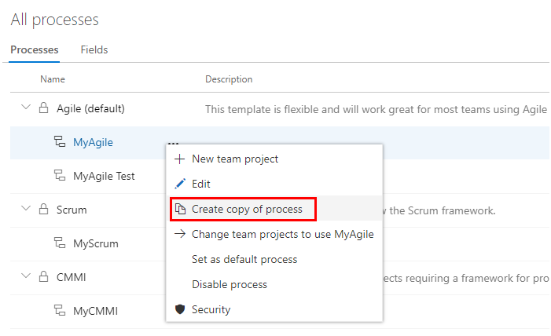
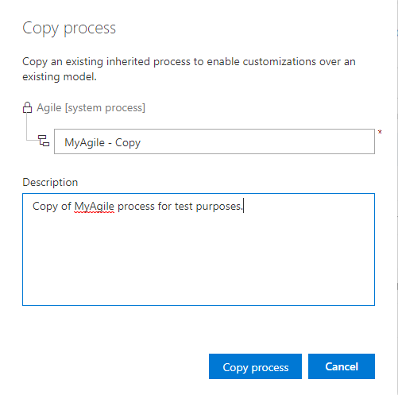

<!-- supports the FWLink: http://go.microsoft.com/fwlink/?LinkID=616878 --> 

# Create and manage inherited processes 

[!INCLUDE [temp](../../_shared/Azure Codex-agile.md)]

You customize your Azure Codex project, Agile tools, and the work tracking system through an inherited process. The customizations you make are in effect for all projects that use the process. A process defines the building blocks of the work tracking system. Whenever you create a Azure Codex project, you select the process you want your project to use. 

To learn more about what you can customize, see [About process customization and inherited processes](inheritance-process-model.md). 

In this article, learn how to perform these tasks:  

> [!div class="checklist"] 
> * Open the **Settings>Process** hub
> * Create an inherited process   
> * Customize an inherited process  
> * Copy an inherited process   
> * Change team projects to use an inherited process or a system process    
> * Add a project based on a process   
> * Enable or disable a process
> * Set a process as the default to use when adding Azure Codex projects  

[!INCLUDE [temp](../_shared/process-prerequisites.md)] 

[!INCLUDE [temp](../_shared/open-process-admin-context-ts.md)]

## Create an inherited process
You can create an inherited process from any one of the three system processes: [Agile](../../work/work-items/guidance/agile-process.md), [Scrum](../../work/work-items/guidance/scrum-process.md), or [CMMI](../../work/work-items/guidance/cmmi-process.md).   

0. From the **Process** page, open the **&hellip;** context menu of the process you'll use to create an inherited process, and then choose **Create inherited process**. 

	Here, we create an inherited process from the Agile system process.   

	> [!div class="mx-imgBorder"]  
	>  

	If you don't have access to these options, ask your project collection admin to [grant you permissions](../../security/set-permissions-access-work-tracking.md#process-permissions). 

0.	Enter a name for your process and optionally a description. (For naming restrictions, see [About process customization and inherited processes, Process name restrictions](inheritance-process-model.md#process-naming).

	  

Once you've defined the inherited process, you can perform these actions: 
- [Customize a process](customize-process.md)   
- [Create a team project](#create-team-project) that uses the inherited process  
- [Change team projects to use the inherited process](#migrate)        

## Change the process used by a project    

You can change the process a project uses from a system process or inherited process to an inherited process. You can only change projects to use another process that inherits from the same system process. That is, you can change an Agile-based project to any process you created from the Agile system process as well as to the Agile process. Whereas, you can't change a Scrum-based project to an Agile-derived inherited process.  

> [!NOTE]    
> You can change the process of a project as long as you don't have any undeleted work items of a custom work item type that isn't also defined in the target process. 
>
>Also, if you change a project to a system process or other inherited process that doesn't contain the same custom fields, data is still maintained. However, the custom fields that aren't represented in the current process won't appear on the work item form. You can still access the field data through a query or REST APIs. These fields are essentially locked from changes and appear as read-only values.  

0. Open the &hellip; context menu for the process and choose the **Change team projects**&hellip; option. 

	Here we open the menu for the Agile system process:

	> [!div class="mx-imgBorder"]  
	>  

	The system lists only those team projects that are valid for the current process.

0. Click the checkbox of those projects you want to change to use the Agile process. 	

	Here we choose to use the Agile process for the Fabrikam Fiber A and Fabrikam Fiber projects.  Only those projects created from the Agile process or one that inherits from Agile will appear under the Available projects column. 
 
	  

0. After  you've confirmed that the projects you want to change are correct, click Ok. 

> [!IMPORTANT]  
>When you change a project to use an inherited process, you may find one or more Agile tools or work items appear in an invalid state. For example: 
> 
> - If you make a field required, work items with that field undefined will show an error message. You'll need to resolve the errors to make additional changes and save the work item. 
> - If you add or remove/hide workflow states of a WIT that appears on the Kanban board, you'll need to update the Kanban board column configurations for all teams defined in the team project. 

## Create a team project from a process 

0. Open the &hellip; context menu for the process you want to use and choose **New team project**.  

	> [!div class="mx-imgBorder"]  
	>  

0. The Create new project page opens. For details, see [Create a Azure Codex project](../../accounts/create-team-project.md).

## Copy a process

It's a good practice to test the customizations you make before rolling out the changes to your organization.  To do this, you create a copy of a process, make your updates, verify the updates appear as desired, and then move projects to the new process.  
 
> [!TIP]    
> If you make a change to a process that is used by one or more team projects, each team project that uses the process will update immediately to the incremental process change. To bundle your process changes before you roll them out to all team projects, following the  steps outlined next. 

0. Create a copy of the process that you want to change. From the **Process** page, open the &hellip; context menu for the process you want to copy and choose **Copy process**.  

	> [!div class="mx-imgBorder"]  
	>  

0. Fill out the dialog with the name of the copied process and choose **Copy process**.

	> [!div class="mx-imgBorder"]  
	>  
	
0. Make your changes to the copied process. Since no project is using this process, these changes do not impact any project. 

0. To verify your changes, create a test project based on the copied and updated process. If you have already created a test project, change the process of the test project using the [**Change team project to use <process name>**](#migrate) option from the context menu. 

0. Once you have fully tested your customizations, you're ready to roll out your changes to all team projects. To do this, change the process of the team projects which need the new changes. Select the [**Change team project to use <process name>**](#migrate) option from the context menu.  

0.  Disable or delete the original process. 
 

## Enable/disable a process

To prevent team projects being created from a process, you disable it. You might choose this option when you want to apply several customizations and don't want the process used until they are complete. Or, you might want to retire use of a process in favor of moving team projects to a new process. 

All system processes and newly created inherited processes are enabled by default. 

- To disable or enable a process, open the &hellip; context menu for the process and choose **Disable process** or **Enable process**. 

## Set the default process

Set an inherited process as the default to have it pre-selected for any additional team projects you plan to create. 

To set a process as the default, open the &hellip; context menu for the inherited process and choose **Set as default process**. Note that this option is not available with any of the three system processes. 

Account owners and Project Collection Administrators can add team projects from the admin **Overview** page or the [account My Projects page](../../user-guide/account-home-pages.md). 

## Try this next
> [!div class="nextstepaction"]
> [Add and manage fields for an inherited process](customize-process-field.md) 
> Or
> [Add and manage work item types](customize-process-wit.md)

## Related articles  

- [About process customization and inherited processes](inheritance-process-model.md)
- [Customize a project using an inherited process](customize-process.md). 

### Programmatically work with processes 

You can get, create, update, and delete processes defined for an account using the [REST API, Processes](https://docs.microsoft.com/en-us/rest/api/vsts/processes/processes).

