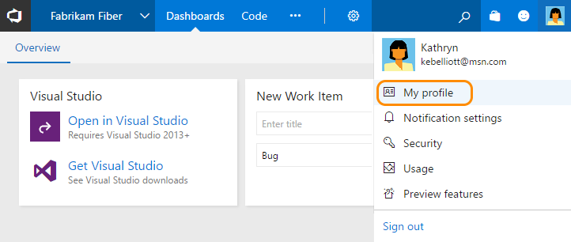
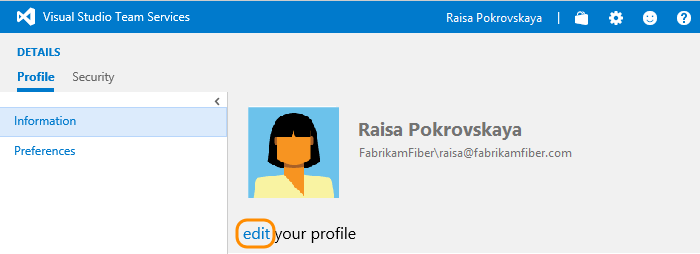
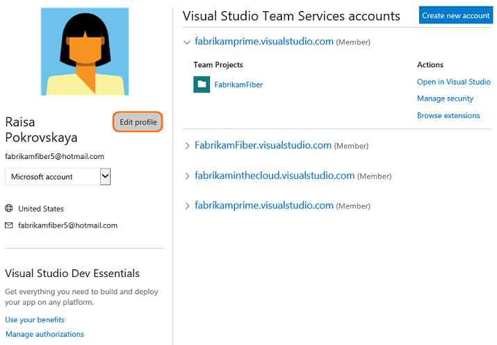
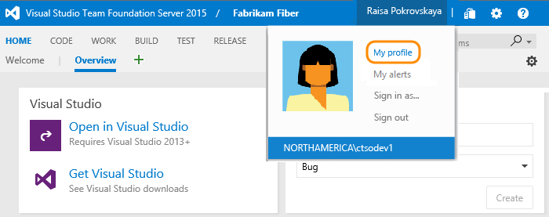
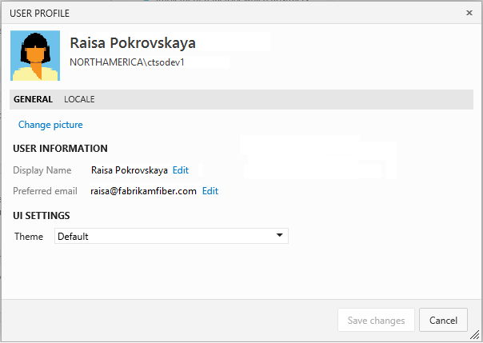

#Set your account preferences

**Team Services | TFS 2017 | TFS 2015**

From your profile page, you can change your picture or other account preferences. Specifically, you can set the following:  

Profile
 
-    Your picture   
-    Your display name   
-    Your preferred email   
-    Locale settings (Language, date and time pattern, time zone, and user interface theme)   

Preview features

-   [Enable/disable preview features](../collaborate/preview-features.md)    

Security

- [Personal access tokens](../setup-admin/team-services/use-personal-access-tokens-to-authenticate.md)   
- [Alternate authentication credentials](../../integrate/get-started/auth/overview.md)   
- [OAuth authorizations](../../integrate/get-started/auth/oauth.md)   
- [SSH public keys](../git/use-ssh-keys-to-authenticate.md)   

Personal alerts and notifications

<ul style="padding-left:30px">
- [Manage personal notifications](../collaborate/manage-personal-notifications.md) (Team Services, TFS 2017.1)    
- [Set personal alerts](#alerts) (TFS 2015, TFS 2017)   

Use personal alerts and notifications to receive email notifications when changes are made to the following objects:

- Changes to work items
- Code check ins
- Build completions
- Commits
- Pull requests
 

>[!NOTE]  
>The images you see from your web portal may differ from the images you see in this topic. These differences result from updates made to Team Services or your on-premises TFS and [options that you or your admin have enabled](../collaborate/preview-features.md). However, the basic functionality available to you remains the same unless explicitly mentioned.  

## Set preferences (Team Services)   

To change your your account information, open your account menu.  

  

From the Profile/Information page, click Edit to change the picture, display name, or preferred email. Open the Preferences page to change a locale preference.  

<!---

-->
  

## Set preferences (TFS)    

  

Click edit to change a setting. Choose the Locale tab to change a locale preference.  

