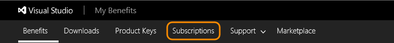
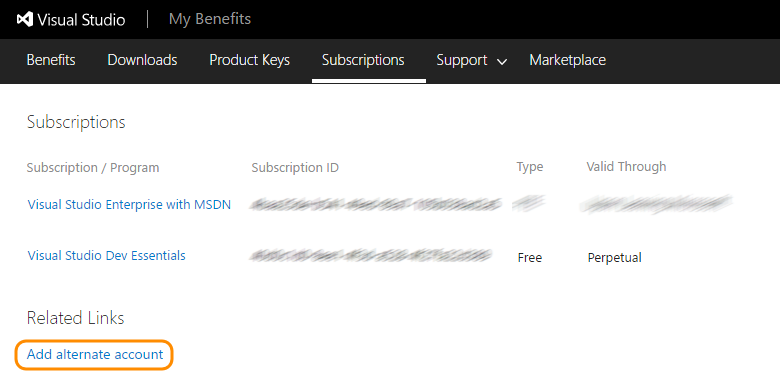
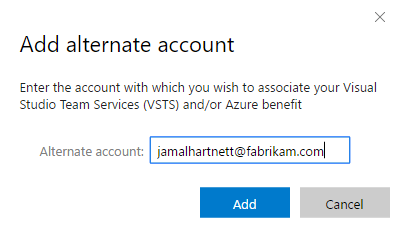
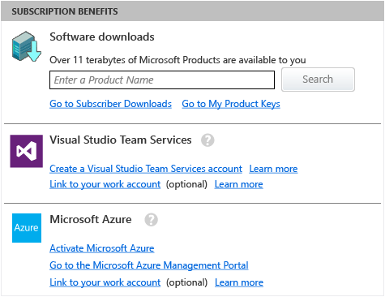
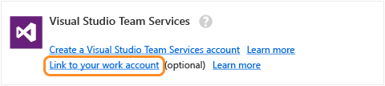
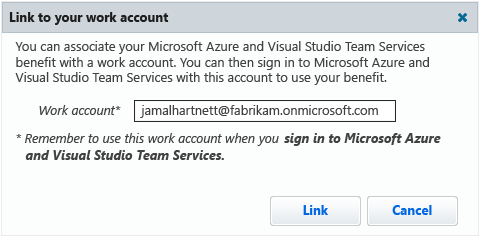

#   Add work or school accounts to Visual Studio with MSDN subscriptions

**Team Services**

When you activate a Visual Studio with MSDN subscription 
through the MSDN portal (```https://msdn.microsoft.com```), 
you must use a "personal" Microsoft account. 
If you go through the Visual Studio subscriptions portal (```https://my.visualstudio.com```), 
you must use the email address that you previously used 
to activate your subscription on the MSDN portal 
or the email address that was assigned to your subscription for new subscriptions. 
This email address can be either your personal Microsoft account 
or a "work or school account" managed by your organization with Azure Active Directory.

If your subscription includes Visual Studio Team Services or Microsoft Azure as benefits, 
you can add your work or school account to your subscription so you can use that account with your benefits, 
**but only for subscriptions that you activated with your Microsoft account**. 
This lets you sign in to your subscription with your Microsoft account, 
but access Team Services, Azure, or Visual Studio with your work or school account.

> Do you have the same email address for your Microsoft account and your work or school account?
>
> You must still add that email address to your subscription 
> so you can use your work or school account with your benefits. 

If your subscription has migrated to the 
Visual Studio subscriptions portal (```https://my.visualstudio.com```), 
and you use your Microsoft account to sign in to that portal, 
follow the steps for the [Visual Studio subscriptions portal](#my-visualstudio-com).
Otherwise, follow the steps for the [My Account page](#my-account-page).

<a name="my-visualstudio-com"></a>
## Visual Studio subscriptions portal

0.	Sign in with your Microsoft account to the 
[Visual Studio subscriptions portal (https://my.visualstudio.com)](https://my.visualstudio.com).

	> If you're asked to choose "personal account" 
	> or "work or school account", choose "personal account" (your Microsoft account). 
	>
	> <p><a data-toggle="collapse" href="#expando-choose-msa-wsa">Why do you ask me to choose? &#x25BC;</a></p>
	> <div class="collapse" id="expando-choose-msa-wsa">
	> <p>Your Microsoft account and your work or school 
	> account share the same email address. 
	> Although both identities use the same email address, 
	> they're still separate identities with different profiles, 
	> security settings, and permissions.
	> </div>

0.	Go to **Subscriptions**.

	

0.	Under **Related Links**, go to **Add alternate account**.

	> <p><a data-toggle="collapse" href="#expando-no-related-links-alt-account">Why don't I see **Related Links** or **Add alternate account**? &#x25BC;</a></p>
	> <div class="collapse" id="expando-no-related-links-alt-account">
	> <ul>
	> <li>Your subscription must include Team Services or Azure as benefits.
	> <li>You're signed in with your work or school account, 
	> and your subscription is already associated with that account. 
	> To add a work or school account, you must sign in with your Microsoft account. 
	> Please follow these steps: 
	> <p>
	> <ol>
	> <li>Close all browsers.
	> <li>Open a private or incognito browsing session.
	> <li>Sign in to the Visual Studio subscriptions portal with your Microsoft account. 
	> If you're asked to choose "personal account" 
	> or "work or school account", choose "personal account".
	> </ol>
	> </ul>
	> <p>
	> </div>

	

0.	Add your work or school account.

	

0.	Use your work or school account to sign in to your Team Services 
account (```https://{youraccount}.visualstudio.com```).

<a name="my-account-page"></a>
## My Account page

0.  Sign in with your "personal" Microsoft account to the 
[My Account page (https://msdn.microsoft.com/subscriptions/manage)](https://msdn.microsoft.com/subscriptions/manage/). 
You see your subscription benefits here.

   

0.  Add your work or school account to your subscription.

   

0.  Enter your work or school account.

   

0.  Use your work account or school account to sign in to your Visual Studio Team Services 
account (```https://{youraccount}.visualstudio.com```).

##  Q&A

<!-- BEGINSECTION class="md-qanda" -->

####Q:  Why can't I add my work or school account to my subscription?

A:  Your Visual Studio with MSDN subscription must: 

*	Include Visual Studio Team Services or Microsoft Azure as a benefit. 
*	Have been activated with your Microsoft account. 

You must also use your Microsoft account, not your work or school account, to sign in to the 
[Visual Studio subscriptions portal (https://my.visualstudio.com)](https://my.visualstudio.com) 
or the [My Account page (https://msdn.microsoft.com/subscriptions/manage)](https://msdn.microsoft.com/subscriptions/manage/).

####Q:  Can I add more than one work or school account to my subscription?

A:  No, you can add only one work or school account.

<a name="unconfirmed-subscription"></a>
####Q:  Why doesn't Team Services recognize my subscription?

A:	This might happen for different reasons: 

*	You must have an active, valid, and 
[eligible Visual Studio subscription](add-account-users-assign-access-levels-team-services.md#EligibleMSDNSubscriptions) 
that includes Team Services as a benefit.

*	If your Visual Studio subscription is valid and eligible, 
[make sure to activate your subscription](https://support.microsoft.com/en-us/kb/3011409) 
before you sign in to Team Services. 

*	Team Services should automatically recognize your subscription when you sign in. 
If not, try having the Team Services account owner set 
[your access level to "Visual Studio/MSDN Subscriber" in the Team Services account](add-account-users-assign-access-levels-team-services.md). 

If Team Services still doesn't recognize your subscription, try these other 
[troubleshooting tips](http://blogs.msdn.com/b/visualstudioalm/archive/2014/03/19/visual-studio-online-best-practices-troubleshooting-issues-with-the-quot-eligible-msdn-subscriber-license-type.aspx).

####Q:  Why can't I sign in with my work or school account after adding it to my subscription or getting invited to Visual Studio Team Services?

A:  Check with the Team Services account owner that they've 
[set up Azure Active Directory (Azure AD) access](manage-organization-access-for-your-account-vs.md) 
between the Team Services account and your organization's 
directory that manages your work or school account.

<!-- ENDSECTION --> 
