# Get started with continuous testing

**Team Services | TFS 2017 | TFS 2015 | [Previous version](https://msdn.microsoft.com/library/ee702477%28v=vs.120%29.aspx)**  

Make sure that your app still works after every 
check-in and build using Visual Studio Team Services. 
Find problems earlier by running tests 
automatically with each build. When your build is 
done, review your test results to start resolving 
the problems that you find.

##  Before you start

This overview shows how to get started by running 
unit tests with your build. 

1. [Check in your solution](../../../tfvc/overview.md) 
   to Visual Studio Team Services. Include your test projects.

1. [Create a build definition](../../../build/overview.md) 
   that builds your solution after each check-in, 
   using continuous integration.

When you're ready to 
[run other continuous tests](#RunOtherTests), such as 
system tests, under more realistic conditions, 
create environments from physical or virtual 
machines that you've already set up. Then set up 
your build to run your app and tests in the 
environments that you created.

For information about setting up test machines in a test lab, see [Use a lab environment for your devops](https://www.visualstudio.com/en-us/docs/test/lab-management/using-a-lab-environment-for-your-application-lifecycle)

## Run unit tests with your builds

Your build definition includes a test task that runs unit tests. 
For example, if you're building a Visual Studio solution in Team Services,
your build definition includes a **Visual Studio Test** task. After your 
build starts, this task automatically runs all the unit tests in your 
solution - on the same build machine. 

1. If you want to customize your test run, go to your team project 
   to find your build definition in the **Explorer** tab and edit it.

   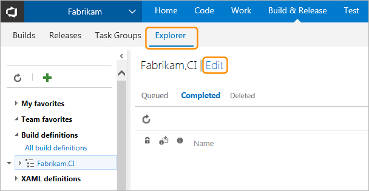

1. Edit the Visual Studio Test task:

   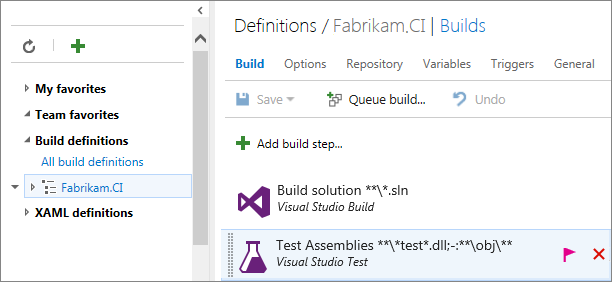

1. You can add filter criteria to run specific tests, enable code coverage, 
   run tests from [other unit test frameworks](#OtherUTFrameworks), and so on.
   For information about the option settings of the Visual Studio Test task, see
   [Run Tests using Visual Studio task](https://github.com/Microsoft/vsts-tasks/blob/master/Tasks/VsTest/README.md).

   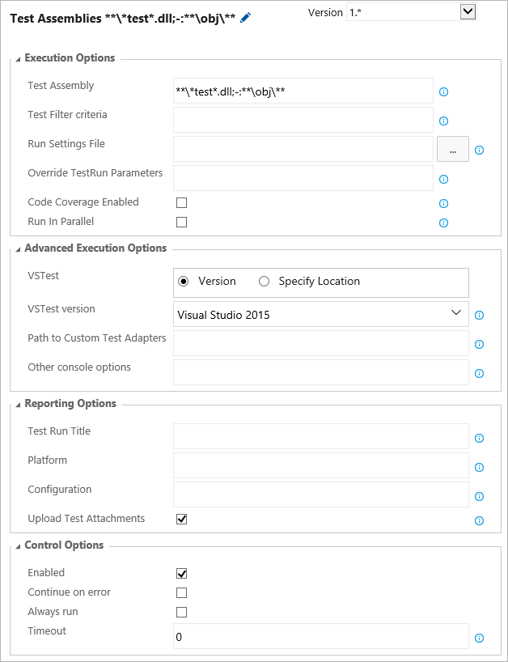

1. When you're done, save your build definition.

   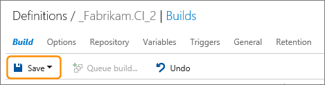

1. Start the build.

   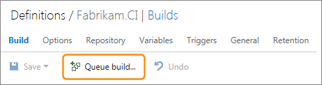 

1. After the build finishes, you can review the test results to resolve any problems that happened. Go to the build to open the build summary.

   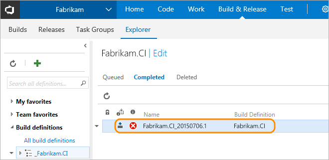

1. Open the test run results summary.

   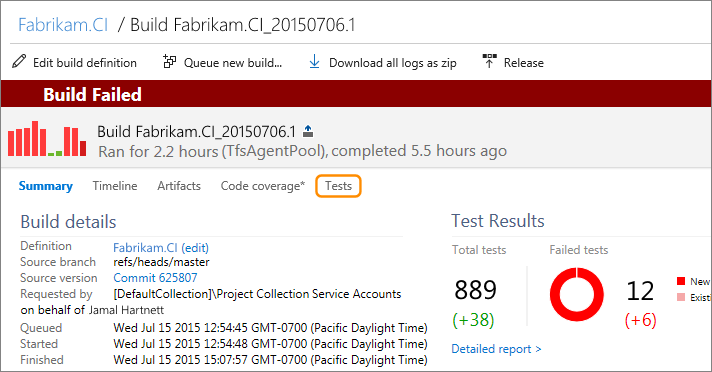

1. Compare your test results between this build and the last build.

   Here you'll find changes in new, failed, and passed tests, 
   how long these tests took to run, how long these tests have been failing, and more.
   Organize your test results and open bugs directly for failed tests.

   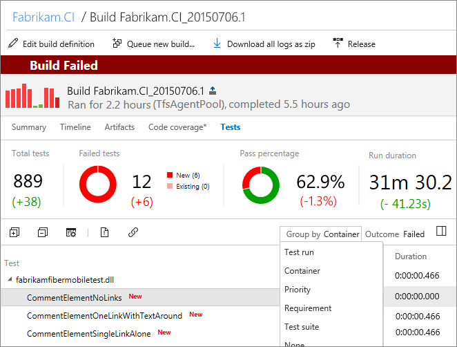

1. To start debugging a failed test, review the resulting error and stack trace.

   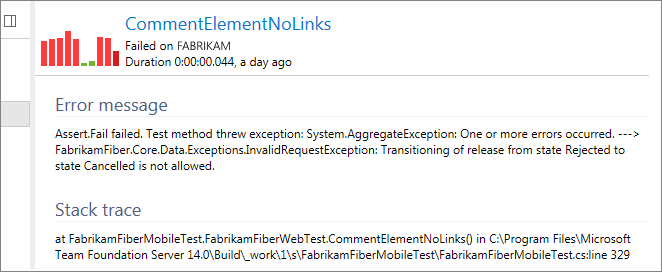
 

## Next: Run other continuous tests with your builds

When you're ready to test your app more extensively under more realistic conditions, on different platforms and configurations:

1. [Create environments](../set-up-continuous-test-environments-builds.md)
   from physical or virtual machines that you've 
   already set up.

1. [Set up your build to run your app and tests](../set-up-continuous-testing-builds.md)
   in the environments that you created.

1. After your build finishes, 
   [review your test results](review-continuous-test-results-after-build.md) 
   to start resolving problems that you found.

## Q & A

<!-- BEGINSECTION class="m-qanda" -->

#### Q: Where can I find details about configuring test agents?

A: See [Install and configure test agents](../../lab-management/test-machines/install-configure-test-agents.md)

#### Q: Where can I learn more about integrating tests with my build?

A: Try these blog posts and videos:

* [Configuring Continuous Integration and Continuous Testing with Visual Studio](http://blogs.msdn.com/b/visualstudioalm/archive/2015/07/17/video-configuring-continuous-integration-and-continuous-testing-with-visual-studio-2015.aspx)

* [Testing in Continuous Integration and Continuous Deployment Workflows](http://blogs.msdn.com/b/visualstudioalm/archive/2015/05/29/testing-in-continuous-integration-and-continuous-deployment-workflows.aspx)

* [Integrating Testing Efforts into the DevOps Process with Build vNext and Visual Studio Release Management](https://channel9.msdn.com/Series/ConnectOn-Demand/234)

#### Q: How do I run tests from different unit test frameworks with my build?

A: First, set up your test frameworks in your development tool. For example, in Visual Studio:

1. [Set up the plug-in for your test framework](../../developer-testing/getting-started/getting-started-with-developer-testing.md#frameworks), if you haven't already.

1. Create a folder that has the custom binaries for your plug-in. (The plug-in package for your framework is a .vsix file. Change the extension to .zip so that you can unzip it.)

1. Add these assemblies to version control and [let the build controller know where to get them](../../../build/overview.md).

1. In your build definition, provide the path to the test framework:

   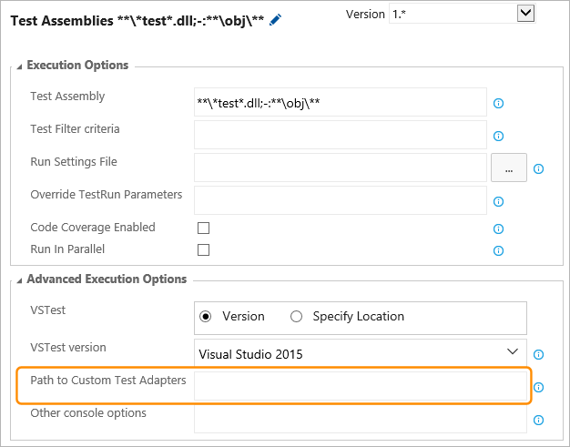

#### Q: Can I find a specific test run?

A: Yes, by finding that test run here:

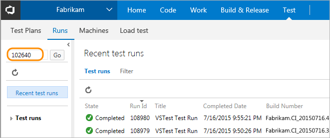

####Q: Can I find specific results from a test run?

A: Yes, after you find your test run, create a query to find the test results you want:

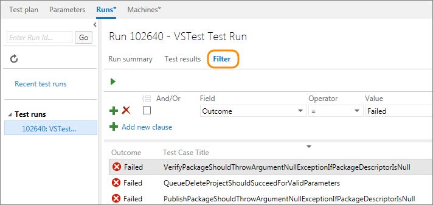

<!-- ENDSECTION -->

## See also

* [End-to-end example of continuous testing](../example-continuous-testing.md)
* [Test apps early and often](../../index.md) 
* [Run Selenium tests](continuous-test-selenium.md)
* [Test Java applications](continuous-test-java.md)
* [Testing in Continuous Integration and Continuous Deployment Workflows](https://blogs.msdn.microsoft.com/visualstudioalm/2015/05/29/testing-in-continuous-integration-and-continuous-deployment-workflows/)
* [Review continuous test results after a build](review-continuous-test-results-after-build.md)
* [Set up continuous testing for your builds](../set-up-continuous-testing-builds.md)
* [Set up environments to run continuous test tasks with your build tasks](../set-up-continuous-test-environments-builds.md)

[!INCLUDE [help-and-support-footer](../../_shared/help-and-support-footer.md)] 
