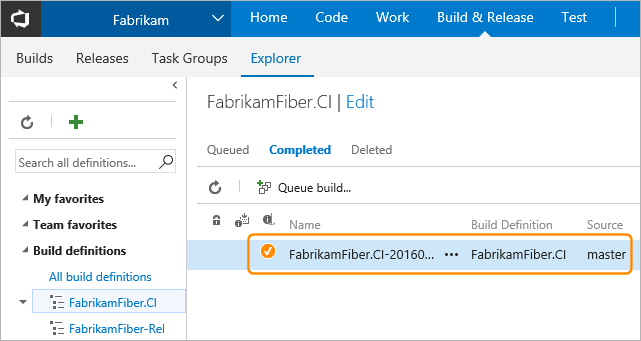
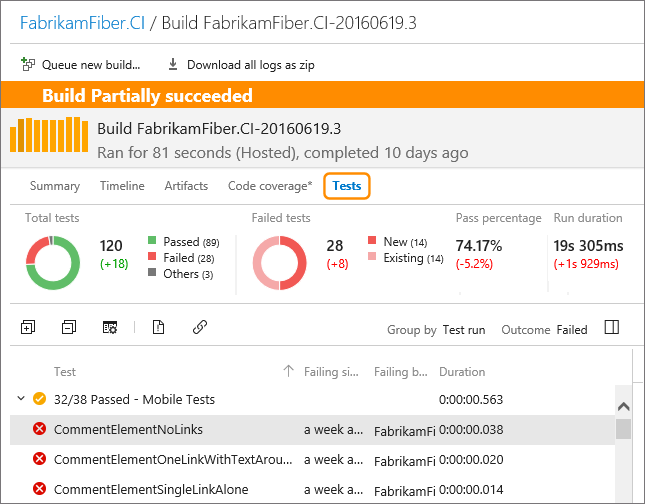
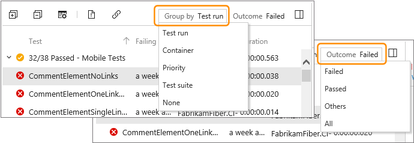
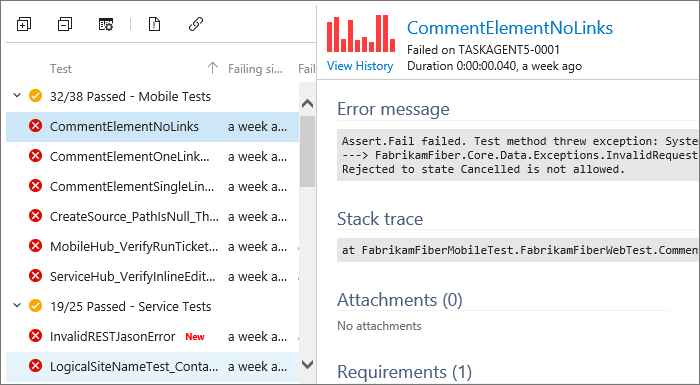
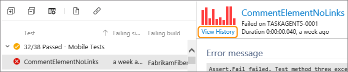
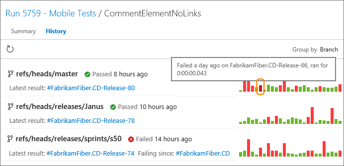
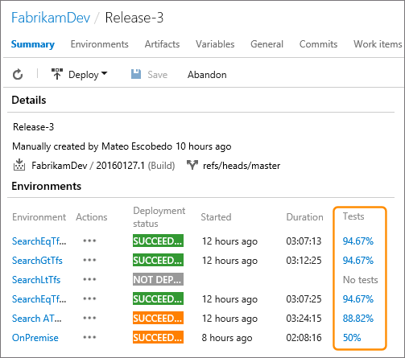
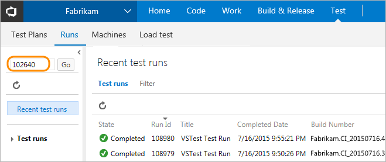
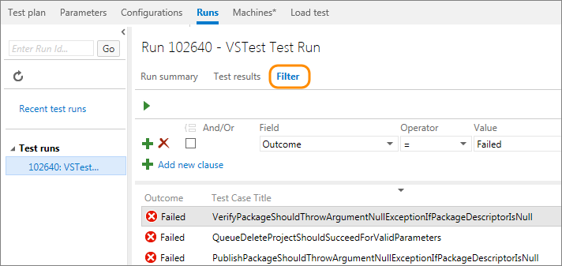

# Review continuous test results after a build

[!INCLUDE [version-header-vs-tfs](../../_shared/version-header-vs-tfs.md)]

After your build finishes running continuous tests using Visual Studio Team Services or Team Foundation Server, review your test results to start analyzing any problems that you found.

1. In Visual Studio Team Services or Team Foundation Server, go to your team project.

1. Find your build to open the build summary:

   

1. Review the summary for your test run results.
   Here you'll find changes in new, failed, and passed tests, 
   how long these tests took to run, how long these tests have been failing, and more.

   
  
1. Organize your test results using the group and outcome lists.

   

1. To start debugging a failed test, review the resulting error and stack trace.

   

1. To trace the results of a test across builds, view the test history.

   

1. In the history page, review when a test started to pass or fail.

   

   Group the list of results using the drop-down list.
   Mouse over a bar in the chart to see a pop-up summary, or select
   a bar to view the detailed test results for that build. 
 
1. Test results are also summarized in the release summaries in the **Release** hub.
   Choose any of the percentage values to see the full summary in the **Test** hub. 

   

## Q & A

<!-- BEGINSECTION class="m-qanda" -->

#### Q: Can I find a specific test run?

A: Yes, by finding that test run here:

####Q: Can I find specific results from a test run?

A:  Yes, after you find your test run, create a query to find the test results you want:

<!-- ENDSECTION -->

## See also

* [Set up environments for continuous testing with your builds](../set-up-continuous-test-environments-builds.md)
* [Set up continuous testing for your builds](../set-up-continuous-testing-builds.md)
* [Run tests with your builds](getting-started-with-continuous-testing.md)

[!INCLUDE [help-and-support-footer](../../_shared/help-and-support-footer.md)] 
