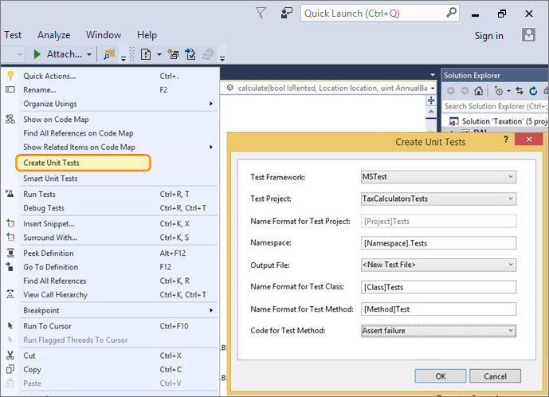
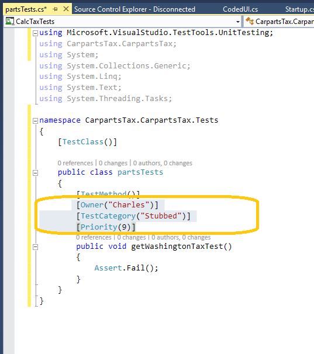
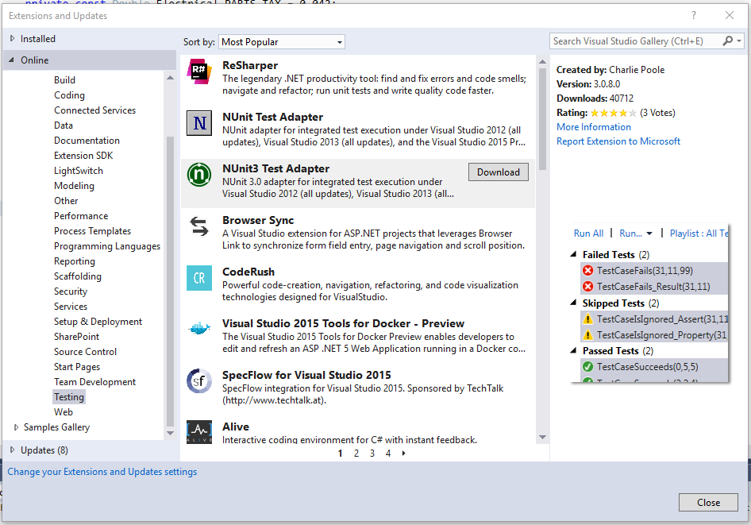

# Create unit test method stubs with the Create Unit Tests command

[!INCLUDE [version-header-vs](../../_shared/version-header-vs.md)]

Visual Studio includes the **Create Unit Tests**
command that provides the ability to create unit 
test method stubs. This feature allows easy 
configuration of a test project, the test class, 
and the test method stub within it. 

To get started, select a method, a type, or a namespace in the code
editor in the project you want to test, open the shortcut menu, and choose
**Create Unit Tests**. This opens the **Create Unit Tests**
dialog where the create options for the new unit tests can be selected.

## Setting Unit Test Traits
If you plan to run these tests is part of the test automation process you might consider having the test created in another test project (second option in the diaglog above) and setting unit test traits for the unit test. 
This will enable you to more easily include or exclude these specific tests as part of a continuous integration or continous deployment pipeline. This traits are set by by altering the unit test diretly as seen in the image below. 

## Using third-party unit test frameworks
With Visual Studio you can easily not just have Unit tests created for you, it can be done with any test framework.
To get add other test frameworks choose the Tools menu in Visual Studio and then choose Extensions and Updates. Expand Online, Visual Studio Gallery, Tools and choose Testing. 

> At present only C# with **MSTest** and Xunit test frameworks are supported, but will be extended to other langauges and
frameworks in the future.

## When should I use this feature?

Use this feature whenever you need to create unit tests,
but specificaly when you are testing existing code 
that has very little or no test coverage, and no 
documentation. In other words,  where there is 
limited or non-existent code specification. It 
effectively implements an approach similar to
[Smart Unit Tests](http://blogs.msdn.com/b/visualstudioalm/archive/2014/11/19/introducing-smart-unit-tests.aspx)
that characterize the observed behaviour of the code.

However, this feature is equally applicable to
the situation where the developer starts by writing 
some code, and uses that to boot strap the unit testing 
discipline. Within the flow of coding, the developer might 
want to quickly create a unit test method stub 
(with a suitable test class, and a suitable test project) 
for a particular piece of code. 

For more information, see 
[this blog post](https://blogs.msdn.microsoft.com/visualstudioalm/2015/03/06/creating-unit-test-method-stubs-with-create-unit-tests/).

[!INCLUDE [help-and-support-footer](../../_shared/help-and-support-footer.md)] 
