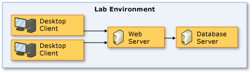
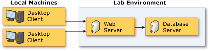

# Use a lab environment for your devops

[!INCLUDE [version-header-vs-tfs](../_shared/version-header-vs-tfs.md)]

A lab environment is a collection of virtual and physical machines, 
which you can use to develop and test applications. A lab environment 
can contain multiple roles needed to test multi-tiered applications, 
such as workstations, web servers, and database servers. In addition, 
you can use a build-deploy-test workflow with your lab environment 
to automate the process of building, deploying, and running 
automated tests on your application.

* **Use a test plan to run automated tests** - You can run a collection of automated tests, called a *test plan*, and view the progressr.  
  
* **Use a build-deploy-test workflow** - You can use a build-deploy-test workflow to test multi-tiered applications automatically. A typical example is a workflow that starts a build, deploys the build files onto the appropriate machines in a lab environment, and then performs automated tests. In addition, you can schedule your workflow to run at specific intervals.  
  
* **Collect diagnostic data from all machines, even during manual testing** - You can collect diagnostic data from multiple machines simultaneously. For example, during a single test run, you can collect IntelliTrace, test impact, and other forms of data from a web server, a database server, and a client.  
  
Here are examples of common types of lab environments:  
  
| Topology | Description |  
|---|---|  
|| This lab environment has a *client-server topology*, which is often used to test an application that has server and client components. In a client/server topology, all of the client and server machines used to test your application are in your lab environment. When you use this topology, you can collect test data from every machine that impacts your tests.|  
|| This lab environment has a *server topology*, which is often used to run manual tests on server applications, and which allows testers to use their own client machines to verify bugs in the environment. In a backend topology, your lab environment contains only servers. When you use this type of topology, you typically connect to the servers in the lab environment using a client machine that is not part the environment.|  
  
See [Video: Managing lab environments for testing](http://go.microsoft.com/fwlink/?LinkID=252614).  
  
Typical techniques for setting up a lab environment are: 
  
* **[Use Team Services or Team Foundation Server Build or Release Management](#usebandrm)**

* **[Use Visual Studio Lab Management features of Microsoft Test Manager](#usemtmlm)**

## Use Team Services or Team Foundation Server Build or Release Management

You can perform automated testing and build-deploy-test automation
using the **[Build &amp; Release](../../build/overview.md)**
features in Team Foundation Server (TFS)
and Visual Studio Team Services. Some of the benefits are:

* You do not need a Build controller or Test controller.
* The Test agent is installed through a task as part of the build or release.
* It is easy to customize the deployment steps. You are no longer restricted to use a single script. You can also take advantage of the many tasks that are available in the product as well as in Visual Studio Marketplace.
* You do not have to maintain test suites. You can directly run tests from binaries.
* You get a richer inline reporting experience for the tests that ran within each build or release.
* You can track which assets (release, build, work items, commits) are currently deployed and tested on each environment.
* You can customize and extend the automation to easily deploy to multiple test environments, and even to production.
* You can schedule the automation to happen whenever there is a check-in or commit, or at a specific time every day.

**[More information](use-build-or-rm-instead-of-lab-management.md)**.

## Use Visual Studio Lab Management features of Microsoft Test Manager

You can create and manage lab environments with the Visual Studio Lab Management features of Microsoft Test Manager 
when you use Visual Studio Enterprise or Visual Studio Test Professional.

Lab Management automatically installs test agents on every machine in your environment.  
  
If you use Lab Management in conjunction with System Center Virtual Machine Manager (SCVMM), you can also get these benefits when you use lab environments:  
  
* **Quickly reproduce machine configurations** - You can store collections of virtual machines that are configured to recreate typical production environments. You can then perform each test run on a new copy of a stored environment.  
  
* **Reproduce the exact conditions of a bug** - When a test run fails, you can store a copy of the state of your lab environment, and access it from your build results or a work item.  
  
* **Run multiple copies of a lab environment at the same time** - You can run multiple copies of your lab environment at the same time without naming conflicts.  
  
### Standard Environments and SCVMM Environments

There are two types of lab environments that you can create with Visual Studio Lab Management:
**standard environments** and **SCVMM environments**.
However, the capabilities of each type of environment are different.  
  
> **NOTE**: Lab Management **does not** support SCVMM 2016. For information on SCVMM, see [Virtual Machine Manager](http://go.microsoft.com/fwlink/?LinkId=226332). 
  
**Standard environments:** can contain a mix of virtual and physical machines. You can also add virtual machines to a standard environment that are managed by third-party virtualization frameworks. In addition, standard environments do not require additional server resources such as an SCVMM server.  
  
**SCVMM environments:** can only contain virtual machines that are managed by SCVMM (System Center Virtual Machine Manager), so the virtual machines in SCVMM environments can only run on the Hyper-V virtualization framework. However, SCVMM environments provide the following automation and management features that are not available in standard environments:  
  
- **Environment snapshots:** Environment snapshots contain the state of a lab environment, so you can quickly restore a clean environment, or save the state of an environment that has been modified. You can also use a build-deploy-test workflow to automate the process of saving and restoring environment snapshots.  
  
- **Stored environments:** You can store a copy of an SCVMM environment, and then deploy multiple copies of that environment.  
  
- **Network isolation:** Network isolation allows you to simultaneously run multiple identical copies of an SCVMM environment without computer name conflicts.  
  
- **Virtual machine templates:** A virtual machine template is a virtual machine that has had its name and other identifiers removed. When a VM template is deployed in an SCVMM environment, Microsoft Test Manager generates new identifiers. This allows you deploy multiple copies of a virtual machine in the same environment, or multiple environments, and then run the virtual machines simultaneously.  
  
- **Stored Virtual Machines:** A virtual machine that is stored in your Team Project library and includes unique identifiers.  
  
For more information about these features, see [Guidance for Creating and Managing SCVMM Environments](https://msdn.microsoft.com/en-gb/library/ee830480.aspx).  
  
Standard environments and SCVMM environments support many of the same features. However, there are some important differences to consider. The following table compares the features that are available for standard environments and SCVMM environments.  
  
|Capability|SCVMM Environments|Standard Environments|  
|----------------|------------------------|---------------------------|  
|**Testing**|||  
|Run manual tests|Supported|Supported|  
|Run coded UI and other automated tests|Supported|Supported|  
|File rich bugs using diagnostic adapters|Supported|Supported|  
|**Build deployment**|||  
|Automatic build-deploy-test workflows|Supported|Supported|  
|**Environment creation and management**|||  
|Use physical machines in addition to virtual machines|Not supported|Supported|  
|Use third-party virtual machines|Not supported|Supported|  
|Automatically install test agents onto machines in the lab environment|Supported|Supported|  
|Save and deploy the state of a lab environment using environment snapshots|Supported|Not supported|  
|Create lab environments from VM templates|Supported|Not supported|  
|Start/stop/snapshot environment|Supported|Not supported|  
|Connect to the environment using Environment Viewer|Supported|Supported|  
|Run multiple copies of an environment at the same time using network isolation|Supported|Not supported|  
  
### Lab management concepts

Here are some additional concepts that you should be familiar with before you continue:  
  
|Term|Description|  
|----------|-----------------|  
|Lab Center|The area of Microsoft Test Manager where you create and manage lab environments.|  
|Team Project Lab|The collection of lab environments that have been set up so you can connect to them and run their virtual machines.|  
|Team Project Library|An archive of stored virtual machines, templates, and stored lab environments that have been imported into the host group of your team project. You can use the items in your library with SCVMM environments; however, you can’t add them directly to a standard environment. You can’t run the items in your library; instead you use them to deploy a new environment.|  
|Deployed Environment|A lab environment that has been deployed to your team project lab so that you can connect to it and run its machines.|  
  
### Set up environments

* [Standard lab environments](https://msdn.microsoft.com/en-gb/library/ee390842.aspx)
* [SCVMM (virtual) environments](https://msdn.microsoft.com/en-gb/library/ee943322.aspx)
* [Creating and using a network isolated environment](https://msdn.microsoft.com/en-gb/library/ee518924.aspx)
* [Build and Release Management environments](use-build-or-rm-instead-of-lab-management.md)
  
## See also
  
* [Install and configure test agents](test-machines/install-configure-test-agents.md)
* [Visual Studio Lab Management Guide](http://go.microsoft.com/fwlink/?LinkID=230951)  
* [Managing lab environments for testing](http://go.microsoft.com/fwlink/?LinkID=252614)  
* [Visual Studio devops + Team Foundation Server Blog](http://go.microsoft.com/fwlink/?LinkID=254496)  
* [Test apps early and often](../../overview.md)   
 
[!INCLUDE [help-and-support-footer](../_shared/help-and-support-footer.md)] 
