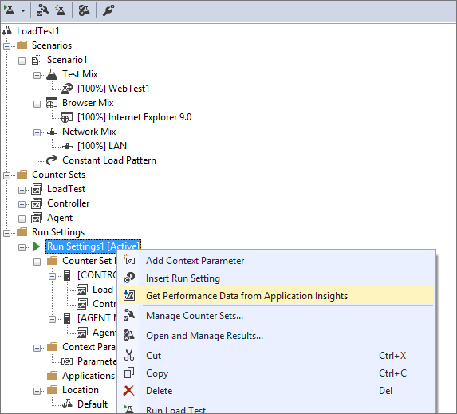

# Get app performance data with your load tests

[!INCLUDE [version-header-vs-ts](../../_shared/version-header-vs-ts.md)]

When you load test your app in the cloud using Visual Studio Team Services, 
you can compare app performance with virtual user load using 
[Application Insights](https://azure.microsoft.com/documentation/articles/app-insights-overview/).
Then, by doing a quick root cause analysis, you can figure out which code 
is causing performance problems.

1. Download and install 
   [Visual Studio Enterprise 2015](https://www.visualstudio.com/downloads/download-visual-studio-vs), 
   if you haven't already done so.

1. [Enable Azure Active Directory](https://www.visualstudio.com/docs/setup-admin/team-services/manage-organization-access-for-your-account-vs)
   for your Team Services account, if you haven't already done so.

1. [Link your Team Services account with your Azure subscription](https://www.visualstudio.com/docs/setup-admin/team-services/manage-organization-access-for-your-account-vs#connect-your-team-services-account-to-your-directory),
   if you haven't already done so.

1. Sign in to your Team Services account from your web browser to refresh the Azure Resources Manager access token. 
   The token is valid for 12 hours in the context of Team Services.

   - If you have already signed, you must sign out and then sign in again.

1. [Set up your load test project to run in the cloud](getting-started-with-performance-testing.md#LoadTestVSIDE), 
   if you haven't already done so.

1. With your load test project open in Visual Studio Enterprise, open the 
   **Run Settings** section and select your active run settings. Open the
   shortcut menu and choose **Get Performance Data from Application Insights**.  

   

1. Select the apps you want to monitor and the performance counters 
   you want to view while your load test runs.

   

   The counters you selected are shown in the load test project.
 
   
 
1. Queue a load test run and view the performance data from 
   Application Insights while your load test runs. The data might 
   take a few minutes to appear.

   

   Application counters are correlated with user load so that you can 
   understand which issues might cause performance problems that you find.
 
   >The counter samples have a sampling rate of one minute irrespective of 
   the sampling rate configured in your load test project. 

1. To do a more detailed analysis for any performance issue, or to do a 
   quick root cause analysis, go to Application Insights.

   

##  Q&A

<!-- BEGINSECTION class="md-qanda" -->

#### Q: Can I get more detailed profiler information?

A: Yes, see [Profiling live Azure web apps with Application Insights](https://docs.microsoft.com/en-us/azure/application-insights/app-insights-profiler).

#### Q: Can I view data from other app monitoring tools when load testing in the cloud?

A: No.

#### Q: Can I increase how often data is collected?

A: No, this is currently a fixed frequency of one minute.

#### Q: I don't see any counters even after waiting a few minutes. What's wrong?

A: Go to Application Insights and check that you can view performance data 
for your app there. If you see data collected there, report your issue to 
[vsoloadtest@microsoft.com](mailto:vsoloadtest@microsoft.com). 

#### Q: Why do I get an "Unable to connect to Team Services due to network failure" error when trying to add apps using the Get Performance Data from Application Insights menu command?
 
A: This can happen because:

* No apps are configured to push analytics data to Application Insights. See 
  [Get started with Visual Studio Application Insights](https://azure.microsoft.com/en-in/documentation/articles/app-insights-get-started/).
  Also check that you can see the apps in **Application Insights** in the 
  Azure portal, as shown here:
  
  
 
* The Azure Resource Manager access token has expired. The token is valid for 12 hours 
  in the context of Team Services. Sign out of your Team Services account and then sign 
  in again to refresh the token.

* Azure Active Directory is not enabled for your Team Services account.
  See [Enable Azure Active Directory](https://www.visualstudio.com/docs/setup-admin/team-services/manage-organization-access-for-your-account-vs).

If none of the above works, contact us at [vsoloadtest@microsoft.com](mailto:vsoloadtest@microsoft.com).

<!-- ENDSECTION --> 

[!INCLUDE [help-and-support-footer](../../_shared/help-and-support-footer.md)] 
