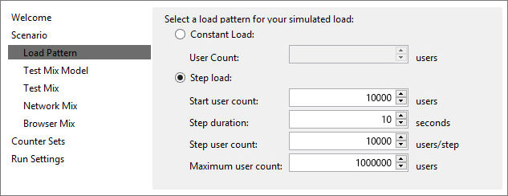
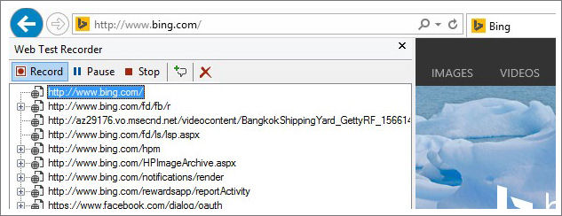
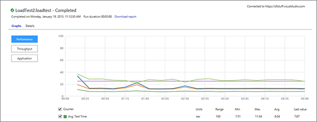
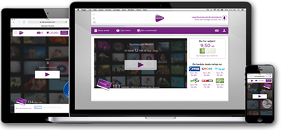

# Performance testing scenarios and capabilities

**Visual Studio 2017 | Visual Studio 2015 | Team Services | [Previous version](https://msdn.microsoft.com/library/dn250793%28v=vs.120%29.aspx)**  

Performance test your code with hundreds of 
thousands of users using 
[Visual Studio Team Services](http://go.microsoft.com/fwlink/?LinkId=307137&clcid=0x409&wt.mc_id=o~msft~vscom~getstarted-hero~dn906133&campaign=o~msft~vscom~getstarted-hero~dn906133&scenario=test).

* Load test web sites, apps and APIs
* Scale to hundreds of thousands of concurrent users
* Deep analysis with rich diagnostics, trace and exception logging
* Generate load from multiple regions worldwide
* 20,000 virtual user minutes FREE every month

>If you prefer to run your tests in a local environment rather
than in the cloud, see [Use a lab environment for your devops](../lab-management/using-a-lab-environment-for-your-application-lifecycle.md).

## Cloud scalable

Generate hundreds of thousands of connections in 
minutes. Cloud-based load testing leveraging the 
power of Azure is like having a whole performance 
lab at your fingertips. Of course you can run your 
performance test from on-premises agents too!

* [Performance testing videos](https://channel9.msdn.com/Search?term=performance%20load%20testing#ch9Search)
* [Get started with performance testing](getting-started/getting-started-with-performance-testing.md)

## Easily create powerful load tests
With authoring experiences in Visual Studio, Azure and Visual Studio Team Services you can quickly create load tests by specifying a website, referencing a JMeter test file or recording and replaying your actions. Run them or customize them using powerful tools in Visual Studio. You can even use existing unit or functional tests to generate load.

* [Performance testing videos](https://channel9.msdn.com/Search?term=performance%20load%20testing#ch9Search)
* [Get started with performance testing](getting-started/getting-started-with-performance-testing.md)
 
## Deep reporting and diagnostics
View app performance with real-time charts and 
graphs. Go even further with 
[Application Insights](https://www.visualstudio.com/explore/application-insights-vs), 
and correlate test results with server diagnostics.

* [Performance testing videos](https://channel9.msdn.com/Search?term=performance%20load%20testing#ch9Search)
* [Get started with performance testing](getting-started/getting-started-with-performance-testing.md)

## Test from where your users are
Run tests from one of many global Azure datacenter 
locations to minimize latency and simulate users' 
real-world conditions.

* [Performance testing videos](https://channel9.msdn.com/Search?term=performance%20load%20testing#ch9Search)
* [Get started with performance testing](getting-started/getting-started-with-performance-testing.md)
 
## How Eovendo ensures uptime with cloud-based load testing
Eovendo works to make video ads more compelling. We 
work to keep their costs down.

* [Read more](https://customers.microsoft.com/Pages/CustomerStory.aspx?recid=16127)

## Free and flexible pricing

Pricing is per virtual user minute (VUM) - a measure 
of how long your test is and how many users the test
simulates. The first 20,000 virtual user minutes are
free each month.

|First 20,000 VUM / month | 20,001-2M VUM | 2,000,001-10M VUM | 10,000,001 VUM-above |
| --- | --- | --- | --- |
| FREE | $0.0004 / VUM | $0.0002 / VUM | $0.0001 / VUM |

[!INCLUDE [help-and-support-footer](../_shared/help-and-support-footer.md)] 
