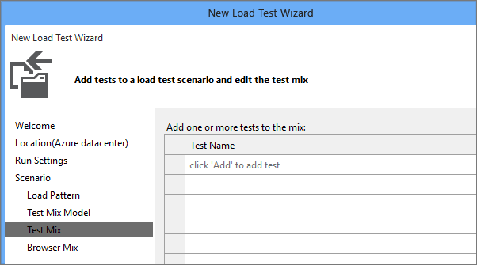
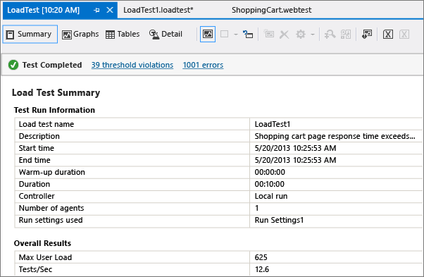
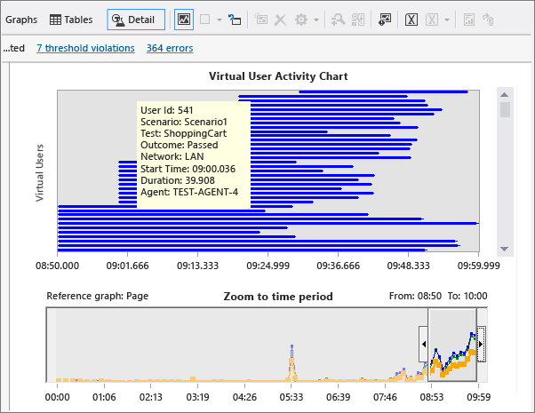

# Performance test your app before release

**Team Services | Visual Studio 2017 | Visual Studio 2015 | [Previous version](https://msdn.microsoft.com/library/dn250793%28v=vs.120%29.aspx)**

Find performance issues before you release your app 
by running load tests with with Visual Studio 
Enterprise. Don't want to use your resources and 
set up your own machines to create load? You can 
use [Cloud-based Load Testing](http://go.microsoft.com/fwlink/?LinkID=317257)
to provide virtual machines in the cloud that generate the load of 
many users accessing your web site at the same time.
All you need is a [Visual Studio Team Services account](http://go.microsoft.com/fwlink/?LinkId=307137).

To load test your app with on-premises resources or 
using Cloud-based Load Testing, you first create 
web performance tests. These tests are used in your 
load tests to simulate multiple users performing 
actions in your app at the same time.

## Create a web performance and load test project

1. If you don't have Visual Studio Enterprise, get it [here](https://www.visualstudio.com/downloads/).

1. Create a web performance and load test project.

   

   If you don't see the template for the web performance and load test project type,
   ensure you have installed the required packages during Visual Studio setup.

   

## Record a web performance test

1. Create a web performance test.

   

   Your web browser opens.

1. Enter the URL for the website that you want to test.

   

1. Use your application like you expect your customers to use it. For example, search for items and add them to the shopping cart.

   The recorder will capture the HTTP requests and responses.

1. When you're done, stop recording.

   

   Now, Visual Studio looks for dynamic parameters for the HTTP responses to each of your HTTP requests. A progress bar appears while this happens.

   If dynamic parameters are found, a table appears. You can assign constant values to each dynamic parameter.

1. Rename your test. For example, ShoppingCart.webtest.

   

1. Edit test properties to specify performance goals. For example, you can set a page response time goal to 1 second.

   

1. Save the test.

## Create a load test

1. Create a new load test in the web performance and load test project.

   

1. When the load test wizard appears, choose the kind of load test that you'd like to run.

   

1. Change the load pattern to step load. This gradually adds users over time.
   [How many virtual users can I configure in my load test?](#howmanyusers)
 
   

1. Choose the test mix step.

   

1. Add the web performance test you created.

   

1. Move the web performance test to the list of tests to run.

   

   When you run cloud-based load tests using your Visual Studio Team Services account, you can run those tests and generate load in an Azure datacenter that's closer to your users. That way, you reduce latency and simulate local conditions.

1. Select the location where you want to run your load test.

   

1. When you finish the wizard, the web performance test is added to the load test and appears in the load test editor.

   

## Run and analyze your load test

You can run your load test locally, or you can run it in the cloud using Visual Studio Team Services. 
All you need is a [Visual Studio Team Services account](https://www.visualstudio.com/docs/setup-admin/team-services/sign-up-for-visual-studio-team-services). 
If you run the load test in the cloud, you can generate more load without setting up test controllers and test agents. 
To learn how easy it is to use Cloud-based Load Testing to run your load tests, go 
[here](getting-started/getting-started-with-performance-testing.md).

Follow these steps to run your load test on your local machine.

1. Run the load test.

   

1. While the test runs, you discover that the shopping cart page response time exceeds the value you set.

   

1. Add an analysis note to track the issue.

   

1. After the load test is finished, the summary is displayed.

   The results for the completed test include performance counter data, threshold violations, and error information.

   

1. Choose the detail view. By analyzing the step load pattern for users, 
   you can identify the user count where your performance fails to meet your requirements.

   

1. Fix any performance issues in your application's code and rerun the test.

## Improve your load tests

You can improve your test to better simulate 
real-world loads by specifying various load test 
[scenario properties](https://msdn.microsoft.com/library/ff406966%28v=vs.140%29.aspx)
and [run settings properties](https://msdn.microsoft.com/library/ff406976%28v=vs.140%29.aspx). For example, you can specify the number of new users that will use web cache data in your load test.

## Q & A

<!-- BEGINSECTION class="m-qanda" -->

#### Q: How can I increase the capacity of my load tests?

A: You can use the [Cloud-based Load Testing service](https://go.microsoft.com/fwlink/?LinkID=317257), so you can run your tests across multiple virtual machines in the cloud.

#### Q: How many virtual users can I configure in my load test?

A: In the full version of Visual Studio Enterprise, the number of virtual users is unlimited. In Visual Studio Enterprise trial version, the virtual user count is limited to 250.

#### Q: Can I analyze load tests that ran previously?

A: Yes, to open and manage those results, click  in the load test editor. You can have multiple tests open at the same time to compare runs, and [create trend analysis reports](https://msdn.microsoft.com/library/dd728091%28v=vs.140%29.aspx) to compare them.

#### Q: Is there a difference between what I can analyze during a running test versus a completed test?

A: Yes, these are the differences:

* **Performance counters** A smaller subset of the performance counter data is available while a test is running.

* **Views** When the load test run has completed, the [Summary View](https://msdn.microsoft.com/library/ms404677%28v=vs.140%29.aspx#SummaryView) and [Details View](https://msdn.microsoft.com/library/ms404677%28v=vs.140%29.aspx#DetailsView) are available.

#### Q: Can load tests use other test types in their test mix besides web performance tests?

A: Yes, you can include unit tests and [coded UI tests](https://msdn.microsoft.com/library/dd286652.aspx).

#### Q: Can virtual users simulate pausing between test steps?

A: Yes, you can [specify think times](https://msdn.microsoft.com/library/dd997697.aspx) to simulate the time spent by a user on a web page.

#### Q: Why should I use Cloud-based Load Testing?

A: If you don't want to set up machines for load testing, or you don’t have available resources, you can use the [Cloud-based Load Testing service](https://go.microsoft.com/fwlink/?LinkID=317257). It sets up virtual machines in the cloud that will run your load test. Note that your web site must be publicly available on the internet for load testing using Visual Studio Team Services to access it.

<!-- ENDSECTION -->

## See also

* [Performance test your Azure web app under load](app-service-web-app-performance-test.md)
* [Get app performance data with your load tests](getting-started/get-performance-data-for-load-tests.md)
* [Run URL-based load tests with Visual Studio Team Services](getting-started/get-started-simple-cloud-load-test.md)
* [Run Apache JMeter load tests with Visual Studio Team Services](getting-started/get-started-jmeter-test.md)
* [View and compare performance test results](getting-started/performance-reports.md)

[!INCLUDE [help-and-support-footer](../_shared/help-and-support-footer.md)] 
