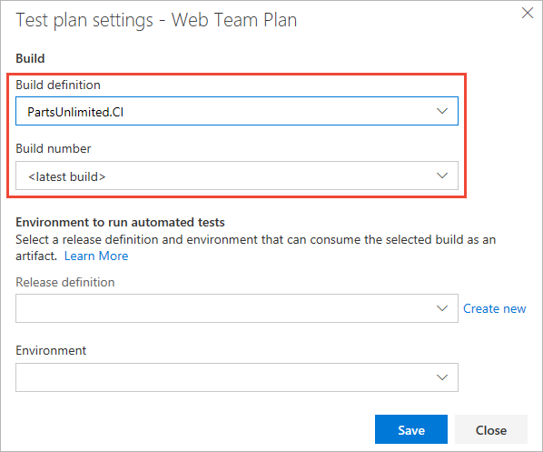
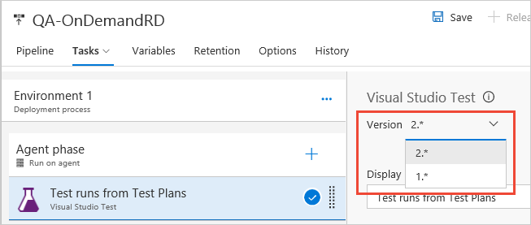
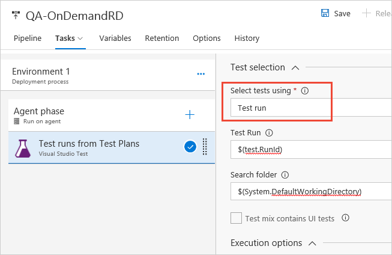
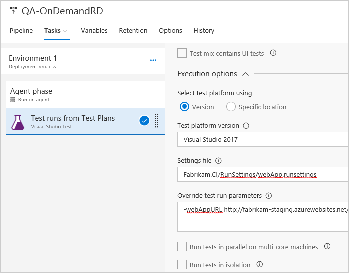
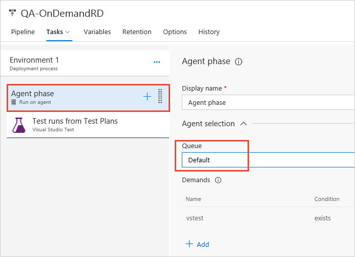
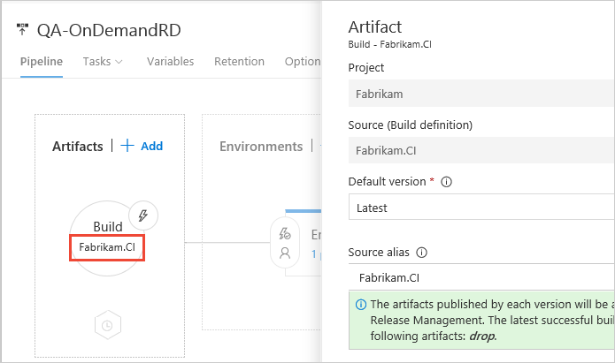
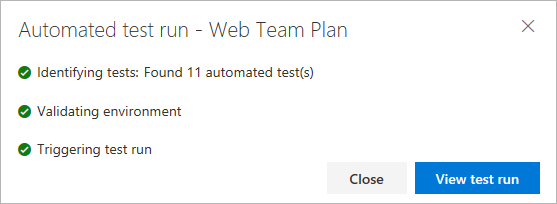
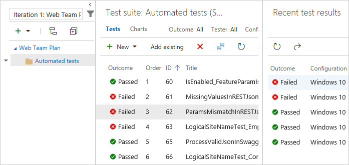

# Run automated tests from test plans

Automate test cases in your test plans and run them directly from the [!INCLUDE [test-hub-include](_shared/test-hub-include.md)]:

* Provides a user-friendly process for testers who may not be well
  versed with running tests in Build or Release workflows.

* Gives you the flexibility to run selected tests on demand,
  rather than scheduled testing in Build or Release workflows
  where all tests meeting the filter criteria are run.

* Useful when you want to rerun a few tests that failed due
  to test infrastructure issues, or you have a new build that
  includes fixes for failed tests.

You will need:

* A [test plan](create-a-test-plan.md)
  containing your automated tests, which you have associated with automated test methods using 
  [Visual Studio 2017](associate-automated-test-with-test-case.md), 
  or [Visual Studio 2015 or earlier](https://msdn.microsoft.com/library/dd380741%28v=vs.120%29.aspx).

* A [Team Build pipeline](../pipelines/apps/windows/dot-net.md)
  that generates builds containing the test binaries.

* The app to test. You can deploy the app as part of the 
  [build and release workflow](../pipelines/overview.md) and also use it for on-demand testing.

You must also be a Project Contributor, or have the following permissions:

* Create releases
* Manage releases
* Edit release environment
* Manage deployment

For more information, see [Set permissions for release pipelines](../pipelines/policies/set-permissions.md#set-permissions-for-release-pipelines) and
[Release permissions](../pipelines/policies/permissions.md#release-permissions).

## Set up your environment

1. In the **Test plans** page of the [!INCLUDE [test-hub-include](_shared/test-hub-include.md)], choose your test plan,
   open the shortcut menu, and choose **Test plan settings**.

   

1. In the Test plan settings dialog, select the build pipeline that generates builds which
   contain the test binaries. You can then select a specific build number to test, or let the
   system automatically use the latest build when tests are run.

   

1. You will need a release pipeline that was created from the 
   **Run automated tests from Test Manager** template to run tests from test plans
   in the [!INCLUDE [test-hub-include-nolink](_shared/test-hub-include-nolink.md)]. If you have an existing release pipeline that was created
   using this template, select it and then select the existing environment in the
   release pipeline where the tests will be executed.
   Otherwise, choose the **Create new** link in the
   dialog to create a new release pipeline containing a single environment
   with the **Visual Studio Test** task already added.

   

   [How do I pass parameters to my test code from a build or release pipeline?](../pipelines/test/reference-qa.md#pass-params)

1. To configure the **Visual Studio Test** task and the release pipeline,
   start by assigning meaningful names to the release pipeline and environment.
   Then select the **Visual Studio Test** task and configure it as follows:
 
   * Verify that version 2 of the Visual Studio Test task is selected.
     The version number is shown in the drop-down list at the top left
     of the task settings panel. 

      

   * Verify that **Select tests using** is set to **Test run**.
     [What does this setting mean?](../pipelines/test/reference-qa.md#faq-ondemandruns) 

      

   * If you have UI tests that run on real browsers or thick clients,
     set (tick) the **Test mix contains UI tests** checkbox. This is not
     required if you are running UI tests on a headless browser. 

   * Select how is the test platform is provisioned, and the version of
     Visual Studio or the location of the test platform that is installed
     on the test machines 

   * If your tests need input parameters such as app URLs or database
     connection strings, select the relevant settings file from the
     build artifacts. You can use the **Publish build artifacts** tasks
     in you build pipeline to publish the settings file in a drop
     location if this file is not included in the artifacts.
     In the example shown below, the application URL is exposed in the
     run settings file, and is overridden to set it to a staging URL
     using the **Override test run parameters** setting.

   

   For information about the option settings of the Visual Studio Test task, see [Visual Studio Test task](https://github.com/Microsoft/vsts-tasks/blob/master/Tasks/VsTestV2/README.md).

1. Choose the **Agent phase** item and verify that the deployment queue
   is set to the one containing the machines where you want to run the
   tests. If your tests require special machines from the agent pool,
   you can add demands that will select these at runtime.

   

   You may be able to minimize test times by distributing tests across multiple
   agents by setting **Parallelism** to **Multiple executions** and specifying the number of agents.
   [More details](../pipelines/test/set-up-continuous-test-environments-builds.md#unified-agents).

   > **Note**: If you are running UI tests such as CodeUI or Selenium
   on physical browsers such as IE, Firefox, or Chrome, the agent
   on the machines must be running in interactive mode and not
   as a service. [More details](../pipelines/test/reference-qa.md#faq-agentmode). 

1. In the **Pipeline** page of the release pipeline, verify
   that the build pipeline containing the test binaries is linked
   to this release pipeline as an artifact source.  

   
 
1. Save the release pipeline.

1. If you chose **Create new** in the Test plan settings dialog in step 2
   of this example, return to the browser page containing your test plan
   settings. In the Test plan settings dialog, select the release pipeline
   and environment you just saved.

   

## Run the automated tests

1. In the [!INCLUDE [test-hub-include](_shared/test-hub-include.md)], open the test plan and select a test suite that contains the
   automated tests.

1. Select the test(s) you want to run, open the **Run** menu,
   and choose **Run test**. 

   

   The test binaries for these tests must be available
   in the build artifacts generated by your build pipeline.

1. Choose **OK** to start the testing process. The system checks that only
   automated tests are selected (any manual tests are ignored),
   validates the environment to ensure the Visual Studio Test
   task is present and has valid settings, checks the user's
   permission to create a release for the selected release
   pipeline, creates a test run, and then triggers the creation
   of a release to the selected environment.

   

1. Choose **View test run** to view the test progress and analyze
   the failed tests. Test results have the relevant information
   for debugging failed tests such as the error message, stack trace,
   console logs, and attachments. 
 
1. After test execution is complete, the **Runs** page of the
   [!INCLUDE [test-hub-include-nolink](_shared/test-hub-include-nolink.md)] shows the test results. The **Run summary** page
   shows an overview of the run.

   
 
   There is a link to the **Release** used to run the tests, which
   makes it easy to find the release that ran the tests if you need
   to come back later and analyze the results. Also use this link if you
   want to open the release to view the release logs.

   [What are the typical error scenarios or issues I should look out for if my tests don't run?](../pipelines/test/reference-qa.md#faq-errors)

1. The **Test results** page lists the results for each test in the
   test run. Select a test to see debugging information for failed
   tests such as the error message, stack trace, console logs, and attachments. 

   

1. Open the **Test Plans** page and select the test plan to see the status
   of your tests if tests are updated after test execution is complete.
   Select a test to see the recent test results.

   
 
## See Also

* [Associate automated tests with test cases](associate-automated-test-with-test-case.md)
* [Associate automated test results with requirements](associate-automated-results-with-requirements.md)
* [Test with unified agents and phases](../pipelines/test/set-up-continuous-test-environments-builds.md)
* [Continuous testing scenarios and capabilities](index.md)

[!INCLUDE [help-and-support-footer](_shared/help-and-support-footer.md)] 
