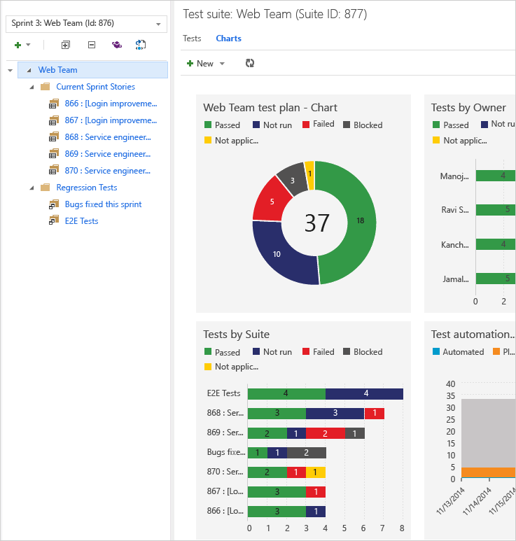
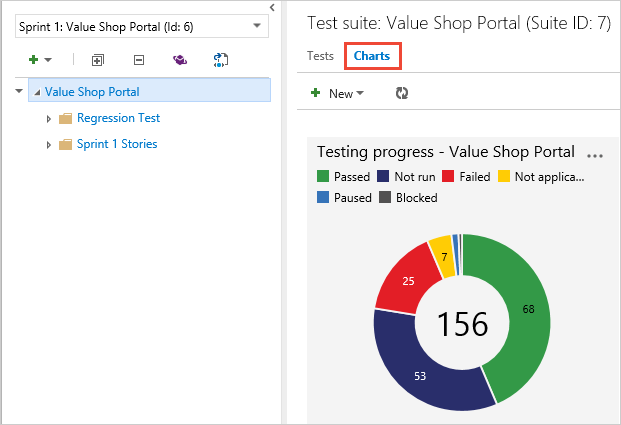
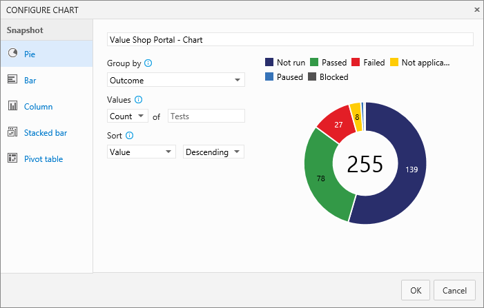
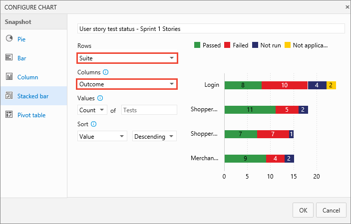
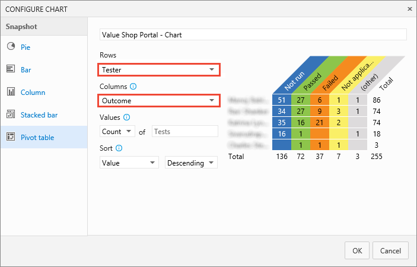
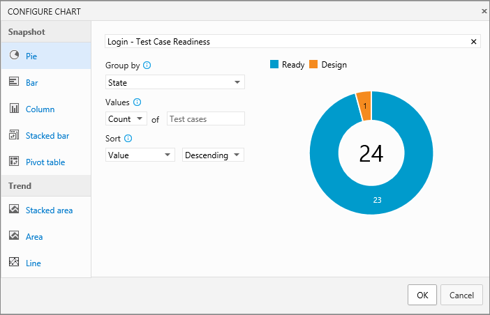
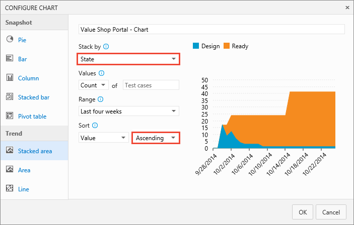
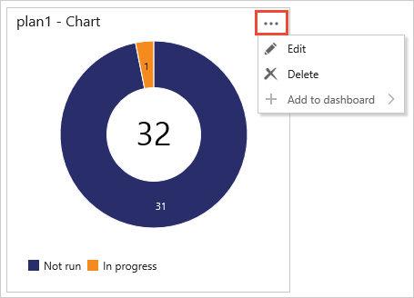

# Track test status

[!INCLUDE [version-header](_shared/version-header.md)] 

Quickly view the status of your testing using lightweight charts. 
For example, find out how many test cases are ready to run,
or how many tests are passing and failing in each test suite. 
You can pin these charts to your home page, then all the team 
can see the progress at a glance.

 

[!INCLUDE [feature-availability](_shared/feature-availability.md)] 

## Track testing progress

Use test results charts to track how your testing is going. 
Choose from a fixed set of pre-populated fields related to results.
By default, a pie chart is created for each test plan. 
This chart is grouped by the outcome field to show the latest results
for all the tests in the test plan.

View this default chart from the Charts page.

Add your own charts for test results to visualize what's important 
for your team. If you already know how to add a chart, jump to the 
[examples](#TestResultsExamples) below of charts that you can create.

1. Select the test plan or test suite for your chart in the 
   Test plans page. Then create a new chart.

   

1. Select the chart type. Based on the chart, configure the 
   fields that you want to use to group by, or for rows and columns.

   

   All charts roll up the information for any child test suites 
   of the test plan or test suite that you selected.

1. Save the chart. Now it will be displayed in the Charts page 
   for the test plan or test suite that you selected.

### Test results examples

**What's the test status for a specific test suite?**

Select the test suite from the Test plans page and add 
a test results pie chart. Group by outcome.

**What's the test status for user stories that my team's testing this sprint?**

If you have created requirement-based test suites in your test
plan for your user stories, you can create a chart for this.

1. Group these requirement-based test suites together 
   in a static test suite.

1. Select this static test suite in the Test plans page.

1. Add a test results stacked bar chart. Choose Suite 
   as the rows pivot and Outcome as the columns pivot.

   

**How many tests has each tester left to run?**

Select your test plan from the Test plans page and add a test 
results pivot table chart. Choose Tester as the rows pivot and
Outcome as the columns pivot.

**How can I check quality based on the configuration?**

Use either a stacked bar chart or a pivot table chart. 
Choose Configuration as the rows pivot and Outcome as 
the columns pivot.

**How can I track why tests are failing for my team?**

For failure analysis, use either a stacked bar chart 
or a pivot table chart. Choose Tester for the rows 
and Failure type for the columns. (Failure type for 
test results can only be set using Microsoft Test Manager.)

**How can I track the resolution for failing tests for my team?**

For resolution analysis, use either a stacked bar chart 
or a pivot table chart. Choose Tester for the rows and 
Resolution for the columns. (Resolution type for test 
results can only be set using Microsoft Test Manager.)

## Track test case status

Use test case charts to find out the progress of your 
test case authoring. The charts for test cases give 
you the flexibility to report on columns that you add 
to the tests page. By default, test case fields are not 
added to the view in the tests page.

If you already know how to add a chart, jump to the
[examples](#ExamplesTestCase) below of charts that you can 
create for test cases.

1. Add any fields you want to use for your test case chart 
   from the tests page with Column options. Then the fields will 
   appear as choices in the drop-down lists for grouping for 
   your test case charts.

1. Select the test plan or test suite for your chart in 
   the Test plans page. Then add a test case chart.

   

   All charts roll up the information for any child test suites 
   of the test plan or test suite that you selected.

1. Select the chart type. Based on the chart, configure the 
   fields that you want to use to group by, for rows and columns,
   or the range (trend charts only).

   

   You can't group by test suite for the test case charts.

1. Save the chart. Now it will be displayed in the charts 
   page for the test plan or test suite that you selected.

### Test case examples

**How can I track burndown for test case creation?**

Use a stacked area trend chart to view the burndown for 
how many test cases are ready to be run. Choose State 
for the stack by field and Ascending for the sort field.

**How can I track burndown for automation status?**

Use a stacked area trend chart to view the burndown 
for how many test cases have been automated. Choose 
Automation status for the stack by field and Ascending 
for the sort field.

**If multiple teams own test cases in my test plan, can I see how many each team owns and the priorities of the tests?**

If your teams are organized by area path, then your can use a 
test case pie chart. Choose Area path for the group by field.

If you want to know the priorities of these tests, then create 
a stacked bar chart. Choose Area path for rows and priority
for the columns.

**How can I track test creation status by team members?**

Test case owners are tracked by the Assigned to field. 
Use a stacked bar chart or a pivot table chart. Choose 
Assigned to for rows and status for the columns.

## Share charts on your team's dashboard

Pin a chart to your team's dashboard for all the team to view. 
Use the chart's context menu.

You can [configure the dashboard widget](../report/widget-catalog.md)
to show a range of chart types.
You must be a team administrator to do this, but team members with 
Stakeholder access can view the charts on the dashboard. 

Learn more about
[dashboards](../report/dashboards.md). 
Or learn more about
[team administration](../organizations/settings/configure-team-settings.md).

## See also

*  [FAQs for manual testing](reference-qa.md#trackstatus)

##  Next step

> [!div class="nextstepaction"]
> [Control how long to keep test results](how-long-to-keep-test-results.md)
