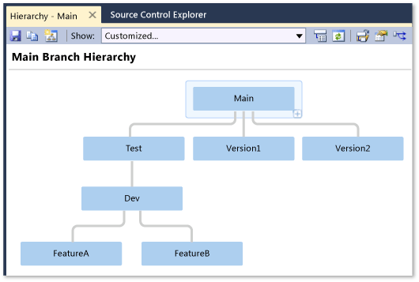
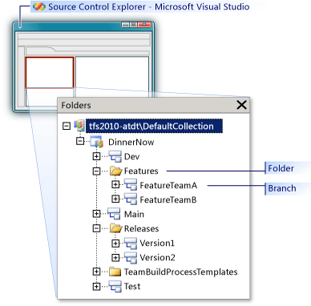
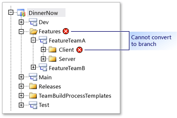

# Branch folders and files

#### VSTS | TFS 2018 | TFS 2017 | TFS 2015 | VS 2017 | VS 2015 | VS 2013

You can use branches to accomplish the following goals:  
-   Manage concurrent work by multiple teams on the same codebase  
-   Isolate risks that are introduced by different sets of changes to the codebase  
-   Take snapshots and then support subsequent isolated changes (for example, to create a release branch)  

For example, the following illustration shows how the DinnerNow company developed a branch structure to meet its business needs.

The following screenshot shows the DinnerNow branch structure in the Hierarchy window.  

  

Feature Team A and Feature Team B each do their work in separate branches. When the teams are ready to integrate their work, they merge their branches into the Dev branch. When the builds from the Dev branch are stable and ready to test, the teams merge the Dev branch into the Test branch.

As each version is released, the Main branch is branched into a new version branch, such as the Version1 branch and the Version2 branch. By following this strategy, the company can enhance or fix each past version of the product separately if necessary.

You can perform a branching operation by using either **Source Control Explorer**, as this topic demonstrates, or the Branch command at a command prompt. For more information, see [Branch Command](branch-command.md).

>**Tip:**  
>Branching is an important and powerful technique for creating a parallel set of versions of your files. However, using branches can add complexity and cost to your project. For example, when you merge two branches, you may have to resolve conflicts.  
>
>Before you create a branch, you should consider whether you can better meet your needs by applying a label. By applying a label, you can quickly and easily take a snapshot of the state of your files so that you can then later retrieve or build the files in that state. For more information, see [Use labels to take a snapshot of your files](use-labels-take-snapshot-your-files.md).

## Convert a Folder to a Branch

The release of Visual Studio Team Foundation Server 2010 began a distinction between branches and folders. The following illustration shows the top-level of the DinnerNow folder structure:

DinnerNow folder structure in Source Control Explorer  

  

As the illustration shows, you can still use folders to organize branches within a team project's version control hierarchy. However, folders and branches have a different appearance and different capabilities. When you right-click a folder or branch and click **Properties**, you display different information and different functionality.

When you perform branch operations, branches have important advantages over folders. Branches support version control features that provide extra visibility into your branch structure and into where your changesets have merged. (For more information, see the links in the [See Also](#see-also) section later in this topic.)

Although you can still branch and merge among folders, the best practice for your team is to branch and merge only among branches. The following procedure explains how to convert a folder to a branch.

**Required Permissions**  
To perform the following procedure, your **Manage branch** permission must be set to **Allow**. For more information, see [Permissions and groups reference](../security/permissions.md).

### To convert a folder to a branch

1.  In **Source Control Explorer**, make sure that the folder that you want to convert exists on the server.

2.  If the pending addition icon () appears next to the folder, right-click the folder, and then click **Check In Pending Changes**.

3.  Right-click the folder that you want to convert, point to **Branching and Merging**, and then click **Convert to Branch**.

    The **Convert Folder to Branch** dialog box appears.

    >[!IMPORTANT]
    >If you are converting a folder that you have already branched, you should probably select the **Recursively perform this conversion for all branched child folders** check box. This option also converts to branches all folders that were branched from this one folder.
    > 
    >

4.  (Optional) In the **Owner** field, type the name of the person who owns this branch.

    >[!NOTE]  
    >The Owner field is for information only. Being named in the Owner field grants no additional permissions.
    >
    >

5.  (Optional) In the **Description** field, type information that you think would be helpful to other team members who must use this branch or understand its purpose.

6.  Click **Convert**.

>[!IMPORTANT]  
>You cannot nest branches; therefore, you cannot convert any folder to a branch if it either contains a branch or is contained by a branch. For example, the following illustration shows how neither the parent nor the child of the **FeatureTeamA** branch can be converted to a branch.  
>
>
>
>  

After you have converted a folder to a branch, you can convert it back to a folder if your team decides to change your branch structure.

### To convert a branch to a folder

1.  In **Source Control Explorer**, click the branch that you want to convert.  
2.  On the **File** menu, point to **Source Control**, point to **Branching and Merging**, and then click **Convert to Folder**.  
3.  When the **Convert Branch Back To Folder** message appears, click **Yes**.

## Branch a branch

After you have converted a folder to a branch, you can then create other branches from that branch. The following procedure shows how you can use the graphical user interface of Visual Studio to branch a branch. (For information about how to perform this task at the command prompt, see [Branch Command](branch-command.md).)

**Required Permissions**  
To perform this procedure, your **Manage branch** permission must be set to **Allow** for the paths to the source and target branches. Your **Merge** permission for the path of target branch must set to **Allow**. For more information, see [Permissions and groups reference](../security/permissions.md).

### To branch a branch

1.  In **Source Control Explorer**, right-click the branch that you want to branch, point to **Branching and Merging**, and then click **Branch**.

    The **Branch from** dialog box appears.

2.  In the **Target Branch Name** box, specify the path of the new branch.

3.  (Optional) In the **Branch from version** section, click one of the following options in the **By** list:

    -   If you click **Latest Version**, the branch is created for the most recent version in version control.

    -   If you click **Changeset**, you can specify the number of the changeset in the **Changeset** box. As an alternative, click the ellipses (**...**) to open the **Find Changesets** dialog box.

        For more information, see [Find and view changesets](find-view-changesets.md).

    -   If you click **Date**, you can specify a date in the **Date** box.

4.  Click **Branch**.

    The branch is created and appears in **Source Control Explorer**.

    >[!NOTE]
    >Unlike most version control operations, this operation does not generate a pending change. Rather, the operation is completed immediately and you cannot undo it.
    >
    >

## Branch a folder or file

Although you can branch a folder or file directly, we recommend that you avoid it. Otherwise, you will not be able to [view your branch hierarchy](view-branch-hierarchy-team-project.md) or [track your changesets](view-where-when-changesets-have-been-merged.md). The best practice is to branch and merge only among branches, as described earlier in this topic.

But if you have a special need to branch a folder or file, you can use the following procedure to perform this task. (For information about how to perform this task at the command prompt, see [Branch Command](branch-command.md).)

**Required Permissions**  
To perform this procedure, your **Check out** permission and your **Merge** permission for the target path must be set to **Allow**. For more information, see [Permissions and groups reference](../security/permissions.md).

### To branch a folder or file

1.  In **Source Control Explorer**, right-click the folder or file that you want to branch, point to **Branching and Merging**, and then click **Branch**.

    The **Branch** dialog box appears.

2.  In the **Target** box, modify the location and name for the new branch.

    You can also click **Browse** to specify a target.

3.  In the **Branch from version** section, click one of the following options in the **By** list:

    -   If you click **Latest Version**, the branch is created for the most recent version in version control.

    -   If you click **Changeset**, you can specify the number of the changeset in the **Changeset** box. As an alternative, you can click the ellipses (**...**) to open the **Find Changesets** dialog box.

        For more information, see [Find and view changesets](find-view-changesets.md).

    -   If you click **Date**, you can specify a date in the **Date** box.

    -   If you click **Label**, you can type the label name in the **Label** box. As an alternative, you can click the ellipses (**...**) to open the **Find Label** dialog box.

        For more information, see [Use labels to take a snapshot of your files](use-labels-take-snapshot-your-files.md).

    -   If you click **Workspace Version**, the branch is created for the version in your workspace.

4.  (Optional) Select the **Create local working copies for the new branch** check box to create a copy of the version-controlled item on the local workspace. Clear the check box if you do not need a local copy and you want to improve performance by not downloading many items to your computer.

5.  Click **OK**.

    The branch is created and appears in **Source Control Explorer**.

    >[!NOTE]  
    >A **Browse For Folder** window appears if you selected the **Create local working copies for the new branch** check box and the local folder that you specified is not mapped in the current workspace. Browse for a folder or click **Make New Folder**, specify a folder to synchronize to the version-controlled items, and then click **OK**.
    >
    >

## See Also

#### Other Resources

 [Use Source Control Explorer to manage files under version control](use-source-control-explorer-manage-files-under-version-control.md)  
 [View where and when changesets have been merged](view-where-when-changesets-have-been-merged.md)  
 [View the branch hierarchy of a team project](view-branch-hierarchy-team-project.md)  
 [Branch Command](branch-command.md)  
 [Branches Command](branches-command.md)  
 [Branch strategically](branch-strategically.md)  
[Visual Studio TFS Branching Guide](http://go.microsoft.com/fwlink/?LinkId=191400)
