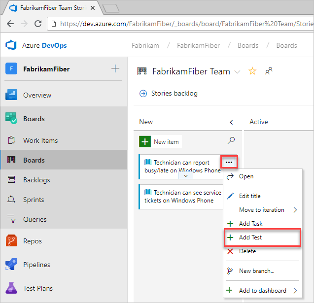
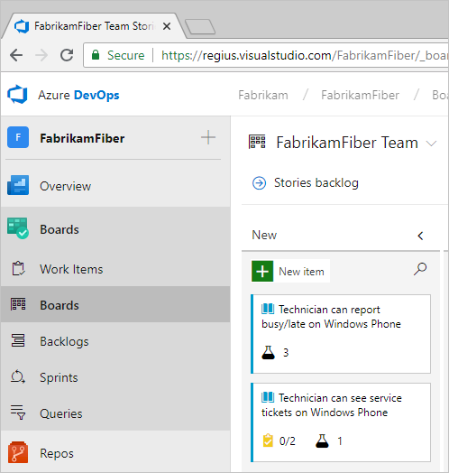
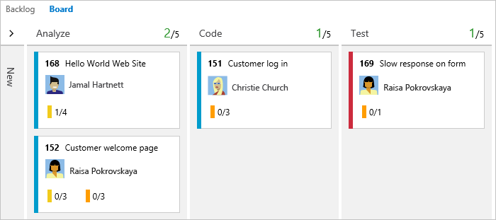

# Add, run, and update inline tests

[!INCLUDE [version-vsts-only](../_shared/version-vsts-only.md)]

A quick and easy way to start manual testing is to add the test to the user story or bug you want to test. From the Kanban board, you can quickly define inline tests, or a set of manual tests, for a backlog item. Not only can you add tests, you can run them and update their status. If you're new to working with the Kanban board, see [Kanban quickstart](../boards/boards/kanban-quickstart.md). 

Tests you create from the Kanban board are automatically linked to the user story or backlog item.  
 
## Open your Kanban board

[!INCLUDE [temp](../boards/_shared/new-agile-hubs-feature.md)]

# [New navigation](#tab/new-nav)

1. From your web browser, open the project for your Azure DevOps Services organization and select the **Work** hub. If you don't have a team project, [create one now](sign-up-invite-teammates.md). If you haven't been added as a team member, [get invited now](sign-up-invite-teammates.md#invite-others).

	The URL follows this pattern: ```https://{organization name}.visualstudio.com/{project name}/_backlogs```  

	If you don't see the team or project you want, choose the  Azure DevOps Services icon to [browse all projects and teams](../project/navigation/work-across-projects.md).  

2. Select **Boards** to open the Kanban board.

# [Previous navigation](#tab/prev-nav)

1. From your web browser, open the team project for your Azure DevOps Services organization and choose the **Work** hub. If you don't have a team project, [create one now](sign-up-invite-teammates.md). If you haven't been added as a team member, [get invited now](sign-up-invite-teammates.md#invite-others).

	The URL follows this pattern: ```https://{organization name}.visualstudio.com/{project name}/_backlogs```  

	If you don't see the team or project you want, choose the  Azure DevOps Services icon to [browse all projects and teams](../project/navigation/work-across-projects.md).  

2. Select **Board** to open the Kanban board.

---

## Add tests

# [New navigation](#tab/new-nav)

1. To start adding tests, open the menu for a work item.

   

   Adding inline tests is the same as adding test cases to a test suite. A default test plan and test suite are automatically created under which the manual test cases are grouped.  

	For example, a test suite is created for the following user story and inline tests are added to that suite. User story 314 is highlighted, which has two manual tests defined with IDs of 337 and 341.  

   

2. If you have a number of tests to add, simply keep entering each title and choose **Enter**.

   

	To add details to the test case, open it. You can select the title, double-select the inline item, or open the context menu and choose **Open**. 

   

See [Create manual tests](../test/create-test-cases.md) to learn more about defining tests. 

> [!IMPORTANT]  
> Prior to running the test, you must add details.  

# [Previous navigation](#tab/prev-nav)

1. To start adding tests, open the menu for the work item.

	 

	Adding inline tests is the same as adding test cases to a test suite. A default test plan and test suite are automatically created under which the manual test cases are grouped.  

	For example, a test suite is created for each user story, and all inline tests are added to that suite. Below, user story 152 is highlighted which has three manual tests defined with IDs of 153, 155, and 161.  

	 

	To learn more about test plans and test suites, see [Plan your tests](../test/create-a-test-plan.md).  

2. If you have a number of tests to add, simply keep entering each title and select **Enter** on your keyboard. 

	   

	To add details to the test case, open it. You can select the title, double-select the inline item, or open the context menu and choose **Open**.

	 

See [Create manual tests](../test/create-test-cases.md) to learn more about defining tests.

> [!IMPORTANT]  
> Prior to running the test, you must add details.

---

## Run a test

# [New navigation](#tab/new-nav)

Run the test by selecting  **Run test** from the  actions menu for the inline test.


Microsoft Test Runner starts in a new browser instance. For details on running a test, see [Run manual tests](../test/run-manual-tests.md).

# [Previous navigation](#tab/prev-nav)

Run the test by selecting  Run test from the  actions menu for the inline test.  

  

Microsoft Test Runner starts in a new browser instance. For details on running a test, see [Run manual tests](../test/run-manual-tests.md).

---

## Update the status of a test

# [New navigation](#tab/new-nav)

You can update the status of the test from the  actions menu. 


 
Updating the status of tests enable you to [track test results](../test/track-test-status.md).

# [Previous navigation](#tab/prev-nav)

You can update the status of the test from the  actions menu.

   
 
Updating the status of tests enable you to [track test results](../test/track-test-status.md).  

---

## Expand or collapse inline tests

# [New navigation](#tab/new-nav)

Upon first opening the Kanban board, you'll see an un-expanded view of checklists and tests.

   

Simply select the inline test summary to expand a collapsed set of tests. Select the same summary to collapse an expanded list.


# [Previous navigation](#tab/prev-nav)

Upon first opening the Kanban board, you'll see an un-expanded view of checklists.



Simply select the inline test summary to expand a collapsed set of tests. Select the same summary to collapse an expanded list.


---

## Next steps

Use inline tests for lightweight traceability and to manage manual tests for user stories or other backlog items that they support.
  
> [!div class="nextstepaction"]
> [Learn more about test case management](../test/create-test-cases.md)
> [Kanban quickstart](../boards/boards/kanban-quickstart.md)

To initiate web-based exploratory testing for a user story, you need to install the Exploratory testing , see [Exploratory test your web app directly in your browser](../test/perform-exploratory-tests.md).

