# Deploy an ASP.NET Web App in Azure App Service

**VSTS**

[App Service](https://docs.microsoft.com/en-us/azure/app-service/app-service-value-prop-what-is)
is a platform-as-a-service (PaaS) offering of Microsoft Azure. Create
web and mobile apps for any platform or device. Integrate your apps with
SaaS solutions, connect with on-premises applications, and automate your
business processes.

**The following illustration shows the completed application:**


## Prerequisites

1. Visual Studio 2015 Update 3 (download from [here](https://www.visualstudio.com/downloads/))

1. Active Azure Account

1. Azure SDK for VS 2015 (download from [here](https://azure.microsoft.com/en-in/downloads/))

1. Microsoft Web Deploy (download from [here](https://www.microsoft.com/en-us/download/details.aspx?id=43717))

   Since we already have the source code in the [repo](https://github.com/hsachinraj/DevOps-Immersion-Labs/tree/master/source) we could use the same for our Azure App Service deployment. You can also create your own app and try deploying the same.

1. Load the **01\_Demos\_ASPNET5.sln** from your Visual Studio and wait until the package restoration is complete. If any issues found, try the below workarounds-

   - Clean the solution and try to rebuild, which should work fine. Also make sure you have connected to the internet while restoring the packages as these would get downloaded over the internet

   - Close your Visual Studio and try to clear the temp of your system and reload the solution, which should work fine.

    > **Note**: Make sure you have the dev environment setup properly as discussed in the pre-requisites section of this lab or you may end up with issues.

    > Upon loading the solution, do a local build to make sure that your application works fine without any issues and you should see your app running locally.

    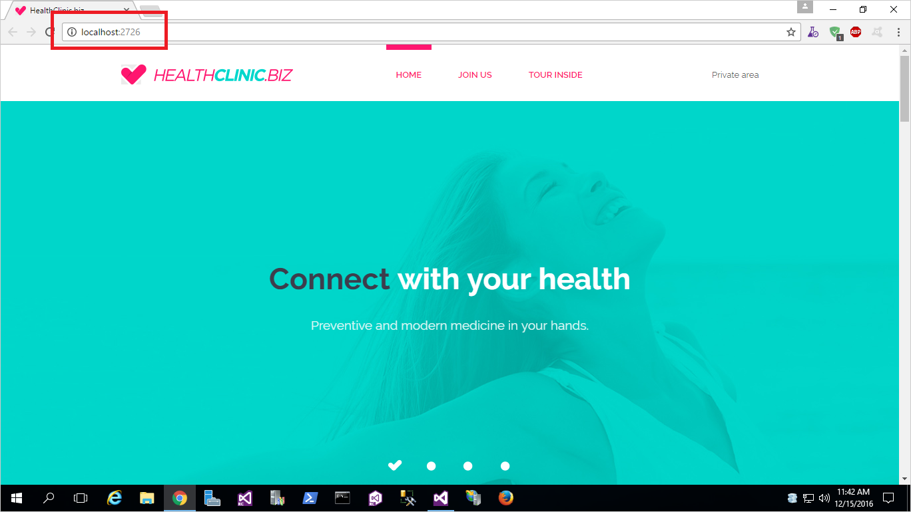

1. Right click on “MyHealth.Web” and select “publish”. You will see a new window automatically open to indicate that the resources will be created in Azure, which will host all application resources. Fill in the required information and make sure to change the type to Web App.

   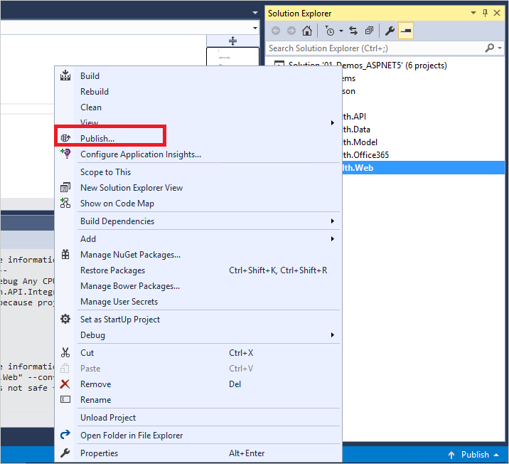

1. Select a publish target to “Microsoft Azure App Service” since we would
   be publishing a WebApp to Azure App Service.

   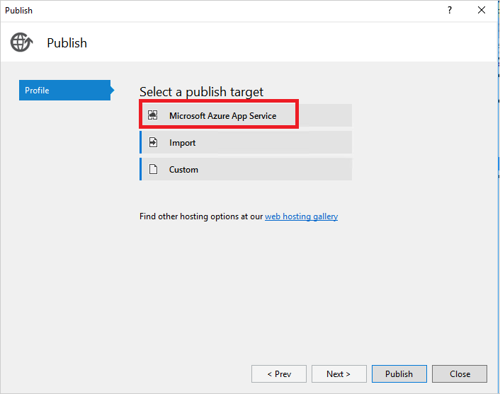

1. Upon selecting the publish target to Microsoft Azure App Service, you will get a new window to fill in the information for publishing. On the
   top right corner, you can manage your Azure accounts. Select one of the account that you wish to host against and click on “New” to create a new Resource group.

   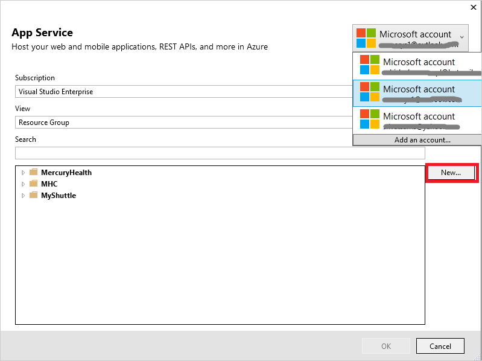

1. Log into Azure portal from [here](https://portal.azure.com)

   

1. Upon login you should see there are no resource group created at the moment in your resource groups.

   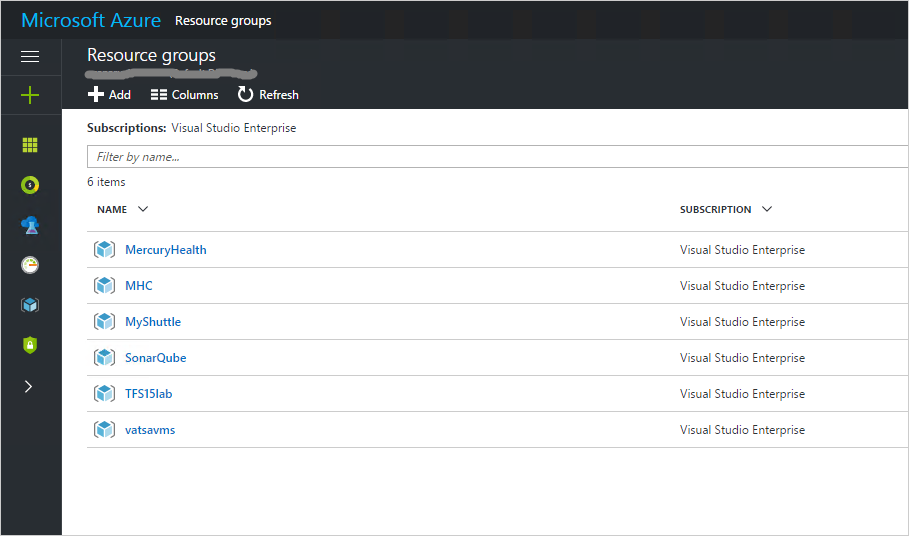

1. From your Visual Studio, upon clicking **New**, you will get another window to configure the App Service Plan.

   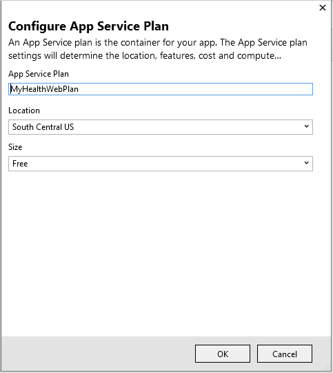

1. Upon filling out the required information, click on “Services” to add a new service.

   

1. You will get a new window when clicked on services. Your web application will have a SQL database in the future, so fill out the required information to configure SQL Server as shown-

   

1. Configure SQL database as shown-

   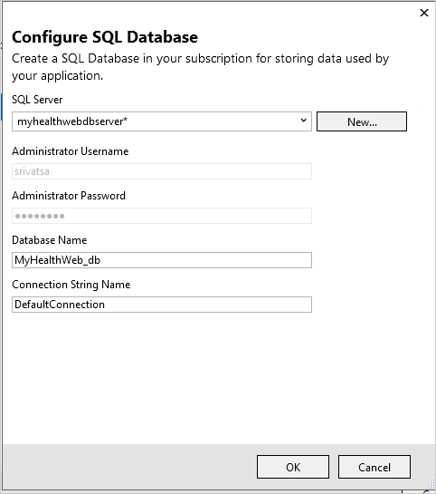

1. Finally, you should see the services upon configured-

   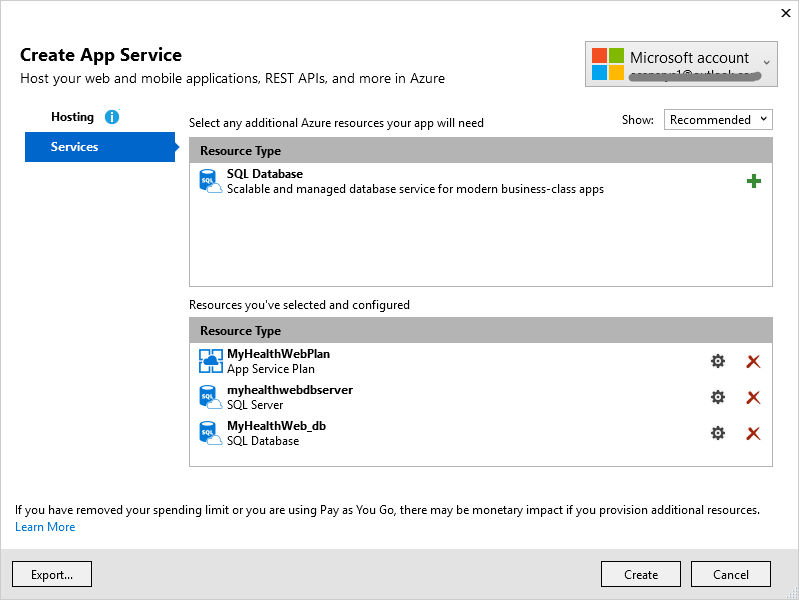

1. Click on create so that the deployment starts by spinning up all those resources on Azure. You can see at the bottom of the window which shows the status of your deployments.

   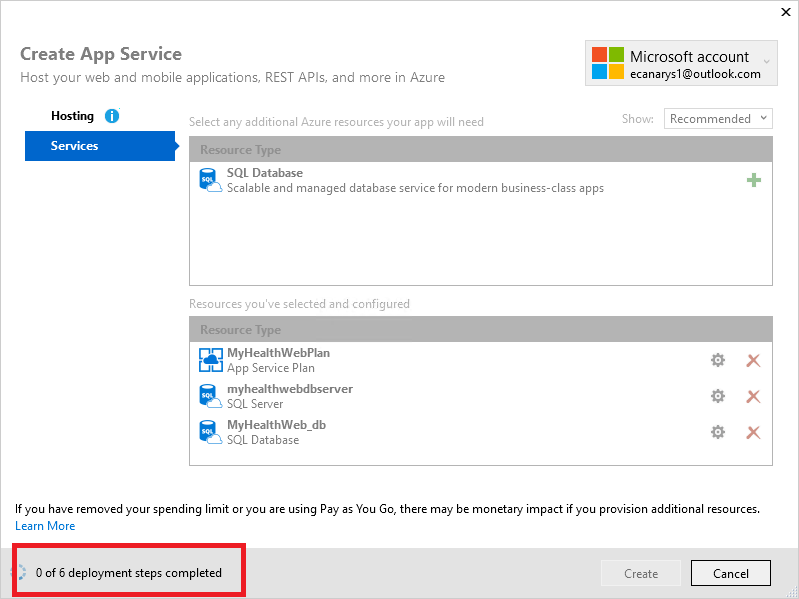

1. Once successfully created, you should see the resources in your Visual Studio “Server Explorer”.

   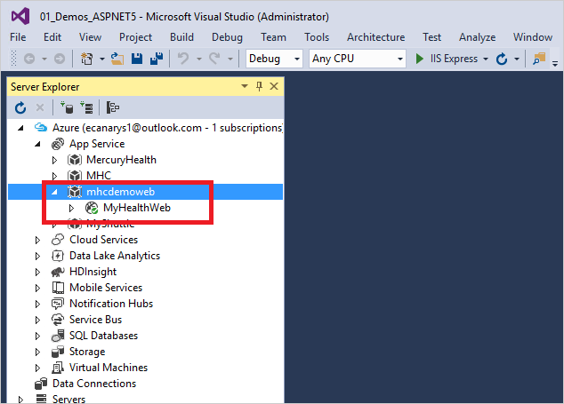

1. With the previous steps, you generated the Azure resources for your deployments.

1. In your solution explorer, right click on the MyHealth.Web and click Publish. You will see Publish Web dialog box. The wizard shows you a
   list of available Publish Profiles. If you select Microsoft Azure App Service, you can see a list of available subscriptions and the resource
   groups that were previously created. Select the resource group that you created to deploy the web application.

   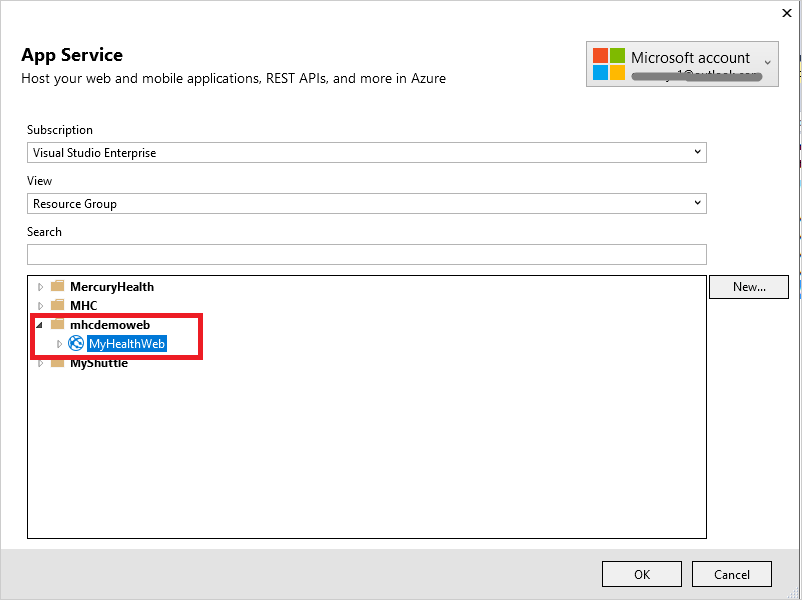

1. After you select the resource group, the page that opens shows the connection information. The default parameters will populate the fields.
   You can modify these fields if required or leave it as it is. To test that the connection works correctly, click on Validate Connection.

   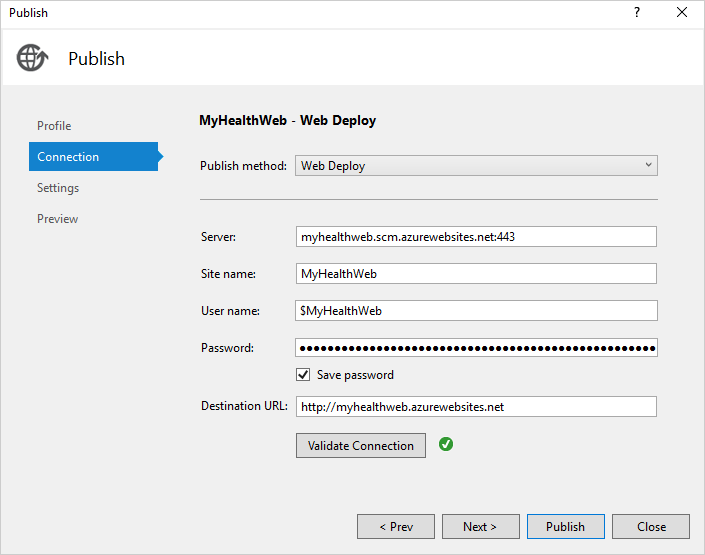

1. In the **Settings** page, you can configure the deployment type depending on whether you require in a Debug/Release mode. You can check
   the box for using default connection string at run time.

   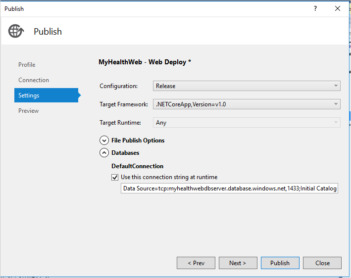

1. On the last page, Preview, you can determine the changes that affect the Azure environment.

   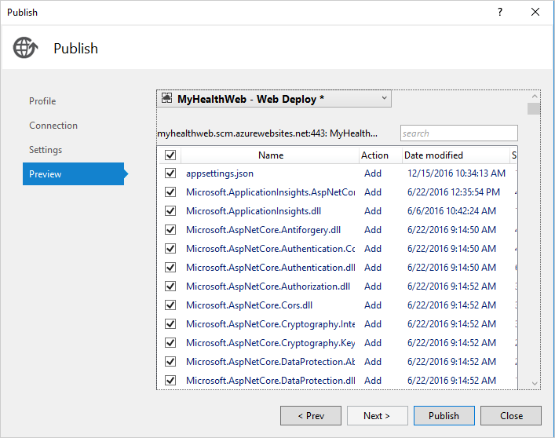

1. At last, click Publish. The **Output** window displays information about the deployment. When it’s completed, it displays a successful message.

   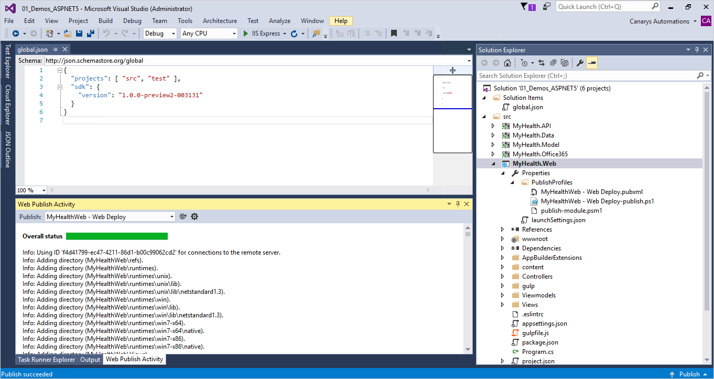

1. You can see the website in the browser that will open.

   

1. When you go back to your Azure portal and see, you have all the resources that was created and published from your Visual Studio.

   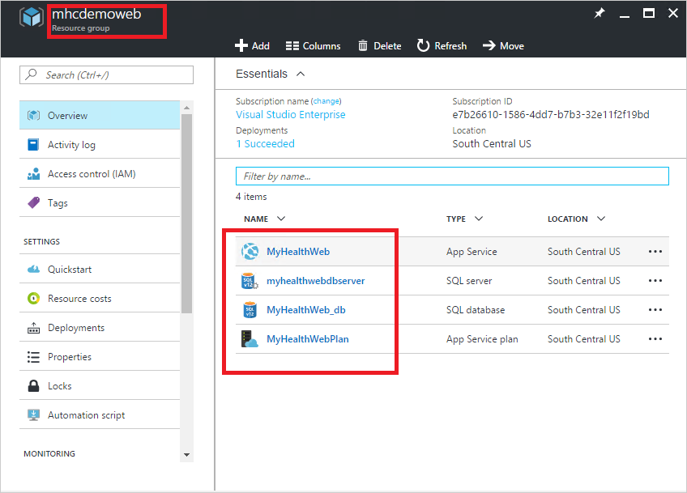

1. Once the app is running fine, you can verify by doing some changes to the UI. So that you make sure that your app is actually running in Azure App Service. To open remote files, go to your server explorer from Visual Studio.

1. Login to your Azure from Server Explorer. Expand the node Azure &gt; App Service &gt; YOUR RESOURCE GROUP &gt; YOUR WEBAPP &gt; Files &gt; Views &gt; Index.cshtml and replace the line as below

   ```html
   <li><a asp-controller="Account" asp-action="Login">Private area</a></li>
   ```
   with

   ```html
   <li><a asp-controller="Account" asp-action="Login">Secret area</a></li>
   ```

1. Save the changes and refresh the browser. You should see the changes
   reflecting in the site now.

   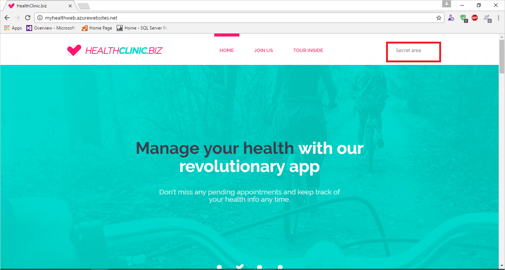

1. We can also remote debug our application from Azure within our Visual Studio.

   Put a breakpoint in your code and Right click and select **Publish**. You should see the new window as shown-

   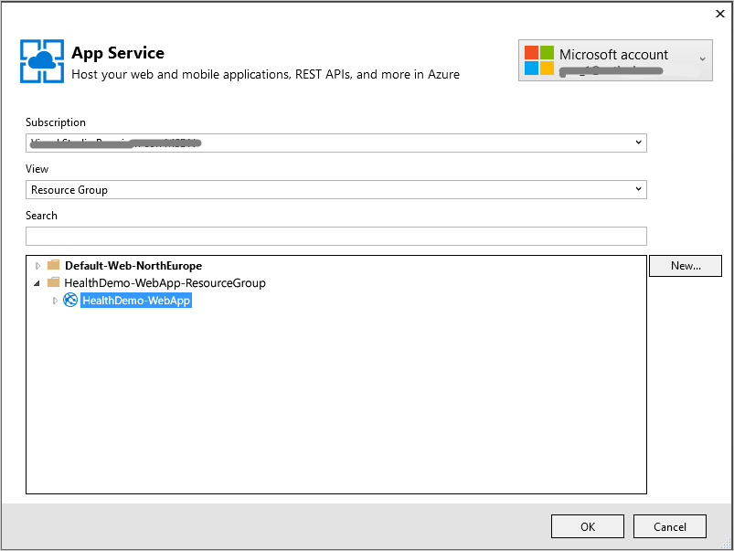

1. Publish the debug files so that you can show remote debugging-

   

1. Click on Publish. From your Visual Studio, go to **Debug** &gt; click **Attach to Process,** enter the azure websites URL along with its port
   and select **dnx.exe** process

   

   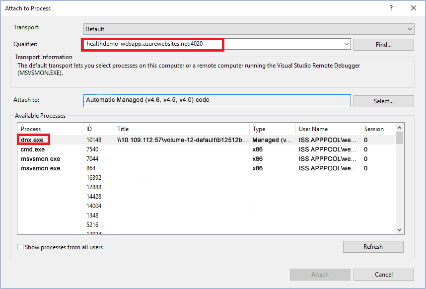

1. Finally, from your Server Explorer &gt; App Service node, attach the debugger. Refresh the browser and you would be hitting your breakpoint
   wherever you would have set. And that’s how you gonna remote debug ASP.NET apps on Azure. To learn more about remote debugging, see [Remote Debug ASP .NET Core Apps on Azure](https://blogs.msdn.microsoft.com/webdev/2016/03/21/remote-debug-aspnet-core-on-azure/)

   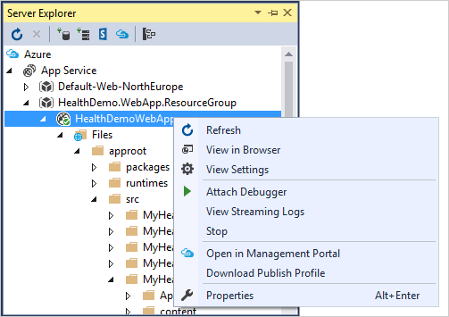

[!INCLUDE [rm-help-support-shared](../../../_shared/rm-help-support-shared.md)]
