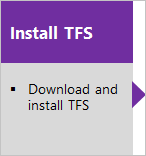
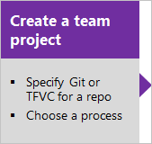
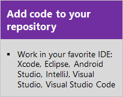

# What is Team Foundation Server?

[!INCLUDE [temp](../_shared/version-tfs-all-versions.md)]

Team Foundation Server (TFS) is the on-premises version of our cloud service, [VSTS](what-is-vsts.md) (VSTS).  

Just like VSTS, TFS provides an integrated set of features that you access through your web browser or a supported IDE, including: 

- Git repositories for source control of your code   
- Build and release management to support continuous integration and delivery of your apps 
- Agile tools to support planning and tracking your work, code defects, and issues using Kanban and Scrum methods 
- A variety of tools to test your apps, including manual/exploratory testing, load testing, and continuous testing 
- Highly customizable dashboards for sharing progress and trends 

In addition, the TFS ecosystem provides support for adding extensions, integrating with other popular services, such as: Campfire, Slack, Trello, UserVoice, and more, and developing your own custom extensions.  

When you deploy TFS, you can also configure the following servers or integration points: 

- **Build server**: supports on-premises and cloud-hosted builds
- **SQL Server and SQL Analysis Server**: supports SQL Server Reports and the ability to create Excel pivot charts based on the cube

## Where do I start?

- Download TFS Express for free   
- Then, either upload your code to share or source control 
- Or, begin tracking your work using Scrum, Kanban, or a combination of methods 

Choose an on-premises TFS when you need your data to stay within your network or you want access to SQL Server reporting services that integrate with TFS data and tools. You can start for free by downloading TFS Express. 

 
 

## Try this next  

> [!div class="nextstepaction"]
> [Install TFS](/tfs/server/install/single-server)

To learn more, see these topics:

- [A tour of services](services.md)
- [Key concepts](concepts.md)  
- [Client-server tools](tools.md)
- [Software development roles](roles.md)
- [Pricing - TFS](https://visualstudio.microsoft.com/team-services/tfs-pricing/)

