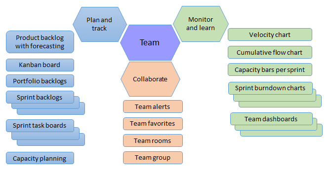

# About teams, Agile tools, and team settings  

<b>Team Services | TFS 2017 | TFS 2015 | TFS 2013 </b> 

Each team can configure the backlogs and boards they use to support their Scrum or Kanban methodology.
You plan and track your project using the set of Agile tools you access from the web portal. 

The following tools are team specific, that is, when you [add another team](scale/multiple-teams.md), you create another variant of the tool that is configurable and customizable by the team through the web portal. 

Backlogs

- [Product backlog](backlogs/create-your-backlog.md)   
- [Portfolio backlogs](backlogs/define-features-epics.md)   
- [Sprint backlogs](scrum/sprint-planning.md)     

Task boards

- [Task boards](scrum/task-board.md)   
- [Sprint burndown](scrum/sprint-burndown.md)   
- [Capacity planning](scale/capacity-planning.md)    

Kanban boards
 
- [Kanban board](kanban/kanban-basics.md)   
- [Task checklists](kanban/add-task-checklists.md)   
- [Epics & Features boards](kanban/kanban-epics-features-stories.md)   
- [Filter the Kanban board](kanban/filter-kanban-board.md)   
 

Other tools

- [Velocity & forecasting](scrum/velocity-and-forecasting.md)      
- [Team dashboards](../report/dashboards.md)   
- [Team notifications](../collaborate/manage-team-notifications.md) (Team Services, TFS 2017.1)   
- [Team alerts](track/alerts-and-notifications.md) (TFS 2013-TFS 2017)   
- [Team rooms](../collaborate/collaborate-in-a-team-room.md)   
   

Teams are associated with one or more area paths and a backlog iteration path which determine what items will appear on their backlogs and boards. For details on adding and configuring teams, see the following topics.  
 

Teams 

- [Add teams](scale/multiple-teams.md)  
- [Team admins](scale/add-team-administrator.md)  
- [Team members](scale/multiple-teams.md#add-team-members)  
 

Basic team settings 

- [Area paths](scale/set-team-defaults.md)   
- [Iteration paths](scale/set-team-defaults.md)  
- [Backlog levels](customize/select-backlog-navigation-levels.md)  
- [Working with bugs](customize/show-bugs-on-backlog.md)  
- [Working days](customize/set-working-days.md)  

Kanban boards

- [Add columns](kanban/add-columns.md)  
- [WIP limits](kanban/wip-limits.md)   
- [Split columns](kanban/split-columns.md)   
- [Expedite work](kanban/expedite-work.md)  
- [Definition of done](kanban/definition-of-done.md)  
- [Customize cards](customize/customize-cards.md)  
- [Card reordering](customize/reorder-cards.md)   
- [Annotations](customize/customize-cards.md#annotations)  
- [Cumulative flow chart](../report/guidance/cumulative-flow.md)

Scrum tools

- [Add/remove sprint backlogs](scale/set-team-defaults.md)   
- [Set sprint dates](customize/set-area-paths.md)    
- [Customize cards on task board](customize/customize-cards.md#task-board)   
- [Capacity planning](scale/capacity-planning.md)  
- [Velocity and forecasting](scrum/velocity-and-forecasting.md)  

