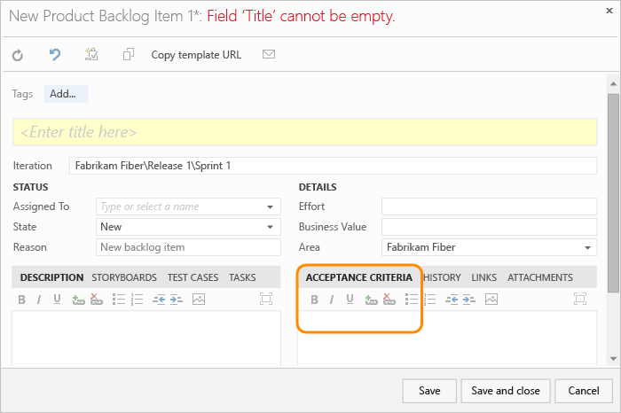
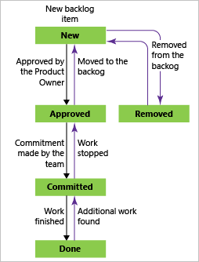

# Add work items to plan and track your project (TFS)

**TFS 2015 | TFS 2013**  

>[!IMPORTANT]   
><b>Feature availability: </b>The new web form provides many additional features. If you connect to VSTS or the web portal for TFS 2017 or later versions, see [Add work items to plan and track your project](add-work-items.md). 

You add work items to plan and manage your project. You use different types of  work items to track different types of work - such as tasks, features or user stories, test cases and bugs, risks or issues, and more. You can describe the work to be done, assign work, track status, and coordinate efforts within your team.  

Different types of work items are used to track features, user experiences, code defects, tasks, and issues. You can link work items to one another, as well as to changesets and source code files. As the following image shows, each work item form comes with a number of controls, fields, and tabs.


>[!NOTE]  
>Depending on the process you chose when creating your team project--[Scrum](../work-items/guidance/scrum-process.md), 
[Agile](../work-items/guidance/agile-process.md), or [CMMI](../work-items/guidance/cmmi-process.md)--the types of work items you can create will differ. For example, backlog items may be called product backlog items (PBIs), user stories, or requirements. All three are similar: they describe the customer value to deliver and the work to be performed.<br/>  
For an overview of all three processes, see [Choose a process](../work-items/guidance/choose-process.md). 
 


## Add work items to define new work
You can start adding work items once you connect to a team project. Here we show how to add work items from the web portal. For additional clients that you can use, see [Clients that support tracking work items](../work-items/about-work-items.md#clients).

1. From a web browser, connect to the team project that you want to work in. For example, the Fabrikam, Inc. team navigates to ```http://fabrikamprime:8080/tfs/DefaultCollection/Fabrikam%20Fiber%20Website/```.  
	If you haven't been added as a team member, [get added now](../scale/multiple-teams.md#add-team-members).

2. From a team home page, you can choose the type of work item you want to create.  

	  

	Work items you add are automatically scoped to your [team's area and iteration paths](../scale/multiple-teams.md). To change the team context, see [Switch team project or team focus](../../teams/switch-team-context.md?toc=/vsts/work/scale/toc.json&bc=/vsts/work/scale/breadcrumb/toc.json)

3. Enter a title and then save the work item. Before you change the default State, you must save it.  

	  

	You can [add tags to any work item to filter backlogs and queries](../track/add-tags-to-work-items.md).

##Update work items as work progresses
As work progresses, team members can update the state and reassign it as needed. While the workflow states differ for different work item types, they usually follow a progression from New or Active to Completed or Done. The following image shows the work flow states for a product backlog item. If you want to discard a work item, change the state to Removed.  

<table>
<tbody valign="top">
<tr>
<td>
<p><b>Typical workflow progression:</b> </p> 
<ul>
<li>Create a product backlog item in the default state, New.</li>
<li>Change the state from New to Approved.</li>
<li>Change the state from Approved to Committed.</li>
<li>Change the state from Committed to Done.</li>
</ul>
<p><b>Atypical transitions:</b> </p> 
<ul>
<li>Change the state from New to Removed.</li>
<li>Change the state from Removed to New.</li>
<li>Change the state from Approved to Removed.</li>
<li>Change the state from Committed to Approved.</li>
<li>Change the state from Done to Committed.</li>
</ul>
</td>
<td>
  
</td>
</tr>
</tbody>
</table>


Removed work items remain in the data store and can be reactivated by changing the State.  

With each update, changes are recorded in the History field which you can view through the **History** tab.  

  

To find work items based on their history, see [History & auditing](../track/history-and-auditing.md).  


<a id="link-wi">  </a>
##Link items to manage dependencies 
By linking work items using Related or Dependent link types, you can track work that is dependent on other work. Each work item contains one or more tabs with link controls. These controls support linking the work item to one or more objects.

**Link control tab from the web portal**  

  

Some work item types have two or more link control tabs. Each tab is designed to support specific types of links and restricts the types of link relationships made. To learn more, see [Manage dependencies, link work items to support traceability](../track/link-work-items-support-traceability.md).  
  

## Get the URL for a work item
From the web portal, simply copy the URL from the web browser address or open the context menu for the work item ID hyperlink and choose the Copy shortcut.  

In Visual Studio, right-click the work item tab to copy the URL. The URL opens the work item in the web portal.  


## Related notes

Once you've added several work items, you can use additional features to get notified of changes, create queries, define status and trend charts, plus more. To customize a work item type, see [Customize your work tracking experience](../customize/customize-work.md). 

