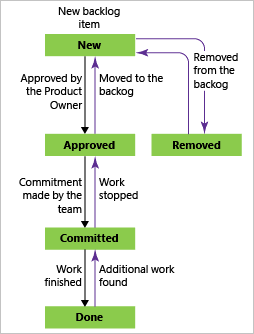
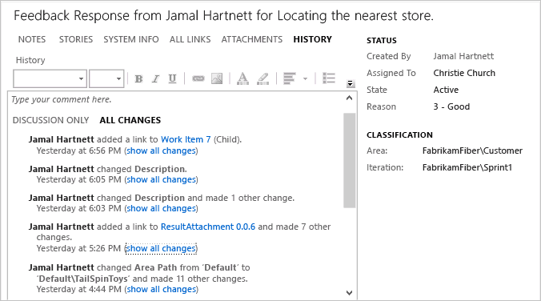

# Add and follow a work item 

<b>VSTS | TFS 2018 | TFS 2017 | TFS 2015 | TFS 2013</b> 


You add work items to plan and manage your project. You use different types of work items to track different types of work&mdash;such as user stories or product backlog items, tasks, bugs, or issues. You can describe the work to be done, assign work, track status, and coordinate efforts within your team.   


##Prerequisites
[//]: # (::: moniker range="vsts")
* You must be a member of a team project. If you don't have a team project yet, create one in [VSTS](../../accounts/set-up-vs.md). If you haven't been added as a team member, [get added now](../../accounts/add-account-users-assign-access-levels.md). 
[//]: # (::: moniker-end)
[//]: # (::: moniker range=">= tfs-2013 <= tfs-2018")
* You must be a member of a team project. If you don't have a team project yet, create one in an [on-premises TFS](../../accounts/create-team-project.md). If you haven't been added as a team member, [get added now](../../security/add-users-team-project.md). 
[//]: # (::: moniker-end)

[//]: # (::: moniker range="vsts || >= tfs-2018")

<a id="define-new-work">  </a>
## Add a work item 
You can start adding work items once you connect to a team project. If you don't have a team project yet, create one in [VSTS](../../accounts/set-up-vs.md)<!---or set one up in an [on-premises TFS](../../accounts/create-team-project.md)-->.

Here we show how to add work items from the web portal. 

>[!IMPORTANT]   
><b>Feature availability: </b>The new work item  form is available from VSTS and TFS 2017 and later versions. This topic describes how to track work using the new form. If you don't see the new form, [your admin may need to enable it](../customize/manage-new-form-rollout.md), or if it's enabled, [you may need to switch to use it](../customize/process/new-work-item-experience.md#switch-new). 

1.  From the **Work** hub, choose the work item type from the New Work Item list of options. Here, we choose to create a User Story. 

	 

	>[!NOTE]  
	>Depending on the process chosen when the team project was created&mdash;[Scrum](../work-items/guidance/scrum-process.md), 
	[Agile](../work-items/guidance/agile-process.md), or [CMMI](../work-items/guidance/cmmi-process.md)&mdash;the types of work items you can create will differ. For example, backlog items may be called product backlog items (Scrum), user stories (Agile), or requirements (CMMI). All three are similar: they describe the customer value to deliver and the work to be performed.
	>
	> For an overview of all three processes, see [Choose a process](../work-items/guidance/choose-process.md). 
	
	Click the  pin icon to have it show up within the Work hub drop down menu. 
<!---
	Or, from the Queries page, click the New menu and select the work item type. 

	
-->
3. Enter a title and then save the work item. Before you can change the State from its initial default, you must save it.  

	  

	You can [add tags to any work item to filter backlogs and queries](../track/add-tags-to-work-items.md).

	Work items you add are automatically scoped to your [team's area and iteration paths](../scale/set-team-defaults.md). To change the team context, see [Switch team project or team focus](../../settings/switch-team-context.md?toc=/vsts/work/work-items/toc.json&bc=/vsts/work/work-items/breadcrumb/toc.json).

That's it! 

Create as many work items as you need of the type you need to track the work you want to manage.  
[//]: # (::: moniker-end)

[//]: # (::: moniker range="tfs-2017")

TO BE COMPLETED 
[//]: # (::: moniker-end)

[//]: # (::: moniker range=">= tfs-2013 <= tfs-2015")
## Add work items to define new work
You can start adding work items once you connect to a team project. Here we show how to add work items from the web portal. For additional clients that you can use, see [Clients that support tracking work items](../work-items/about-work-items.md#clients).

1. From a web browser, connect to the team project that you want to work in. For example, the Fabrikam, Inc. team navigates to ```http://fabrikamprime:8080/tfs/DefaultCollection/Fabrikam%20Fiber%20Website/```.  
	If you haven't been added as a team member, [get added now](../scale/multiple-teams.md#add-team-members).

2. From a team home page, you can choose the type of work item you want to create.  

	  

	Work items you add are automatically scoped to your [team's area and iteration paths](../scale/multiple-teams.md). To change the team context, see [Switch team project or team focus](../../teams/switch-team-context.md?toc=/vsts/work/scale/toc.json&bc=/vsts/work/scale/breadcrumb/toc.json)

3. Enter a title and then save the work item. Before you change the default State, you must save it.  

	  

	You can [add tags to any work item to filter backlogs and queries](../track/add-tags-to-work-items.md).

##Update work items as work progresses
As work progresses, team members can update the state and reassign it as needed. While the workflow states differ for different work item types, they usually follow a progression from New or Active to Completed or Done. The following image shows the work flow states for a product backlog item. If you want to discard a work item, change the state to Removed.  

<table>
<tbody valign="top">
<tr>
<td>
<p><b>Typical workflow progression:</b> </p> 
<ul>
<li>Create a product backlog item in the default state, New.</li>
<li>Change the state from New to Approved.</li>
<li>Change the state from Approved to Committed.</li>
<li>Change the state from Committed to Done.</li>
</ul>
<p><b>Atypical transitions:</b> </p> 
<ul>
<li>Change the state from New to Removed.</li>
<li>Change the state from Removed to New.</li>
<li>Change the state from Approved to Removed.</li>
<li>Change the state from Committed to Approved.</li>
<li>Change the state from Done to Committed.</li>
</ul>
</td>
<td>
  
</td>
</tr>
</tbody>
</table>


Removed work items remain in the data store and can be reactivated by changing the State.  

With each update, changes are recorded in the History field which you can view through the **History** tab.  

  

To find work items based on their history, see [History & auditing](../track/history-and-auditing.md).  
 
[//]: # (::: moniker-end)

[//]: # (::: moniker range="vsts || >= tfs-2017 <= tfs-2018")
## Follow a work item

When you want to track the progress of a single work item, click the  icon. This signals the system to notify you when changes are made to the work item.  

  

You'll only receive notifications when other members of your team modifies the work item, such as adding to the discussion, changing a field value, or adding an attachment. 

Notifications are sent to your preferred email address, which which [you can change from your account preferences](../../notifications/change-email-address.md).  

To stop following changes, click the   icon.
 
[//]: # (::: moniker-end)

[//]: # (::: moniker range=">= tfs-2017 <= tfs-2018")

>[!IMPORTANT]
>For on-premises TFS, [you must configure an SMTP sever](../../tfs-server/admin/setup-customize-alerts.md) in order for team members to receive notifications.  

[//]: # (::: moniker-end)

## Try this next  

From the **Work** hub you can add the most common types of work items. To quickly add backlog items, such as user stories or requirements, see these topics:  
> [!div class="nextstepaction"]
> [Create your backlog](create-your-backlog.md)
> [Kanban quickstart](../kanban/kanban-quickstart.md) 


For additional clients that you can use to add work items, see [Clients that support tracking work items](../../user-guide/tools.md?toc=/vsts/work/work-items/toc.json&bc=/vsts/work/work-items/breadcrumb/toc.json ).

Once you've added several work items, you can use additional features to get notified of changes, create queries, define status and trend charts, plus more.  

For descriptions of each field and work item form control, see [Work item field index](../work-items/guidance/work-item-field.md?toc=/vsts/work/work-items/toc.json&bc=/vsts/work/work-items/breadcrumb/toc.json ) and [Work item form controls](../work-items/work-item-form-controls.md?toc=/vsts/work/work-items/toc.json&bc=/vsts/work/work-items/breadcrumb/toc.json ).  


