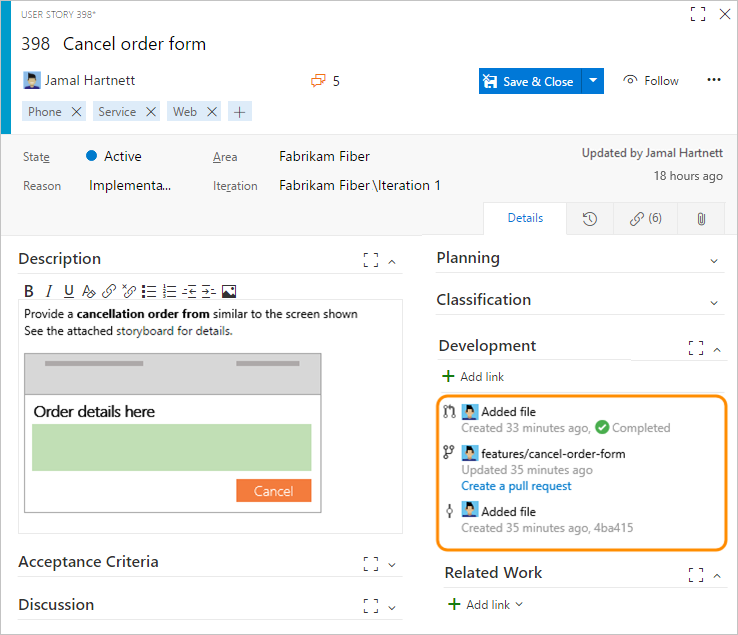
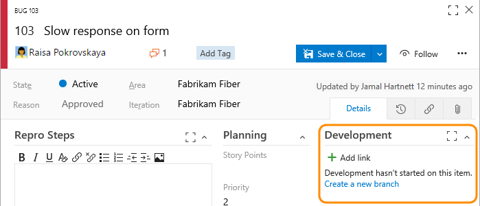
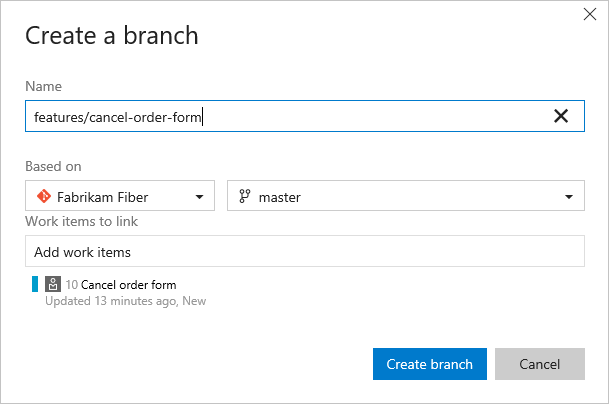
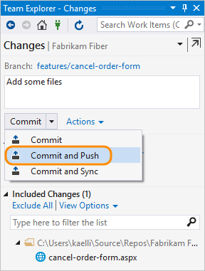
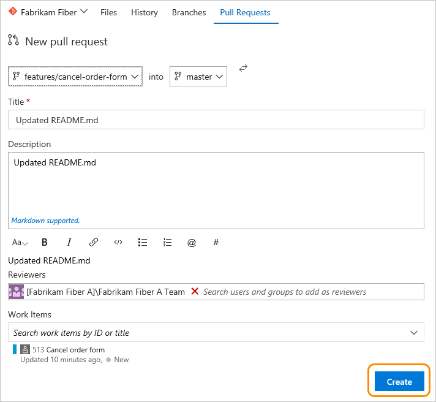
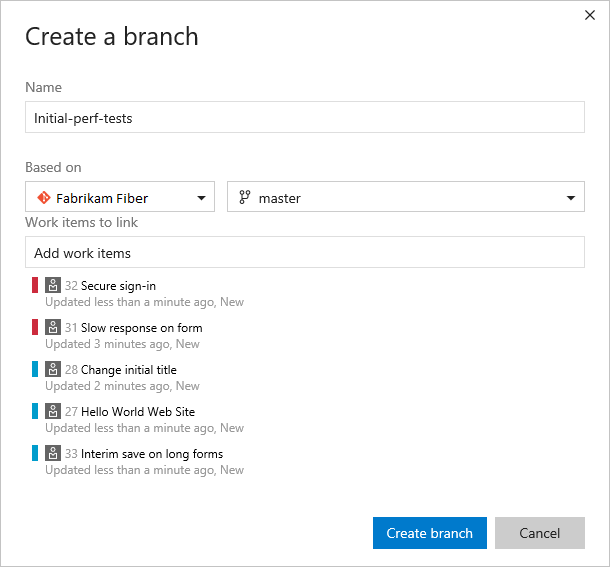
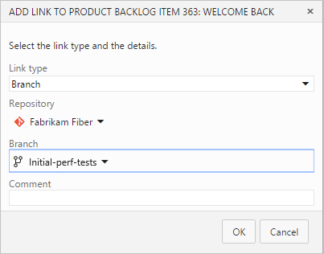
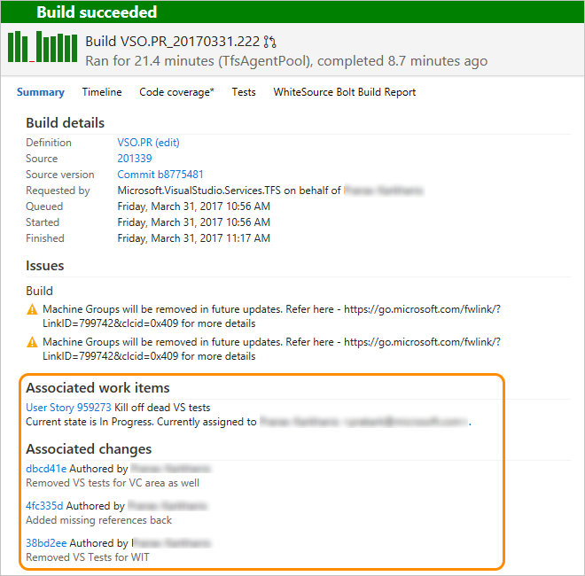

#Drive Git development from a work item   

**Team Services | TFS 2017**   

>[!NOTE]  
><b>Feature availability: </b>The Development section appears in the work item web form for Team Services or TFS 2017 or later versions, configured with the [new work item tracking experience](../process/new-work-item-experience.md). It supports both Git and TFVC version control repositories. Go here to learn how to [add a Git repository for your existing team project](../../setup-admin/create-team-project.md#git-and-tfvs-repos).   

One of the ways your team can drive their development and stay in sync is to link your work items to the objects created during development, such as branches, commits, pull requests, and builds. You can begin that linking by creating a branch from one or more work items. Later, you can create pull requests, quickly open commits, and maintain a record of development operations performed to complete specific work.  

The Development section records all Git development processes that support completion of the work item. This section can show your team information needed to take the next development step and minimize navigational steps to accomplish common development tasks. It also supports traceability, providing visibility into all the branches, commits, pull requests, and builds related to the work item.    

  

From it, you can quickly access branches, pull requests, and commits which are linked to the work item. Also, you can initiate a pull request for a branch you've created or linked to from the work item.  

Links shown in this section appear as a result of these actions:   
- Creating a branch, commit, or pull request from the work item    
- Specifying the work item ID during a commit, pull request, or other supported Git or TFVC operation   
- Specifically linking the work item from the Development section or  Links tab to a source code branch, build, or other supported Git or TFVC operation.  

Hovering over any entry listed under the Development section activates the hyperlink to the associated object.    

The link types you can add within the development section are Branch, Build, Changeset, Commit, Found in build, Integrated in build, Pull Request, and Versioned Item. 

>[!NOTE]  
>The link types, **Found in build** and **Integrated in build** are only available from Team Services and only work with the current build processes (not XAML builds). 

 


<a id="git-development">  </a>
## Workflow process

Consider creating a new branch when there are no linked code artifacts. If there is a branch but no pull requests, consider creating a pull request. Here's a typical workflow sequence when working with a Git repository. 

1. Start work on the work item by creating a branch. You can add a new Git branch from within the Development section...  

	 
 
	... or, from the form's  Actions menu.  

	  

	Name the branch and select the repository on which it's based.   

	  

	Branches you create are automatically linked to the work item.  

	>[!NOTE]  
	>You can only create a branch once you've added files to the main branch, which is always named ```master```.   

2. From Visual Studio or other supported IDE, fetch the contents of the branch you just created. For details, see [Update code with fetch and pull, Download changes with fetch](../../git/tutorial/pulling.md#download-changes-with-fetch). (While any code editing and committing process will work, we work best with an edition of Visual Studio.)  

3. Add or modify files in the branch that you created.  

4. From Visual Studio or other supported IDE, commit and push changes from your local branch to the repository. By adding the work item ID to your commit, you automatically link the commit to the work item.   

	  

	If this is the first time pushing changes from a new branch, you'll need to publish the branch before pushing your changes. For more details, see [Share code with push](../../git/tutorial/pushing.md).   

<a id="create-pull-request">  </a>
5. Create a [pull request](../../git/pull-requests.md). You create a pull request to merge the changes you made to a master branch and get your changes reviewed by other members of your team.  

	   

	>[!NOTE]
	>Once you've created a pull request, you can't create a new pull request for the same branch until you complete the previous pull request.     

6. Complete the pull request from the web portal or Visual Studio.  
 
	

<a id="add-branch-multi-wi">  </a>
## Create a branch for several work items  

You can also add a new branch from the work item listed on the backlog or Kanban board without having to open the work item. Using [multi-select](create-your-backlog.md#bulk-modify), you can select several work items and create a new branch where they're all linked to the branch. 

For example, here we select 5 items to link to a new branch.  


And, we specify the name of the branch.  

  


<a id="link-objects">  </a>
## Link to existing development and build objects

All items listed under the Development section also appear under the  Links tab. All development actions initiated from the Development section are also logged under the  History tab. 

  

To link a work item to an existing object, click the  Add links icon and then choose the link type.  



[Link work items to support traceability](../track/link-work-items-support-traceability.md).   


### Remove a link 
If you want to remove a link, you can do so from the Development section by highlighting it first and then click the  delete icon.  

  

Or, you can select it from the  Links tab and click the .


## Related notes

Learn more about tracking work with work items and developing with Git from these resources: 

- [Add work items](add-work-items.md)  
- [Git overview](../../git/overview.md)  
- [TFVC overview](../../tfvc/overview.md)
- [Productivity tips](../productivity/productivity-tips.md)  
- [Link work items to support traceability and manage dependencies](../track/link-work-items-support-traceability.md)  
- [Create your backlog](create-your-backlog.md)  
- [Agile tools](../overview.md)  

>[!NOTE]    
>To learn more or to customize the Development links control, see [LinksControlOptions elements, Development links control](../reference/linkscontroloptions-xml-elements.md#development-links-control).    

Keep in mind that the Development section only appears when using the web portal for Team Services or TFS 2017 or later versions. The work item tracking experience and forms that appear in Visual Studio will be missing several of the features that the web portal makes available.  

### Associated work items in build 

With Git commits, any work items that have been linked to a commit will be listed under the Associated work items in the build summary page. 

  

<!--- Add info about option to set build linking; link to release notes if needed --> 

[!INCLUDE [temp](../_shared/help-support-shared.md)]  
