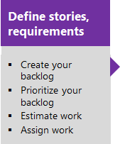
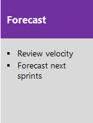

# About Agile tools and Agile project management 

[!INCLUDE [temp](../_shared/version-vsts-tfs-all-versions.md)]

You plan and track your project using the suite of Agile tools you access from the web portal. Agile tools support the core Agile methods&mdash;Scrum and Kanban&mdash;used by software development teams today. Scrum tools support defining and managing work within sprints, setting capacity, and tracking tasks. Kanban tools allow you to manage a continuous flow of work via an interactive sign board.  

You access all Agile tools from **Work**. If you're new to Agile, see [What is Agile?](/azure/devops/agile/what-is-agile) for an overview.

product backlog page" style="border: 1px solid #C3C3C3;" />  

Most Agile tools are [scoped to a team](../../organizations/settings/about-teams-and-settings.md). This supports team autonomy as well as scaling the system.  

> [!div class="mx-tdBreakAll"]  
> |Backlogs  |Task boards  |Kanban boards  |  Other  | 
> |-------------|----------|---------|---------|   
> |- [Product backlog](create-your-backlog.md) - [Portfolio (Epics, Features) backlogs](define-features-epics.md) - [Sprint backlogs](../scrum/assign-work-sprint.md)|- [Task boards](../scrum/task-board.md) - [Sprint burndown](../scrum/sprint-burndown.md)  - [Capacity planning](../scrum/set-capacity.md) |- [Kanban board](../kanban/kanban-basics.md) - [Task checklists](../kanban/add-task-checklists.md) - [Epics & Features boards](../kanban/kanban-epics-features-stories.md) |- [Delivery plans](../scale/review-team-plans.md) - [Forecast](../scrum/forecast.md) - [Velocity](../../report/dashboards/velocity-chart-data-store.md) |    

> [!NOTE]
>To understand the differences between backlogs, boards and Delivery plans, see [Backlogs, boards, and plans](backlogs-boards-plans.md). 
 

## Kanban method and tools
Kanban uses a visual interactive board to plan and show progress using cards. Your Kanban board is fully customizable to support the workflow used by your team.  

You update the status of work by dragging card to another column on the Kanban board. You can even change the order of items as you move a card to a new column.   

## Define work items and create your backlog  

You build your project plan by creating a backlog of work items that represent the features, requirements, user stories, or other work to perform. Portfolio backlogs provide support for organizing work in a hierarchical fashion and tracking major product initiatives or scenarios that rely on many stories or requirements.  Different types of work items help you track different types of work, such as user stories, tasks, bugs, issues, and more. 

## Scrum method and tools 
The Scrum method uses sprints to plan work to perform by a team within a specific time period and cadence. To get started, several sprints are predefined for your team.  If you're new to Scrum, get an overview from [What is Scrum?](/azure/devops/agile/what-is-scrum). 

You can quickly assign work items to a sprint by dragging and dropping them from the product backlog to the sprint. 

::: moniker range=">= tfs-2017"
## Work across projects 
  
Use your Project page to view and quickly navigate to teams, projects, branches, work items, pull requests and other objects that are relevant to you. For details, see [Work across projects](../../project/navigation/work-across-projects.md).  
 
::: moniker-end

## Try this next  

Take these tools for a test run by [signing up for a free VSTS organization](../../organizations/accounts/create-organization-msa-or-work-student.md). From there, you're ready to [create your backlog](create-your-backlog.md).  

Once you've started tracking work, you'll want to monitor and track progress, identify trends, and share your plans. See [Charts, dashboards, and widgets](../../report/overview.md). 

## Related articles

You access tools provided by VSTS and TFS by connecting from a client to the server, either in the cloud or on-premises. Some web portal tools require additional Visual Studio Subscriptions or Advanced/VS Enterprise access.  To learn more, see [Permissions and access for work tracking](../../organizations/security/permissions-access-work-tracking.md). 

For an overview of all your customization options, see [Customize your work tracking experience](../../reference/customize-work.md). 

 