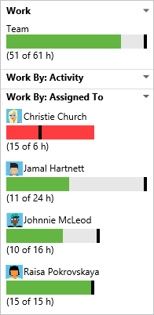

# Agile tools that rely on areas or iterations

Several Agile tools reference the team's default area path, iteration path, and activated sprints to automatically filter the set of work items they display. Here's a quick summary of these tools: 

Backlogs

<ul style="padding-left:15px;font-size:90%">
 <li style="margin-bottom:2px">[Product backlog](../backlogs/create-your-backlog.md)</li> 
 <li style="margin-bottom:2px">[Portfolio backlogs](../backlogs/define-features-epics.md)</li>
<li style="margin-bottom:2px">[Forecast](../scrum/velocity-and-forecasting.md)</li>
</ul>

Scrum

<ul style="padding-left:20px;font-size:90%">
<li style="margin-bottom:2px">[Sprint backlogs](../scrum/sprint-planning.md)</li>
<li style="margin-bottom:2px">[Sprint capacity](../scale/capacity-planning.md)</li>
<li style="margin-bottom:2px">[Task boards](../scrum/task-board.md)</li>
<li style="margin-bottom:2px">[Sprint burndown](../scrum/sprint-burndown.md)</li>
</ul>

Kanban

<ul style="padding-left:20px;font-size:90%">
<li style="margin-bottom:2px">[Kanban product board](../kanban/kanban-basics.md)</li>
<li style="margin-bottom:2px">[Kanban features and epics boards](../kanban/kanban-epics-features-stories.md)</li>
<li style="margin-bottom:2px">[Cumulative flow](../../report/guidance/cumulative-flow.md)</li>
</ul>

Widgets

<ul style="padding-left:20px;font-size:90%">
<li style="margin-bottom:2px">[New work item](../../report/widget-catalog.md#new-work-item-widget)</li>
<li style="margin-bottom:2px">[Sprint burndown](../../report/widget-catalog.md#sprint-burndown-widget)</li>
<li style="margin-bottom:2px">[Sprint capacity](../../report/widget-catalog.md#sprint-capacity-widget)</li>
<li style="margin-bottom:2px">[Sprint overview](../../report/widget-catalog.md#sprint-overview-widget)</li>
<li style="margin-bottom:2px">[Team members](../../report/widget-catalog.md#team-members-widget)</li>
</ul>

Other

<ul style="padding-left:20px;font-size:90%">
<li style="margin-bottom:2px">[Queries](../track/using-queries.md)</li>
<li style="margin-bottom:2px">[Velocity](../scrum/velocity-and-forecasting.md)</li>
<li style="margin-bottom:2px">[Dashboards](../../report/dashboards.md)</li>
<li style="margin-bottom:2px">[Alerts](../track/alerts-and-notifications.md)</li>

</ul>

Many of these tools are built from system queries that reference the team area path. For example, a team's default area path filters the work items that appear on a team's backlog. Also, work items that you create using an Agile tool auto-assign the areas and iterations based on team defaults.  

You can view these queries by choosing the **Create query** link that appears on these tools' pages. (Note that you can't change the underlying query.)  Lastly, you can set  security permissions to control who has access to create, modify, or manage test plans and test suites under an area.

## Team defaults referenced by backlogs and boards

<!--- Team defaults referenced by Agile tools --> 

>**Note**: Some features are available only from Team Services or TFS 2017 or later versions. For details, see [Set team defaults](../scale/set-team-defaults.md).

When you define a team, you define the team's: 
- Selected area path(s) 
- Default area path
- Selected iteration path(s)
- Backlog iteration path 
- Default iteration path 

All Agile tools reference the area path(s) defined for a team. For example, one team might handle all work assigned to *Customer Profile* and *Shopping Cart*, while another team only manages work assigned to the *Email* area path.  Also, the set of work items that appear on a backlog or board depend on the current State of a work item or it's parent-child status.   

In addition, several tools reference the team's default iteration and selected iteration paths or sprints. For example, when you add new work items from a backlog or board view, or from a team dashboard, the system assigns the team's default area path and default iteration path to these work items. 

<table valign="top" width="100%" > 
<tr valign="bottom" > 
<th width="20%">Agile tool</th>
<th width="18%">Area path (see note 1)</th>
<th width="32%">Iteration path</th>
<th width="30%">State</th>
</tr>
<tr valign="top" > 
<td>Portfolio or product backlogs</td>
<td>Selected area path(s)</td>
<td>Equal to or under team's [backlog iteration path](../scale/set-team-defaults.md#set-backlog-iteration)</td>
<td>Active (corresponds to a Proposed or InProgress state category, see notes 2, 3)</td>
</tr>

<tr valign="top" > 
<td>Kanban boards (see note 4)</td>
<td>Selected area path(s)</td>
<td>Equal to or under team's [backlog iteration path](../scale/set-team-defaults.md#set-backlog-iteration)</td>
<td>Any state (see notes 3, 5)</td>
</tr>

<tr valign="top" > 
<td>Sprint backlogs (see note 4)</td>
<td>Selected area path(s)</td>
<td>Team's selected iteration paths</td>
<td>Any state (see notes 3, 5)</td>
</tr>

<tr valign="top" > 
<td>Task boards (see note 4)</td>
<td>Selected area path(s)</td>
<td>Team's selected iteration paths</td>
<td>Any state (see notes 3, 5)</td>
</tr>

<tr valign="top" > 
<td>New work item widget</td>
<td>Default area path</td>
<td>Default iteration path</td>
<td>n/a</td>
</tr>

</table>

<b>Notes:</b>

<ol>
<li>Agile tools filter items based on the team's selected area path(s). Teams can choose [whether to include or exclude items assigned to subarea paths](../scale/set-team-defaults.md#team-area-paths).</li>
<li>Work items whose State equals Closed, Done, or Removed (corresponding to a Completed category state) don't appear on portfolio and product backlogs.</li>
<li>You can add custom workflow states and assign them to one of three state categories. The [state categories](../process/customize-process-workflow.md#workflow-states) determine which work items appear on backlog and board views. </li>
<li>Kanban boards, sprint backlogs, and task boards only show the last node in a hierarchy, called the leaf node. For example, if you link items within a hierarchy that is four levels deep, only the items at the fourth level appear on the Kanban board, sprint backlog, and task board. To learn more, see [parent-child links between items](../../work/backlogs-boards-plans.md#leaf-nodes).</li>
<li>Work items whose State equals Removed don't appear on boards.</li> 
</ol>

## Sprint planning tools 

Once you've defined and selected the sprints for your team, [you can start using these tools to plan your sprint](../scrum/sprint-planning.md).  

###Track team capacity

At the start of each sprint, you'll want to plan the work that your team can commit to. The three Agile tools that support this work include the sprint backlog, capacity planning, and capacity bars. The sprint backlog contains a filtered subset of backlog items whose iteration path corresponds to the current sprint. 

<table valign="top" > 
<tr valign="top" > 
<td width="35%">

<b>Team capacity planning tool</b>

By setting team capacity, the team knows exactly the total number of work hours or days the team has for each sprint. With this tool, you set individual team member capacity as well as days off. And, conveniently, you can set holidays or shared days off taken by the entire team. 

Setting capacity for each team member working during a sprint causes the capacity bar for that individual to appear. 

You <a href="#team_settings">set recurring days off</a>, such as weekends, through team settings.

</td>
<td>
 
</td>
</tr>
<tr valign="top" > 
<td>

<b>Individual and team capacity bars</b>

With capacity bars, you can quickly see who is over, at, or under capacity. Capacity bars update with each of these activities: 

<ul>
<li>

Tasks are assigned with non-zero remaining work

</li>
<li>

Change in remaining work

</li>
<li>

Date change within the sprint cycle. Individual and team capacity always reflects their capacity from the current day till the end of the sprint.  

</li>
</ul>

Here's how to interpret the capacity colors:

</td>
<td width="455px">

</td>
</tr>
</table>

### Update tasks, monitor burndown 
During a sprint, your team can use the task board and sprint burndown chart to track their progress. Your sprint burndown chart provides you with an at-a-glance visual to determine if your team is on track to meet their sprint plan.  
 
<table valign="top">
<tr valign="top" > 
<td width="35%">

<b>Task board</b>

Your [task board](../scrum/task-board.md) provides an interactive progress board for work required to complete the sprint backlog. During your sprint you'll want to update the status of tasks and the remaining work for each task. 

Updating tasks daily or several times a week yields a smoother burndown chart. 

</td>
<td width="520px">

</td>
</tr>
<tr valign="top" > 
<td>

<b>Sprint burndown chart</b>

You use the [sprint burndown chart](../scrum/sprint-burndown.md) to mitigate risk and check for scope creep throughout your sprint cycle. The burndown chart reflects the progress made by your team in completing all the work they estimated during their sprint planning meeting. 

The ideal trend line always indicates a smooth and steady burndown. The blue area, however, represents what's actually going on. It shows the buildup of work as team members add tasks and the reduction of work as team members complete those tasks.

</td>
<td>

</td>
</tr>
</table>

### Velocity and forecast 

While you use sprint planning and tracking tools for each sprint, you use the velocity and forecast tools to estimate work that can be completed in future sprints. 

Velocity provides a useful metric for gaining insight into how much work your team can complete during a sprint cycle. And, the forecast tool provides a means for determining how much work your team can complete within a sprint based on a specified team velocity. 

After your team has worked several sprints, they can use the [velocity and forecast tools](../scrum/velocity-and-forecasting.md) to estimate work that can be accomplished in future sprints.  

<table valign="top" > 
<tr valign="top" > 
<td>

<b>Velocity chart</b>

Each team is associated with one and only one velocity chart. The green bar within the chart indicates the total estimated effort (story points or size) of backlog items (user stories or requirements) completed within the sprint. (Blue corresponds to the estimated effort of items not yet completed.)  

Velocity will vary depending on team capacity, sprint over sprint. However, over time, the velocity should indicate a reliable average that can be used to forecast the full backlog. 

By minimizing the variability of backlog item size─effort or story points─you gain more reliable velocity metrics.

</td>
<td width="500px">

</td>
</tr>
<tr valign="top" > 
<td>

<b>Forecast tool</b>

You can use the forecast tool to get an idea of how many and which items you can complete within a sprint. 

By plugging in a velocity, you can see which items are within scope for the set of sprints the team has selected. As shown here, a velocity of 15 indicates that it will take three sprints to complete the work shown. 

</td>
<td>

</td>
</tr>
</table>  

## Structure teams, areas, and iterations to support hierarchical teams or scale agility within an enterprise 

Although there is no concept of sub-teams, you can create teams whose area paths are under another team, which effectively creates a hierarchy of teams. To learn more, see [Add another team](../scale/multiple-teams.md).

Also, these topics can walk you through the steps for configuring teams, area paths, and iterations to support portfolio management or enterprise organizations: [Portfolio management](../scale/portfolio-management.md) and [Implement Scaled Agile Framework to support epics, release trains, and multiple backlogs](../scale/scaled-agile-framework.md).

## Related notes 

*	[Add another team](../scale/multiple-teams.md)  
*	[Set team defaults](../scale/set-team-defaults.md)  
*	[Agile tools that rely on areas and iterations](../concepts/agile-tools-areas-iterations.md)
*	[Define iteration paths](../customize/set-iteration-paths-sprints.md)  
*	[Define area paths](../customize/set-area-paths.md)  
*	[Manage team assets ](../scale/manage-team-assets.md)  
*	[Set permissions and access for work tracking](../how-to/set-permissions-access-work-tracking.md) 
*	[Query by area or iteration path ](../track/query-by-area-iteration-path.md)    
