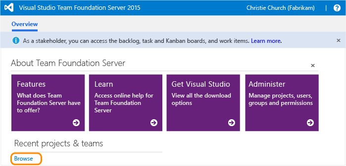
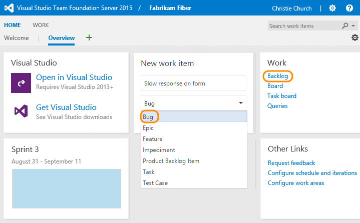
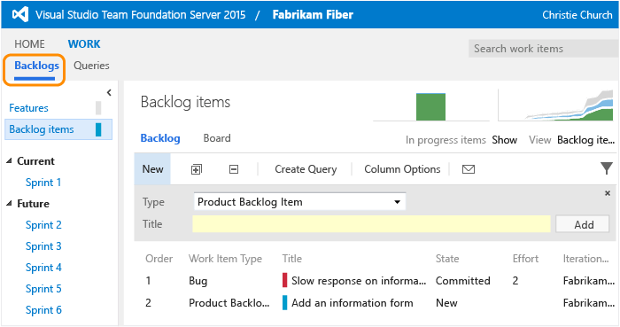
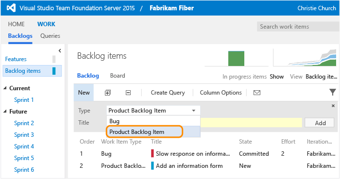
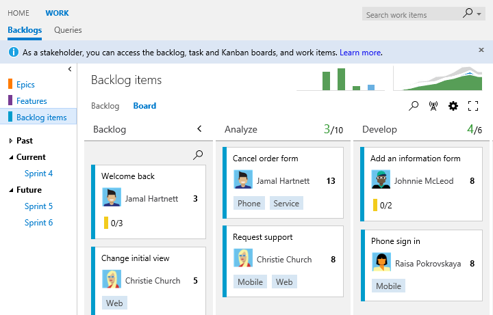
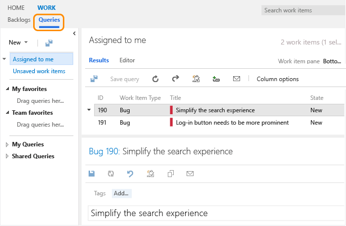
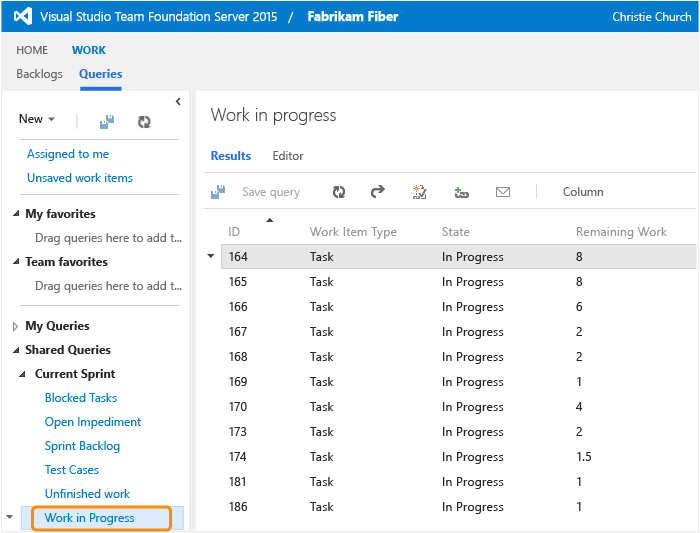
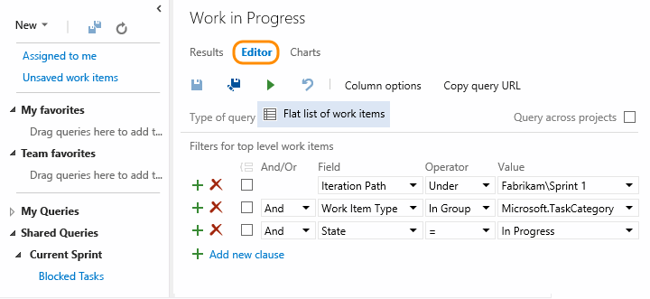
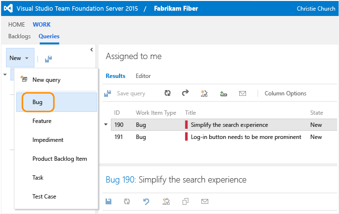
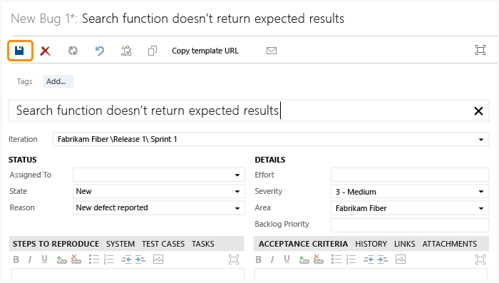

#Work as a stakeholder

<b>Team Services | TFS 2017 | TFS 2015 | TFS 2013</b> 

<!--- Need to note TFS 2013 differences --> 

With stakeholder access, anyone on your team can check project status and provide feedback. Stakeholders can track project priorities and provide direction, feature ideas, and business alignment to a team. They can contribute to project plans by adding and modifying work items.  

>[!NOTE]  
>**Feature availability**: The following features are available from Team Services or from the web portal of the listed on-premises TFS version or a later version. Those not annotated are available from all platforms and versions. To determine your platform or TFS version, see [Platform and version support](../../provide-feedback.md#platform-version). Visit the [Visual Studio Downloads page](https://www.visualstudio.com/downloads/download-visual-studio-vs) to get the latest TFS update.  

Stakeholders contribute to team projects through the web portal using any supported browser. Within a team project, stakeholders can perform the following primary tasks by navigating to a hub/page or their account profile. For a comparison chart of stakeholder versus basic access, see the [Feature Matrix](https://www.visualstudio.com/team-services/compare-features/).


<div style="float:left;width:350px;margin:8px;font-size:90%">
<p style="font-weight:bold;padding-bottom:0px;text-align:center;">Account, Dashboards, and Notifications</p>
<ul style="padding-left:30px">
<li style="margin-bottom:2px">[Navigate to teams, team projects, and more](../../connect/account-home-pages.md) (Team Services)</li>
<li style="margin-bottom:2px">[View project welcome pages](../../collaborate/project-vision-status.md) (Team Services)</li>
<li style="margin-bottom:2px">[View team dashboards](../../report/dashboards.md) <sup>1</sup></li>
<li style="margin-bottom:2px">[Manage personal notifications](../../collaborate/manage-personal-notifications.md) (Team Services, TFS 2017) </li>
<li style="margin-bottom:2px">[Set personal alerts for changes to work items](../track/alerts-and-notifications.md) (TFS) </li>
<li style="margin-bottom:2px">[Invite users and assign licenses](../../setup-admin/team-services/add-account-users-assign-access-levels-team-services.md) <sup>5</sup>  (Team Services)  </li>
</ul>

<p style="font-weight:bold;padding-bottom:0px;text-align:center;">Build & Release</p>
<ul style="padding-left:30px">
<li style="margin-bottom:2px">[View releases](../../build/actions/view-manage-releases.md) <sup>6</sup> (TFS 2015.2)</li>
<li style="margin-bottom:2px">[Approve a release](../../build/concepts/definitions/release/environments.md#approvals) (TFS 2015.2)</li>
</ul>
</div>

<div style="float:left;width:350px;margin:8px;font-size:90%">
<p style="font-weight:bold;padding-bottom:0px;text-align:center;">Work</p>
<ul style="padding-left:30px">
<li style="margin-bottom:2px">[View, add, and modify items on backlogs](#check-backlog) <sup>2, 3</sup></li>
<li style="margin-bottom:2px">[View, and modify items on sprint backlogs](../scrum/sprint-planning.md)</li>
<li style="margin-bottom:2px">[View, and modify items (Kanban)](../kanban/kanban-basics.md)  <sup>3, 4</sup></li> 
<li style="margin-bottom:2px">[Add tasks to the checklist (Kanban)](../kanban/add-task-checklists.md) <sup>4</sup> (TFS 2015.1)</li>
<li style="margin-bottom:2px">[Follow changes made to work items](../../collaborate/follow-work-items.md) (TFS 2017)</li>
<li style="margin-bottom:2px">[View the cumulative flow diagram](../../report/guidance/cumulative-flow.md)</li>
<li style="margin-bottom:2px">[View, and modify items (task board)](../scrum/task-board.md) <sup>3, 4</sup></li>
<li style="margin-bottom:2px">[View, create, and modify work items](#create-work-item) <sup>4</sup></li>
<li style="margin-bottom:2px">[View, create, and save queries](#query)</li>
<li style="margin-bottom:2px">[Submit, view, and change your feedback responses](give-feedback.md)</li>
<li style="margin-bottom:2px">[Change work item type](../backlogs/remove-delete-work-items.md) (Team Services)</li>


</ul>
</div>


<div style="clear:left;font-size:100%">
</div>


**Notes:** 
1. Does not include access to the welcome page  
2. Does not support changing the backlog priority order  
3. Does not support updating status by moving cards on the board  
4. Stakeholders can assign existing tags to work items, but not create new tags
5. Stakeholders must be granted [Project Collection Administrator permission](../../setup-admin/add-administrator-tfs.md) in order to add users and assign licenses.   
6. Stakeholders can only view and approve releases.


Also, Stakeholders do not have access to [Delivery Plans](../scale/review-team-plans.md).   

If you choose a feature that's not available to you as a stakeholder, you'll receive an error message indicating that you have insufficient permissions when you try to complete the task. 


[!INCLUDE [temp](../_shared/image-differences.md)] 


## Add user as a stakeholder  

Stakeholder access support business owners and analysts and other team members who don't contribute to code, build, and test activities. They contribute by adding ideas to the backlog, adding context and information to work items, and reviewing status and progress. All members of an organization who don't use Visual Studio but want to contribute to work item tracking and monitor progress can be assigned as a stakeholder. 

Stakeholder access provides free access to Team Services and to on-premises TFS team projects. Stakeholders don't have to have a client access license (CAL). This view restricts functionality so that your organization complies with the end-user license agreement for Team Foundation Server. For more information, see [Visual Studio licensing white paper](http://go.microsoft.com/fwlink/?LinkId=255102).  

For information on adding stakeholder accounts:  

   **Team Services:**&#160;&#160;[Add users in Visual Studio Team Services](../../setup-admin/team-services/add-account-users-assign-access-levels-team-services.md)  
   **On-premises TFS:**&#160;&#160;[Change access levels](change-access-levels.md)  

Only account owners or members of the [Team Foundation Server Administration group](../../setup-admin/add-administrator-tfs.md) can add accounts to get Stakeholder access. 

>[!NOTE]  
>If you cancel purchases of Team Services users in your account, the access level of the account owner and the next four people to sign in to the account will be set to Basic. Team Services provides five free users with Basic access to each account. Subsequent users to sign in will have their access level reduced to Stakeholder. This means that these users would have access to fewer features.
  

## First time signing in 

1. If you're connecting to Team Services, click the link provided in the email invitation you should have received. 

  Or, open a browser window and enter the URL for the web portal.

  **Team Services:**  ```http://AccountName.visualstudio.com/DefaultCollection/ProjectName```
 
  **On-premises TFS:**  ```http://ServerName:8080/tfs/DefaultCollection/ProjectName```

  For example, to connect to the server named *FabrikamPrime* and project named *Contoso*, type ```http://FabrikamPrime:8080/tfs/DefaultCollection/Contoso```.

2.  Enter your credentials. If you aren't able to sign in, you need to be added as a member to a team and added to Stakeholder access. 

	>[!NOTE]
	>The images you see from your web portal may differ from the images you see in this topic. These differences result from updates made to Team Services or your on-premises TFS. However, the basic functionality available to you remains the same unless explicitly mentioned.
	>
	>For an overview of navigating in the web portal and the features available to you by enabling the Account Landing feature, see [Work in the web portal](../../connect/work-web-portal.md).

3.  To connect to a team project, choose Browse.

  

  If you don't see a project listed, contact the project administrator for your team and ask them to add you to the project.  

4. From the Overview dashboard, you can open the backlog that tracks work. Or, you can create a work item to track new work. 

  

  You might see different work item types in your view based on the process selected for your team project: [Scrum](../guidance/scrum-process.md), [Agile](../guidance/agile-process.md),  or [CMMI](../guidance/cmmi-process.md).  

  If you don't see these options in one of the dashboards for your team, contact your team admin and ask that they provide the New work item and Work links widgets on a dashboard for you to use.    


<a id="check-backlog">  </a> 

##Check the backlog or add new work  

Work appears in the backlog in priority order.

1. To view or edit a work item, select it and choose Enter.

    

2. To add a new item, select the type and then name it. Your items are added to the bottom of the list.  

    

##Check work in progress  

To view the team's work status, open the board. Choose an item to open or edit it.   



<a id="query">  </a> 
##Find work assigned to you, or query for other work items  

Open the Queries page to see the list of work items assigned to you.  

  

Or, open any of the queries defined in the Shared Queries folder.  

  

And, you can [create new queries or edit existing queries](../track/using-queries.md) and save them under My Queries folder.  

  

<a id="create-work-item">  </a> 
##Create a bug  

You can create any type of work item listed on the New menu. Types listed can differ among different projects.  

1. Open a bug.

  

2.  Fill out the form and save it. A field with a yellow background indicates you need to enter valid data.

  

  [Manage bugs](../backlogs/manage-bugs.md) provides more info on capturing bug information.

>[!NOTE]  
>A caution icon on a tab indicates values that violate validation rules. You must correct information on that tab in order to save the work item. To learn more about each of the default work item types, see one of these topics: [Scrum](../guidance/scrum-process.md), [Agile](../guidance/agile-process.md),  or [CMMI](../guidance/cmmi-process.md).  

##Related notes 

In addition to accessing the features discussed previously, Stakeholder names will appear in the drop-down lists of the Assigned To and other person-name fields. So, team members can assign work to a Stakeholder. 

To learn more about the latest features available to you, see:

- [Create your backlog](../backlogs/create-your-backlog.md)
- [Kanban basics](../kanban/kanban-basics.md)
- [Add work items](../backlogs/add-work-items.md)
- [Use the query editor to list and manage queries](../track/using-queries.md)

### Features stakeholders can't access 

If you need access to the following features&mdash;which support the daily work of product owners, team leads, developers, testers, and project administrators&mdash;you need to be have Basic access.:  
- Change the priority of an item within a backlog  
- Delete work items or move work items to another team project
- Create shared queries, view charts, and modify the home page  
- Access the full set of features of the Code, Build, Test, and Release hubs  
- Participate in team rooms, which capture interactive, detailed conversations about the project  
- View administrative pages that support managing permissions, area and iteration paths, and more.  

For Team Services pricing, see [Visual Studio Team Services Pricing](https://www.visualstudio.com/team-services/pricing/).  

For on-premises TFS, go [here for a comparison chart of access levels](change-access-levels.md).  

[!INCLUDE [temp](../_shared/switch-team-context-work.md)]  

To view or create work items for another team project or team, switch to that project. 

###Export work items to Excel or Project
Stakeholders can use Excel or Project to add and update work items. See these topics for details:  
- [Bulk add or modify work items with Excel](../office/bulk-add-modify-work-items-excel.md)  
- [Create your backlog and tasks using Project](../office/create-your-backlog-tasks-using-project.md)  

###Work in Team Explorer
You can use [Visual Studio Community and other Team Foundation clients](../../tools.md) to add, modify, and query for work items. Some features, such as the product backlog and Kanban board, you can only view through the web portal.   

In Team Explorer, if you choose a feature that's not available for stakeholders, you'll just get an error that you don't have access. [Download Visual Studio Community](https://www.visualstudio.com/downloads/download-visual-studio-vs) to get Team Explorer for free.

###Access to third-party tools  
With Stakeholder access, you can access third-party tools that are connected to Team Services through APIs or service hooks. You'll only be able to access those tools that support work item tracking.  


