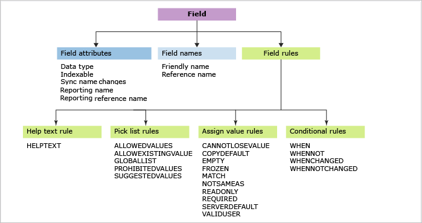
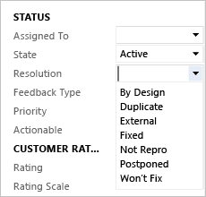
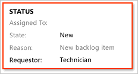
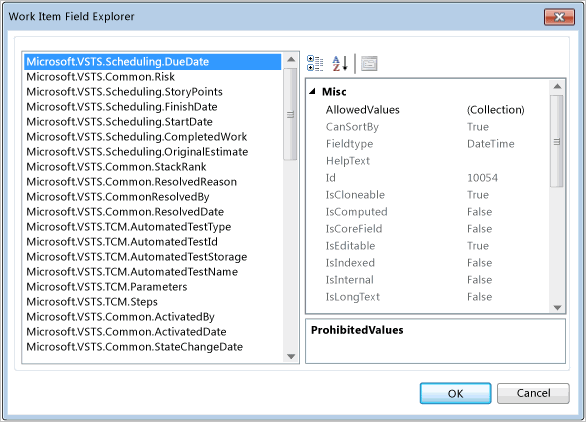

# Add or modify a field to track work 

[!INCLUDE [temp](../_shared/customization-phase-0-and-1-plus-version-header.md)]

Your project contains 100 or more data fields, based on the process&#151;[Agile](../work-items/guidance/agile-process.md), [Scrum](../work-items/guidance/scrum-process.md), or [CMMI](../work-items/guidance/cmmi-process.md)&#151;used to create the project. You update data by [modifying the data field within a work item](../backlogs/add-work-items.md). Each work item is associated with a work item type (WIT), and the data you can track corresponds to the fields assigned to the WIT. 

You can modify an existing field or add a custom field to support tracking additional data requirements. For example, you can customize the pick list within a drop-down menu, add a rule to specify a default value or restrict the value it can take, or change a field attribute.  

Not all pick lists are defined in the same way. Some lists are defined through the user interface, the workflow for a WIT, or by adding user accounts to a project as indicated in the following table.   

> [!NOTE]    
> **Feature availability:** You can exercise some features only from an on-premises TFS and are noted as such. 


> [!div class="mx-tdCol2BreakAll"]  
> |WIT definition  |Command line change (On-premises XML) |
> |-------------|----------|  
> |- [Customize a pick list](#picklist)<br/>- [Add rules to a field](#add-rules)<br/>- [Add a custom field](#add-custom-field)<br/>- [Change the field label on the form](#change-label)<br/>- [Add a custom control](#custom-control) |- [List fields](#list-fields)<br/>- [Change a field attribute](#change-attribute) <br/>- [Delete a field](#delete-field)<br/>- [Index a field](#index-field)  | 


## Methods by which work item fields get added 
You use work item fields to track data for a work item type and to define the filter criteria for queries as well as to generate reports. Any data element, except for system  fields, that you want to track must be defined as a work item field. You can define work item fields within the definition of a work item type or global workflow.

Work item fields are maintained for a project collection. You add fields when you perform one of the following tasks:

-   **Create a project**. All fields that are defined within the definitions for work item types or global workflow and that are defined for the selected process template are created. The core system fields are automatically defined for every work item type that is defined for a project. For a list of these fields, see [Work item field index](../work-items/guidance/work-item-field.md).

-   **Import a WIT definition**. All new fields that are defined within the definition for a type of work item are added to the collection. For more information, see [All WITD XML elements reference](reference/all-witd-xml-elements-reference.md).

-   **Import a global workflow definition**. All new fields that are defined within the global workflow are added to the collection. You define a global workflow when you want to maintain a set of work item fields that several types of work items share. For more information, see [Customize global workflow](reference/global-workflow-xml-element-reference.md).

-   **Map a project collection to an instance of Project Web App (PWA)**. After you install the Team Foundation Server Extensions for Project Server, configure the integration by mapping various components of Team Foundation. When you map a collection, a global workflow definition that supports several fields in Project Server fields is imported. For more information, see [Project Server fields added to TFS to support data synchronization](../tfs-ps-sync/project-server-fields-added-to-tfs.md).

All fields that are defined in all WITs and all global workflows for all projects make up the complete set of fields defined within the collection. You can change the attribute of, rename, and delete existing fields. However, you incur certain costs when you make these kinds of changes, specifically for on-premises TFS and reporting. 

To add or customize a field for a collection, modify the XML content for the  WIT definition. Define each field through a **FIELD** element within the **FIELDS** section of the WIT definition. For information about the structure and location of these files, see [All FIELD XML elements reference](reference/all-field-xml-elements-reference.md).

<a id="modify-field">  </a>
## Add a field, or apply a rule, or change an attribute 

To add a custom field, add field rules, or change the label of a field on a work item form, you modify the work item type (WIT) or types  that use the field. Follow the [customization sequence](customize-work.md) that matches your process model. 

To change a field attribute or rename a field, use the **witadmin** command line tool. Otherwise, to modify a field, you add or modify the rules associated with the field within a WIT definition.   



<a id="edit">  </a>
## To edit a WIT definition file 

To add rules or add a custom field, export, edit, and then import the WIT definition file.

[!INCLUDE [temp](../_shared/process-editor.md)]  

Any field that you want to use to track data must be added to the WIT definition file. This is true for all but system fields (fields whose reference name start with **System.**). All System fields are defined for all WITs, whether or not you include them in WIT definition. To learn more about each field, see [Work item field index](../work-items/guidance/work-item-field.md).

::: moniker range="vsts || >= tfs-2017 <= tfs-2018"
<a id="boolean-field">  </a>
## Add a checkbox or Boolean field 
::: moniker-end

::: moniker range="vsts || >= tfs-2018"
Use the following syntax to add a Boolean field within the **FIELDS** section of the WIT definition. 
::: moniker-end
::: moniker range="tfs-2017"
Use the following syntax to add a Boolean field within the **FIELDS** section of the WIT definition. Requires TFS 2017.2 or later version. 
::: moniker-end

::: moniker range="vsts || >= tfs-2017 <= tfs-2018"
> [!div class="tabbedCodeSnippets"]
```XML
<FIELD name="Triage" refname="Fabrikam.Triage" type="Boolean" >
   <DEFAULT from="value" value="False" />
   <HELPTEXT>Triage work item</HELPTEXT>
</FIELD>
```

And then add the following syntax within the **FORM** section to have the field appear on the form. 

> [!div class="tabbedCodeSnippets"]
```XML
<Control Label="Triage" Type="FieldControl" FieldName="Fabrikam.Triag" /> 
```
 
The field will appear as a checkbox on the form. 
::: moniker-end


<a id="picklist">  </a>
## Customize a pick list

Pick lists are the enumerated values that appear within a drop-down menu in a work item form and the **Value** column within the query editor. The method you use to customize a pick list varies depending on the field.

To modify the pick list for most string or integer fields within a work item form, edit the WIT definition. For example, to add a custom Resolution field and pick-list, specify the XML code as shown.

<table>
<tbody>
<tr>
<td>Custom field and pick list<br /><br />
  
</td>
<td>
<pre><code>&lt;FIELD name=&quot;Resolution&quot; refname=&quot;MyCompany.Resolution&quot; type=&quot;String&quot;&gt;    
&lt;ALLOWEDVALUES&gt;
   &lt;LISTITEM value=&quot;By Design&quot; /&gt;
   &lt;LISTITEM value=&quot;Duplicate&quot; /&gt;
   &lt;LISTITEM value=&quot;External&quot; /&gt;
   &lt;LISTITEM value=&quot;Fixed&quot; /&gt;
   &lt;LISTITEM value=&quot;Not Repro&quot; /&gt;
   &lt;LISTITEM value=&quot;Postponed&quot; /&gt;
   &lt;LISTITEM value=&quot;Won't Fix&quot; /&gt;
&lt;/ALLOWEDVALUES&gt;
&lt;/FIELD&gt;</code></pre>
</td>
</tr>
</tbody>
</table>


Rules support combining lists, restricting to whom a list applies, and setting conditions on when a list appears on the work item form. Rules control whether a distribution list is expanded to show its individual members or a list is filtered by using the optional **expanditems** and **filteritems** attributes. Use global lists to minimize the work that is required to update a list that is shared across WITs or projects.

When you use a list in several WITs or across several projects, maintaining it as a global list minimizes your maintenance requirements. Also, if you need to have parts of lists show up as different across WITs or projects, you can define a global list for part of a pick list. See see [Define pick lists](reference/define-pick-lists.md) and [Define global lists](reference/define-global-lists.md).

<a id="add-rules">  </a>
### Add rules to a field

To add a custom field or add rules to a field, edit the WIT definition. You can limit rules to apply to specific users or groups. Most rules support the **for** or **not** attributes to focus who the rule does and doesn't apply to.

For example, with the following code snippet, you can enforce the rule that only members of the Management Team, a customer defined TFS group, can modify the Stack Rank field once a work item has been created.

> [!div class="tabbedCodeSnippets"]
```XML
<FIELD name="Stack Rank" refname="Microsoft.VSTS.Common.StackRank" type="Double" reportable="dimension">  
   <FROZEN not="[project]\Management Team" />  
   <HELPTEXT>Work first on items with lower-valued stack rank. Set in triage.</HELPTEXT>
</FIELD>  
```

You apply rules to accomplish the following actions:  

>[!div class="mx-tdCol2BreakAll"]  
> |To accomplish this action: | Use this XML element: |  
> |---|---|
> | Specify a tool-tip. | **HELPTEXT** |
> | Qualify the value a field can have. | **CANNOTLOSEVALUE**, **EMPTY**, **FROZEN**, **NOTSAMEAS**, **READONLY**, and **REQUIRED** |
> | Copy a value or specify a default. | **COPY**, **DEFAULT**, and **SERVERDEFAULT** |
> | Restrict who can modify a field. | **VALIDUSER**, **for** and **not** field rule attributes |
> | Enforce pattern matching on a string field. | **MATCH** |
> | Conditionally apply rules based on values in other fields. | **WHEN**, **WHENNOT**, **WHENCHANGED**, and **WHENNOTCHANGED** |

System fields, whose names all start with the "System" prefix (for example, System.ID), are limited in terms of the rules you can apply to them. For example, you can't copy or set to empty fields used to track who created, changed, or closed a work item, or date-time fields used by the system.

For more information about applying field rules and restrictions, see [Apply a rule to a work item field](reference/apply-rule-work-item-field.md).

<a id="add-custom-field">  </a>
## To add a custom field
To add a custom field, edit the WIT definition to add a **FIELD** element within the **FIELDS** section and a **Control** element within the **FORM** section. 

0. Export the WIT definition file [based on the process model you use](../customize/customize-work.md).   

0.  Locate the section of the XML file that begins with ```FIELDS```.

0.  Add the ```FIELD``` element that specifies the name of the custom field to add. You must specify the following required attributes: friendly ```name```, ```refname``` (reference name), and ```type```. For more information, see [FIELD (Definition) element reference](reference/field-definition-element-reference.md).

    The following code specifies the custom field, Requestor, with a reference name of ```FabrikamFiber.MyTeam.Requestor``` and a pick list of allowed values, with the default value of Customer.

	> [!div class="tabbedCodeSnippets"]
	```XML
	<FIELD name="Requestor" refname="FabrikamFiber.MyTeam.Requestor" type="String" reportable="Dimension">
	   <ALLOWEDVALUES>
	      <LISTITEM value="Customer" />
	      <LISTITEM value="Executive Management" />
	      <LISTITEM value="Other" />
	      <LISTITEM value="Support" />
	      <LISTITEM value="Team" />
	      <LISTITEM value="Technicians" />
	      <DEFAULTVALUE value="Customer" />
	    </ALLOWEDVALUES>
	</FIELD>
	```

    > [!TIP]  
    > Elements within the list always appear in alphanumeric order, regardless of how you enter them in the XML definition file. The Reference Name, or `refname`, is the programmatic name for the field. All other rules should refer to the `refname`. For more information, see [Naming restrictions and conventions](../../organizations/settings/naming-restrictions.md#WorkItemFields). 

0.  Add the `Control` element within the `FORM` section so that the custom field appears on the form within the group of elements where you want it to appear.

    For example, the following code snippet adds the Requestor field to appear below the Reason field on the work item form.
	> [!div class="tabbedCodeSnippets"]
	```XML
	<Column PercentWidth="50">
	   <Group Label="Status">
	      <Column PercentWidth="100">
	         <Control FieldName="System.AssignedTo" Type="FieldControl" Label="Assi&amp;gned To:" LabelPosition="Left" />
	         <Control FieldName="System.State" Type="FieldControl" Label="&amp;State:" LabelPosition="Left" />
	         <Control FieldName="System.Reason" Type="FieldControl" Label="Reason:" LabelPosition="Left" ReadOnly="True" />
	         <Control FieldName="FabrikamFiber.MyTeam.Requestor" Type="FieldControl" Label="Requestor:" LabelPosition="Left" ReadOnly="True" />
	      </Column>
	   </Group>
	</Column>
	```

	> [!TIP]  
	> The schema definition for work tracking defines all child elements of the `FORM` element as camel case and all other elements as all capitalized. If you encounter errors when validating your type definition files, check the case structure of your elements. Also, the case structure of opening and closing tags must match according to the rules for XML syntax. For more information, see [Control XML element reference](reference/control-xml-element-reference.md).   

0.  Import the WIT definition file according to the process model you use.

0.  Open either the web portal or Team Explorer to view the changes. If the client is already open, refresh the page.

    The following illustration shows that the work item form for the product backlog item now contains the new field.  

      


<a id="change-label">  </a>

## To change the field label on a work item form
To modify the field label, change the value assigned to the ```Control``` element ```Label``` attribute. To remove a field from the work item form, delete the ```Control``` element associated with the field. 
 
0.  Export the WIT definition file according to your process model.

0.  In the `FORM` and `Layout` sections, find the definition of the field you want to modify. This example modifies the label for the **Title** field:

	> [!div class="tabbedCodeSnippets"]
	```XML
	<Column PercentWidth="70">  
	   <Control Type="FieldControl" FieldName="System.Title" Label="Title" LabelPosition="Left" />  
	</Column>
	```

0.  Change the label for the field so that the Portuguese branch office working on this particular project can read the name of the **Title** field when they work with the work item form. Include the Portuguese word for title (Titulo) in the Title field.

	> [!div class="tabbedCodeSnippets"]
	```XML
	<Column PercentWidth="70">  
	   <Control Type="FieldControl" FieldName="System.Title" Label="Title (Titulo):" LabelPosition="Left" />  
	</Column>
	```

0.  Import the modified WIT definition.


<a id="custom-control">  </a>
## Add a custom control  

Using the [object model for tracking work items](https://docs.microsoft.com/previous-versions/visualstudio/visual-studio-2013/bb130347(v%3dvs.120)), you can programmatically create, change, and find bugs, tasks, and other WITs. You can also create your own custom controls that add functionality to a work item form.

::: moniker range=">= tfs-2017 <=tfs-2018"

Using [REST APIs for tracking work items](https://docs.microsoft.com/rest/api/vsts/wit/work%20items), you can programmatically create, change, and find bugs, tasks, and other WITs. You can also create your own custom controls that add functionality to a work item form.

Or, you can add a custom control which is available through the [Visual Studio Marketplace](https://marketplace.visualstudio.com/search?term=custom%20controls&target=VSTS&sortBy=Relevance). For example:

-   [Multi-value control](https://marketplace.visualstudio.com/items?itemName=ms-devlabs.vsts-extensions-multivalue-control) that supports the input of multiple values for a field by showing a list of check boxes  
-   [Color picklist control](https://marketplace.visualstudio.com/items?itemName=ms-devlabs.color-form-control) that supports adding color to pick list items  
-   [Work item form one click actions](https://marketplace.visualstudio.com/items?itemName=mohitbagra.witoneclickactions) that provides a group extension with a customizable set of rules which support one-click action.    

To add a custom control to the new web form, see [WebLayout and Control elements](reference/weblayout-xml-elements.md). 

::: moniker-end 


::: moniker range=">= tfs-2013 <= tfs-2018"
<a id="change-attribute">  </a>
## Change an attribute of an existing field 

You use **witadmin changefield** to change the attributes of an existing field. For example, the following command changes the friendly name defined for MyCompany.Type to Evaluation Method.  

> [!div class="tabbedCodeSnippets"]
```
witadmin changefield /collection:http://AdventureWorksServer:8080/tfs/DefaultCollection /n:MyCompany.Type /name:"Evaluation Method"
```  

The following table summarizes the attributes you can change using [witadmin changefield](reference/witadmin/manage-work-item-fields.md).

| Attribute | Description |
|---|---|
| Data type | Specifies the type of data that the field accepts. In general, you cannot change the field data type once it is defined. You can switch the field data type only for fields of type **HTML** or **PlainText**. |
| Friendly name | The friendly name appears in the drop-down menus of work item queries and it must be unique across all fields that are defined within a project collection. The friendly name may differ from the form label that appears on the work item form. |
| Reporting attributes | You can change the name of the field as it appears in a report, the report reference name, and the reporting type. You can localize the reporting friendly name.<br /><br />The reporting type determines whether the field's data is written to the relational warehouse database, to both the relational warehouse database and to the OLAP cube, or to generate a pre-calculated sum of values when processing the OLAP cube.<br /><br />For a complete list of the default reportable fields, see [Reportable fields reference](reference/reportable-fields-reference.md). For more information about reportable attributes, see [Field data type and reportable attributes](reference/define-modify-work-item-fields.md). |
| Synchronization | You can enable or disable synchronization for person-name fields with Active Directory. |

<a id="index-field">  </a>
## Change the index attribute of a field
 
You can enable indexing for a field to improve query response times when filtering on the field. By default, the following fields are indexed: Assigned To, Created Date, Changed By, State, Reason, Area ID, Iteration ID, and Work Item Type.  

To enable or disable indexing for a field, use the [**witadmin indexfield** command](reference/witadmin/manage-work-item-fields.md). 

::: moniker-end

## Related articles

This topic addressed how to add and customize fields for Hosted XML and On-premises XML process models. For information on adding and customizing WITs for Hosted XML and On-premises XML process models, see [Add or modify a work item type](add-modify-wit.md). For the Inheritance process model, see [Customize a process](../../organizations/settings/work/customize-process.md). 

Other related topics or resources: 

- [Work tracking object limits](../../organizations/settings/work/object-limits.md) 
- [Customize the work tracking experience](customize-work.md)  
- [Field data type and field attributes](reference/define-modify-work-item-fields.md)    
- [WebLayout and Control elements](reference/weblayout-xml-elements.md)
- [Guide to administrative tasks](../../organizations/accounts/organization-management.md)  
- [Import, export, and manage work item fields (witadmin)](reference/witadmin/manage-work-item-fields.md).
  


### Required permissions
 
- To list fields, you must have your **View project-level information** permission for the project in the collection set to **Allow**.  
- (TFS) To add or customize a field, you must be a member of the Project Administrators group or have your **Edit project-level information** permission set to Allow.  
- (TFS) To delete or rename fields or change an attribute of a field, you must be a member of the **Team Foundation Administrators** security group or the **Project Collection Administrators** security group.  
  
To get added as an administrator, [Add administrators](../../organizations/security/set-project-collection-level-permissions.md).

<a id="field-reference"></a>  

[!INCLUDE [temp](../_shared/field-reference.md)]

<a id="list-fields"></a> 
### List or review fields  

To list or review fields, you can use one of the following tools, depending on the process model&mdash;Inheritance, Hosted XML, or On-premises XML&mdash;you use. For an index of fields defined within the default processes, see [Work item field index](../work-items/guidance/work-item-field.md).  

<table>
<tr valign="bottom">
<th>Tool</th>
<th>Inheritance</th>
<th>Hosted XML </th>
<th>On-premises XML </th>
</tr>

<tbody valign="top" align="center">

<tr>
<td align="left">[Web portal: List inherited and custom-defined fields](../../organizations/settings/work/customize-process-field.md#review-fields)</td>
<td></td>
<td><sup>1</sup></td>
<td> </td>
</tr>

<tr>
<td align="left">[Work item field explorer](#wi-explorer) <sup>2</sup> </td>
<td></td>
<td></td>
<td></td>
</tr>

<tr>
<td align="left">[witadmin listfields command line tool](reference/witadmin/manage-work-item-fields.md)</td>
<td></td>
<td></td>
<td></td>
</tr>

</tbody>
</table>

 
**Notes:** 
1. Only supported for default processes (Agile, CMMI, Scrum). 
2. For TFS 2017 and later versions, install the [TFS Process Template editor from the Visual Studio Marketplace](https://marketplace.visualstudio.com/items?itemName=KarthikBalasubramanianMSFT.TFSProcessTemplateEditor).   
	For TFS 2015 and earlier versions, you access this tool from the Process Editor after installing the [Microsoft Visual Studio Team Foundation Server 2015 Power Tools](https://marketplace.visualstudio.com/items?itemName=TFSPowerToolsTeam.MicrosoftVisualStudioTeamFoundationServer2015Power). 


<a id="wi-explorer">  </a>
**Work Item Field Explorer**

In addition to the attributes that you can change for a work item field, there are several non-changeable and virtually hidden attributes for each field. You can look up the assignments of these fields using the Work Item Field Explorer tool.  



For a description of each attribute, see this post: [Work Item Field Attributes - What You Can and Can't Change](https://blogs.msdn.microsoft.com/devops/2012/08/17/work-item-field-attributes-what-you-can-and-cant-change/).

::: moniker range=">= tfs-2013 <= tfs-2018"
<a id="integration-fields">  </a>
### Test, build, and version control fields

Several WITs contain fields that provide information that is generated by automated processes that integrate with Team Foundation Build, Microsoft Test Manager, and Team Foundation version control. To add one of these fields to your custom WITs, you [edit the WIT definition](#edit) according to the steps outlined previously in this topic.

For example, you can add the **Found In** and **Integrated in Build** fields that appear in the type definitions for bugs. These fields associate bugs with the builds where they were found or fixed. You can use the following code snippet to add these fields to a work item type definition.

> [!div class="tabbedCodeSnippets"]
```XML
<FIELD name="Found In" refname="Microsoft.VSTS.Build.FoundIn" type="String" reportable="dimension">
    <HELPTEXT>Product build number (revision) in which this item was found</HELPTEXT>
</FIELD>
<FIELD name="Integration Build" refname="Microsoft.VSTS.Build.IntegrationBuild" type="String" reportable="dimension">
    <HELPTEXT>Product build number this bug was fixed in</HELPTEXT>
</FIELD>
```

For more information, see [Query based on build and test integration fields](../track/build-test-integration.md).

### Field names and reporting

You can add fields or change the attributes of existing fields to support reporting. When you add or change fields, you should name them systematically so that you can find the field in the Analysis Services cube because the fields are logically grouped into folders. To learn more, see [Add or modify work item fields to support reporting](reference/add-or-modify-work-item-fields-to-support-reporting.md).

<a id="delete-field">  </a>
### Delete a field

When you remove a field from a specific type of work item, that field is not removed from the collection or the database server, even if it is no longer referenced by any WIT. To remove a field, follow these steps.

1.  Remove the `FIELD` definition from all WIT definitions and any global workflows that reference it.

2.  Verify the field is not in use. For example:

        witadmin listfields /collection:http://AdventureWorksServer:8080/tfs/DefaultCollection /n:MyCompany.CustomContact

        Field: MyCompany.CustomContact
        Name: Custom Contact
        Type: String
        Reportable As: dimension
        Use: Not In Use
        Indexed: False

3.  Delete the field. For example:

        witadmin deletefield /collection:http://AdventureWorksServer:8080/tfs/DefaultCollection /n:MyCompany.CustomContact

4.  If the deleted field was reportable, [rebuild the data warehouse to purge the old field and its values](../../Report/admin/rebuild-data-warehouse-and-cube.md).

For more information, see [Manage work item fields](reference/witadmin/manage-work-item-fields.md).  

::: moniker-end