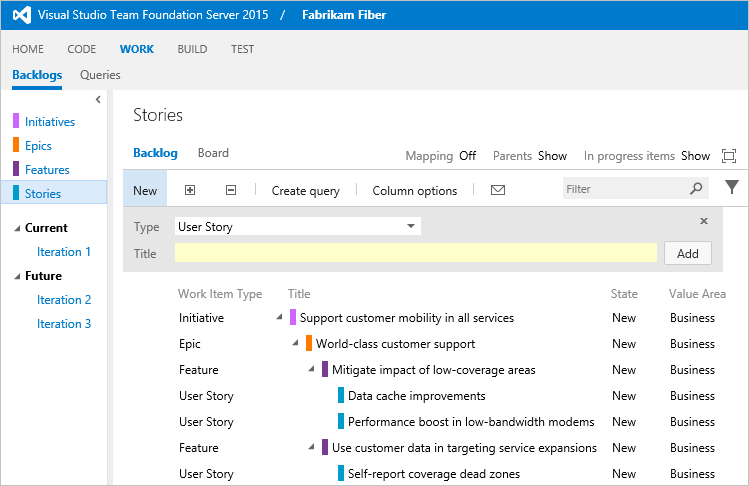
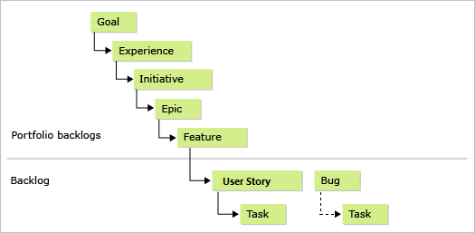

# Add a portfolio backlog level

<b>Team Services (Hosted XML) | TFS 2017 | TFS 2015 | TFS 2013</b> 

>[!IMPORTANT]  
>This topic applies to team project customization for Hosted XML and On-premises XML process models. For the Inheritance process model, see [Customize your backlogs or boards for a process](../process/customize-process.md). 
>
>For an overview of process models, see [Customize your work tracking experience](../customize/customize-work.md).  

Portfolio backlogs are useful for organizing your backlog under business initiatives. When you [organize your backlogs into portfolios](../backlogs/organize-backlog.md), you can gain a hierarchical view of the work defined in lower-level backlogs, including work in progress across several teams. Program managers can track the status of those backlog items of interest and drill down to ensure that all work is represented.  

Your team project comes equipped with two portfolio backlogs: Features and Epics. However, if you need one or more additional portfolio backlogs, you can add them.  

>[!NOTE]  
>If you haven't yet enabled the Portfolio Backlogs feature for your on-premises TFS, [do that first](configure-features-after-upgrade.md).  

Here, we add a third portfolio backlog, Initiative. With it, the management team can set priorities and view progress of work belonging to initiatives.  

<a id="image-diff"></a>  

>[!NOTE]  
>The images you see from your web portal may differ from the images you see in this topic. These differences result from updates made to your on-premises TFS, and the process template chosen when creating your team project&mdash;[Agile](/team-services/work/guidance/agile-process), [Scrum](/team-services/work/guidance/scrum-process), or [CMMI](/team-services/work/guidance/cmmi-process). However, the basic functionality available to you remains the same unless explicitly mentioned. 




You can add up to five levels of portfolio backlogs. And, each team can [choose which  backlogs appear for them to work on](../customize/select-backlog-navigation-levels.md).

<a id="overview">  </a>
##Process overview

The process to add another portfolio backlog differs slightly depending on the [process model](customize-work.md) you use.   
- For **Hosted XML**: You'll first export your process, add or update definition files, and then import that process to either update existing team projects or use it to create a team project.  
- For **On-premises XML**: You'll first export your work tracking definition files, update them, and then import them to your team project.  

This topic walks you through adding a portfolio backlog to a team project based on the [Agile process](../guidance/agile-process.md) in these five steps: 
1.	[Export the files you need](#export-files)
2.	[Create the Initiative work item type](#create-initiative)
3.	[Update Categories with the Initiative Category](#update-categories)
4.	[Update ProcessConfiguration to add the Initiative portfolio backlog](#update-processconfig)
5.	[Update your team project and verify your changes](#update-team-project)  

You can apply the same steps if you work with a team project based on the [Scrum](../guidance/scrum-process.md) or [CMMI](../guidance/cmmi-process.md) process. When you're done, you'll get to manage your portfolio of projects by grouping work within these four levels: User Stories (or Product backlog items or Requirements), Features, Epics, and Initiatives.   
 
For an overview of the three system processes, see [Choose a process](../guidance/choose-process.md). For an overview of the three process models, see [Customize your work tracking experience](customize-work.md). 

<a id="export-files">  </a>
##1. Export the files you need
<ol>

<li>If you aren't the account owner or a member of the Project Collection Administrator's group, [get added as an administrator](../../setup-admin/add-administrator-tfs.md). You need these permissions to customize the team project.</li>   
<li>Get the files you need: 
<ul>
<li>For **Hosted XML**: [Export the process you want to update](../import-process/import-process.md)<br/>
Save the files to a folder that you'll use to update these files and folders: Categories, ProcessConfiguration, and WorkItemTypes</li> 
<li> For **On-premises XML**: <br/>
<ul>
<li> If you haven't done so yet, update your team project to [enable the latest features](configure-features-after-upgrade.md)  </li> 
<li> [Export the definition files you'll need](#import-export): Epic, Categories, and ProcessConfiguration </li> 
</ul> 
</li>
</ul>
</li>
</ol>


<a id="create-initiative">  </a>
##2. Create a work item type named Initiative

The easiest way to create a work item type (WIT) is to copy an existing one, rename it, and edit it to support your requirements. In this example, we copy the Epic WIT and label it Initiative.  

<ol>
<li>Copy the ```Epic``` WIT definition to an XML file labeled ```Initiative```. (The Epic.xml file is located in the WorkItem Tracking folder of the ProcessTemplate folder.)</li>

<li>Edit the file named ```Initiative```. <br/> 
<ol type="a">
<li>Rename the WIT. Replace ```WORKITEMTYPE name="Epic"``` with ```WORKITEMTYPE name="Initiative"```, and update the description.<br/>
```<WORKITEMTYPE name="Initiative" >```  <br/>
&nbsp;&nbsp;&nbsp;```<DESCRIPTION>Initiatives help program managers to effectively manage and organize work across several teams >```  <br/>
&nbsp;&nbsp;&nbsp;```</DESCRIPTION>``` <br/> 
```. . . ```  <br/>
```</WORKITEMTYPE>```  <br/>
</li>
<li>Add any [custom fields that you want to track](add-modify-field.md) using this WIT. </li>
<li>Rename the ```Tab``` section named ```Features``` to ```Epics``` and replace ```Filter WorkItemType="Feature" ``` with ```Filter WorkItemType="Epic" ```. <br/>
```<Tab Label="Epics">```<br/>
```<Control Type="LinksControl" Name="Hierarchy">```<br/>
&nbsp;&nbsp;&nbsp;```<LinksControlOptions>```<br/>
&nbsp;&nbsp;&nbsp;```<WorkItemLinkFilters FilterType="include">```<br/>
&nbsp;&nbsp;&nbsp;```<Filter LinkType="System.LinkTypes.Hierarchy" />```<br/>
&nbsp;&nbsp;&nbsp;```</WorkItemLinkFilters>```<br/>
&nbsp;&nbsp;&nbsp;```<WorkItemTypeFilters FilterType="include">```<br/>
&nbsp;&nbsp;&nbsp;&nbsp;&nbsp;&nbsp;```<Filter WorkItemType="Epic" />```<br/>
&nbsp;&nbsp;&nbsp;```</WorkItemTypeFilters>```<br/>
&nbsp;&nbsp;&nbsp;&nbsp;&nbsp;&nbsp;```<ExternalLinkFilters FilterType="excludeAll" />```<br/>
&nbsp;&nbsp;&nbsp;&nbsp;&nbsp;&nbsp;```<LinkColumns>```<br/>
&nbsp;&nbsp;&nbsp;&nbsp;&nbsp;&nbsp;&nbsp;&nbsp;&nbsp;&nbsp;```      <LinkColumn RefName="System.ID" />```<br/>
&nbsp;&nbsp;&nbsp;&nbsp;&nbsp;&nbsp;&nbsp;&nbsp;&nbsp;&nbsp;```      <LinkColumn RefName="System.Title" />```<br/>
&nbsp;&nbsp;&nbsp;&nbsp;&nbsp;&nbsp;&nbsp;&nbsp;&nbsp;&nbsp;```      <LinkColumn RefName="System.AssignedTo" />```<br/>
&nbsp;&nbsp;&nbsp;&nbsp;&nbsp;&nbsp;&nbsp;&nbsp;&nbsp;&nbsp;```      <LinkColumn RefName="System.State" />```<br/>
&nbsp;&nbsp;&nbsp;&nbsp;&nbsp;&nbsp;&nbsp;&nbsp;&nbsp;&nbsp;```      <LinkColumn LinkAttribute="System.Links.Comment" />```<br/>
&nbsp;&nbsp;&nbsp;&nbsp;&nbsp;&nbsp;&nbsp;&nbsp;&nbsp;&nbsp;```</LinkColumns>```<br/>
&nbsp;&nbsp;&nbsp;```</LinksControlOptions>```<br/>
```</Control>```<br/>
```</Tab>```<br/>
<p>With this change, you cause the tab control to exclusively show or link to epics as child work items of the initiative.  </p>
</li>
</ol>
</li>
</ol>


<a id="update-categories">  </a>
##3. Update Categories with the Initiative Category 
Now, add the Initiative Category. This adds the Initiative backlog to process configuration. The agile experience manages WITs according to categories.    

Add the Initiative Category to the Categories.xml file. (The Categories.xml file is located in the WorkItem Tracking folder.)  
	
```  
  <CATEGORY name="Initiative Category" refname="FabrikamFiber.InitiativeCategory">  
    <DEFAULTWORKITEMTYPE name="Initiative" />  
  </CATEGORY>  
```  

You can add this category anywhere within the definition file. Since you are adding a custom category, label the category using your company name.  


<a id="update-processconfig">  </a>

##4. Update ProcessConfiguration to add the Initiative portfolio backlog  
In this last step, you add the Initiative portfolio backlog to the process and modify the Feature portfolio backlog to reflect the hierarchy between Initiatives and Features. The process configuration determines the parent-child relationships among the portfolio backlogs.  

1.	Edit the ProcessConfiguration file to add a new portfolio backlog within the ```PortfolioBacklogs``` section. (The ProcessConfiguration.xml file is located in the WorkItem Tracking/Processfolder of the ProcessTemplate folder.)

	Add the Initiative Category by adding the following syntax. Replace the names, workflow state values, and default column fields to match those that you use. 

	```
    <PortfolioBacklog category="FabrikamFiber.InitiativeCategory" pluralName="Initiatives" singularName="Initiative" workItemCountLimit="1000">
      <States>
        <State value="New" type="Proposed" />
        <State value="Active" type="InProgress" />
        <State value="Resolved" type="InProgress" />
        <State value="Closed" type="Complete" />
      </States>
      <Columns>
        <Column refname="System.WorkItemType" width="100" />
        <Column refname="System.Title" width="400" />
        <Column refname="System.State" width="100" />
        <Column refname="Microsoft.VSTS.Scheduling.Effort" width="50" />
        <Column refname="Microsoft.VSTS.Common.BusinessValue" width="50" />
        <Column refname="Microsoft.VSTS.Common.ValueArea" width="100" />
        <Column refname="System.Tags" width="200" />
      </Columns>
      <AddPanel>
        <Fields>
          <Field refname="System.Title" />
        </Fields>
      </AddPanel>
    </PortfolioBacklog>
	```

	If you have modified the workflow states, then verify that each work flow state is mapped to one of the metastates of ```Proposed```, ```InProgress```, and ```Complete```. The last state within the workflow must map to ```Complete```.

2.	Edit the ```PortfolioBacklog``` element for the Epic Category to point to ```Initiative``` as the parent backlog.  
	
	```
	<PortfolioBacklog category="Microsoft.EpicCategory" pluralName="Epics"  
	   singularName="Epic" parent="FabrikamFiber.InitiativeCategory"      
	   workItemCountLimit="1000">   
	   . . .  
	</PortfolioBacklog>
	```  

	Intermediate portfolio backlogs require specifying the parent category, which must be configured as a portfolio backlog.  

4.	Add the color to use for Initiative to the ```WorkItemColors``` section.  
	```
	    <WorkItemColor primary="FFCC66FF" secondary="FFF0D1FF" name="Initiative" />
	```

	This assigns a bright pink as the primary color to use in list displays, and a paler pink for the secondary color (currently not used).  


<a id="update-team-project">  </a>
##5. Update your team project and verify access to the new portfolio backlog  

1.	Update your team project: 
	- For **Hosted XML:**  [Import your process](../import-process/import-process.md).  
	- For **On-premises XML:**  [Import the definition files you updated](#import-export) in this order:  
		a. Initiative.xml  
		b. Categories.xml   
		c. ProcessConfiguration.xml   

2.	Open or refresh the web portal and confirm that Initiative appears as a portfolio backlog as expected. See [Organize your backlog](../backlogs/organize-backlog.md).  
3.	Grant [Advanced access](../connect/change-access-levels.md) to users who'll need to exercise all the features available with portfolio backlogs.  
	For **Hosted XML:**  See [Assign licenses to users](../../setup-admin/team-services/add-account-users-assign-access-levels-team-services.md).


<a id="import-export">  </a>
## Import and export definition files (on-premises TFS only) 

If you're updating a team project that connects to an on-premises TFS, you'll use the **witadmin** commands to import and export definition files. You need to export the following files: 
- Epic.xml
- Categories.xml (located in the WorkItem Tracking folder)
- ProcessConfiguration.xml (located in the WorkItem Tracking/Process folder)

[!INCLUDE [temp](../_shared/process-editor.md)]   

1. Open a Command Prompt window where either Visual Studio or Team Explorer is installed and enter:  

	```cd %programfiles(x86)%\Microsoft Visual Studio 14.0\Common7\IDE```  

	On a 32-bit edition of Windows, replace ```%programfiles(x86)%``` with ```%programfiles%```. The version of Visual Studio or Team Explorer must be at the same version as the on-premises TFS. 

2.	Enter the ```witadmin``` command, substituting your data for the arguments that are shown. For example, to import a WIT:   

	```witadmin importwitd /collection:CollectionURL /p:"ProjectName" /f:"DirectoryPath\WITDefinitionFile.xml"```

		For *CollectionURL* specify the URL of a team project collection and for *ProjectName* specify the name of a team project defined within the collection. You must specify the URL in the following format: ```http://ServerName:Port/VirtualDirectoryName/CollectionName```.  

		For *DirectoryPath*, specify the path to the ```WorkItem Tracking/TypeDefinitions``` folder that holds the process template that you downloaded. The directory path must follow this structure: ```Drive:\TemplateFolder\WorkItem Tracking\TypeDefinitions```.

	For  example,  import the ServiceApp WIT:

	```witadmin importwitd /collection:"http://MyServer:8080/tfs/DefaultCollection"/p:MyProject /f:"DirectoryPath/ServiceApp.xml"``` 

Use these commands to export and import categories and process configuration: 

	witadmin exportwitd /collection:CollectionURL /p:"ProjectName" /n:TypeName /f:"DirectoryPath\WITDefinitionFile.xml"

	witadmin importwitd /collection:CollectionURL /p:"ProjectName" /f:"DirectoryPath\WITDefinitionFile.xml"

	witadmin exportcategories /collection:"CollectionURL" /p:"ProjectName" /f:"DirectoryPath/categories.xml"

	witadmin importcategories /collection:"CollectionURL" /p:"ProjectName" /f:"DirectoryPath/categories.xml"

	witadmin exportprocessconfig /collection:"CollectionURL" /p:"ProjectName" /f:"DirectoryPath/ProcessConfiguration.xml"

	witadmin importprocessconfig /collection:"CollectionURL" /p:"ProjectName" /f:"DirectoryPath/ProcessConfiguration.xml"


##Related notes  
We've just shown how to add another portfolio backlog level. You can add up to five portfolio backlogs. This includes the default backlogs of Feature and Epic. In total, this provides you with seven levels from the top-level portfolio backlog to task.  



If you want to add another WIT to your backlogs or boards, see [work item types to backlogs and boards](add-wits-to-backlogs-and-boards.md). 

To learn more about the syntax for a definition file or command line tool, see these topics:  

- [All WITD XML elements reference](../reference/all-witd-xml-elements-reference.md)  
- [Categories XML element reference](../reference/categories-xml-element-reference.md)  
- [Process configuration XML element reference](../reference/process-configuration-xml-element.md)  
- [Import, export, and manage work item types](../reference/witadmin/witadmin-import-export-manage-wits.md)  
- [Import and export categories](../reference/witadmin/witadmin-import-export-categories.md)  
- [Import and export process configuration](../reference/witadmin/witadmin-import-export-process-configuration.md)  

Otherwise, see [Customize your work tracking experience](customize-work.md) to access other configuration and customization options available to you.  

If you have additional questions, see [Team Foundation Server - work tracking](http://social.msdn.microsoft.com/Forums/tfsworkitemtracking/threads) forum.  

###Portfolio backlog hierarchy

What controls the hierarchy among portfolio backlogs?  

The process configuration determines the hierarchy through the assignment of parent categories to portfolio backlog categories. Only parent-child relationships are supported. The upper-most category within the hierarchy doesn't contain a parent assignment.  

###Portfolio backlogs and WIT categories

Can I have more than one WIT defined in a category that I use for a portfolio backlog? 

Yes. For example, you can add Goal and Initiative WITs to a portfolio backlog category. The main restriction is to not add the same WIT to two different categories that are assigned to one of the following sections for process configuration: a ```PortfolioBacklog```, ```RequirementBacklog```, or ```TaskBacklog```.  

###Nesting of backlog items

**Can you nest backlog items in addition to using portfolio backlogs?**  

While you can nest backlog items, we don't recommend you do. We don't support drag-and-drop linking of nested backlog items. Instead, we support [mapping of backlog items to portfolio items](../backlogs/organize-backlog.md).  

For examples of how hierarchically linked items that belong to the Requirements Category appear on the backlogs and boards, see [Backlogs, boards, and plans - How backlogs and boards display hierarchical (nested) items](../backlogs-boards-plans.md#nested).

