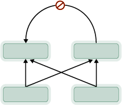
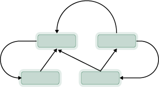
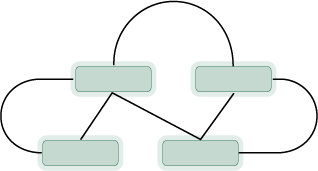
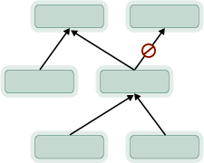

# LinkTypes elements reference 

[!INCLUDE [temp](../../_shared/version-vsts-tfs-all-versions.md)]

> [!IMPORTANT]  
>This topic provides a reference of link types defined for VSTS and TFS. For the On-premises XML process model, you can add custom link types. Custom link types are not supported for Hosted XML or Inheritance process models. For an overview of process models and supported cusomizations, see [Customize your work tracking experience](../customize-work.md).  

You use different link types to form link relationships between different work item types (WITs). There are three categories of link types: system-defined, process-defined, and user-defined or custom. The link types defined in the default processes support link relationships among the test management WITs.  
  
Each link type defines the link labels, topology type, and restrictions that are used when links between work items are constructed. For example, the parent-child link type defines two labels (Parent and Child), supports a hierarchical or tree topology, and prevents circular references from being created between work items.  
  
You can customize an existing link type or create a link type to meet your project tracking requirements. Before you start to add or modify a link type, you should assess the link types available and how they are used in your team project. See [Manage dependencies, link work items](../../track/link-work-items-support-traceability.md). Links are added through the work item form, which contains the links control. See [Link controls, restrictions, and fields](../../track/linking-attachments.md).  

> [!NOTE]  
>  You cannot customize the system-defined link types that correspond to the Related, Parent-Child, and Successor-Predecessor links.  
  
You may want to modify or create a link type for one of the following reasons:  
  
-   Change the link labels that are used to match your team's naming conventions.  
-   Add a link type to track a particular relationship that is unique to your team's process.  


The link type is specified in a type definition XML file that you import to a team project collection. To customize or create a link type, use **witadmin importlinktype** to import the link type definition file to the project collection that hosts your team project. With the **witadmin** command-line tool, you can deactivate, delete, export, import, list, and reactivate link types. See [Manage link types](witadmin/manage-link-types.md).   

<a name="SyntaxStructure"></a>   
##  Syntax structure  
You can define additional link types by adding them to the link types that are defined for a team project collection. 

You can define valid link types for use in your process based on the structure that the link type definition schema provides. A link type is defined by the following XML syntax in the link types XML file.  
  
> [!div class="tabbedCodeSnippets"]
```XML 
<LinkTypes>  
      <LinkType ReferenceName="LinkTypeName" ForwardName="ForwardName" ReverseName="ReverseName" Topology="TopologyType" />  
</LinkTypes>  
```  

The descriptions in the following table apply to the previous syntax:

|Attribute | Description |
|---|---|
|*ReferenceName*&#160;&#160;&#160;&#160;|Name of the link type. This name is used internally when you create a link between two work items.|
|*ForwardName*|Name of the link at the source work item. This name appears when you add links to the source work item.|
|*ReverseName*|Name of the link at the target work item. This name appears when a listing of the links at the target work item appears.|
|*TopologyType*|Specifies the **DirectedNetwork**, **Network**, **Tree**, or **Dependency** [topology](#topology). The first three topologies are directional, and you use them to define subordinate or sequential relationships. You use **Network** to define relationships between peers or where no implied subordination exists.|

Link directionality is determined by the assignments made to the **ForwardName** and **ReverseName** attributes. If you create a custom link and assign the same name to the forward and reverse names, you should set the link type to **Network** because it is the only non-directional topology.

<a name="Requirements"></a>
### Requirements

Each link type has a reference name and two optional friendly names, or name labels, which must be unique within the project collection. Each link type name must meet the following requirements:

-   Names can have up to 254 Unicode characters  
-   Names must not be empty  
-   Names cannot have leading or trailing white spaces  
-   Names cannot contain backslash (\\) characters  
-   Names cannot contain two consecutive white spaces.


<a id="link-types">  </a>
##Link types

Link types come in two flavors. Work item link types support creating relationships among work items. External link types support connecting a work item to an external object, such as a code object, build, or hyperlink.  You can't create a custom link type that links to an external (non-work item) object. 


<a id="work-link-types">  </a>
### Work item link types
Work item link types are system-defined, process-defined, or user-defined (custom). Most links are system defined. Each link type defines the link labels, topology type, and restrictions that are used when links between work items are constructed. For example, the parent-child link type defines two labels (Parent and Child), supports a hierarchical or tree topology, and prevents circular references from being created between work items.


  

The following table lists the work item link types you can specify within the **WorkItemLinksFilter** element.  

<table width="100%"> 
<tbody valign="top">
<tr>
<th width="16%">Link type</th>
<th width="35%">Reference name</th>
<th width="49%">Description</th>
</tr>


<tr>
<td>Affects<br/>Affected By</td>
<td><p>Microsoft.VSTS.Common.Affects.Forward<br/>
Microsoft.VSTS.Common.Affects.Reverse</p>
<p>Topology type: Dependency<br/>
Link category: Process-defined</p>
</td>
<td>Use to track change requests to requirements. (CMMI process)  
</tr>

<tr>
<td>Duplicate<br/>Duplicate Of <sup>1</sup></td>
<td><p>System.LinkTypes.Duplicate-Forward<br/>
System.LinkTypes.Duplicate-Reverse</p>
<p>Topology type: Tree<br/>
Link category: System-defined</p>
</td>
<td>Used to link duplicate work items.</td>
</tr>


<tr>
<td>Parent<br/>Child </td>
<td><p>System.LinkTypes.Hierarchy-Forward<br/>
System.LinkTypes.Hierarchy-Reverse</p>
<p>Topology type: Tree<br/>
Link category: System-defined</p></td>
<td>Use to organize work item within a hierarchy. You can quickly create this hierarchy among backlog items using the [mapping function](../../backlogs/organize-backlog.md) or among backlog items and tasks using the [sprint backlog](../../scrum/sprint-planning.md) or [task board](../../scrum/task-board.md).  
</td>
</tr>


<tr>
<td>References<br/>Referenced By</td>
<td><p>Microsoft.VSTS.TestCase.SharedParameterReferencedBy</p>
<p>Topology type: Dependency<br/>
Link category: Process-defined</p></td>
<td>Use to link Test Cases to Shared Parameters to support the ability to [repeat a test with different data](../../../manual-test/repeat-test-with-different-data.md). In general, you wouldn't add this link type to a scoped links control.   
</td>
</tr>


<tr>
<td>Related</td>
<td><p>System.LinkTypes.Related</p>
<p>Topology type: Network<br/>
Link category: System-defined</p></td>
<td>Use to link work items that are at the same level, such as two user stories that define features that overlap one another. The Related link type creates simple relationships with few restrictions.
</td>
</tr>
<tr>
<td>Successor<br/>Predecessor</td>
<td><p>System.LinkTypes.Dependency</p>
<p>Topology type: Dependency<br/>
Link category: System-defined</p></td>
<td>Use to track tasks that must be completed before others can be started. When you plan work using Project, linked tasks are represented as predecessor-successor links in TFS. 
</td>
</tr>

<tr>
<td>Tested By<br/>Tests</td>
<td><p>Microsoft.VSTS.Common.TestedBy-Forward<br/>
Microsoft.VSTS.Common.TestedBy-Reverse</p>
<p>Topology type: Dependency<br/>
Link category: Process-defined</p></td>
<td>Use to track test cases that test user stories (Agile), product backlog items (Scrum), or requirements (CMMI). Can also link to other work item types such as bugs, issues, or tasks. </td>
</tr>

<tr>
<td>Test Case<br/>Shared Steps</td>
<td><p>Microsoft.VSTS.TestCase.SharedStepReferencedBy</p>
<p>Topology type: Dependency<br/>
Link category: Process-defined</p></td>
<td>Use to link test cases with shared steps. You [share steps between test cases](../../../manual-test/mtm/share-steps-between-test-cases.md) to avoid having to create multiple entries of the same sequence of steps. </td>
</tr>

</tbody>
</table>

Notes:
1. Available only from VSTS and TFS 2017 and later versions. 

<a id="test-plan-links">  </a>
### Test plan and test suite links 

What link type is used to link test cases to test suites and test suites to test plans?

Test related link types link test case management work items to one another, or to other work items. From the web portal or Microsoft Test Manager, you can view which test cases are defined for a test suite, and which test suites are defined for a test plan. However, these objects aren't linked to each other through link types.

 


<a id="external-link-types">  </a>
### External link types
               
External link types are all system-defined and support linking work items to other objects as shown in the following image. 

  


The following table describes the external link types you can specify to scope a links control using the **ExternalLinksFilter** element. 


<table width="100%"> 
<tbody valign="top">
<tr>
<th width="25%">External link type</th>
<th width="75%">Description</th>

</tr>


<tr>
<td>Branch</td>
<td>Used to link a work item to a branch.</td>
</tr>

<tr>
<td>Build</td>
<td>Used to link a work item to a build.</td>
</tr>

<tr>
<td>Fixed in Changeset</td>
<td>Used to link a work item to a changeset. </td>
</tr>

<tr>
<td>Fixed in Commit</td>
<td>Used to link a work item to a commit.</td>
</tr>

<tr>
<td>Hyperlink</td>
<td>Used to link a work item to a URL. Note that **Workitem Hyperlink** is the name of this link type in the [Artifact Link Types API](https://docs.microsoft.com/rest/api/vsts/wit/artifact link types/list). </td>
</tr>

<tr>
<td>Pull Request</td>
<td>Used to link a work item to a pull request. </td>
</tr>

<tr>
<td>Model Link</td>
<td>(Not supported within the web portal) Used to link a work item to a diagram&mdash;such as an Activity, Component, Layer, Use Case, or other diagram&mdash;stored within the system. You can link diagrams to work items only from the Visual Studio client. </td>
</tr>

<tr>
<td>Result attachment   </td>
<td>Used to link a work item to an attachment associated with a test result. These links appear when you associate a work item with a test result from the Test hub or Microsoft Test Manager. </td>
</tr>

<tr>
<td>Storyboard</td>
<td>Used to link a work item to a file on a network. See [Storyboard your ideas using PowerPoint](../../backlogs/office/storyboard-your-ideas-using-powerpoint.md#link-storyboard) for details.  </td>
</tr>

<tr>
<td>Tag</td>
<td>Used to link a work item to a tag that's been defined for a git commit or git repository. See [Work from the Git command prompt](../../../git/command-prompt.md) for more information. </td>
</tr>
<tr>
<td>Test Result </td>
<td>Used to link a work item to a test result. These links appear when you associate a work item with a test result from the Test hub or Microsoft Test Manager.    </td>
</tr>

<tr>
<td>Versioned item</td>
<td>Used to link a work item to a file or changeset defined within a TFVC repository. Note that **Source Code File** is the name of this link type in the [Artifact Link Types API](https://docs.microsoft.com/rest/api/vsts/wit/artifact link types/list).   </td>
</tr>
</tbody>
</table>

<a id="topology"></a>
### Link type topologies and restrictions 

The topology types described in the following table determine the restrictions placed on the usage of each link type.


<table width="100%"> 
<tbody valign="top">
<tr>
<th width="55%">Topology type</th>
<th width="45%">Illustration</th>

</tr>
<tr>
<td><p>**Dependency**: You can use dependency links to create relationships between work items that have directionality and to restrict circular relationships. The link name is different at the end points.</p><p>**Example usage**: Use a dependency link to record the features that must be completed to deliver a user requirement. You can't create a dependent link between two work items that are linked to the same work items via dependent links. </p></td>
<td> </td>
</tr>


<tr>
<td><p>**Directed Network**: You can use directed network links to create relationships between work items that indicate directionality. The link name is different at the end points. Circular relationships are allowed.</p>
<p>**Example usage**: Use a directed network link to record a relationship between two features that might share dependencies and which you want to distinguish from each other in some way.  </p></td>
<td></td>
</tr>

<tr>
<td><p>**Network**: You can use network links to create basic relationships between work items that are non-restrictive. The link is the same at both end points. Circular relationships are allowed.</p>
<p>**Example usage**: Use a network link, such as Related, to record a relationship between two features that might share dependencies.</p></td>
<td></td>
</tr>

<tr>
<td><p>**Tree**: You can use tree links to create hierarchical relationships among work items. Tree links support multi-level hierarchical views, have directionality, and restrict circular relationships. The link name is different at the end points. Tree links are the only type of link that is supported by the **Tree of Work Items** query. With Parent/Child links, you can't assign two parents to a child.</p>
<p>**Example usage**: Use a tree link to record tasks and subtasks from your team that must be completed to deliver a user story or backlog item. Or, [map backlog items to features, and features to epics](../../backlogs/organize-backlog.md). </p></td>
<td></td>
</tr>

</tbody>
</table>
 

<a id="custom-link-type"></a>
## Create a custom link type (TFS) 

> [!NOTE]    
>**Feature availability**: Creating a custom link type is only supported for the On-premises XML process model. You can't add custom link types when you use the Hosted XML process model.

To create a custom link type, define the link type XML definition file according to the syntax provided earlier in this topic, and then import it using  [**witadmin importlinktype**](witadmin/manage-link-types.md). Each process-defined link type is associated with an XML definition file. These files are defined in the ```WorkItem Tracking\LinkTypes``` folder of the [process set of files and folders](process-templates/customize-process.md). 

For example, the following syntax defines the Microsoft.VSTS.Common.TestedBy link type provided via the TestedBy.xml file:

> [!div class="tabbedCodeSnippets"]
```XML
<?xml version="1.0" encoding="utf-8"?>
<LinkTypes>
   <LinkType ReferenceName="Microsoft.VSTS.Common.TestedBy" ForwardName="Tested By" ReverseName="Tests" Topology="Dependency" />
</LinkTypes>
```

When you create or update a team project, the link type definitions defined for the reference process are imported into the project collection.


##Customize the links control 

In addition to defining link types, you can customize the work item type definition to accept or prohibit specific links based on link type. You use the `LinksControlOptions` element to define the options that control what links can be added to a work item and to which work item types. Also, you can specify the default columns that you want to appear for the list of links in a work item. For more information, see [Define link controls to restrict link relationships](define-link-controls.md).  

## Related articles  
-  [Link work items to track dependencies](../../track/link-work-items-support-traceability.md)    
-  [Customizing your work tracking experience](../customize-work.md)

To programmatically interact with link types, see [Artifact Link Types API](https://docs.microsoft.com/rest/api/vsts/wit/artifact link types/list).


### Test management links    
Using the web portal or Test Manager, you can view which test cases are defined for a test suite, and which test suites are defined for a test plan. However, these objects aren't linked to each other through link types.  

 
  
