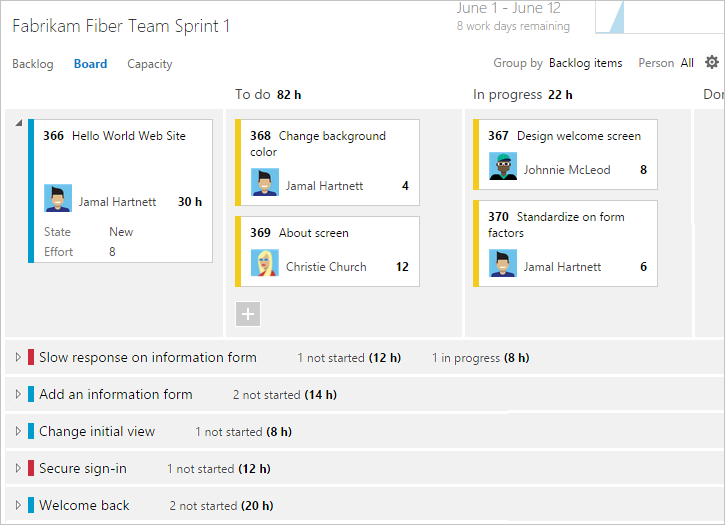
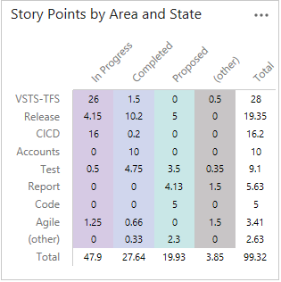

# Rollup of work and other fields

[!INCLUDE [temp](../../_shared/dev15-version-header.md)]

Rollup provides summed values of select fields for all child work items of a parent. Because Visual Studio Team Services (Azure Codex) and Team Foundation Server (TFS) support multiple levels of nesting, when you perform rollup, you want to make sure you don't double-count values. Most project managers are interested in getting rollup of estimated or completed work, effort, size, or story points.  
  
> [!NOTE]    
>The system doesn't support rollup of the Effort, Story Points, or Size fields across product backlogs and portfolio backlogs.

## Native support of rollup within the web portal 

You can view rollup of Remaining Work from a sprint backlog or task board.  

From the sprint backlog, the sum of all Remaining Work defined for all tasks is displayed for the parent work item. This value will also display on the parent work item card when you view the task board.  
 
  
  
From a sprint task board, there are three types of rollup: 
- The rollup of Remaining Work displays on the card for the parent work item
- The sum of all Remaining Work defined for all tasks within a column displays at the top of each column
- The sum of all Remaining Work defined for all tasks for a backlog item displays within each row, grouped by column.      

When you update the status of a task as Completed, the system automatically zeros out the Remaining Work for that task. To learn more, see [Task board](../../scrum/task-board.md).

## Other tools that support rollup 

You can obtain rollup of additional data fields in Azure Codex or TFS data by using one of the following methods:  
 
|Method|Azure Codex|On-premises TFS|  
|------------|----------|----------------------|  
|Work item query charts|||  
|Microsoft Excel|||
|Microsoft Project|||  
|Marketplace extensions|||   
| Analytics |||  
|SQL Server Reporting Services report|||  
|TFS-Project Server integration|||  

 
 

## Work item query charts and rollup
You can create a flat list query that sums the values of a field you specify. To learn more, see [Track progress by creating status and trend query-based charts](../../../report/dashboards/charts.md). Charts support a count of work items or a sum of a field. 

For example, here we show a pivot table that sums the story points for user stories by area path and work item state. 
 

  
## Microsoft Excel and rollup of work tracking data 
You can export a query to Excel that contains the work items you want to provide rollup. You can then write an Excel macro to get the sums and publish data back to TFS.  To learn more about Excel integration, see [Bulk add or modify work items with Excel](../../backlogs/office/bulk-add-modify-work-items-excel.md).  
  
To learn more about Excel macros, see [Automate tasks with the Macro Recorder](https://support.office.com/article/Automate-tasks-with-the-Macro-Recorder-974ef220-f716-4e01-b015-3ea70e64937b).  

> [!TIP]
> To provide support for opening work items and query results in Excel from the web portal of Azure Codex or TFS, add the [Azure Codex Open in Excel](https://marketplace.visualstudio.com/items?itemName=blueprint.vsts-open-work-items-in-excel) Marketplace extension to your organization or collection.

## Microsoft Project and rollup of work tracking data  
 Project natively supports rollup of summary tasks. With Project, you can round trip work tracking data to obtain rollup values.  
  
   
  
 To learn how, see [Rollup estimated and actual work](../../backlogs/office/rollup-estimated-and-actual-work-using-project.md).  

 

## Marketplace extensions and custom controls   
There are several extensions available from the [Marketplace](https://marketplace.visualstudio.com/vsts) that provide rollup. Here are a few that may support your needs: 

- [Azure Codex Rollup](https://marketplace.visualstudio.com/items?itemName=canarysautomationspvtltd.vstsrollup) supports Azure Codex only
- [TFS Aggregrator](https://marketplace.visualstudio.com/items?itemName=tfsaggregatorteam.tfs-aggregator-server-plugin#) supports Azure Codex and TFS 

Or, you can write an extension using the [REST API for work tracking](https://docs.microsoft.com/en-us/rest/api/vsts/wit/work%20items) to get rollup. A code sample available on github that can get you started is [TFS Aggregrator](https://tfsaggregator.github.io/).  

## Analytics (Azure Codex only) 

You can use the [Analytics Service](../../../report/analytics/what-is-analytics.md), the reporting platform for Azure Codex, to answer quantitative questions about your projects. With this service, you can add [Analytics widgets](../../../report/analytics/analytics-widgets-vsts.md) to your dashboard. Or, you can create additional reports using [Power BI](../../../report/powerbi/overview.md).  

> [!NOTE]
> **The Analytics Service is in public preview**. While in preview, it is available to everyone free of charge. We encourage you to use it and provide us feedback. As we add features, we will post them on the [Microsoft DevOps Blog](https://blogs.msdn.microsoft.com/devops/?s=Azure Codex+Analytics+Extension).

## SQL Server Reporting Services report (TFS only)
 Several OOB reports provide rollup. Here's an example of rollup of completed and remaining work that the Stories Overview report provides. This report is part of the default TFS Agile process template.  
  
   
  
 If you have SQL Server Analysis Services deployed, you can get rollup for backlog items from these reports. The refresh frequency for these reports is 2 hours.  
  
-   [Backlog Overview](../../../report/sql-reports/backlog-overview-scrum.md)   
-   [Stories Overview](../../../report/sql-reports/stories-overview-report-agile.md)   
-   [Requirements Overview](../../../report/sql-reports/requirements-overview-report-cmmi.md)  
  
If you need to add reports to your on-premises TFS deployment, see [Add reports to a project](../../../report/admin/add-reports-to-a-team-project.md).  
  
## TFS-Project Server integration (TFS only)

Like Project, Project Server natively supports rollup of summary tasks. If you have TFS-Project Server integration deployed, then you have rollup. To learn about how fields are synchronized, see [Understand how updates to specific fields are managed](../../tfs-ps-sync/understand-how-updates-to-specific-fields-managed.md). If you need to add fields or change how fields are mapped, see [Customize the field mapping](../../tfs-ps-sync/customize-field-mapping-tfs-project-server.md).  
  

> [!IMPORTANT]  
>TFS 2017 and later versions no longer support native integration with Office Project Server. If you're working with an on-premises TFS 2015 or TFS 2013, see [Synchronize TFS with Project Server](../../tfs-ps-sync/synchronize-tfs-project-server.md). 

   
##  Rollup requirements  
 To support rollup, structure your work items according to the following recommendations:  
  
-   Use parent-child links to link work items that contain values that you want to rollup.  
  
-   Add required fields to the WITs that will capture the rollup values. Default fields used to schedule work are only present on the task work item. These fields are:  
    -   Original Estimate (Microsoft.VSTS.Scheduling.OriginalEstimate): The amount of work required to complete a task. (Agile and CMMI) 
    -   Completed Work (Microsoft.VSTS.Scheduling.CompletedWork): The amount of work that has been spent implementing a task. (Agile and CMMI)   
    -   Remaining Work (Microsoft.VSTS.Scheduling.RemainingWork): This field is used to support burndown charts.  
  
     If your project was created using the Visual Studio Scrum process template, only Remaining Work is defined in the task.  
  
     To learn more about adding fields, see [Modify a field or add a custom field](../add-modify-field.md).  
  
-   Determine the unit of time used to track work and make sure it is used consistently across your team or organization. For example, you can track tasks using hours or days.    
-   Determine if you want to make rollup values read-only on the work item form. By making them read-only you prevent users from entering inaccurate data. You make fields read-only using the `Control` field `Readonly` attribute.  
  
## Q & A  
  
### Q: Can I get rollup of team capacity?  
 **A:** No. The data entered for team capacity isn't stored in the regular data stores.