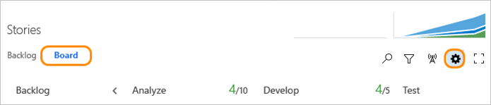

# Reorder cards  
<b>VSTS | TFS 2018 | TFS 2017 | TFS 2015</b> 

::: moniker range="tfs-2013"
> [!NOTE]   
> Reordering cards is not a supported feature in TFS 2013. Consider upgrading to TFS 2015.1 or later version. 
::: moniker-end

<!---
> [!NOTE]  
> **Feature availability:** This feature is supported from VSTS or an on-premises TFS 2015.1 or later version.  
> 
--> 

::: moniker range="vsts"
You can drag any work item to any column or swimlane on the Kanban board. You can even change the order of items as you move a card to a new column. 

::: moniker-end

::: moniker range=">= tfs-2015 <= tfs-2018"
You can drag any work item to any column or swimlane on the Kanban board. You can even change the order of items as you move a card to a new column. (Requires TFS 2015.1 or later version.)  

::: moniker-end

::: moniker range="vsts || >= tfs-2015 <= tfs-2018"
> [!TIP]
> You can drag-and-drop work items onto a sprint from any backlog or board. To add sprints to a team backlog, see [Set team defaults](../scale/set-team-defaults.md). 

::: moniker-end

::: moniker range="vsts"
## Set card reordering team preference  

If you want to preserve the backlog priority when you move a card to a new column, you can change the Kanban board card reordering setting for your team. 

1. To open, click the  gear icon from your team's Kanban board.  

	  

	If you're not a team admin, [get added as one](../scale/add-team-administrator.md). Only team and project admins can set team settings.  

2. From the Card reordering page you can choose between the two supported behaviors.    
	   

	The setting you choose applies to all active Kanban boards for your team.  
::: moniker-end

::: moniker range=">= tfs-2015 <= tfs-2018"

## Set card reordering team preference  

If you want to preserve the backlog priority when you move a card to a new column, you can change the Kanban board card reordering setting for your team. (Requires TFS 2015.2 or later version.)

1. To open, click the  gear icon from your team's Kanban board.  

	  

	If you're not a team admin, [get added as one](../scale/add-team-administrator.md). Only team and project admins can set team settings.  

2. From the Card reordering page you can choose between the two supported behaviors.    
	   

	The setting you choose applies to all active Kanban boards for your team.  
::: moniker-end

::: moniker range="vsts || >= tfs-2015 <= tfs-2018"
> [!NOTE]  
> The last column, typically the Closed or Done column, is always ordered by Closed Date with recently Closed showing at the top. In all other columns, cards are ordered by the backlog order or they are reorder based on the Card reordering setting selected.  
::: moniker-end

