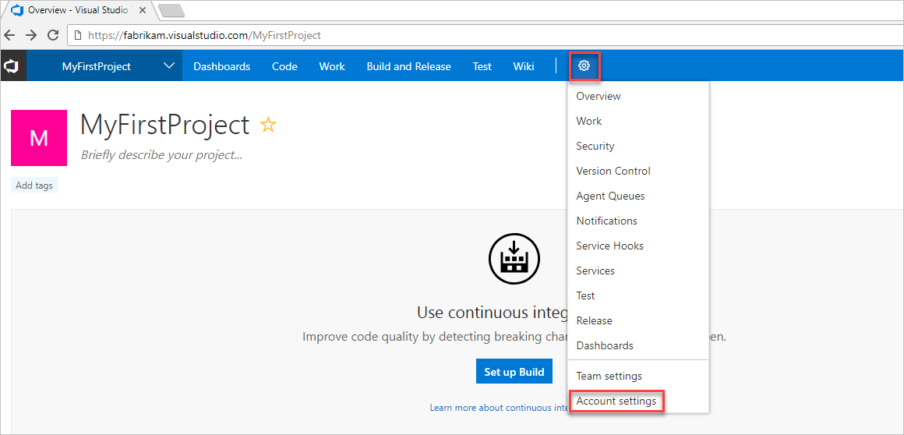
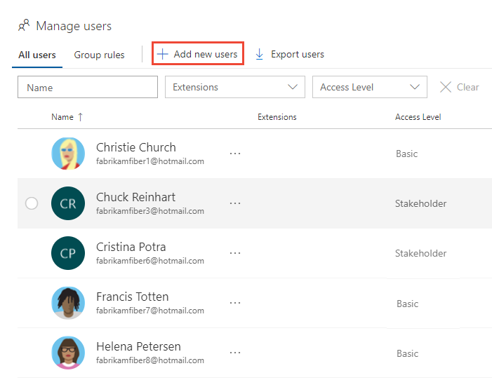

# Sign up for free and invite others to collaborate on your project
 
Sign up for an Azure DevOps organization and Azure Boards to being planning and tracking work. 

<a name="MicrosoftAccount"></a>

## Sign up with a personal Microsoft account

0.	Right-click the sign-up link, [Azure DevOps](https://go.microsoft.com/fwlink/?LinkId=307137&clcid=0x409), and enter 
your email address for your Microsoft account. 

	If you're a Visual Studio subscriber 
	and get Azure DevOps as a benefit, 
	use the Microsoft account associated with your subscription. 

	

0.	On the Microsoft account sign-in page, 
enter your email address for your Microsoft account. 
Then enter your password, and finish signing in.

	

	If you don't have a Microsoft account, 
	you can create a Microsoft account at this time. 

0.	Enter a name for your account. The name you enter cannot contain spaces or special characters (such as / \ [ ] : | < > + = ; ? or &#42;), cannot end in a period or comma, must be less than 256 characters, and must be unique within the Azure DevOps namespace. 

	To manage your code, choose Git or Team Foundation Version Control.

	

	Choose Git for distributed source control and TFVC for centralized source control. To learn more, review [Git](../../git/overview.md) 
	or [Team Foundation Version Control](../../tfvc/overview.md).

0.	(Optional) Click **Change details** to change default assignments. Otherwise, click **Continue** to confirm to initiate your account creation.

	

	To change default assignments, use this guidance:

	- **Project name**: You can specify your team project name. The name you enter cannot contain spaces or special characters (such as / : \ ~ & % ; @ ' " ? < > | # $ &#42; } { , + = [ ], cannot begin with an underscore or begin or end with a period, and must be 64 characters or less.
   - **Organize work using**: The default work tracking process is set to **Agile**. If you want to work with Scrum or CMMI processes, then select those now.  You can't change the process after the team project is created. (To learn more, see [Choose process](../../work/work-items/guidance/choose-process.md). 
   - **Host your projects in**: You can choose between [several locations for where you want your data hosted](https://www.microsoft.com/en-us/trustcenter/privacy/vsts-location).
 
	

0.	By default, Azure DevOps creates your first team project as "MyFirstProject". After Azure DevOps creates your account and team project, 
you can invite others to join your project, add code, start planning and tracking using work items, or rename your team project. 

	

	Congratulations, you're now a Azure DevOps organization owner! 

	To sign in to your account at any time, go to ```https://{youraccount}.visualstudio.com```.

<a id="invite-others" />

## Invite others to join your team 

You provide others access to your account by adding their email address. 

0. Choose , the gear Settings icon, and choose the **Account Settings** option
 
	

0. Then, click **Users** to open the Manage users page. Click **Add new users** to open the dialog. 

	

0. Fill out the form. 
 
	   

	- **Users**: Enter the email address (Microsoft account address) for the user account. You can add several email addresses by separating them with a semicolon (;). Note that the email addresses display in red when they are accepted.  
		> [!NOTE]   
		> You must add email addresses for 
		> ["personal" Microsoft accounts](https://www.microsoft.com/account) 
		> unless you plan to use [Azure Active Directory (Azure AD)](https://azure.microsoft.com/documentation/articles/active-directory-whatis/). 
		> to authenticates users and control account access.  
		> If your users don't have Microsoft accounts, 
		> have them [sign up](https://signup.live.com/).  
	- **Access level**: Leave the Access level at **Basic** for those users who will contribute to the code base. To learn more, see [About access levels](../../organizations/security/access-levels.md). 
	- **Add to projects**: Select the project that you named in the previous procedure. 
	- **Azure DevOps Groups**: Leave this entry at Project Contributors, the default security group for people who will contribute to your project. To learn more, see [Default permissions and access assignments](../../organizations/security/permissions-access.md). 

0. When done, choose **Add** to complete your invitation. 
