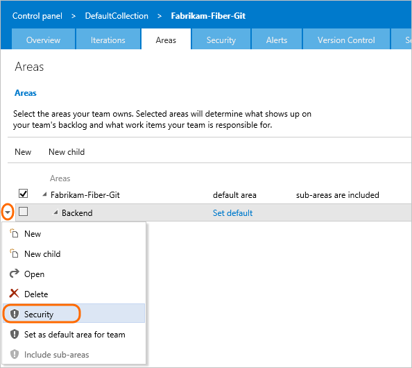
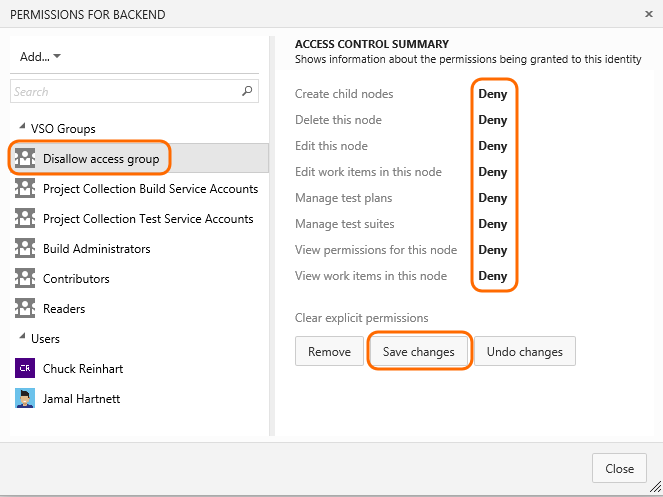

# Set permissions and access for work tracking   

<b>Team Services | TFS 2017 | TFS 2015 | TFS 2013</b> 

The team administrator role supports configuration of team settings. To be added as a team administrator, see [Configure team settings and add team administrators](../work/scale/manage-team-assets.md#add-team-admin). To learn more about stakeholder access, see [Work as a stakeholder](../work/connect/work-as-a-stakeholder.md).  

For an overview of work tracking features and functions, see [Agile tools](../work/overview.md).

<table>
<tr valign="bottom">
<th width="310px">Task</th>
<th>Stakeholders</th>
<th>Readers</th>
<th>Contributors</th>
<th>Team Admins</th>
<th width="16%">Account Owner/ Project Admins</th>
</tr>
<tbody valign="top" align="center">
<tr>
<td align="left">View work items, including bugs, requirements, and tasks</td>
<td></td>
<td></td>
<td></td>
<td></td>
<td></td>
</tr>

<tr>
<td align="left">Create and edit work items, follow a work item</td>
<td></td>
<td>  </td>
<td></td>
<td></td>
<td></td>
</tr>

<tr>
<td align="left">Change work item type </td>
<td></td>
<td>  </td>
<td></td>
<td></td>
<td></td>
</tr>

<tr>
<td align="left">Move or delete work items </td>
<td> </td>
<td>  </td>
<td></td>
<td></td>
<td></td>
</tr>

<tr>
<td align="left">Search and query work items, save work item queries
</td>
<td></td>
<td>Can't save queries</td>
<td></td>
<td></td>
<td></td>
</tr>

<tr>
<td align="left">View backlogs, boards, and plans
</td>
<td></td>
<td></td>
<td></td>
<td></td>
<td></td>
</tr>

<tr>
<td align="left">Provide feedback
</td>
<td></td>
<td></td>
<td></td>
<td></td>
<td></td>
</tr>

<tr>
<td align="left">Request feedback
</td>
<td> </td>
<td> </td>
<td></td>
<td></td>
<td></td>
</tr>

<tr>
<td align="left">Agile tools (Kanban boards, backlogs, sprint planning, portfolio management)
</td>
<td> limited interactions </td>
<td> view only</td>
<td></td>
<td></td>
<td></td>
</tr>

<tr>
<td align="left">Configure Agile tools, set team defaults 
</td>
<td> </td>
<td> </td>
<td> </td>
<td></td>
<td></td>
</tr>

<tr>
<td align="left">Create new work item tags</td>
<td>Can assign existing tags</td>
<td> </td>
<td></td>
<td></td>
<td></td>

</tr>

<tr>
<td align="left">View, add, and configure Delivery Plans</td>
<td> </td>
<td>view only</td>
<td></td>
<td></td>
<td></td>

</tr>

<tr>
<td align="left">Customize project information (area paths, iteration paths, and work tracking processes) 
</td>
<td>  </td>
<td> </td>
<td>  </td>
<td>  </td>
<td></td>
</tr>

</tbody>
</table>

 

## Set permissions to restrict access to work items   

Permissions placed on an area paths allows you to permit or restrict access to edit or modify work items, test cases, or test plans assigned to those areas. You can restrict access to users or groups. You can also set permissions for who can add or modify areas or iterations for the team project.  

1. Open the **Security** dialog for the node you want to manage.  

	

2. Select the group or team member, and then change the permission settings. For example, for the Disallow Access Group, deny the ability to view, modify, or edit work items in the FabrikamFiber area path.

	

	If the group or team member doesn't appear in the list, you can [**Add** it](../../setup-admin/add-users.md).  
	
You can specify two explicit authorization states for permissions: **Deny** and **Allow**. In addition, permissions can exist in one of three additional states.  

| Permission 		| Authorization |
| ----------------- | ------------- |
| Allow 			| Explicitly grants users to perform the task associated with the specific permission. For users to access a task, the associated permission must be set to **Allow** or **Inherited allow**. |
| Deny 				| Explicitly prevents users from performing the task associated with the specific permission. **Deny** takes precedence over **Allow**.  For exceptions to these rules, see [Permissions reference](../../setup-admin/permissions.md#inheritance)|
| Inherited allow/Inherited deny 	| Allows or denies a user to perform the task associated with the permission based on the permission set for a group to which the user belongs. |
| Not set         	| Implicitly prevents users from performing the action associated with the permission.  Because the permission is neither explicitly set to **Deny** nor explicitly set to **Allow**, authorization for that permission can be inherited from other groups of which the user or group is a member.  By default, most permissions are not set to either **Deny** or **Allow**, the permissions are left **Not set**.  |

For additional ways to restrict modifications to work items, see [Restrict who can create or modify a work item](../reference/apply-rule-work-item-field.md). 

## Test management permissions  

Area permissions for web-based test case management and test execution control access to the following actions. 

The **Manage test suites** permission enables users to:  
<ul style="padding-left:10px">
<li style="margin-bottom:2px">Create and modify test suites</li>
<li style="margin-bottom:2px">Add or remove test cases to/from test suites</li>
<li style="margin-bottom:2px">Change test configurations associated with test suites</li>
<li style="margin-bottom:2px">Modify the suite hierarchy by moving a test suite</li>
</ul>

The **Manage test plans** permission enables users to:  
<ul style="padding-left:30px">
<li style="margin-bottom:2px">Create and modify test plans </li>
<li style="margin-bottom:2px">Add or remove test suites to or from test plans</li>
<li style="margin-bottom:2px">Change test plan properties such as build and test settings</li>
</ul>

Additional test management permissions are assigned at the team project level and include the ability to create, delete, and view test runs, and manage test configurations and environments. See [Project, object, and test-level permissions](../../setup-admin/permissions.md#project_test).  

## Related notes 

*	[Add another team](../scale/multiple-teams.md)  
*	[Set team defaults](../scale/set-team-defaults.md)  
*	[Customize iteration paths](../customize/set-iteration-paths-sprints.md)  
*	[Customize area paths](../customize/set-area-paths.md)  
*	[Configure team settings and add team administrators](../scale/manage-team-assets.md)  
*	[Set permissions and access for work tracking](../how-to/set-permissions-access-work-tracking.md) 
*	[Query by area or iteration path ](../track/query-by-area-iteration-path.md)    
