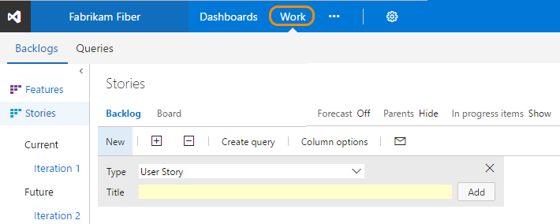

# Agile tools documentation 

<b>Team Services | TFS 2017 | TFS 2015 | TFS 2013</b> 

> [!NOTE]  
> Are you new to Agile? if so, [Learn more](https://www.visualstudio.com/agile) about how Agile and Team Services can help your team create great software.

As a project manager you can plan and track the work required to bring your applications from idea to completion. Agile tools provide you with the power, flexibility, and responsiveness you need to stay on top of changing priorities, deadlines, and requirements. 

To use these tools, you must be added to a group with the [appropriate permissions and access](how-to/set-permissions-access-work-tracking.md) and must be able to [connect to a team project](../connect/connect-team-projects.md). If you need to create a team project, you can do that either in the cloud with 
[Team Services](../setup-admin/team-services/connect-to-visual-studio-team-services.md), 
or by creating one on an [on-premises Team Foundation Server (TFS)](../setup-admin/tfs/install/get-started.md). 

Backlogs

- [Backlogs, boards, & plans](backlogs-boards-plans.md)  
- [Create your backlog](./backlogs/create-your-backlog.md)   
- [Add work items](./backlogs/add-work-items.md)    
- [Define features and epics](./backlogs/define-features-epics.md)   
- [Organize backlogs](./backlogs/organize-backlog.md)  
 
- [Integrate with Git](backlogs/connect-work-items-to-git-dev-ops.md)    
- [Bulk modify](./backlogs/bulk-modify-work-items.md)  
- [Work item templates](./productivity/work-item-template.md)  
- [Storyboarding](office/storyboard-your-ideas-using-powerpoint.md)  
- [Manage bugs](./backlogs/manage-bugs.md)  
- [Productivity tips](./productivity/productivity-tips.md)  

Scrum

- [What is Scrum?](https://www.visualstudio.com/learn/what-is-scrum/)  
- [Plan sprints](./scrum/sprint-planning.md)   
- [Schedule sprints](./scrum/define-sprints.md)  
- [Plan capacity](./scale/capacity-planning.md)  
- [Task board](./scrum/task-board.md)  
- [Sprint burndown](./scrum/sprint-burndown.md)  
- [Velocity & forecast](./scrum/velocity-and-forecasting.md)  
 
<i><u>Customize</u></i>   
- [Set team defaults](./scale/set-team-defaults.md)  
- [Customize cards](./customize/customize-cards.md)  

Kanban

- [Kanban basics](./kanban/kanban-basics.md)  
- [Task checklists](./kanban/add-task-checklists.md)  
- [Epics & features](./kanban/kanban-epics-features-stories.md)  
- [Filter Kanban board](./kanban/filter-kanban-board.md)  
- [Add inline tests](./kanban/add-run-update-tests.md)  
- [Cumulative flow](../report/guidance/cumulative-flow.md)  
  
<i><u>Customize</u></i>   
- [Add columns](./kanban/add-columns.md)  
- [WIP limits](./kanban/wip-limits.md)  
- [Split columns](./kanban/split-columns.md)  
- [Expedite work](./kanban/expedite-work.md)  
- [Definition of done](./kanban/definition-of-done.md)  
- [Customize cards](./customize/customize-cards.md)  
- [Card reordering](./customize/reorder-cards.md)  

Track

- [Queries overview](./track/example-queries.md)  
- [Adhoc vs managed queries](./track/adhoc-vs-managed-queries.md)  
- [Managed queries](./track/using-queries.md)  
- [Code search](../search/overview.md)  
- [Follow work](../collaborate/follow-work-items.md)  

   
- [Charts](../Report/charts.md)  
- [Dashboards](../Report/dashboards.md)  
- [Tags](./track/add-tags-to-work-items.md)  
- [Alerts](./track/alerts-and-notifications.md)  
- [History & audit](./track/history-and-auditing.md)  
- [Share work plans](track/share-plans.md)  

Scale

- [Agile culture](./scale/agile-culture.md)  
- [Add teams](./scale/multiple-teams.md)  
- [Set team defaults](./scale/set-team-defaults.md)  
- [Configure team settings](./scale/manage-team-assets.md)  
- [Manage portfolios](./scale/portfolio-management.md)  
- [Visibility across teams](./scale/visibility-across-teams.md)  

   

- [Scale Agile to large teams](https://www.visualstudio.com/learn/scale-agile-large-teams/)  
- [Delivery plans](./scale/review-team-plans.md)    
- [Scaled Agile Framework](./scale/scaled-agile-framework.md)   
- [Practices that scale](./scale/practices-that-scale.md)   

For an overview of all your customization options, see [Customize your work tracking experience](./customize/customize-work.md). 
 

Agile tools support the core Agile methods&mdash;Scrum and Kanban&mdash;used by software development teams today. Scrum tools support defining and managing work within sprints, setting capacity, and tracking tasks. Kanban tools allow you to manage a continuous flow of work via an interactive sign board.  

>[!NOTE]
>Working from the web portal, you have several backlogs and boards available to support planning and tracking work. For an overview of the features supported on each backlog and board, see [Backlogs, boards, and plans](backlogs-boards-plans.md). 

You access all Agile tools from the **Work** hub. If you're new to Agile, see [What is Agile?](https://www.visualstudio.com/learn/what-is-agile/) for an overview.

  

  
### Additional resources 

Team projects and process
 
- [Get started with Team Services](../overview.md)   
- [Choose a process](./guidance/choose-process.md)   
- Process guidance:  
	- [Agile](./guidance/agile-process.md)  
	- [Scrum](./guidance/scrum-process.md)  
	- [CMMI](./guidance/cmmi-process.md)  
- [Create a team project](../setup-admin/create-team-project.md)   
- [Connect to team projects](../connect/connect-team-projects.md)   
- [Work as a stakeholder (no client access license required)](../quickstart/get-started-stakeholder.md)      

Team Foundation clients and tools

- [Web portal](../connect/work-web-portal.md)   
- [Visual Studio/Team Explorer](../connect/work-team-explorer.md)     
- [Eclipse: Team Explorer Everywhere](http://java.visualstudio.com/Docs/tools/eclipse)    
- [Excel](./office/bulk-add-modify-work-items-excel.md)   
- [Project](./office/create-your-backlog-tasks-using-project.md)   
- [PowerPoint Storyboarding](./office/storyboard-your-ideas-using-powerpoint.md)    
- [Compatibility and Team Foundation clients](../setup-admin/requirements.md#client-compatibility)   
   

Reference

- [Index of work item fields](./guidance/work-item-field.md)   
- [Reportable field reference](reference/reportable-fields-reference.md)   
- [Technical reference](../reference/overview.md)   
- [Permissions reference](../setup-admin/permissions.md)     

