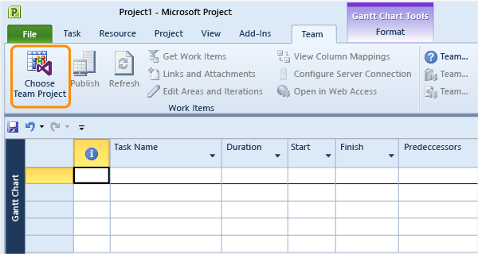
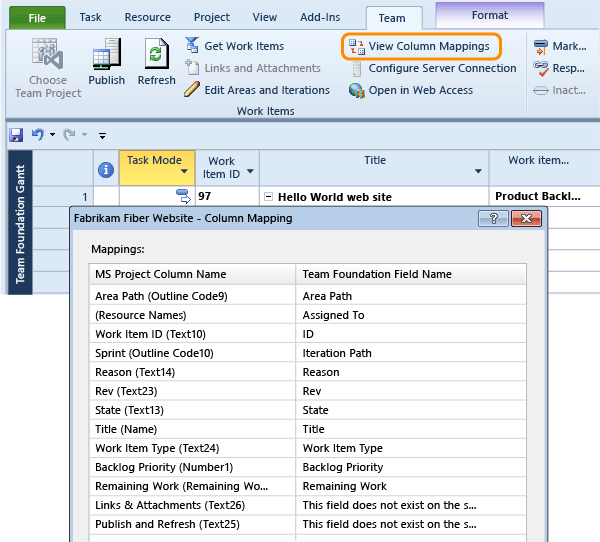

# Rollup estimated and actual work using Project
[!INCLUDE [temp](../_shared/dev15-version-header.md)]

Because Microsoft Project has a scheduling engine, it automatically will generate a rollup of summary tasks. Rollup provides summed values of select fields for all child work items of a parent.  
  
 There are a few items to be aware of, however, to make it work correctly. You may have to add fields to work item types (WITs) and update the Microsoft Project Mapping file. You can work in Project or TFS to structure the breakdown of work items and move seamlessly back and forth from each tool by publishing and refreshing data. After setting a baseline schedule in Project, you publish your rollup values to TFS.  
  
 With Project, you can rollup estimated, completed work or remaining work, and effort, size, or story points. By publishing the rollup values back to TFS, you can view them in work item forms, queries or on the backlog pages.  
  
   
  
 To learn about other methods that support rollup, see [Support rollup of work and other fields](../reference/support-rollup-of-work-and-other-fields.md).  
  
## Add fields to work item types  
 The following default fields used to schedule work are only present on the task work item.  
  
-   Original Estimate (Microsoft.VSTS.Scheduling.OriginalEstimate): The amount of work required to complete a task. (Agile and CMMI)  
  
-   Completed Work (Microsoft.VSTS.Scheduling.CompletedWork): The amount of work that has been spent implementing a task. (Agile and CMMI)  
  
-   Remaining Work (Microsoft.VSTS.Scheduling.RemainingWork): This field is used to support burndown charts.  
  
 If your team project was created using the Visual Studio Scrum process template, only Remaining Work is defined in the task.  
  
1.  Add required fields to the WITs that will capture the rollup values.  
  
     For example, to rollup Original Estimate or Completed Work for user stories, add the following fields to the WIT definition for user story:  
  
    ```  
    <FIELD name="Original Estimate" refname="Microsoft.VSTS.Scheduling.OriginalEstimate" type="Double" reportable="measure" formula="sum">  
       <HELPTEXT>Initial value for Remaining Work - set once, when work begins</HELPTEXT>  
    </FIELD>  
    <FIELD name="Completed Work" refname="Microsoft.VSTS.Scheduling.CompletedWork" type="Double" reportable="measure" formula="sum">  
        <HELPTEXT>The number of units of work that have been spent on this task</HELPTEXT>  
    </FIELD>  
    ```  
  
     To learn more about adding fields, see [Modify a field or add a custom field](../customize/add-modify-field.md).  
  
2.  Determine if you want to make rollup values read-only on the work item form.  
  
     By making them read-only you prevent users from introducing data inaccuracies into TFS. You make fields read-only using the `Control` field `Readonly` attribute.  
  
##  <a name="project"></a> Update the Microsoft Project Mapping file  
  
1.  Update the Microsoft Project Mapping file to contain the field mappings you need to support rollup. For details, see [Upload or download the Microsoft Project Mapping file](../reference/upload-or-download-the-microsoft-project-mapping-file.md).  
  
     Depending on the process template used to create your team project, some of these mappings may be there already. Here's an example of fields to include:  
  
    ```  
    <Mapping WorkItemTrackingFieldReferenceName=" Microsoft.VSTS.Scheduling.OriginalEstimate" ProjectField="pjTaskBaselineWork" ProjectUnits="pjHour" PublishOnly="false" IfSummaryRefreshOnly="false" />  
    <Mapping WorkItemTrackingFieldReferenceName=" Microsoft.VSTS.Scheduling.CompletedWork" ProjectField="pjTaskActualWork" ProjectUnits="pjHour" PublishOnly="false" IfSummaryRefreshOnly="false" />    
    <Mapping WorkItemTrackingFieldReferenceName="Microsoft.VSTS.Scheduling.RemainingWork" ProjectField="pjTaskRemainingWork" ProjectUnits="pjHour" PublishOnly="false" IfSummaryRefreshOnly="false" />      
    <Mapping WorkItemTrackingFieldReferenceName="Microsoft.VSTS.Scheduling.StartDate" ProjectField="pjTaskStart" PublishOnly="true" IfSummaryRefreshOnly="false" />      
    <Mapping WorkItemTrackingFieldReferenceName="Microsoft.VSTS.Scheduling.FinishDate" ProjectField="pjTaskFinish" PublishOnly="true" IfSummaryRefreshOnly="false" />  
    ```  
  
     Don't map Original Estimate or any other field to pjTaskDuration. This mapping is not supported.  
  
2.  If you want to map Effort, Story Points, or Size, use   a pjTaskNumber field, for example:  
  
    ```  
    <Mapping WorkItemTrackingFieldReferenceName="Microsoft.VSTS.Scheduling.StoryPoints" ProjectField="pjTaskNumber12" PublishOnly="false" IfSummaryRefreshOnly="false" />  
    ```  
  
3.  Assign `PublishOnly="false"` and `IfSummaryRefreshOnly="false"` in the mapping file so that the rollup summary values are published to the TFS database.  
  
##  <a name="requirements"></a> Structure your work items to support rollup  
  
1.  Link all work items that should support rollup using parent-child links.  For example, create tasks that link to user stories.  
  
     You can do this easily by [creating tasks from the task board](http://msdn.microsoft.com/en-us/f13e32ae-fe77-421a-b524-43b6bcd1a0f3), or you can [create your schedule in Project](create-your-backlog-tasks-using-project.md).  
  
2.  Determine the unit of time used to track work and make sure it is used consistently across your team or organization. For example, you can track tasks using hours or days.  
  
3.  Specify values for Original Estimate (Agile and CMMI only) and Remaining Work for each task.  
  
     If you work in Project, specify the Duration for each task.  
  
4.  If you want to roll up to a feature level, link user stories, or other backlog items, to features using parent-child links.  
  
     You can quickly link items [using the mapping pane](http://msdn.microsoft.com/en-us/658f5e1c-ccdd-48da-bd88-4637273c666d).  
  
## Create a query of the work items you want to rollup  
 If you've created your work items in Project, then you can proceed to creating your schedule in Project.  
  
 However, if you've created your work items in TFS, your next step is to create a tree query. By viewing backlog items to tasks, you can create the query from the backlog page.  
  
   
  
 For more information, about tree queries, see [Use the query editor to list and manage queries](http://msdn.microsoft.com/en-us/c9b6d41c-47ce-4a29-8a1c-ba44d8c4809a)  
  
## Create your schedule in Project  
  
1.  If you've created your work items in Project, then skip to step 2.  
  
     To get rollup of work items you've defined in TFS, open Project, connect to the team project, and open the query you created in the last procedure.  
  
       
  
     Project is now bound to your team project. The Team Foundation Gantt view supports entry and display of several TFS fields.  
  
     If you don't see the **Team** ribbon (or the **Team** menu if you use Project 2007) see [Create your backlog and tasks using Project](create-your-backlog-tasks-using-project.md). To get the Team Foundation add-in, you need to have Team Explorer installed if you don't have Visual Studio installed.  
  
2.  From the Schedule page (**File>Options>Schedule**) set those options that need to match with how you track work in TFS. For example, if you track work in hours, make sure that Project is set to track hours. To automate scheduling of tasks, choose **Auto Scheduled**.  
  
       
  
3.  Add columns to display fields that you need. For example, you might need to add columns to display Original Estimate and Completed Work. These TFS fields correspond to the Baseline Work and Actual Work fields in Project.  
  
     To see which TFS fields are mapped, open **Column Mappings**.  
  
       
  
4.  Enter your work estimates in the Duration column, not in the Baseline Work.  
  
## Set a baseline and publish changes and rollup values to TFS  
 When you use Microsoft Project to create parent and child tasks, it assigns parent or summary tasks the rollup of hours or days that are defined for all its child tasks.  
  
1.  When you have a schedule that meets your needs, set the Project Baseline to copy the values in the Duration field to the Original Estimate field.  
  
       
  
       
  
2.  To publish changes you make in Project to TFS, make sure that the **Publish and Refresh** field is set to Yes. Set this field to No if you create milestone tasks or other tasks that aren't work item related.  
  
3.  Publish your changes and rollup values to TFS.  
  
       
  
4.  As changes occur to the schedule, you can refresh your Project plan, clear and set a new baseline, and republish the rollup values.  
  
## Q & A  
  
### Q: Where can I learn more about customizing the Microsoft Project Field Mapping file?  
 **A:** See [Customize the Microsoft Project field mapping file](../reference/customize-project-field-mapping-file.md).  
  
### Q: What's the difference between manual and automated task scheduling?  
 **A:** By using Task Mode, which is accessed through the following Ribbon menu, you have more flexibility in the way you and team members schedule tasks.  
  
   
  
 By using manually scheduled tasks, which are indicated by the  icon, you can manually schedule the duration and the start and finish dates for a task. Team members can place a manually scheduled task anywhere in their schedules, and Project will not move it.  
  
 Start and finish dates for auto scheduled tasks () are determined by the scheduling engine based on task dependencies and the project calendar, as in previous releases of Project. Project managers who are accustomed to automatic scheduling with past versions of Project can turn the new manual scheduling feature off for specific tasks or the entire project.  
  
### Q: Can I get a rollup of team capacity?  
 **A:** No. The data entered for team capacity isn't stored in the regular data stores.