# About Agile tools and tracking work

<b>Team Services | TFS 2017 | TFS 2015 | TFS 2013</b> 

> [!NOTE]  
> Are you new to Agile? if so, [Learn more](https://www.visualstudio.com/agile) about how Agile and Team Services can help your team create great software.

As a project manager you can plan and track the work required to bring your applications from idea to completion. Agile tools provide you with the power, flexibility, and responsiveness you need to stay on top of changing priorities, deadlines, and requirements. 

To use these tools, you must be added to a group with the [appropriate permissions and access](../how-to/set-permissions-access-work-tracking.md) and must be able to [connect to a team project](../connect/connect-team-projects.md). If you need to create a team project, you can do that either in the cloud with 
[Team Services](../setup-admin/team-services/connect-to-visual-studio-team-services.md), 
or by creating one on an [on-premises Team Foundation Server (TFS)](../setup-admin/tfs/install/get-started.md). 

Backlogs

- [Backlogs, boards, & plans](backlogs-boards-plans.md)  
- [Create your backlog](./backlogs/create-your-backlog.md)   
- [Add work items](./backlogs/add-work-items.md)    
- [Define features and epics](./backlogs/define-features-epics.md)   
- [Organize backlogs](./backlogs/organize-backlog.md)  
 
- [Integrate with Git](backlogs/connect-work-items-to-git-dev-ops.md)    
- [Bulk modify](./backlogs/bulk-modify-work-items.md)  
- [Work item templates](./productivity/work-item-template.md)  
- [Storyboarding](office/storyboard-your-ideas-using-powerpoint.md)  
- [Manage bugs](./backlogs/manage-bugs.md)  
- [Productivity tips](./productivity/productivity-tips.md)  

Scrum

- [What is Scrum?](https://www.visualstudio.com/learn/what-is-scrum/)  
- [Plan sprints](./scrum/sprint-planning.md)   
- [Schedule sprints](./scrum/define-sprints.md)  
- [Plan capacity](./scale/capacity-planning.md)  
- [Task board](./scrum/task-board.md)  
- [Sprint burndown](./scrum/sprint-burndown.md)  
- [Velocity & forecast](./scrum/velocity-and-forecasting.md)  
 
<i><u>Customize</u></i>   
- [Set team defaults](./scale/set-team-defaults.md)  
- [Customize cards](./customize/customize-cards.md)  

Kanban

- [Kanban basics](./kanban/kanban-basics.md)  
- [Task checklists](./kanban/add-task-checklists.md)  
- [Epics & features](./kanban/kanban-epics-features-stories.md)  
- [Filter Kanban board](./kanban/filter-kanban-board.md)  
- [Add inline tests](./kanban/add-run-update-tests.md)  
- [Cumulative flow](../report/guidance/cumulative-flow.md)  
  
<i><u>Customize</u></i>   
- [Add columns](./kanban/add-columns.md)  
- [WIP limits](./kanban/wip-limits.md)  
- [Split columns](./kanban/split-columns.md)  
- [Expedite work](./kanban/expedite-work.md)  
- [Definition of done](./kanban/definition-of-done.md)  
- [Customize cards](./customize/customize-cards.md)  
- [Card reordering](./kanban/kanban-basics.md#card-reorder-setting)  

Track

- [Queries overview](./track/example-queries.md)  
- [Adhoc vs managed queries](./track/adhoc-vs-managed-queries.md)  
- [Managed queries](./track/using-queries.md)  
- [Code search](../search/overview.md)  
- [Follow work](../collaborate/follow-work-items.md)  

   
- [Charts](../Report/charts.md)  
- [Dashboards](../Report/dashboards.md)  
- [Tags](./track/add-tags-to-work-items.md)  
- [Alerts](./track/alerts-and-notifications.md)  
- [History & audit](./track/history-and-auditing.md)  
- [Share work plans](track/share-plans.md)  

Scale

- [Agile culture](./scale/agile-culture.md)  
- [Add teams](./scale/multiple-teams.md)  
- [Set team defaults](./scale/set-team-defaults.md)  
- [Configure team settings](./scale/manage-team-assets.md)  
- [Manage portfolios](./scale/portfolio-management.md)  
- [Visibility across teams](./scale/visibility-across-teams.md)  

   

- [Scale Agile to large teams](https://www.visualstudio.com/learn/scale-agile-large-teams/)  
- [Delivery plans](./scale/review-team-plans.md)    
- [Scaled Agile Framework](./scale/scaled-agile-framework.md)   
- [Practices that scale](./scale/practices-that-scale.md)   

For an overview of all your customization options, see [Customize your work tracking experience](./customize/customize-work.md). 
 

Agile tools support the core Agile methods&mdash;Scrum and Kanban&mdash;used by software development teams today. Scrum tools support defining and managing work within sprints, setting capacity, and tracking tasks. Kanban tools allow you to manage a continuous flow of work via an interactive sign board.  

>[!NOTE]
>Working from the web portal, you have several backlogs and boards available to support planning and tracking work. For an overview of the features supported on each backlog and board, see [Backlogs, boards, and plans](backlogs-boards-plans.md). 

You access all Agile tools from the **Work** hub. If you're new to Agile, see [What is Agile?](https://www.visualstudio.com/learn/what-is-agile/) for an overview.

  

## Agile project management basics 

You build your project plan by creating a backlog of work items that represent the features, requirements, user stories, or other work to perform.  Different types of work items help you track different types of work, such as user stories, tasks, bugs, issues, and more. 

[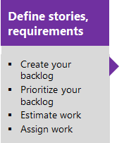](./backlogs/create-your-backlog.md)[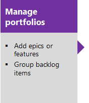](./backlogs/organize-backlog.md)[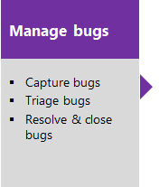](./backlogs/manage-bugs.md)[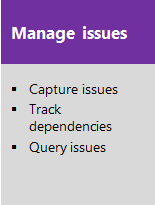](./backlogs/create-your-backlog.md#manage-impediments)

## Scrum method and tools 
The Scrum method uses sprints to plan work to perform by a team within a specific time period and cadence. To get started, several sprints are predefined for your team.  If you're new to Scrum, get an overview from [What is Scrum?](https://www.visualstudio.com/learn/what-is-scrum/). 

[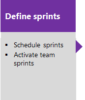](./scrum/define-sprints.md)[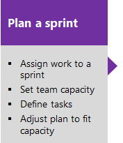](./scrum/sprint-planning.md)[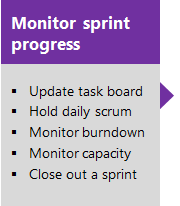](./scrum/task-board.md)[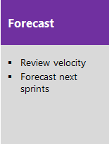](./scrum/velocity-and-forecasting.md)

## Kanban method and tools
Kanban uses a visual interactive board to plan and show progress using cards. Your Kanban board is fully customizable to support the workflow used by your team.  

[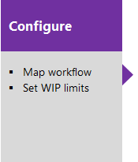](./kanban/kanban-basics.md)[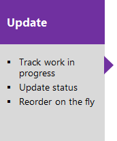](./kanban/kanban-basics.md)[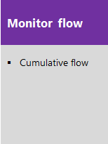](../Report/guidance/cumulative-flow.md)

You update the status of work by dragging card to another column on the Kanban board. You can even change the order of items as you move a card to a new column.   

## Scale: Manage work across the enterprise

How do you manage work across the enterprise using Agile tools?  How will you scale your Agile tools to support your growing enterprise?  

You can scale your system as needed by adding teams and/or team projects. These can be created within the single account or collection. As your organization grows, your tools can grow to support a [culture of team autonomy as well as organizational alignment](./scale/agile-culture.md). 

<table width="100%">
<tbody valign="top">
<tr>
<td width="40%">
**Single team project, team defined within an account/collection**  
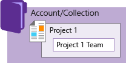  
</td>

<td width="60%">
**Multiple team projects and teams defined within an account/collection**   
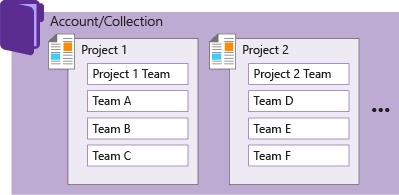  

</td>
</tr>
</tbody>
</table>
 

To learn more, see the following topics:  

- [Scale Agile to large teams](https://www.visualstudio.com/learn/scale-agile-large-teams/)
- [Add and structure teams](./scale/multiple-teams.md) and organize work to gain the best of both worlds: team autonomy and organizational alignment. Teams can manage their work independently of one another.  
- [Configure team settings and add team administrators](./scale/manage-team-assets.md). 
- Manage a [portfolio of backlogs](./scale/portfolio-management.md) and gain insight into each team's progress as well as the progress of all programs.  
	  
	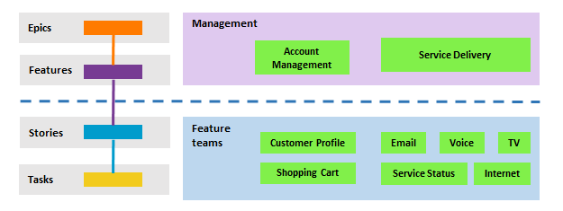

- Incrementally adopt [practices that scale](./scale/practices-that-scale.md) to create greater rhythm and flow within your organization, engage customers, improve project visibility, and develop a productive workforce.
- Structure team projects to gain [visibility across teams](./scale/visibility-across-teams.md) or to support [epics, release trains, and multiple backlogs to support the Scaled Agile Framework](./scale/scaled-agile-framework.md). 
- Use [Delivery plans](./scale/review-team-plans.md) to review the schedule of stories or features your teams plan to deliver. Delivery plans show the scheduled work items by sprint (iteration path) of selected teams against a calendar view. 

## Try this next  

Take these tools for a test run by [creating an account on Team Services for free](../setup-admin/team-services/sign-up-for-visual-studio-team-services.md).  

Once you've started tracking work, you'll want to monitor and track progress, identify trends, and share your plans. See [Get started monitoring progress and trends with Agile tools](../report/monitor-progress-trends.md). 

## Related notes

You access tools provided by Team Services and TFS by connecting from a client to the server, either in the cloud or on-premises. Some web portal tools require additional Visual Studio Subscriptions or Advanced/VS Enterprise access.  
- **Team Services**: [Add users and assign licenses in Visual Studio Team Services](../setup-admin/team-services/add-account-users-assign-access-levels-team-services.md)
- **TFS**: [Change access levels](./connect/change-access-levels.md)  

See the [Feature index](../alm-devops-features.md) for an end-to-end overview of all Team Services and TFS features.  

For an overview of all your customization options, see [Customize your work tracking experience](./customize/customize-work.md). 
  
### Additional resources:

Team projects and process
 
- [Get started with Team Services](../overview.md)   
- [Choose a process](./guidance/choose-process.md)   
- Process guidance:  
	- [Agile](./guidance/agile-process.md)  
	- [Scrum](./guidance/scrum-process.md)  
	- [CMMI](./guidance/cmmi-process.md)  
- [Create a team project](../setup-admin/create-team-project.md)   
- [Connect to team projects](../connect/connect-team-projects.md)   
- [Work as a stakeholder (no client access license required)](./connect/work-as-a-stakeholder.md)      

Team Foundation clients and tools

- [Web portal](../connect/work-web-portal.md)   
- [Visual Studio/Team Explorer](../connect/work-team-explorer.md)     
- [Eclipse: Team Explorer Everywhere](http://java.visualstudio.com/Docs/tools/eclipse)    
- [Excel](./office/bulk-add-modify-work-items-excel.md)   
- [Project](./office/create-your-backlog-tasks-using-project.md)   
- [PowerPoint Storyboarding](./office/storyboard-your-ideas-using-powerpoint.md)    
- [Compatibility and Team Foundation clients](../setup-admin/requirements.md#client-compatibility)   
   

Reference

- [Index of work item fields](./guidance/work-item-field.md)   
- [Reportable field reference](reference/reportable-fields-reference.md)   
- [Technical reference](../reference/overview.md)   
- [Permissions reference](../setup-admin/permissions.md)     

### Work across team projects 
  
If you work in Team Services or TFS 2017.1 or later version, you can use your account hub to view and quickly navigate to teams, team projects, branches, work items, pull requests and other objects that are relevant to you. For details, see [Work effectively from your account hub](../connect/account-home-pages.md).  

### Feedback and support  

We welcome your feedback. 

Send suggestions on **[UserVoice](https://visualstudio.uservoice.com/forums/330519-team-services)**, and follow us on **[Twitter](https://twitter.com/VSTeam) @VSTeam**. Or, tell us what you think with **Send-a-Smile** on the title bar ... . 

Or, see our [comprehensive feedback and support page](../provide-feedback.md).  

 