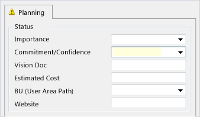

# Control the display of work item fields

<p><b>TFS 2017 (Hosted XML) | TFS 2015 </b></p>

>[!IMPORTANT]  
>This topic applies to team project customization for the On-premises XML process model. For the Hosted XML process model, see [WebLayout and Control elements](weblayout-xml-elements.md). For the Inheritance process model, see [Customize a process](../process/customize-process.md).  
>
>For an overview of process models, see [Customize your work tracking experience](../customize/customize-work.md).  

You can control the label name, position, size of text box, and other display controls of plain text, integer, number, date, and tree path work item fields on your work item form. To display these fields, you must specify the correct `Control` element `Type` attribute, from the following options:  
  
-   `DateTimeControl`: Used to display formatted date fields that have a field type of `DateTime`.  
  
-   `FieldControl`: Used to display plain textual or numeric fields and lists of values for fields that have a field type of `String`, `Identity`, `Integer`, `Double`, and `PlainText`.  
  
-   `HtmlFieldControl`: Used to display multiline, rich-text format of fields that have a field data type of `HTML`.  
  
-   `WorkItemClassificationControl` Used to display the hierarchical path fields that have a field type of `TreePath`.  
  
For more information about other `Type` controls, see the following topics:   
-   [Specify work item form controls](specify-work-item-form-controls.md)    
-   [Provide help text, hyperlinks, or web content](provide-help-text-hyperlinks-web-content-form.md)   
-   [Define link controls to restrict link relationships](define-link-controls.md)   
-   [Add the Attachments control](add-the-attachments-control.md)  
 

[!INCLUDE [temp](../_shared/update-xml-wit.md)] 
 
<a name="Size"></a> 
## Control the size and display of data fields  

You can control the spacing and size of each data field by using the optional attributes that are described in the following table.  
  
> [!NOTE]  
> The overall size of each data entry field is determined by several factors: the attributes that are assigned to the field, the size of the container, and the area that is allocated to other fields on the form. Default values are assigned to fields when you do not specify a minimum size. However, attributes that are assigned to other fields in the form can affect the size of fields. The number of columns and the horizontal size that you allocate to the largest field in each column determine the horizontal dimension of a form. The number of fields that you specify in a vertical group and the vertical size that you allocate to each field determine the size of the top of the form and also the size of the bottom of the form.  
  
|Attribute|Description|Pattern value example|  
|---------------|-----------------|---------------------------|  
|`MinimumSize`|Specifies the minimum size (*Width*, *Height)* for the control. When the container for the control is smaller than this size, horizontal and vertical scrollbars appear.|(100,100)|  
|`Margin`|Specifies in pixels the amount of space around the control and between the control and its neighbors (top, bottom, left, right).|(2,0,2,0)|  
|`Padding`|Specifies, in pixels, the amount of space around the outside border of the control (top, bottom, left, right).|(2,0,2,0)|  
  
##  <a name="Labeling"></a> Label fields and add fields in two places on the form  
 For each form control, you can specify an optional label and the position of the label by using the `Label` and `LabelPosition` attributes. The label can specify a different name than the friendly name that is assigned by the `FIELD` element. If you do not specify a label, the friendly name is used. However, note that the friendly name is always used when a team member runs a query to search for work items. The maximum label size is 80 characters.  
  
> [!NOTE]  
> You must define the same label position to all controls that are defined in the same group.  
  
If you want to add the field in more than one area of the form, such as on the top of the form and on a tab, you can do so by using the `Name` attribute. The `Name` attribute just identifies the control as distinct from the other control that is added to the form.  
  
<a name="ReadOnly"></a> 
## Make a field Read-Only  
You can mark a field as read-only in one of two ways. In the first method, you add the `READONLY` element as a child to the `FIELD` element in the `FIELDS` section of the type definition. By using the `READONLY` element, you can specify whether certain users can modify the field. As shown in the following example, only program managers can modify a Sub-Title field.  
  
```  
<FIELD name="Sub-Title" refname="ACME.ACE.SubTitle" type="String" >  
<READONLY for="[Global]\Team Foundation Valid Users" not="Program Managers"/>  
</FIELD>  
  
```  
 
In the second method, you specify the `ReadOnly` attribute for the `CONTROL` element. In this method, all users are restricted from modifying the field.  
  
```  
Control FieldName=" ACME.ACE.SubTitle" Type="FieldControl" Label="Sub-Title" LabelPosition="Left" ReadOnly="True" />  
  
```  
  
<a name="Plain"></a> 
## Add text and number fields  
You use the `FieldControl` type to add plain text and number fields to a form. This attribute is also used to add pick lists; fields that are used to display person names, such as the Assigned To or Owner fields; and integer and real numbers. The field control must refer to a field by its reference name. The field label can be plain text or styled as a hyperlink. For more information, see [Provide help text, hyperlinks, or web content](provide-help-text-hyperlinks-web-content-form.md).  
  
**Text, Integer, and Pick List Fields**  
  
  
You can control the format of number fields and the maximum length of characters that can be entered in a text or number field by using the optional attributes that are described in the following table.  
  
|Attribute|Description|  
|---------------|-----------------|  
|`NumberFormat`|Specifies the characters that you can enter in the field control. Valid values are as follows: `WholeNumbers`, `SignedWholeNumbers`, `DecimalNumbers`, and `SignedDecimalNumbers`.|  
|`MaxLength`|Specifies the maximum length of characters that you can use for a field control.|  
  
The following code lists the syntax that is used to create the group of fields that appears in the previous illustration.  
  
```  
<TABGROUP>  
<TAB Label="Planning">  
<Group Label="Status" Padding="(0,0,0,3)">  
   <Column PercentWidth="100">  
      <Control FieldName="Microsoft.DevDiv.Importance" Type="FieldControl" Label="Importance" LabelPosition="Left" />  
      <Control FieldName="Microsoft.DevDiv.Commitment" Type="FieldControl" Label="Commitment / Confidence" LabelPosition="Left" />  
      <Control FieldName="Microsoft.DevDiv.VisionDoc" Type="FieldControl" Label="Vision Doc" LabelPosition="Left" />  
      <Control FieldName="Microsoft.DeveloperDivision.Features.EstimatedCost" Type="FieldControl" Label="Estimated Cost" LabelPosition="Left" />  
      <Control FieldName="Microsoft.DevDiv.BusinessUnit" Type="FieldControl" Label="BU (Use Area Path)" LabelPosition="Left" />  
      <Control FieldName="Microsoft.DevDiv.Website" Type="FieldControl" Label="Website" LabelPosition="Left" />  
   </Column>  
</Group>  
   . . .  
</TAB>  
</TABGROUP>  
  
```  
  
<a name="Formatted"></a> 
##  Add rich-text formatted text fields  
 You use the `HTMLFieldControl` type to add fields whose data type is `HTML`. This control provides support to display formatted text over multiple lines.  
  
**HTML field** 

   
  
```  
<Control Type="HtmlFieldControl" FieldName="Microsoft.VSTS.ReproSteps" Label="Repro Steps"  
LabelPosition="Top" MinimumSize="(100,500)" />  
```  
  
> [!TIP]  
>  When you add several `HTMLFieldControl` elements on a form that will be stacked vertically, you should specify the `MinimumSize` attribute for each field control. In this manner, you can make the text boxes all a similar size. Otherwise, the last HTML control element is sized to fill the form, and the previous elements appear together with smaller text boxes.  
  
<a name="Date"></a> 
##Add Date or Calendar fields  
You use the `DateTimeControl` type to give users a calendar picker to select a date for a `DateTime` field. By using this control, you can quickly select a date and time for the field.  
 
**Calendar Field with Format="Short" **
  
  
For example, you can specify a preferred start date or a review date that is in the future.  
  
```  
<Control Type="DateTimeControl" FieldName="MyCompany.EnvironmentCR.PreferredStart"  
Label="Preferred Start Date:" LabelPosition="Left" Format="Short" />  
<Control Type="DateTimeControl" FieldName="MyCompany.EnvironmentCR.PreferredStartTime"  
Label="Preferred Start Time:" LabelPosition="Left" Format="Time" />  
```  
  
 You can control the format of the `DateTime` field by using the optional attributes that are described in the following table.  
  
|Attribute|Description|  
|---------------|-----------------|  
|`Format`|Specifies the format for the date-time field that corresponds to one value of the DateTimePickerFormat enum. Valid values are as follows: `Custom`, `Long`, `Short`, `Time`.<br /><br /> When you specify `Custom`, you must also set the `CustomFormat` attribute.|  
|`CustomFormat`|Specifies the custom format that is used for the date-time field that corresponds to the syntax that is defined for the DateTimePicker.CustomFormat property. For example:<br /><br /> Format="Custom"<br /><br /> CustomFormat = "MMM dd, 'of the year' yyyy"<br /><br /> For more information, see the Microsoft Web site: [DateTimePicker.CustomFormat Property](http://go.microsoft.com/fwlink/?LinkId=148757).|  
  
<a name="AreaIteration"></a> 
## Add fields for area and iteration paths  
 You use the `WorkItemClassificationControl` type to add fields whose data type is `TreePath`. This control provides support to display area path fields and iteration path fields in a hierarchical, nested tree format. The tree shows hierarchical nodes that you can expand and collapse.  
  
```  
<Control Type="WorkItemClassificationControl" FieldName="System.AreaPath" Label="Area"LabelPosition="Left" />  
```  
  
> [!NOTE]  
>  You can use the `WorkItemClassificationControl` to display the `System.AreaPath` and `System.IterationPath` fields. You cannot display any other type of field or custom field by using this control.  
  
For more information, see [Customize area or iteration paths](../customize/modify-areas-iterations.md).  
  
## Related notes 
- [Provide help text, hyperlinks, or web content](provide-help-text-hyperlinks-web-content-form.md)     
-  [Add the attachments control](add-the-attachments-control.md)    
-  [Define link controls to restrict link relationships](define-link-controls.md)  