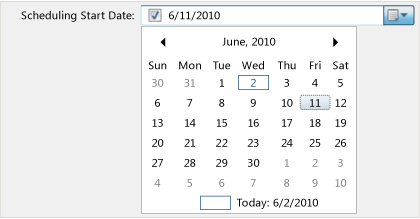
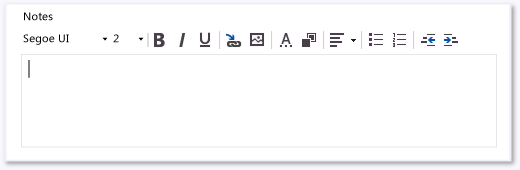
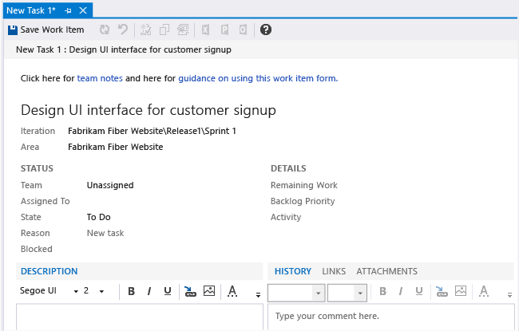
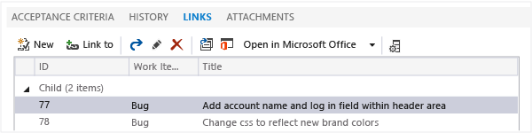
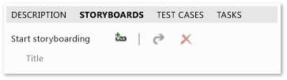
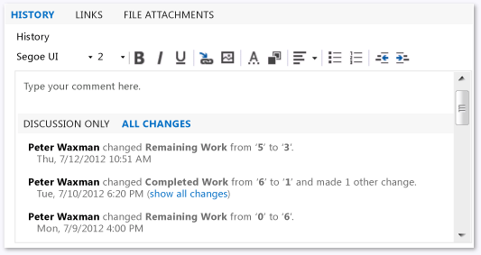
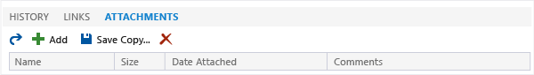

# Specify work item form controls

<p><b>TFS 2017 | TFS 2015 </b></p>

>[!IMPORTANT]  
>This topic applies to team project customization for the On-premises XML process model. For the Hosted XML process model, see [WebLayout and Control elements](weblayout-xml-elements.md). For the Inheritance process model, see [Customize a process](../process/customize-process.md).<br/><br/>
>For an overview of process models, see [Customize your work tracking experience](../customize/customize-work.md).  

This topic provides a quick reference to the `Control` element, its child elements, and attributes. For each field or form control that you want to display on a work item form, you add a `Control` element.  
  
 You can customize a work item form to display information to help your team use the form correctly. You can add the work item fields and controls that enable you to enter and view the data that you want to track.  
  
 The `Control` element provides nine values for the `Type` attribute that you can use to add fields or to display plain or hyperlinked text or fields. In addition, you can define special controls to add links and attachments, display Web-based content, or create your own control and add it to a work item form.  
  
<a name="fields"></a>
##Add work item fields  
 When you customize your work item form, you typically add a subset of the work item fields that are defined for the work item type that you want to appear on the form. The field definitions control many aspects of which data displays or which data that you can enter into the form. For more information, see [Modify a field or add a custom field](../customize/add-modify-field.md).  
  
 Each work item field is associated with a data type. You can use the information in the following table to determine which field type is supported by which `Type` attribute of the `Control` element. Use the `Label` attribute to specify the text that displays next to the control. Use the related `LabelPosition` attribute to specify where the label appears relative to the control. For more information, see [Control the display of work item fields](control-display-work-item-fields.md).  
  
> [!NOTE]  
> You can't change the values of system fields, which are updated automatically. For example, the Created Date and Created By fields are defined when a work item is first saved. However, you can use these fields in search criteria.  For a description of each system field, see [Work item field index](../guidance/work-item-field.md). 


## Add a numeric field  

Use `FieldControl` to provide a control field for an Integer field.

```
<Control FieldName="System.Id" Type="FieldControl" Label="Id" LabelPosition="Left" />
```  

Use `FieldControl` to provide a text field for the input or display of Double fields.

```
<Control FieldName="ABC_Company.Statistics.Analysis" Type="FieldControl" Label="Analysis %" LabelPosition="Left" />
```  

## Add a plain text or string field  

Specify the `String` control when you want to add a string field, such as used in pick lists or short text, that is limited to 255 characters. 

```
<Control FieldName="Microsoft.VSTS.DocName" Type="FieldControl" Label="Vision Doc Location" LabelPosition="Left" />
```

Specify the `PlainText` control when you want to capture text that that contains descriptions that may be larger than 255 characters.
  
```
<Control FieldName="System.Title" Type="FieldControl" Label="Title" LabelPosition="Left" />
``` 

## Add a date-time field  
 |`DateTime`|`FieldControl`<br /><br /> `DateTimeControl`

You can specify the `FieldControl` to provide a text field for the input or display of a DateTime data type field.

```
<Control FieldName=" MyCompany.Group1.StartDate " Type="FieldControl" Label="Start Date" LabelPosition="Left" />
```

Or, you can specify `DateTimeControl` to provide a calendar picker to select a date for a field, as shown in the following illustration.

  

```
<Control Type="DateTimeControl" FieldName="MyCompany.Group.ScheduleStart" 
Label="Scheduling Start Date:" LabelPosition="Left" Dock="Fill" Format="Short" />
```  

## Add a rich-text (HTML) field  

Specify the `HTMLControl` to add an HTML field to capture rich-text formatting, as shown in the following illustration.



`<Control Type="HtmlFieldControl" FieldName="Microsoft.VSTS.Notes" Label="Notes" Dock="Fill" />`|  

## Add a plain or hyperlinked text control 

Use the `LabelControl` to display plain or hyperlinked text that is not associated with a field, as shown in the following illustration.



You use the `LabelText` and `Link` child and container elements to specify the text, hyperlink, and position of a field or label whose text is partly associated with a hyperlink. For more information, see [Provide help text, hyperlinks, or web content](provide-help-text-hyperlinks-web-content-form.md), [LabelText and Text](labeltext-and-text-xml-elements-reference.md), and [Link and Param](link-param-xml-elements-reference.md). 

## Add a web page control  
Use `WebpageControl`to display Web content in a work item form. This control is usually contained in its own tab group. You use the `WebpageControlOptions` and `Link` child elements to specify the controls that are required to load the Web page target in the work item form.

For more information, see [Edit a WIT definition to add web content to a work item form](edit-wit-definition-add-web-content-form.md), [WebpageControlOptions](webpagecontroloptions-xml-elements-reference.md), and [Link and Param](link-param-xml-elements-reference.md).  
  

## Add a links control 

You use `LinksControl` to create and manage links between work items. This control is usually contained in its own tab group, as shown in the following illustration.



You can also use the `LinksControlOptions` to define the link filters and layout of column fields that are used to display the list of links. For more information, see [Define link controls to restrict link relationships](define-link-controls.md) and [LinksControlOptions](linkscontroloptions-xml-elements.md).

## Add a Storyboards control 

Use the `StoryboardsControl` to open PowerPoint Storyboarding from a work item and link to Storyboard files saved to a network share. This control is usually contained in its own tab group, as shown in the following illustration.



To add the `StoryboardsControl` to the `FORM` section, add the following code snippet:

```
<Tab Label="Storyboards">
     <Control Name="StoryboardsControl" Type="LinksControl">
        <LinksControlOptions>
           <WorkItemLinkFilters FilterType="excludeAll" />
           <ExternalLinkFilters FilterType="include">
              <Filter LinkType="Storyboard" />
           </ExternalLinkFilters>
           <LinkColumns>
              <LinkColumn RefName="System.Title" />
              <LinkColumn LinkAttribute="System.Links.Comment" />
           </LinkColumns>
        </LinksControlOptions>
     </Control>
  </Tab>
```
  

## Add a tree path control 

You specify the **WorkItemClassificationControl** to provide a control field for a TreePath field. There are only two supported TreePath fields, Area Path and Iteration Path. 

``` 
<Control FieldName="System.AreaPath" Type="WorkItemClassificationControl" Label="Area Path" LabelPosition="Left" />
```  

## Add the history control  

You use the `WorkItemLogControl` to provide a control field for the History field that tracks discussion threads and other historical information, as shown in the following illustration.



You can use this control only to support the display of the history field of a work item, the System.History work item field. By using this control, you can expand and collapse details about historical revisions to a work item. You can also format text that you add to the history field.

```<Control Type="WorkItemLogControl" FieldName="System.History" Label="Detailed Description and History" LabelPosition="Top" Dock="Fill" />
```  

### Add the attachment control  
`AttachmentsControl`
Use to attach files to a work item form. This control is usually contained in its own tab group, as shown in the following illustration.



For more information, see [Add the Attachments control](add-the-attachments-control.md).

<a name="custom"></a> 
## Add custom controls  
In addition to the built-in controls, you can add your own custom control to a work item form.  
  
For example, you could add a custom control to capture a screenshot from the Clipboard. Or you could provide a control to capture multiple values by adding a check box for values that are presented in a list or menu.  
  
[To implement a custom control](http://go.microsoft.com/fwlink/?LinkId=150556), you must specify the name of the control for the `Type` attribute.  

  
### Optional control element field attributes for all control types  
 The following optional attributes can be specified only for those control types that are listed.  
  
|Attribute|Description|  
|---------------|-----------------|  
|`Field`|Specifies the control that is associated with the work item field.|  
|`Label`|Specifies the visible text on the form that identifies the control. Specify a string of no more than 80 characters.<br /><br /> **Note:** You can attach a hyperlink to the label of a field that is added to the work item form by using `FieldControl`. This control is useful for providing a link to information about how the field is used. For more information, see [Provide help text, hyperlinks, or web content](provide-help-text-hyperlinks-web-content-form.md).|  
|`LabelPosition`|Specifies the position of the label that is relative to the control data. Specify a string from one of the following values: `Top`, `Bottom`, `Left`, and `Right`.|  
|`Dock`|Specifies the alignment of the label with the specified side of the container, or stretches the field to fill the container. Specify a string from one of the following values: `Fill`, `Top`, `Bottom`, `Left`, and `Right`.|  
|`Padding`|Specifies the amount of space, in pixels, around the inside border of the control. Four values are provided that correspond to the top, bottom, left, and right. For example: (2,0,2,0).|  
|`Margin`|Specifies the amount of space, in pixels, around the outside border of the control. Four values are provided that correspond to the top, bottom, left, and right. For example: (2,0,2,0).|  
|`ReadOnly`|Specifies that the field is read-only. Specify `True` or `False`.|  
|`MinimumSize`|Specifies the minimum size, in pixels, that the control should occupy in the form. Two values are specified that correspond to the width and height. For example: (100,100).|  
|`Name`|Uniquely identifies a control. The `Name` attribute is required if more than one control on the form is associated with the same work item field.<br /><br /> **Note:** You use the `Name` attribute to display the same field in more than one area on the form. You specify a unique value for the `Name` attribute for both control entries so that the system identifies each control uniquely. It is useful to show the same control in various locations based on the context of tabs.|  
  
### Optional control element field attributes for specific control types  
 The following optional attributes can be specified only for those control types that are listed.  
  
|Attribute|Control types|Description|  
|---------------|-------------------|-----------------|  
|`NumberFormat`|`FieldControl`|Specifies the characters that you can enter in the field control. The following values are valid: `WholeNumbers`, `SignedWholeNumbers`, `DecimalNumbers`, and `SignedDecimalNumbers`.|  
|`MaxLength`|`FieldControl`|Specifies the maximum length of characters that you can use for a field control.|  
|`Format`|`DateTimeControl`|Specifies the format for the date-time field that corresponds to one value of the DateTimePickerFormat enum. The following values are valid: `Custom`, `Long`, `Short`, `Time`.|  
|`CustomFormat`|`DateTimeControl`|Specifies the custom format that is used for the date-time field that corresponds to the syntax that is defined for the DateTimePicker.CustomFormat property.|  
  
  

  
## Related notes
-  [Control XML element reference](control-xml-element-reference.md)   
-  [Change the work item form layout](change-work-item-form-layout.md)   
-  [Edit a WIT definition to add web content to a work item form](edit-wit-definition-add-web-content-form.md)