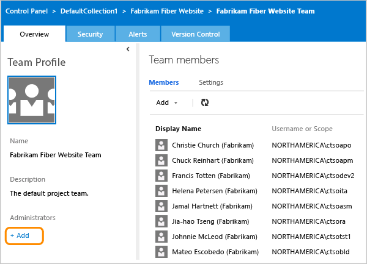
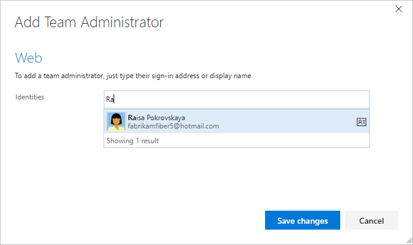

# About teams and team tools 

# Add a team administrator 

<b>Team Services | TFS 2017 | TFS 2015 | TFS 2013 </b>  

  

It's always a good idea to have more than one person with administration permissions for an area. 

1. If you're not a team administrator, get added as one using this procedure. Ask an administrator for your team project or project collection to add you as an administrator.  

2. Add an administrator from the web portal team admin context.  

	  

	To access this page, choose the  gear icon from your team home page.  

3. Add the account identity.  

	 

