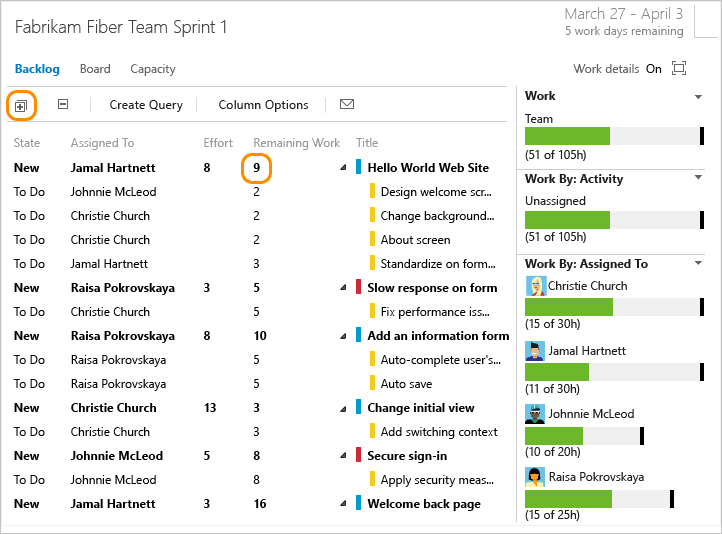

# Define tasks to complete each user story or backlog item 

[!INCLUDE [temp](../../_shared/version-vsts-tfs-all-versions.md)] 

The capacity tool tells you how much work your team can commit to. However, to compare capacity with actually planned work, you need to define and estimate tasks for each backlog item.

Add as many tasks as needed to capture the work required to complete each item. Tasks can represent different work to be performed - such as design, code, test, content, sign off. Usually, each team member adds their own tasks and sets estimates for the work. However, a development lead could define the initial tasks for a requirement.

1. In the sprint backlog, add a task.  

	     

	Creating tasks from the sprint backlog automatically links the task to its parent backlog item.  

2. Name the task and enter an estimate for Remaining Work. Also, if you know who'll perform the work, go ahead and assign the task to that team member.  

	<!--- **Feature availability:** From the web portal you'll have access to the [new form with the new work tracking experience](../backlogs/add-work-items.md). For TFS 2015 and ealier versions, the old form is supported.   --> 
	
	::: moniker range="vsts || >= tfs-2017 <= tfs-2018"
    <a id="task-form-team-services" /> 
	<!--- Task form, new form -->

		
	::: moniker-end
    ::: moniker range=">= tfs-2013 <= tfs-2015"
	<a id="task-form-tfs-2015-13" /> 
	<!--- Task form, old form -->

	  	
	::: moniker-end

	At the planning stage, Remaining Work corresponds to an estimate of how long it will take to complete the task.  
	
	A good rule of thumb is to size tasks to take no more than a day to complete. If a task is too large, the team should break it down. In some cases, you may not be able to estimate some tasks effectively until other tasks have been completed. Create the task now, but estimate it when you have enough information.  
	
	During the sprint, team members update remaining work to continually reflect the time required to complete the task. This value can actually increase after work begins. For example, after working 4 hours on a task that was estimated to take 8 hours, the team member realizes he needs 16 hours over what he estimated. He would update the Remaining Work field with 20 (8-4+16).  As you perform a task, you might find that more time is required. Always update the task with your best estimate of remaining work. That way, you help accurately reflect the total amount of work remaining in the sprint.  

3. As you define tasks and estimate the work, you'll see capacity charts start to fill in for each team member. Capacity bars track the remaining work against the capacity for each team member as well as the entire team.  

	You'll also see a roll-up of the remaining work required to complete each requirement or bug.  

	  

	From this view, you can easily see which individuals are at or near capacity. Teams can determine if work needs to be moved out of the sprint or to reassign tasks.  

	> [!TIP]  
	>Define tasks that take a day or less to complete. This helps mitigate the risks that come from poor estimates.
	>
	>Also, don't divide tasks into subtasks as the [task board will only show leaf node tasks](../backlogs/resolve-backlog-reorder-issues.md?toc=/vsts/work/scrum/toc.json&bc=/vsts/work/scrum/breadcrumb/toc.json#bugs-as-tasks). If you do divide a task into subtasks, specify Remaining Work only for the subtasks, as the system rolls up summary values to the parent task. 

## Try this next
> [!div class="nextstepaction"]
> [3. Set team capacity](set-capacity.md) 
