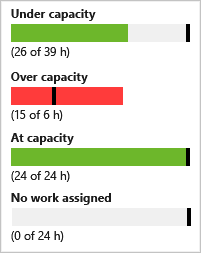
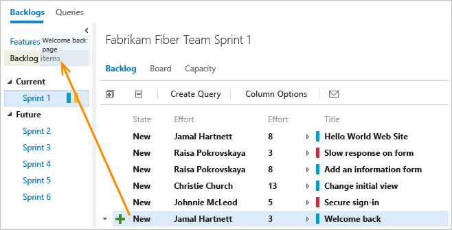
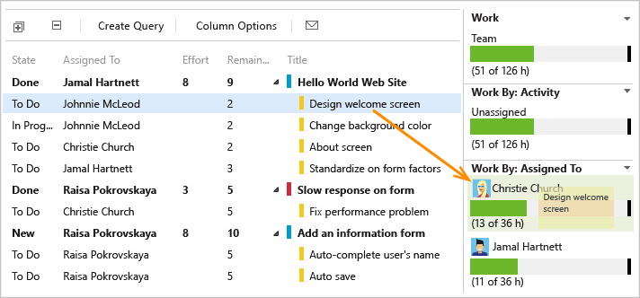

# Adjust work to fit team capacity

[!INCLUDE [temp](../../_shared/version-vsts-tfs-all-versions.md)] 

After you've defined all the tasks for all the items, check whether your team is at or over capacity. If under capacity, you can consider adding more items onto the sprint. If over capacity, you'll want to remove items out of the backlog.  

Next, check whether any team member is under, at, or over capacity. Or, if someone hasn't even been assigned any work. Use the capacity bars to make these determinations.  

  

###Team over capacity: move items out of the sprint

If your team's over capacity, drag items from the bottom of the list onto Backlog items. This will reset the Iteration Path to the default set for your team. Or, you can move the item into the next sprint your team will work in. All the tasks that you've defined for that item will move with it.   

  

> [!TIP]    
> Dragging a backlog item to the backlog or another sprint reassigns all child tasks to the same iteration path. 
> Also, you can multi-select several items and drag them to the backlog or another sprint. 

### Load balance work across the team

To quickly reassign tasks, drag the task onto the new assignee's capacity bar. As you reassign tasks, capacity bars automatically update.  

 

## Try this next
> [!div class="nextstepaction"]
> [5. Share your sprint plan](share-plan.md) 