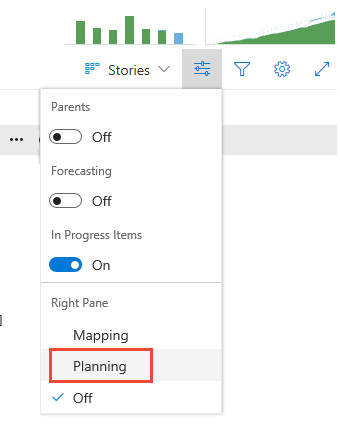
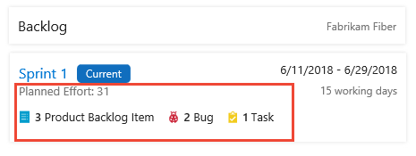
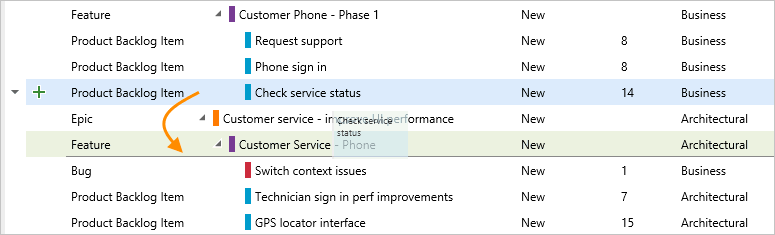
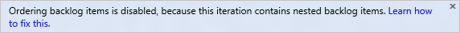

# 1. Assign work to a sprint 
 
[!INCLUDE [temp](../../_shared/version-vsts-tfs-all-versions.md)] 

The first step in planning your sprint is to assign work from your backlog to a sprint. 
Your team builds the sprint backlog during the sprint planning meeting, typically held on the first day of the sprint. 
Each sprint corresponds to a time-boxed interval which supports your team's ability to work using Agile processes and tools. 
During the planning meeting, your product owner works with your team to identify those stories or backlog items to complete in the sprint.  

> [!NOTE]   
> Your project comes with several predefined sprints. You can quickly add more sprints 
> from your backlog as needed. Or, change the dates of the predefined sprints. To learn more about sprints, also referred to as iterations, 
> see [About areas and iterations](../customize/about-areas-iterations.md). 

Planning meetings typically consist of two parts. In the first part, the team and product owner identify the 
backlog items that the team feels it can commit to completing in the sprint, based on experience with previous sprints. 
These items get added to the sprint backlog. In the second part, your team determines how it will develop and test each item. 
They then define and estimate the tasks required to complete each item. Finally, your team commits to implementing 
some or all of the items based on these estimates. 

In this topic you'll learn how to:  

> [!div class="checklist"]   
> * Assign backlog items to a sprint
> * Use multi-select to bulk update work items
> * Order, re-parent, and reassign items to different sprints
   

> [!NOTE]  
> Your sprint backlogs are one of three classes of backlogs available to you. For an overview of the features supported on each backlog and the two types of boards, see [Backlogs, boards, and plans](../backlogs/backlogs-boards-plans.md?toc=/vsts/work/scrum/toc.json&bc=/vsts/work/scrum/breadcrumb/toc.json). 
>
>For a beginner's guide to planning and tracking work, see [Get started with Agile tools](../backlogs/overview.md?toc=/vsts/work/scrum/toc.json&bc=/vsts/work/scrum/breadcrumb/toc.json).  

Here's an example of a sprint plan that consists of backlog items and the tasks required to complete each item. 
By setting team capacity and estimating tasks, the team can see when the team or a team member is at, under, or over capacity.

# [Vertical navigation](#tab/vertical)
::: moniker range="vsts"

> [!div class="mx-imgBorder"]  
> 

::: moniker-end

::: moniker range=">= tfs-2013 <= tfs-2018"
Vertical navigation isn't supported on the TFS platform at this time.
::: moniker-end

# [Horizontal navigation](#tab/horizontal)

 

---

> [!NOTE]    
>Sprint planning doesn't need to be challenging. It can be fun and a time for the entire Scrum team to build camaraderie by working together to answer the question of "What can we commit to?" For examples and strategies to keep your sprint planning focused and effective, check out the [What is Scrum?](https://www.visualstudio.com/learn/what-is-scrum/).
>  
>When you've completed your sprint plan, your sprint backlog should contain all the information your team needs to successfully complete work within the time allotted without having to rush at the end. 

[!INCLUDE [temp](../_shared/prerequisites.md)]
 

## Assign work from your backlog to a sprint 
   
Before you start planning your sprint, you'll want to have [created, prioritized, and estimated your backlog](../backlogs/create-your-backlog.md). 

Also, you'll want to have [set the start and end dates for your sprint](define-sprints.md#quick-start-schedule). 

# [Vertical navigation](#tab/vertical)

::: moniker range="vsts"

0. From your web browser, open your product backlog from the **Work** hub, **Backlogs** page.  

	> [!div class="mx-imgBorder"]
	>  

0. Check that you have selected the correct team from the team selector menu. To open a different sprint other than the current one based on date, choose the  **Browse all sprints** option.

	> [!div class="mx-imgBorder"]  
	>  

0. Check  that you have selected **Stories** as the backlog level (Agile process). For Scrum, it should be **Backlog items** and for CMMI, it should be **Requirements**. 

	> [!div class="mx-imgBorder"]  
	>  

0. Choose the  View options icon, and turn on **Planning**. While you're at it, make sure **Parents** and **Forecasting** are Off. You can choose to set **In Progress items** to Off. 

	> [!div class="mx-imgBorder"]
	> 

	The set of sprints selected for your team appears. If you don't see any sprints listed, you can add sprints or select existing sprints for your team's use. TO learn how, see [Define sprints](define-sprints.md).  <!--- Check with Sondra about what permissions needed to add a sprint or select a sprint --> 

0. Select one or more items from the backlog and drag them to the sprint you are planning, usually the one marked **Current**. This action will update the Iteration Path of the backlog items and any child tasks to the sprint you selected. 

0. Check the level of effort displayed in the sprint window. 

	> [!div class="mx-imgBorder"]
	>    

	*Planned Effort* provides a sum of all *Story Points* or *Effort* defined for backlog items assigned to the sprint. This represents your initial guess at what your team will be able to complete in the sprint. Next, you'll define tasks, estimate that work, and use your team's capacity to make sure it fits in the sprint. 

::: moniker-end

::: moniker range=">= tfs-2013 <= tfs-2018"
Vertical navigation isn't supported on the TFS platform at this time.
::: moniker-end

# [Horizontal navigation](#tab/horizontal)

::: moniker range=">= tfs-2013"

0. From your web browser, open your product backlog from the **Work** hub, **Backlogs** page.  

	> [!div class="mx-imgBorder"]
	>  
	
	Also, you may want to add the Iteration Path to the set of columns that appear on your backlog. To learn  how, see [Change column options](../backlogs/set-column-options.md). 

0. Select one or more items and drag them to one of the listed sprints.  

	> [!div class="mx-imgBorder"]
	>     
		

::: moniker-end

---

::: moniker range=">= tfs-2015"

### Use multi-select to bulk modify items

Multi-select of work items on the product and sprint backlogs works in the same way as multi-select works within query results. 

With multi-select, you can perform several actions on several work items at once, such as: 

- Add links
- Change one or more field values
- Change the backlog priority   
- Assign to a team member
- Move to a sprint
- [Map items or change the parent an item is linked to](/vsts/work/backlogs/organize-backlog#mapping)
::: moniker-end
::: moniker range="tfs-2015"
Multi-select of backlog work items requires TFS 2015.1 or later version.
::: moniker-end
::: moniker range=">= tfs-2015"
To select several items in a sequence, hold down the shift key. To select several non-sequential items, use the Ctrl key. Then, you can either drag the selected items to a new position within the backlog, to a different sprint, or select an option from the context () or action () menu of one of the items. 

To learn more, see [Bulk modify work items](../backlogs/bulk-modify-work-items.md). 
::: moniker-end

## Order, re-parent, and reassign items to different sprints
When you need to change the order of an item, simply drag the item to its new location. Also, you can [re-parent an item using the mapping pane](../backlogs/organize-backlog.md), or simply drag it within the hierarchy to change its parent. 

Ordering and re-parenting backlog items requires that you don't nest items of the same type within each other. That is, you don't create product backlog items that are children of other product backlog items, or tasks that are children of tasks. You can only re-parent tasks under backlog items, backlog items under features, and features under epics. 

If you receive the following message, [you can fix it by removing nested child items](../backlogs/resolve-backlog-reorder-issues.md?toc=/vsts/work/backlogs/toc.json&bc=/vsts/work/backlogs/breadcrumb/toc.json).

  

 
## Try this next
Now that you've defined your sprint plan, your team's ready to begin work on the sprint tasks.

> [!div class="nextstepaction"]
> [2. Add tasks](add-tasks.md)

<!---
 Use your [task board during your daily scrum meetings](task-board.md) to perform these tasks: 

- Update task status and remaining work (daily updates of remaining work leads to smoother burndown charts)    
- Review progress with the team during the daily Scrum meetings
- Update items and address uncompleted work at the close of the sprint  

Also, you can [monitor your burndown chart](sprint-burndown.md) to make sure your team remains on track throughout the sprint. 

You can use [hotkeys and keyboard shortcuts](../backlogs/backlogs-keyboard-shortcuts.md?toc=/vsts/work/scrum/toc.json&bc=/vsts/work/scrum/breadcrumb/toc.json) to navigate within the backlog list. 
-->

## Related articles

If you need to add or rename the sprints your team uses, you must first [define them at the project level](../customize/set-iteration-paths-sprints.md) and then [select them for your team](../scale/set-team-defaults.md). 

 

<!--- 
[!INCLUDE [temp](../_shared/image-differences.md)]  

--> 