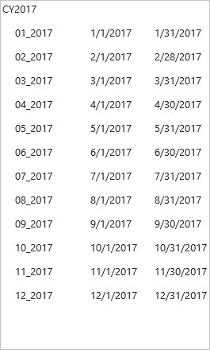
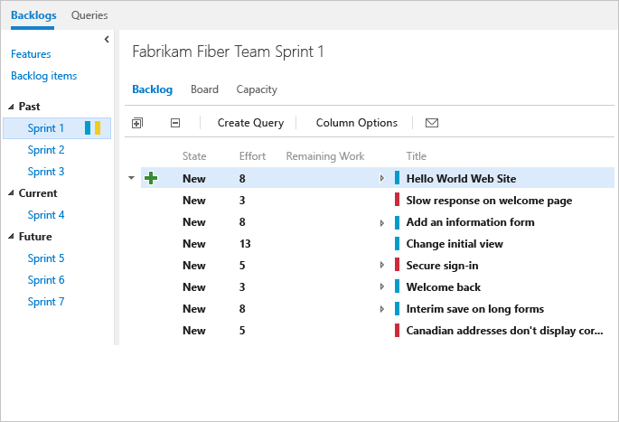
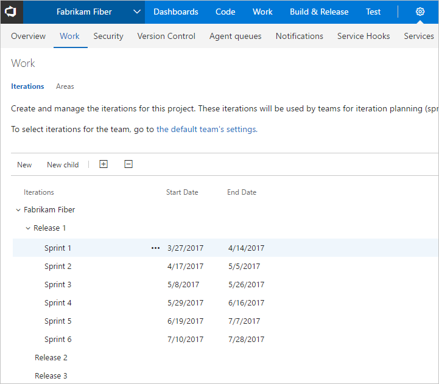

---
title: Define sprints | Team Services & TFS  
description: Implement Scrum by defining sprints, releases, or iterations; also supports several built-in charts and widgets   
ms.technology: vs-devops-agile-wit
ms.prod: vs-devops-alm
ms.assetid: 1DB81E71-36D7-43A5-9C9A-38AA1777715A
ms.manager: douge
ms.author: kaelli
ms.topic: get-started-article  
ms.date: 04/10/2017
--- 

#Schedule sprints  

<b>Team Services | TFS 2017 | TFS 2015 | TFS 2013</b> 

<!--- Need to update with S118 changes --> 

With Scrum, teams plan and track work at regular time intervals, referred to as a sprint cadence. 
You define sprints to correspond to the cadence your team uses.  

Many teams choose a two or three week cadence. However, you can specify shorter or longer sprint cycles.  

>[!NOTE]  
>Your sprint backlog and task board are designed to support your Scrum processes. In addition, you have access to product and portfolio backlogs and Kanban boards. For an overview of the features supported on each backlog and board, see [Backlogs, boards, and plans](../backlogs-boards-plans.md).  

Scheduling sprints involves defining the sprints for a team project, and then selecting the sprints for your team's use. Each sprint that you select for your team provides access to a sprint backlog, task board, and other Agile tools for planning and tracking work. 

[!INCLUDE [temp](../_shared/image-differences.md)]  

<ul class="nav nav-pills" style="padding-right:15px;padding-left:15px;padding-bottom:5px;vertical-align:top;font-size:18px;">
<li style="float:left;" data-toggle="collapse" data-target="#sprints">Selected sprints</li>
<li style="float: right;"><a style="max-width: 374px;min-width: 120px;vertical-align: top;background-color:#AEAEAE;margin: 0px 0px 0px 8px;min-width:90px;color: #fff;border: solid 2px #AEAEAE;border-radius: 0;padding: 2px 6px 0px 6px;outline-style:none;height:32px;font-size:14px;font-weight:400" data-toggle="pill" href="#tfs2015-sprints">TFS 2015</a></li>
<li class="active" style="float: right"><a style="max-width: 374px;min-width: 120px;vertical-align: top;background-color:#007acc;margin: 0px 0px 0px 0px;min-width:90px;color: #fff;border: solid 2px #007acc;border-radius: 0;padding: 2px 6px 0px 6px;outline-style:none;height:32px;font-size:14px;font-weight:400" data-toggle="pill" href="#ts-sprints">Team Services & TFS 2017</a></li>

</ul>
 

 

For example, by selecting Sprints 1 thru 6, the Fabrikam Fiber team gets access to six sprint backlogs. They also get access to capacity planning tools and a task board for each sprint.  

For example, by selecting Sprints 1 thru 4, the Fabrikam Fiber team gets access to four sprint backlogs. They also get access to capacity planning tools and a task board for each sprint.  

 

 

<!---
 

-->

>[!NOTE]  
>**Terminology note:** Your set of Agile tools uses the Iteration Path field to track sprints and releases. When you define sprints, you define the pick list of values available for the [Iteration Path](../customize/modify-areas-iterations.md) field. You use iterations to group work into sprints, milestones, or releases in which they'll be worked on or shipped. 

## Define and schedule sprints
 
Your team project comes with several sprints predefined. However, they aren't associated with any dates. For Scrum and sprint planning, you'll want to assign start and end dates for the sprints your team will use.   

Defining sprints is a two-step process. You first define the sprints for your team project, and then you select the sprints that each team will use. In this way, the system supports teams that work on different sprint cadences.  

### Sprints are a shared resource  

Because the sprints or iterations you defined are a shared resource, they're managed by project admins. Renaming, deleting, modifying the sprint hierarchy, or changing scheduled dates for an iteration impacts all teams that use it. Because of this, you'll want to coordinate changes when working in an enterprise environment with multiple teams.  

#### Schedule sprints for a team project  
To schedule sprints for the team project, you must belong to the [Project Administrators group](../../setup-admin/add-administrator-tfs.md) or have your **Edit project-level information** permission set to **Allow**.  See [Customize areas and iterations, Add an iteration and set iteration dates](../customize/modify-areas-iterations.md#iterations) to perform these tasks:
- Define sprints or iterations for the team project
- Set iteration dates 
- Modify the name of an iteration
- Change the structure of iterations you've defined 
- Archive a set of sprints within a new area 
- Delete iterations you no longer want to use 

>[!NOTE]  
>Deleting an iteration will delete all sprint backlogs, task boards, and burndown charts associated with that iteration.

#### Select sprints for a team 
To select sprints and set defaults for a team, you must be a [team administrator](../scale/manage-team-assets.md), belong to the [Project Administrators group](../../setup-admin/add-administrator-tfs.md), or have your **Edit project-level information** permission set to **Allow**. See [Set team defaults, Select team sprints and default iteration path](../scale/set-team-defaults.md#activate) to perform these tasks:
- To select sprints for your team  
- To set the backlog iteration for your team
- To set the default iteration to use when adding new work items within your team context 
- To remove selected sprints from appearing on your backlog page 

Here we show three sets of cadences defined for the same team project.  

| Monthly sprints | 2-week sprints | 3-week sprints |
|-----------------|----------------|----------------|
|  |  |  |

### Past and future sprints  
Your Scrum Agile tools support you in planning and tracking sprints. But they also provide a historical record your team can use to evaluate their progress sprint over sprint. You can access any sprint backlog, task board, and burndown chart from the Past folder as long as that sprint remains active for your team.  

  

 

### Sprints and releases  

How do you plan and track a release, in addition to planning and tracking sprints?  

One way you can accomplish this is to schedule a set of releases at regular intervals. Then, define the sprints that occur within those intervals as their children. Here's an example of such a structure.  

Iterations admin page, Sprints defined within releases" style="border: 1px solid #CCCCCC;" />   
 
For a worked example of how a management team can focus on releases and feature teams on sprints, see [Portfolio management](../scale/portfolio-management.md). For additional examples illustrating a release train, see [Implement Scaled Agile Framework® to support epics, release trains, and multiple backlogs](../scale/scaled-agile-framework.md). 

 
##Related notes 
If you work with several teams, and each team wants their own backlog view, you can [create additional teams](../scale/multiple-teams.md). Each team then gets access to their own set of Agile tools. Each Agile tool filters work items to only include those assigned values under the team's default area path and iteration path.  

- [Add teams and team members](../scale/multiple-teams.md)  
- [Customize areas and iterations](../customize/modify-areas-iterations.md)
- [Set team defaults](../scale/set-team-defaults.md)  
- [Configure team settings](../scale/manage-team-assets.md)  
- [Portfolio management](../scale/portfolio-management.md)  
- [Implement Scaled Agile Framework® to support epics, release trains, and multiple backlogs](../scale/scaled-agile-framework.md)