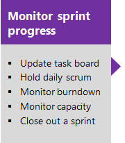

# About Scrum and project management 

[!INCLUDE [temp](../../_shared/version-vsts-tfs-all-versions.md)] 

/azure/devops/agile/what-is-scrum

The Scrum method uses sprints to plan work to perform by a team within a specific time period and cadence. To get started, several sprints are predefined for your team.  If you're new to Scrum, get an overview from [What is Scrum?](/azure/devops/agile/what-is-scrum). 

You can quickly assign work items to a sprint by dragging and dropping them from the product backlog to the sprint. 

