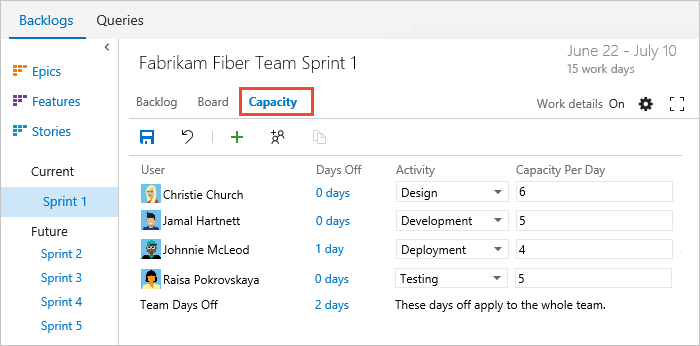
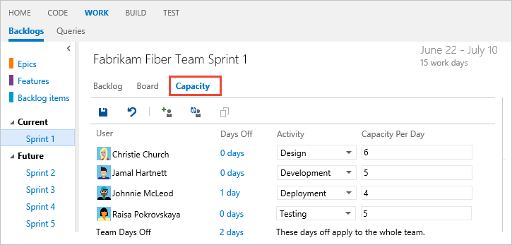
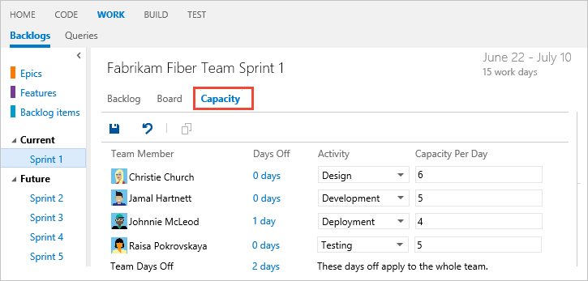
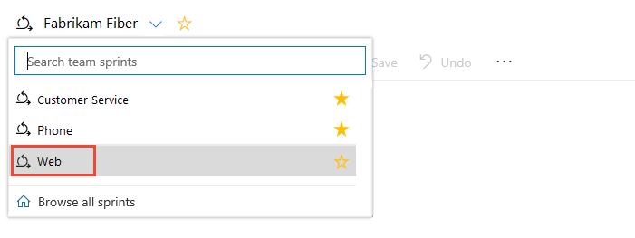

## Set your team's capacity

[!INCLUDE [temp](../../_shared/version-vsts-tfs-all-versions.md)] 

As a next step, you'll want to determine your team's actual capacity. Whereas velocity correlates to how your team estimates requirements, capacity correlates to actual task time - either hours or days. Capacity takes into consideration the variation in work hours by team members as well as holidays, vacation days, and non-working days. 

Because days off and time available for each team member can vary from sprint to sprint, you can set capacity for each sprint. The capacity tool helps you make sure your team isn't over or under committed for the sprint. Also, as you work day-to-day, you'll be able to see if your team is on track.

> [!div class="checklist"]   
> * Copy capacity from the previous sprint to the current sprint  
> * Track capacity when performing multiple activities  
> * Add or remove user accounts from capacity planning for a sprint  
> * Track capacity when working on more than one team  

If you haven't set up sprints yet for your team, go [here to do that now](define-sprints.md).

## Set capacity for team members 

If you haven't yet [added tasks for your sprint backlog items](add-tasks.md), do that now. 

From the **Capacity** page, enter the capacity and days off for each member of your team. If your team tracks capacity by activity, then also select the Activity for each team member.  
 
If you don't see a team member listed, you need to [add them to the team](../scale/multiple-teams.md#add-team-members). Also, you only have to indicate planned days off for the team. You [set weekend days or other recurring days off](#team_settings) under team settings.  

Most teams specify capacity in terms of hours, however, you can also specify it in days. For example, .5 days would correspond to 4 hours for a typical 8 hour day. Choose the same unit you will use to estimate the time a task will take to complete. You only have to indicate planned days off. You [manage weekend days or other recurring days off](../customize/set-working-days.md) under team settings.

For example, Christie Church's capacity is 6 hours/day for design work. 

# [Vertical navigation](#tab/vertical)

::: moniker range="vsts"

> [!div class="mx-imgBorder"]  
> 

::: moniker-end

::: moniker range=">= tfs-2013 <= tfs-2018"
Vertical navigation isn't supported on the TFS platform at this time.
::: moniker-end

# [Horizontal navigation](#tab/horizontal)

::: moniker range=">= tfs-2017"

::: moniker-end

::: moniker range=">= tfs-2013 <= tfs-2015"
#### TFS 2015.1

#### TFS 2015, TFS 2013  
"  

::: moniker-end

---

::: moniker range=">= tfs-2015"

## Copy capacity planning from the previous sprint 

By copying the capacity from the previous sprint, you save time. With the basics defined, all you have to do is adjust the capacity based on individual and team days off and capacity allocation per activity.  

::: moniker-end

# [Vertical navigation](#tab/vertical)

::: moniker range="vsts"

> [!div class="mx-imgBorder"]  
> 

::: moniker-end

::: moniker range=">= tfs-2013 <= tfs-2018"
Vertical navigation isn't supported on the TFS platform at this time.
::: moniker-end

# [Horizontal navigation](#tab/horizontal) 

For example, here we choose Sprint 2 and copy the capacity set for Sprint 1. 

---

::: moniker range="tfs-2015"
> [!NOTE]    
> This feature is available from TFS 2015.1 and later versions.
::: moniker-end

::: moniker range=">= tfs-2015"
Notice that only the capacity per day and activity are copied over. Individual and team days off remain unset. The copy operation always copies the latest updates made to the previous sprint. So you can repeat the copy operation if you've made changes to the previous sprint that you want to copy to the latest sprint. 

::: moniker-end

::: moniker range=">= tfs-2015"

## Add or remove users  

Click  to add a specific account to your capacity planning, or  to add all missing team members. 

 

To remove a user, click the option from the users  action menu. 

 

::: moniker-end

::: moniker range="tfs-2015"
> [!NOTE]    
> This feature is available from TFS 2015.1 and later versions.
::: moniker-end

::: moniker range=">= tfs-2015"

## Track capacity when performing multiple activities

Because individual team members have different sets of skills and duties, you can track their activity and capacity for each activity and for each sprint. 

Here, Jamal divides his time between Deployment and Development. 

> [!div class="mx-imgBorder"]  
>  

::: moniker-end

::: moniker range="tfs-2015"
> [!NOTE]    
> This feature is available from TFS 2015.1 and later versions.
::: moniker-end

## Track capacity when working on more than one team
If you work on more than one team, you'll want to switch between teams easily and specify your sprint capacity to support each team's sprint activities.  

### Switch your team view
When you work on tasls for another team, switch your sprint view to another team to set your capacity for that team. 

# [Vertical navigation](#tab/vertical)

::: moniker range="vsts"

Select the team from the team selector menu. To open a different sprint other than the current one based on date, choose the  **Browse all sprints** option.

> [!div class="mx-imgBorder"]  
> 

::: moniker-end

::: moniker range=">= tfs-2013 <= tfs-2018"
Vertical navigation isn't supported on the TFS platform at this time.
::: moniker-end

# [Horizontal navigation](#tab/horizontal) 

You can switch your team focus to a team you've recently viewed from the project/team drop-down menu. If you don't see the team you want, choose **Browse...**.   
 

---

### Specify sprint capacity for each team you work on
If you work on more than one team during a sprint cycle, you'll probably allocate some percentage of your time to each team.  

For example, both Christie and Raisa split their time between the Web and Phone teams. They therefore allocate 3 hours a day to the Web team, and 3 hours a day to the Phone team.  

> [!div class="mx-imgBorder"]  
> 
 
> [!div class="mx-imgBorder"]  
> 
 
If your name isn't listed in the capacity view, you need to be added as a team member. 

## Try this next
> [!div class="nextstepaction"]
> [4. Adjust work](adjust-work.md) 

## Related articles
Setting capacity and [estimating remaining work for each task](assign-work-sprint.md) provides you with the tools you need to track the amount of work and resources you have allocated sprint over sprint.  

- [Sprint burndown](../scrum/sprint-burndown.md)
- [Velocity](../../report/dashboards/velocity-chart-data-store.md)    
- [Forecasting](../scrum/forecast.md)    
- [Configure team settings](../scale/manage-team-assets.md)

### Set recurring days off  
Your sprint planning and tracking tools automatically consider days off when calculating capacity and sprint burndown. Leave those days of the week that your team doesn't work unchecked in your team's Settings, [Working days](../customize/set-working-days.md) page. 

::: moniker range=">= tfs-2013 <= tfs-2018"

### Customize the pick list of activities or discipline 

> [!NOTE]    
>**Feature availability**: You can customize the pick list of the Activity or Discipline fields when you use the On-premises XML process model. To learn more about process models, see [Customize your work tracking experience](../customize/customize-work.md).  

You can add to or modify the items listed for the [Activity](../track/query-numeric.md)(Agile or Scrum) or [Discipline](../track/query-numeric.md) (CMMI) field by [customizing its pick list](../customize/add-modify-field.md). 

> [!NOTE]    
> The set of values listed corresponds to the combined set of all values defined for the field across all projects in the collection. 
 
::: moniker-end

  