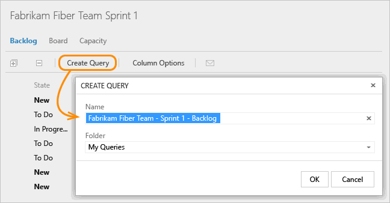

# 5. Share your sprint plan

[!INCLUDE [temp](../../_shared/version-vsts-tfs-all-versions.md)] 
 
If you haven't yet [adjusted the work to fit your team's capacity](adjust-work.md), do that now. 

This article shows you how to: 
> [!div class="checklist"]   
> * Email your sprint plan   

Any stakeholder on your team (someone with permissions to connect to your project) can view your sprint plan. 
Simply send them the URL of your sprint backlog page. But also, you can share it with them through email or print a version. 

To email it, create and save the query for the sprint backlog. 

Then, open the query and click the email icon. 

  

In the form that appears, enter the name(s) of valid users (ones who have access to the project). 

Or, you can select all the items in the list, choose **Copy as HTML**, and paste the formatted list into an email form or Word document. See [Copy a list of work items](../backlogs/copy-list.md?toc=/vsts/work/scrum/toc.json&bc=/vsts/work/scrum/breadcrumb/toc.json). 
