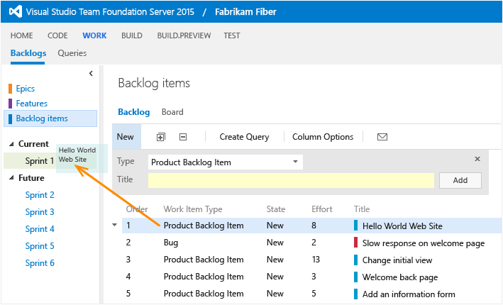
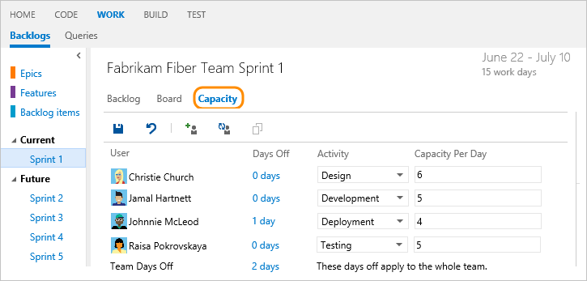
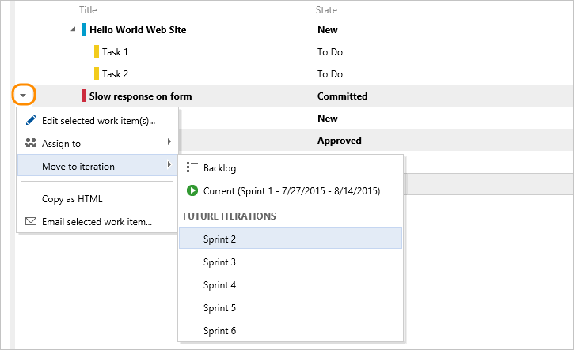
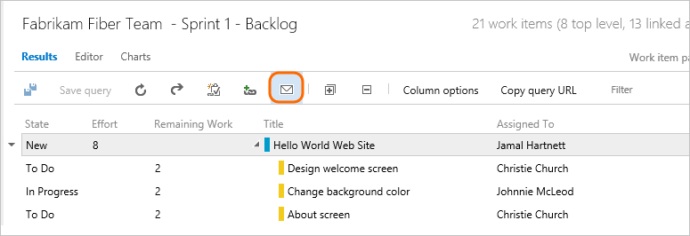

#Sprint planning
 
<b>Team Services | TFS 2017 | TFS 2015 | TFS 2013</b>  

Your team builds the sprint backlog during the sprint planning meeting, typically held on the first day of the sprint. 
Each sprint corresponds to a time-boxed interval which supports your team's ability to work using Agile processes and tools. 
During the planning meeting, your product owner works with your team to identify those stories or backlog items to complete in the sprint.  

Planning meetings typically consist of two parts. In the first part, the team and product owner identify the 
backlog items that the team feels it can commit to completing in the sprint, based on experience with previous sprints. 
These items get added to the sprint backlog. In the second part, your team determines how it will develop and test each item. 
They then define and estimate the tasks required to complete each item. Finally, your team commits to implementing 
some or all of the items based on these estimates. 

>[!NOTE]
>Your sprint backlogs are one of three classes of backlogs available to you. For an overview of the features supported on each backlog and the two types of boards, see [Backlogs, boards, and plans](../backlogs-boards-plans.md). 
>
>For a beginner's guide to planning and tracking work, see [Get started with Agile tools](../agile-project-management.md).  

Here's an example of a sprint plan that consists of backlog items and the tasks required to complete each item. 
By setting team capacity and estimating tasks, the team can see when the team or a team member is at, under, or over capacity.

><i>Sprint planning doesn't need to be challenging. It can be fun and a time for the entire Scrum team to build camaraderie by working together to answer the question of "What can we commit to?" For examples and strategies to keep your sprint planning focused and effective, check out the [Sprint Planning white paper](https://msdn.microsoft.com/library/hh765982.aspx).</i> 

##First pass: identify an initial set of work to complete

>[!NOTE]
>If you need to add additional sprints to your backlog, you must first make sure you've defined the iteration paths at the project level and then selected them for your team. See [Add or modify Area and Iteration Paths (project level)](../customize/modify-areas-iterations.md) and [Set team defaults (team level)](../scale/set-team-defaults.md). 

Your sprint backlog should contain all the information your team needs to successfully plan and complete work within the time allotted without having to rush at the end. Before you start planning your sprint, you'll want to have [created, prioritized, and estimated your backlog](../backlogs/create-your-backlog.md) and [defined your sprints](define-sprints.md).  

1. You begin your planning efforts from your product backlog. Move items that you expect to work on into the current sprint, one item at a time. Simply drag each item from the product backlog onto the sprint.  

	  
	
	If you don't see any links listed under Current or Future, your team admin needs to [configure your team's sprint schedule](define-sprints.md).  
	
	That's your initial guess at what you'll be able to do in the sprint. Next, you'll define tasks, estimate that work, and use your team's capacity to make sure it fits in the sprint. 

2. Next, check the total level of effort of your sprint items. For example, the Fabrikam Fiber team has four members with a total velocity of 40 effort points per three week sprint cycle. So, they're in good shape to commit to the 6 items in the Sprint 1 backlog.  
	
	  
	
	Your initial plan should identify the subset of requirements that's within your team's capacity based on estimated effort and team velocity. Velocity corresponds to the total Effort or Story Points a team can complete within the sprint time period.  

##Set your team's capacity

As a next step, you'll want to determine your team's actual capacity. Whereas velocity correlates to how your team estimates requirements, capacity correlates to actual task time - either hours or days. Capacity takes into account variation in work hours by team members as well as holidays, vacation days, and non-working days. 

Because days off and time available for each team member can vary from sprint to sprint, you set capacity for each sprint. The capacity tool helps you make sure your team isn't over or under committed for the sprint. Also, as you work day-to-day, you'll be able to see if your team is on track.

From the Capacity page, enter the capacity and days off for each member of your team. 

>[!NOTE]
>The user interface is slightly different depending on the platform and version you work from. 

For example, Christie Church's capacity is 6 hours/day for design work. 

 

<ul class="nav nav-pills" style="padding-right:15px;padding-left:15px;padding-bottom:5px;vertical-align:top;font-size:18px;">

<li style="float:left;" data-toggle="collapse" data-target="#capacity">Capacity </li>

<li style="float: right;"><a style="max-width: 374px;min-width: 120px;vertical-align: top;background-color:#AEAEAE;margin: 0px 0px 0px 8px;min-width:90px;color: #fff;border: solid 2px #AEAEAE;border-radius: 0;padding: 2px 6px 0px 6px;outline-style:none;height:32px;font-size:14px;font-weight:400" data-toggle="pill" href="#tfs-2015-capacity">TFS 2015</a></li>

<li style="float: right;"><a style="max-width: 374px;min-width: 120px;vertical-align: top;background-color:#AEAEAE;margin: 0px 0px 0px 8px;min-width:90px;color: #fff;border: solid 2px #AEAEAE;border-radius: 0;padding: 2px 6px 0px 6px;outline-style:none;height:32px;font-size:14px;font-weight:400" data-toggle="pill" href="#tfs-2015-1-capacity">TFS 2015.1</a></li>

<li style="float: right;"><a style="max-width: 374px;min-width: 120px;vertical-align: top;background-color:#AEAEAE;margin: 0px 0px 0px 8px;min-width:90px;color: #fff;border: solid 2px #AEAEAE;border-radius: 0;padding: 2px 6px 0px 6px;outline-style:none;height:32px;font-size:14px;font-weight:400" data-toggle="pill" href="#tfs-15-capacity">TFS 2017</a></li>

<li class="active" style="float: right"><a style="max-width: 374px;min-width: 120px;vertical-align: top;background-color:#007acc;margin: 0px 0px 0px 0px;min-width:90px;color: #fff;border: solid 2px #007acc;border-radius: 0;padding: 2px 6px 0px 6px;outline-style:none;height:32px;font-size:14px;font-weight:400" data-toggle="pill" href="#team-services-capacity">Team Services</a></li>
</ul>
 

 

  

 

 

Most teams specify capacity in terms of hours, however, you can also specify it in days. For example, .5 days would correspond to 4 hours for a typical 8 hour day. Choose the same unit you will use to estimate the time a task will take to complete.

If you don't see a team member listed, you need to [add them to the team](../scale/manage-team-assets.md#add-team-admin). Also, you only have to indicate planned days off. You [manage weekend days or other recurring days off](../scale/capacity-planning.md#team_settings) under team settings.

Additional options available from the Capacity page include copying capacity from the previous iteration, adding team members, adding multiple activities. See [Capacity planning](../scale/capacity-planning.md) for these and more settings.  

##Define tasks to complete each item

The capacity tool tells you how much work your team can commit to. However, to compare capacity with actually planned work, you need to define and estimate tasks for each backlog item.

Add as many tasks as needed to capture the work required to complete each item. Tasks can represent different work to be performed - such as design, code, test, content, signoff. Usually, each team member adds their own tasks and sets estimates for the work. However, a development lead could define the initial tasks for a requirement.

1. In the sprint backlog, add a task.  

	   

	Creating tasks from the sprint backlog automatically links the task to its parent backlog item.  

2. Name the task and enter an estimate for Remaining Work. Also, if you know who'll perform the work, go ahead and assign the task to that team member.  

	>[!NOTE]
	><b>Feature availability: </b>From the web portal for Team Services and TFS 2017, you'll have access to the [new work tracking experience](../process/new-work-item-experience.md). You can [add a custom field, change the form layout](../process/customize-process.md), and [access new form features](../backlogs/add-work-items.md) when you make the switch.  
	
	  
	
	At the planning stage, Remaining Work corresponds to an estimate of how long it will take to complete the task.  
	
	A good rule of thumb is to size tasks to take no more than a day to complete. If a task is too large, the team should break it down. In some cases, you may not be able to estimate some tasks effectively until other tasks have been completed. Create the task now, but estimate it when you have enough information.  
	
	During the sprint, team members update remaining work to continually reflect the time required to complete the task. This value can actually increase after work begins. For example, after working 4 hours on a task that was estimated to take 8 hours, the team member realizes he needs 16 hours over what he estimated. He would update the Remaining Work field with 20 (8-4+16).  As you perform a task, you might find that more time is required. Always update the task with your best estimate of remaining work. That way, you help accurately reflect the total amount of work remaining in the sprint.  

3. As you define tasks and estimate the work, you'll see capacity charts start to fill in for each team member. Capacity bars track the remaining work against the capacity for each team member as well as the entire team.  

	You'll also see a roll-up of the remaining work required to complete each requirement or bug.  

	  

	From this view, you can easily see which individuals are at or near capacity. Teams can determine if work needs to be moved out of the sprint or to reassign tasks.  

	>[!TIP]
	>Define tasks that take a day or less to complete. This helps mitigate the risks that come from poor estimates.
	>
	>Also, don't divide tasks into subtasks as the [task board will only show leaf node tasks](#task-board-leaf-nodes). If you do divide a task into subtasks, specify Remaining Work only for the subtasks, as the system rolls up summary values to the parent task. 

##Second pass: adjust work to fit team capacity

After you've defined all the tasks for all the items, check whether your team is at or over capacity. If under capacity, you can consider adding more items onto the sprint. If over capacity, you'll want to remove items out of the backlog.  

Next, check whether any team member is under, at, or over capacity. Or, if someone hasn't even been assigned any work. Use the capacity bars to make these determinations.  

  

###Team over capacity: move items out of the sprint

If your team's over capacity, drag items from the bottom of the list onto Backlog items.  

  

Or, you can move the item into the next sprint your team will work in. All the tasks that you've defined for that item will move with it.  

###Load balance work across the team

To quickly reassign tasks, drag the task onto the new assignee's capacity bar. As you reassign tasks, capacity bars automatically update.  

  

##Bulk modify items and other options   

>[!NOTE]
><b>Feature availability: </b> Multi-select of work items on the backlog and sprint backlogs is currently supported from Team Services or the web portal for TFS 2015 Update 1 or later version. This feature works in the same way as [multi-select works within query results](../backlogs/bulk-modify-work-items.md).    

You can quickly perform several tasks from a work item's context menu.  

From the sprint backlog, select the work item(s) you want to modify. To select several items in a sequence, hold down the shift key. To select several non-sequential items, use the Ctrl key. 

  

The menu options change based on whether you have selected a single work item or several. 

| Single-select menu options    | Multi-select menu options        |
|--------------------------|-------------------------------|
|  |        |

You can use the [hotkeys and keyboard shortcuts](../../reference/keyboard-shortcuts.md) to navigate within the backlog list. 

##Try this next
 
Now that you've defined your sprint plan, your team's ready to begin work on the sprint tasks. Use your [task board during your daily scrum meetings](task-board.md) and [monitor your burndown chart](sprint-burndown.md) to make sure your team remains on track throughout the sprint. 

To copy, clone, or delete work items, or to quickly create work items using a template, see these topics:

- [Copy or clone a work item](../backlogs/copy-clone-work-items.md#copy-clone)  
- [Remove, delete, or recycle a work item](../backlogs/remove-delete-work-items.md)  
- [Create a work item template](../productivity/work-item-template.md)  

See also [Keyboard shortcuts](../../reference/keyboard-shortcuts.md).  

##Related notes

Much of sprint planning involves a negotiation between the product owner and the team to determine the focus and work to tackle in the upcoming sprint. It's useful to time-box the planning meeting, restricting it to 4 hours or less. 

In the first part of the meeting, your product owner meets with your team to discuss the user stories that might be included in the sprint. Your product owner will share information and answer any questions that your team has about those stories. This conversation might reveal details such as data sources, user interface layout, response time expectations, and considerations for security and usability. Your team should capture these details within the backlog items form. During this part of the meeting, your team learns what it must build.

As you plan your sprints, you may discover additional requirements that you should capture and add to your backlog. Before your sprint planning meeting, you'll want to [refine your backlog](sprint-planning.md#groom) to make sure that it is well defined and in priority order. 

Also, setting a sprint goal as part of your planning efforts can help the team stay focused on what's most important for each sprint. 

After you've planned your sprint, you may want to [share the plan](sprint-planning.md#share) with key stakeholders. 

You can learn more about conducting your sprint planning meeting from these resources: 
*	[Sprint planning](https://msdn.microsoft.com/library/hh765982.aspx) white paper
*	[The Scrum Guide](http://www.scrumguides.org/scrum-guide.html)
*	[Build and manage the product backlog](https://msdn.microsoft.com/library/hh765982.aspx) white paper

###Order, re-parent, and reassign items to different sprints
When you need to change the order of an item, simply drag the item to its new location. Also, you can [re-parent an item using the mapping pane](http://msdn.microsoft.com/Library/vs/alm/Work/backlogs/organize-backlog), or simply drag it within the hierarchy to change its parent. 

Ordering and re-parenting backlog items requires that you don't nest items within each other. That is, you don't create product backlog items that are children of other product backlog items. You can only re-parent backlog items under other features, and features under other epics. 

If you receive the following message, [you can fix it by removing nested child items](../backlogs-boards-plans.md#display-hierarchy).

  

While you can create a hierarchy of backlog items, tasks, and bugs─we don't recommend that you do. The Kanban board, sprint backlog, and task board only show the last node in a hierarchy, called the leaf node. For example, if you link items within a hierarchy that is four levels deep, [only the items at the fourth level appear on the Kanban board, sprint backlog, and task board](http://msdn.microsoft.com/Library/vs/alm/Work/customize/show-bugs-on-backlog#how-hierarchical-items-appear-in-backlog-and-board-views).  

Instead of nesting requirements, bugs, and tasks, we recommend that you maintain a flat list─only creating parent-child links one level deep between items. Use the feature work item type when you want to group requirements or user stories. You can [quickly map stories to features](http://msdn.microsoft.com/Library/vs/alm/Work/backlogs/organize-backlog), which creates parent-child links in the background.  

###Refining the backlog
  
Backlog refinement supports your sprint planning efforts and helps minimize these often seen challenges:

* Long, unfocused, and ineffective sprint planning meetings  
* Insufficient thought given to design requirements  
* Poor sprint planning and execution  
* Defocus on the business value team wants to achieve  
* Inability to forecast  

A meeting to refine the backlog should occur separate from the sprint planning meeting. Use this meeting to perform these activities:  

* Right-size backlog items by splitting larger items into smaller items. No backlog item should be larger than it will take to complete in a single sprint.  

* Identify and fill in gaps in the product backlog. Capture new ideas and stories, architecture and design requirements, and other spikes.  

* Reorder the backlog to represent today's priorities and business value focus.  

* Ensure well defined acceptance criteria has been added to each item.  

* Revisit estimates made to backlog items and adjust upwards or downwards based on recent understanding about scope and acceptance criteria.  

* Review all potential backlog items to consider for the upcoming sprint to make sure they are well understood and that any additional work required to support their development is well understood by both product owner and the team.  

You'll know that you've done a good job refining your backlog when your sprint planning meetings run smoothly and efficiently. Such meetings shouldn't contain a lot of surprises, and your team should feel they can contribute fullly.    

[Refining your Agile backlogs for success](http://www.batimes.com/robert-galen/grooming-your-agile-backlogs-for-success.html) provides a nice quality checklist to guide your backlog refinement efforts

###Set sprint goals
 
Scrum teams use sprint goals to focus their sprint activities. They often set this goal during their sprint planning meeting. The goal summarizes what the team wants to accomplish by the end of the sprint. By explicitly stating the goal, you create shared understanding within the team of the core objective. The sprint goal can also help guide the team when conflicts arise around priorities. 
<a id="tips-from-trenches" />

<blockquote style="font-size: 13px"><b>Tips from the trenches: Defining a sprint goal</b>

The sprint goal defines what the product owner and the team consider as the ultimate target to accomplish that sprint. 
It's not a random selection of backlog items that don't really have a relationship, but a short piece of text that captures 
what the team should try to accomplish. Normally the product owner comes up with the sprint goal before selecting a 
number of items for the next sprint. The items for that sprint should all fit that common goal.

Sprint goals can be feature oriented, but might also have a large process component such as deployment automation or test automation. 
For example:

<ul>
<li>This sprint we will focus on a very simple user story and we will use it to prove that the proposed solution will work.</li>
<li>This sprint will revolve around implementing the security features that will properly secure the administration section of the website.</li>
<li>This sprint will be about integrating the most important payment gateways so that we can start collecting money.</li>
</ul>

Setting the sprint goals helps the team to stay focused. 
It will make it easier to define priority of tasks within a sprint and it will probably 
help limit the number of stakeholders and end-users that are involved.

During the sprint review the most important question you should ask yourself is whether you managed to achieve the sprint goal. 
How many stories you actually completed comes second. If the goal is accomplished, the sprint succeeds, even if not all stories were finished.

Contributed by <a href="http://blog.jessehouwing.nl/">Jesse Houwing</a>, Visual Studio devops Ranger and a 
senior consultant working for Avanade Netherlands.

</blockquote> 

###Share your sprint plan
 
Any stakeholder on your team (someone with permissions to connect to your team project) can view your sprint plan. 
Simply send them the URL of your sprint backlog page. But also, you can share it with them through email or print a version. 

To email it, create and save the query for the sprint backlog. 

Then, open the query and click the email icon. 

  

In the form that appears, enter the name(s) of valid users (ones who have access to the team project). 

Or, you can select all the items in the list, choose **Copy as HTML**, and paste the formatted list into an email form or Word document. See [Share plans](../track/share-plans.md) for more ways to share work with your team. 

###When bugs appear on the backlog and boards with tasks
 
When you choose to have bugs appear in the backlog with tasks, linking tasks and bugs to their parent requirements groups them accordingly on the sprint backlog and task board.

However, if you create parent-child links between a requirement and a bug, and the bug and a task, as shown here . . .

####Hierarchy of items assigned to the sprint backlog 

 . . . only the task and not the bug will appear on the sprint backlog.

####Only leaf nodes appear on the sprint backlog and task board

 . . . and only the task will appear on the task board. 

