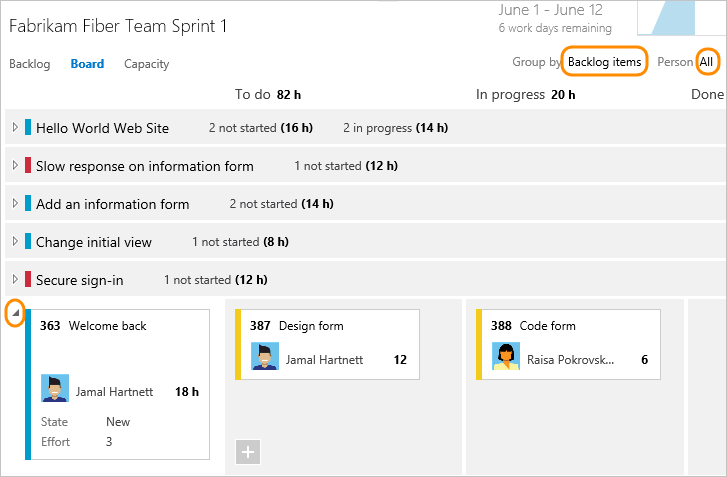
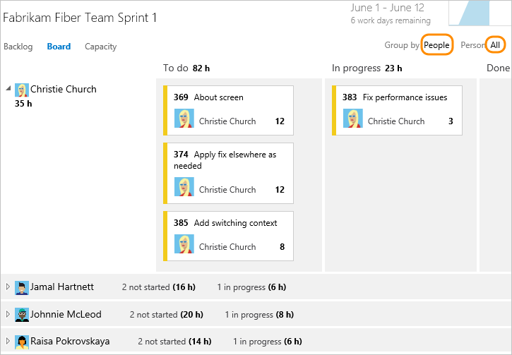

# Task board  

[!INCLUDE [temp](../_shared/dev15-version-header.md)] 

Once you have your [sprint plan](sprint-planning.md) in place, you'll execute that plan for the duration of the sprint. In your daily Scrum meetings, your team can view progress made to backlog items and tasks from the sprint task board.  

Your task board provides a visualization of flow and status of each sprint task. With it, you can focus on the status of backlog items as well as work assigned to each team member. It also summarizes the total amount of remaining work to complete for a task or within a column.  

In this topic you'll learn how to:  

> [!div class="checklist"]   
> * Use your task board to review progress during daily scrum meetings   
> * Filter and group work items on your task board         
> * Update the status of tasks through drag-and-drop   
> * Update remaining work   
> * Close out a sprint    
> * Customize your task board

>[!NOTE]
>Your task board is one of two types of boards available to you. For an overview of the features supported on each backlog and board, see [Backlog, board, and plan views](../backlogs/backlogs-boards-plans.md). To customize the task board to include more or different columns, you need to customize the workflow. For details, see [Customize your work tracking experience](../customize/customize-work.md). 
>
>In addition, if you're wondering why the task board items don't match your query list of items for a sprint, see [Task board items versus query list items](../backlogs/backlogs-boards-plans.md#task-board-items).

##Review progress in daily scrum meetings 
During your daily Scrum, you can filter your task board to help focus on items of interest. 
*	Group by Backlog items or Group by stories to monitor progress of your product backlog items, stories, requirements, or bugs. 
*	Group by People when you want to monitor progress of individual team members.  

Use the Person filter when you want to focus on work assigned to individual team members.

>[!TIP]    
>If you're seeing tasks that don't belong to your team, check that you've [selected the correct team](../../settings/switch-team-context.md?toc=/vsts/work/scale/toc.json&bc=/vsts/work/scale/breadcrumb/toc.json). 

###Show progress on items
With this view, you can quickly see which items are nearing completion and which have yet to be started. You can expand  and collapse  a row to focus on a particular item and its tasks. 
  

###Show progress of individuals
With this view, you can focus on the work completed and the work remaining for each individual team member. You can quickly see who may need help to complete their sprint tasks. This view shows items and tasks assigned to the selected team member. 

###Group by team members
With this view, you can quickly see all the tasks associated with each team member. Backlog items don't appear in this view, only the tasks associated with each individual.  

##Update tasks during the sprint cycle
The task board makes quick work of updating both task status and remaining work.  

###Update task status
Simply drag tasks to a downstream column to reflect if they are in progress or completed.  

  

When you move a task to the Done or Completed column, the system automatically updates the Remaining Work field to 0. If you discover more work is remaining, change the State back to In progress or To do and enter a value for the remaining work. 

###Update remaining work
Updating Remaining Work, preferably prior to the daily Scrum meeting, helps the team stay informed of the progress being made. It also ensures a smoother burndown chart.  

Each team member can review the tasks they've worked on and estimate the work remaining. If they've discovered that it's taking longer than expected to complete, they should increase the remaining work for the task. Remaining work should always reflect exactly how much work the team member estimates is remaining to complete the task. 

  

###Unparented tasks
Tasks without links to parent backlog items or user stories appear at the top of the task board. You can track unparented tasks in similar ways to other tasks, or drag them to an existing backlog item to parent them. The Unparented card tracks the total of remaining work defined for all unparented tasks, however, it isn't associated with any work item.

##Close out a sprint, update your task board
At the end of the sprint, you'll want to perform these final tasks:  
*	Zero out remaining work of all completed tasks
*	Update the status of all completed backlog items
*	Move incomplete tasks or backlog items to the next sprint or back to the product backlog.

Dragging an incomplete item to the product backlog or to a future sprint updates the Iteration Path of all uncompleted child tasks to correspond to the product backlog iteration path or future sprint.   

>[!TIP]
>If you work from VSTS and TFS 2015.1 and later versions, you can 
>[drag-and-drop work items onto a sprint from any backlog or board](define-sprints.md#drag-drop-to-sprint). 

##Try this next

Work with [sprint burndown](sprint-burndown.md) charts to monitor progress, manage scope creep, and mitigate risks. 

## Related notes
As you can see, the task board provides a lot of support for your Scrum activities. For related topics, see:  

*	[Scrum best practices](best-practices-scrum.md)  
*	[Sprint planning](sprint-planning.md)   
*	[Schedule sprints](define-sprints.md)  
*	[Customize cards on the task board](../customize/customize-cards.md#task-board)   
*	[Capacity planning](../scale/capacity-planning.md)  

 

###Task board controls

| Control               | Function                                    |
|-----------------------|---------------------------------------------|
| Backlog               | [Switch to sprint backlog view](sprint-planning.md)                         |
| Board                 | Switch to task board view                   |
| Capacity              | [Switch to Capacity planning](sprint-planning.md#set-capacity)   |
| Group by Stories/People   | Switch grouping of cards based on backlog items or team members                        |
| Person                    | Filter tasks to show items assigned to All or a selected team member            |
|     | [Open board settings](../customize/customize-cards.md)    |
| /     | Enter or exit full screen mode         |

See also [Keyboard shortcuts](../../collaborate/keyboard-shortcuts.md).     

### Customize the task board 
Each team can customize their task board in the following ways:
- [Customize cards](../customize/customize-cards.md) that appear on the task board to show additional fields.
- [Show bugs on the task board](../customize/show-bugs-on-backlog.md), your team can choose to manage bugs similar to product backlog items, as shown in this topic, or manage them similar to tasks. When you track bugs similar to tasks, they'll show up on your sprint backlogs and task boards at the same level as tasks.
   
An administrator can customize the task board for all teams in the following ways:    
- [Add a custom workflow state to the task WIT for a process (Inheritance process model)](../customize/process/customize-process-workflow.md), or [modify the workflow for the task WIT definition] (Hosted and On-premises XML process models)](../customize/reference/change-workflow-wit.md).
- [Add a custom work item type to the task board for a process (Inheritance process model)](../customize/process/customize-process-backlogs-boards.md), or [add a work item type to a backlog and board] (Hosted and On-premises XML process models)](../customize/add-wits-to-backlogs-and-boards.md).

 
 
## Reduce the number of items on the task board 

If you exceed the number of items allowed on your task board, you'll receive a message indicating that you need to reduce the number of items or [increase the maximum number of allowed items (TFS only)](../customize/customize-work.md#limits). The maximum number of items includes work item types included in the Requirement and Task categories.

You can reduce the number of items on the task board by moving them to the backlog or another sprint. When you move a parent PBI or user story, all active child tasks (State not equal to Done or Closed) automatically move with the parent item. 

**VSTS and TFS 2015.1 and later versions:**

- From the task board, drag the PBI or user story from the first column onto the backlog or future sprint. All child tasks automatically move with the parent item.  
- From the sprint backlog, multi-select the items to move and then click the context menu for an item and select the iteration to move them to.  
 
	  

**TFS 2015 and earlier versions:**   
- From the task board, drag the PBI or user story from the first column onto the backlog or future sprint.  

- From the sprint backlog, drag an item back to the backlog or to another sprint.  

	  

- If you need to move several items, you can create a query from the sprint backlog and then use the query to [bulk modify the iteration path](../backlogs/bulk-modify-work-items.md).  

[!INCLUDE [temp](../../_shared/help-support-shared.md)] 

