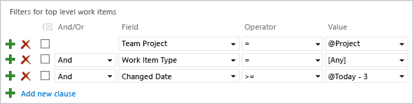
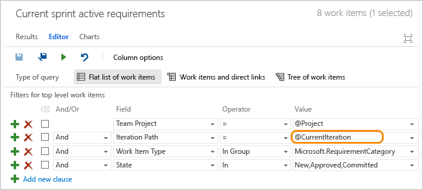
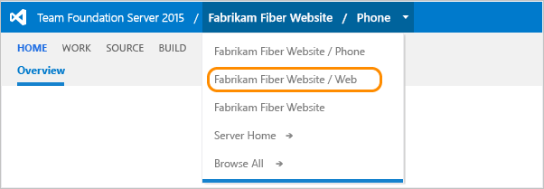

# Query by date or current iteration

[!INCLUDE [temp](../_shared/dev15-version-header.md)]

<p>Two query macros help you find work items based on when changes occurred or if they belong to the current sprint. To list work items based on when they were created, closed, resolved, or changed state─use **@Today** or specify dates.  For queries that list work items based on their assignment to a team's current sprint, use **@CurrentIteration**.</p>
<p>For example, you can find work items that were modified in the last 3 days with the following query.</p>

  

<p>If you're new to creating queries, see [Use the query editor to list and manage queries](using-queries.md).  </p>

##Query for items based on when changes occurred

<p>You can filter for work items by the date on which they were changed or for a specific time period. If you limit the scope of your query, it can help with performance by only returning those results that fit the date range that you want to include. </p>

<table valign="top">
<tbody valign="top">
<tr>
  <th>
    <p>Filter for</p>
  </th>
  <th>
    <p>Include these query clauses</p>
  </th>
</tr>
<tr>
  <td>
    <p>Items created in the last 30 days</p>
  </td>
  <td>
    <p style="margin-bottom:0px">
      ```Created Date  _ >=  _ @Today-30```
    </p>
  </td>
</tr>
<tr>
  <td>
    <p>Items modified on a specific date</p>
  </td>
  <td>
    <p style="margin-bottom:0px">
      ```Changed Date  _ =  _ 7/14/2014```
    </p>
  </td>
</tr>
<tr>
  <td>
    <p>Items resolved today</p>
  </td>
  <td>
    <p style="margin-bottom:0px">```Resolved Date  _ =  _ @Today```</p>
  </td>
</tr>
<tr>
  <td>
    <p>Items closed within a specified time period</p>
  </td>
  <td>
    <p style="margin-bottom:0px">&nbsp;&nbsp;&nbsp;&nbsp;&nbsp;&nbsp;&nbsp;&nbsp;&nbsp;&nbsp;&nbsp;```State _  = _  Done```
    </p>
    <p style="margin-bottom:0px">```And _ Closed Date _  > _ 7/1/2014```</p>
    <p style="margin-bottom:0px">
      ```And _ Closed Date _ <= _ 7/21/2014```</p>
  </td>
</tr>
<tr>
  <td>
    <p>Items whose status was updated within the last week</p>
  </td>
  <td>
    <p style="margin-bottom:0px">
      ```State Changed Date _ <= _ @Today-7```
    </p>
  </td>
</tr>
<tr>
  <td>
    <p>Items closed in the current sprint</p>
  </td>
  <td>
    <p style="margin-bottom:0px">&nbsp;&nbsp;&nbsp;&nbsp;&nbsp;&nbsp;&nbsp;&nbsp;&nbsp;&nbsp;&nbsp;```State _ = _ Done```
    </p>
    <p style="margin-bottom:0px">```And _ Iteration Path _ = _ @CurrentIteration```
    </p>
  </td>
</tr>
</tbody>
</table>

<p>Not all fields are valid for all work item types (WITs). Jump to <a href="#date_fields">date fields</a> for the set of fields you can include in queries and which WITs they apply to.</p>
<p>Enter dates in the format accepted by your computer's operating system.</p>

<a id="current-iteration">  </a>

##Query for items based on belonging to a team's current iteration  
If your team follows Scrum processes, you [schedule work to be completed in sprints](../scrum/define-sprints.md). You can track the progress of requirements, bugs, and other work to be completed in the current sprint using the **@CurrentIteration** macro.  

Prior to creating or updating a query to use the **@CurrentIteration** macro, make sure you [select your team](#team_view). The **@CurrentIteration** macro references the current team selected in the web portal.  

  

You can't use the **@CurrentIteration** macro from some [clients, features, or REST APIs](#current_sprint_restrict).  

<a id="date_fields">  </a>

##Date fields
<p>You can use date fields to filter your queries. Some of these fields are populated with information as a work item progresses from one state to another. Several of these fields do not appear on the work item form, but they are tracked for those WITs listed in the following table.</p>

<table>
<tbody valign="top">
<tr>
  <th width="14%">Field name</th>
  <th>Description</th>
  <th>Work item type</th>
</tr>
<tr>
  <td>
    <p>Activated Date <sup>1</sup>  </p>
  </td>
  <td>
    <p>The date and time when the work item was created or when its status was changed from closed, completed, or done to a new or active state.  </p>
	<p>Reference name=Microsoft.VSTS.Common.ActivatedDate, Data type=DateTime</p>
  </td>
  <td>
    <p>All</p>
  </td>
</tr>
<tr>
  <td>
    <p>Change Date</p>
  </td>
  <td>
    <p>The date and time when a work item was modified.</p>
	<p>Reference name=System.ChangedDate, Data type=DateTime</p>
  </td>
  <td>
    <p>All</p>
  </td>
</tr>
<tr>
  <td>
    <p>Closed Date <sup>1</sup> </p>

  </td>
  <td>
    <p>The date and time when a work item was closed.</p>
	<p>Reference name=Microsoft.VSTS.Common.ClosedDate, Data type=DateTime</p>
  </td>
  <td>
    <p>All</p>
  </td>
</tr>
<tr>
  <td>
    <p>Created Date</p>
  </td>
  <td>
    <p>The date and time when a work item was created.</p>
	<p>Reference name=System.CreatedDate, Data type=DateTime</p>
  </td>
  <td>
    <p>All</p>
  </td>
</tr>
<tr>
  <td>
    <p>Due Date</p>
  </td>
  <td>
    <p>The forecasted due date for an issue to be resolved.</p>
<p>Reference name=Microsoft.VSTS.Scheduling.DueDate, Data type=DateTime</p>
  </td>
  <td>
    <p>Issue (Agile)</p>
  </td>
</tr>


<tr>
  <td>
    <p>Finish Date <sup>2</sup> </p>
  </td>
  <td>
    <p>The date and time when the schedule indicates that the task will be completed. </p>
<p>Reference name=Microsoft.VSTS.Scheduling.FinishDate, Data type=DateTime</p>
  </td>
  <td>
    <p>Task, Bug</p>
  </td>
</tr>
<tr>
  <td>
    <p>Resolved Date <sup>1</sup> </p>
  </td>
  <td>
    <p>The date and time when the work item was moved into a Resolved state. </p>
	<p>Reference name=Microsoft.VSTS.Common.ResolvedDate, Data type=DateTime</p>
  </td>
  <td>
    <p>Bug (Agile, CMMI)</p>
  </td>
</tr>
<tr>
  <td>
    <p>Start Date <sup>2</sup> </p>
  </td>
  <td>
    <p>The date and time when the schedule indicates that the task will start.  </p>
<p>Reference name=Microsoft.VSTS.Scheduling.StartDate, Data type=DateTime</p>
  </td>
  <td>
    <p>Task, Bug</p>
  </td>
</tr>


<tr>
  <td>
    <p>State Change Date</p>
  </td>
  <td>
    <p>The date and time when the value of the State field changed.</p>
	<p>Reference name=Microsoft.VSTS.Common.StateChangeDate, Data type=DateTime</p>
  </td>
  <td>
    <p>All</p>
  </td>
</tr>
<tr>
  <td>
    <p>Target Date</p>
  </td>
  <td>
    <p>The date by which a feature should be completed. </p>
<p>Reference name=Microsoft.VSTS.Scheduling.TargetDate, Data type=DateTime</p>
  </td>
  <td>
    <p>Feature</p>
  </td>
</tr>


</tbody>
</table>

####Notes:
 
1. For these fields to be defined for a WIT, they must be included in the ```WORKFLOW``` section of the WIT definition. For example, this syntax is included within the ```FIELDS``` definition when transitioning to a Resolved state:  
	```
	<FIELD refname="Microsoft.VSTS.Common.ResolvedDate />  
	   <SERVERDEFAULT from="clock"  />  
	</FIELD >  
	```

2. Start and Finish Date fields are calculated if you create a project plan in Microsoft Project and then synchronize that plan with tasks that are stored in TFS or Team Services. These fields do not appear on the work item form, but they are calculated for those backlog items and tasks that are linked to backlog items. You can view their read-only values in results from a query or from Microsoft Excel or Project. For more information, see [Create your backlog and tasks using Project](../office/create-your-backlog-tasks-using-project.md).


##Related notes
To query for items based on text entered in the History field, see
[History and auditing](history-and-auditing.md). 
 
<a id="team_view">  </a>

###Switch  team view
You switch to a different team from the team project/team menu.  

  
 
<a id="current_sprint_restrict"> </a> 

###Client restrictions on the use of @CurrentIteration macro 
You can use the **@CurrentIteration** macro in a query from the following clients:  
<ul>
  <li>
    <p>Web portal that connects to VSTS</p>
  </li>
  <li>
    <p>Web portal that connects to an on-premises TFS 2015 RC</p>
  </li>
  <li>
    <p>Visual Studio 2015 RC or Team Explorer 2015 RC connected to TFS 2015 RC or VSTS.</p>
  </li>
</ul>

An error occurs if you open a query that contains the **@CurrentIteration** macro in earlier versions of Visual Studio, or from Excel or Project. Also, the macro cannot be used when [copying or cloning test suites and test cases](https://msdn.microsoft.com/library/hh543843.aspx), [defining alerts](alerts-and-notifications.md), or with [VSTS REST APIs](https://www.visualstudio.com/integrate/get-started/rest/basics).

 