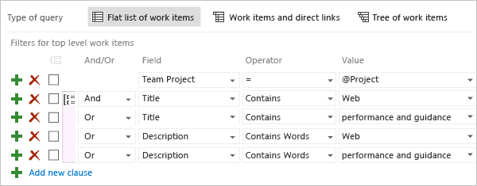
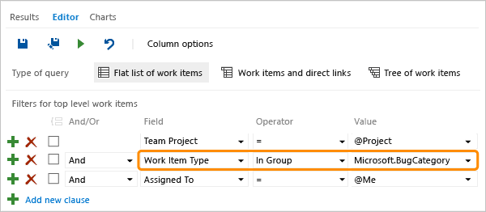

# Query by titles, IDs, and rich-text fields

<b>Team Services | TFS 2017 | TFS 2015 | TFS 2013</b>  

When you want to find work items based on a keyword or phrase, you can do so by entering the [keyword or phrase within the search box](search-box-queries.md#keywords). This initiates a new query which you can modify as needed to further refine your filter criteria, as described in this topic. 

[!INCLUDE [temp](../_shared/search-box.md)]

<a id="keyword"/>
## List items based on keywords or phrases

Use **Contains** and **Contains Words** to list items that partially or exactly match the words or phrase that you enter.  

   

Choose **Contains** or **Does Not Contain** to search against exact or partial matches of a word or phrase. Choose **Contains Words** or **Does Not Contain Words** to search against an exact phrase or to use the wildcard character, <b>*</b>. These operators use the full-text search index.

 

<a id="undefined-value"/>
## List items based on undefined field values

You can find work items that have an undefined field value by using the equals operator (=) and leaving the Value for the field blank. For example, the following filters will list all work items of type Task whose Activity field is blank.  

To list work items based on a field that isn't blank, use the not operator (<>) and leave the Value blank.

<a id="category"/>
### List items based on categories

To filter work items based on the category they belong to, use the **In Group** operator. For example, the following filter criteria will return all work items that are in the current team project, assigned to the team member, and defined as belonging to the Bug Category.

## Common fields for most work item types 

The following table describes common fields used to filter queries. The **ID** fields uniquely identify work items in a list. Use the **Title** field to distinguish the work item from all others of the same type.  The **Description** and other rich-text (data type=HTML) fields provide additional information that is needed to implement work and track changes. After a work item is created, you can modify all fields except for the **ID**. When you add and save a work item, the ID is assigned by the system and cannot be changed. 

>**Note:**&#160;&#160;The system automatically indexes all long-text fields with a data type of **PlainText** and **HTML** fields for full-text search. This includes the **Title**, **Description**, and **Steps to Repro** fields. For more information and  server and collation requirements applicable to on-premises TFS, see [Query fields, operators, values, and variables - Full-text and partial word searches](query-operators-variables.md#full-text).

<table width="100%">
<tbody valign="top">
<tr>
  <th width="17%">Field name</th>
  <th width="66%">Description</th>
  <th width="17%">Work item type</th>
</tr>
<tr>
	<td>
Acceptance Criteria  1
</td>
	<td>
A description of the criteria to be met before the bug or product backlog item can be closed.

Before work begins on a bug or product backlog item, the criteria for customer acceptance should be described as clearly as possible. Conversations between the team and customers to define the acceptance criteria will help ensure that your team understands your customers' expectations. The acceptance criteria can be used as the basis for acceptance tests so that you can more effectively evaluate whether an item has been satisfactorily completed.
 

Reference name=Microsoft.VSTS.Common.AcceptanceCriteria, Data type=HTML
  </td>  
	<td>
Bug, Epic, Feature, Product backlog item (Scrum)
</td>
 
</tr>
<tr>
  <td>
Description 1, 2
  </td>
  <td>
    
Use this field to provide indepth information about a work item.

	
Reference name=System.Description, Data type=HTML

  </td>
<td>All</td>
</tr>
<tr>
<td>
ID
</td>
<td>
The unique identifier that is assigned to a work item. Work item IDs are unique across all team projects and within a team project collection.  
	
Reference name=System.Id, Data type=Integer

</td>
<td>All</td>
</tr>

<tr>
  <td>
Repro Steps (or Steps to reproduce) 1 
  </td>
  <td>
    
The steps that are required to reproduce unexpected behavior. Capture enough information so that other team members can understand the full impact of the problem as well as whether they have fixed the bug. This includes actions taken to find or reproduce the bug and expected behavior. 

 
	
Reference name=Microsoft.VSTS.TCM.ReproSteps, Data type=HTML

  </td>
<td>Bug</td>
</tr>

<tr>
	<td>
Resolution
</td>
	<td>
Describes how an impediment was resolved.

Reference name=Microsoft.VSTS.Common.Resolution, Data type=HTML
  </td>  
	<td>
Impediment (Scrum)
</td>

</tr>

<tr>
  <td>
System Info1 
  </td>
  <td>
    
Information about the software and system configuration that is relevant to the bug, code review, or feedback. 

	
Reference name=Microsoft.VSTS.TCM.SystemInfo, Data type=HTML

  </td>
  <td>Bug, Code Review Request, Feedback Request  
  </td>
</tr>

<tr>
<td>
Team Project
</td>
<td>

The team project to which a work item belongs. Add this field to a query when you want to filter your list to items in one or more team projects. 

<blockquote>**Note:**&#160;&#160;For Team Services or for TFS 2015.1 and later versions, you must check the Query across projects option in the query editor for this field to appear in the drop down field list. To learn more, see [Example queries, query across team projects](using-queries.md#across-projects). </blockquote>
 
	
Reference name=System.TeamProject, Data type=String

</td>
<td>All</td>
</tr>

<tr>
  <td>
Title
  </td>
  <td>
    
A short description that summarizes what the work item is and helps team members distinguish it from other work items in a list.

	
Reference name=System.Title, Data type=String

  </td>
<td>All</td>
</tr>

<tr>
  <td>
Work Item Type
  </td>
  <td>
    
The name of the work item type. Work item types are defined based on the process used when you created your team project. For an overview, see [Choose process](../guidance/choose-process.md). To learn how to add a custom work item type, see [Add or modify a work item type](../customize/add-modify-wit.md). 

To filter work items based on their [category assignment](#category), you can use the **In Group** and **Not In Group** operators and select a category from the drop-down list.   
	
Reference name=System.WorkItemType, Data type=String

  </td>
<td>All</td>
</tr>
</tbody>
</table>

####Notes:   

0. To learn more about working with rich-text fields, see [Share plans](share-plans.md#rich-text).   
0. Upon upgrade to Team Foundation Server 2012, the Description field was changed from a field type of PlainText to **HTML**. Using the **witadmin changefield** command you can revert the data type for this field. See [Manage work item fields (witadmin)](../reference/witadmin/manage-work-item-fields.md).

## Related notes
- [Query editor](using-queries.md)   
- [Add work items](../backlogs/add-work-items.md)  
- [Work item field index](../guidance/work-item-field.md)  
- [Create managed queries](example-queries.md)   

<a id="category"/>
###What items appear in the Requirement or Task categories? 

The default assignments of work item types to each category are listed below for each process.  

| Process | Requirement category | Task category |
|---------|---------|---------|
| Agile | User Story | Task |
| Scrum | Product Backlog Item | Task |
| CMMI | Requirement | Task |

However, each team can determine if the Bug work item type appears in either the Requirement or Task category. See [Show bugs on backlogs and boards](../customize/show-bugs-on-backlog.md). 

Also, you can add custom work item types to a backlog. For details, see [Add or modify a work item type, Add a custom WIT to a backlog or board ](../customize/add-modify-wit.md). 
 
